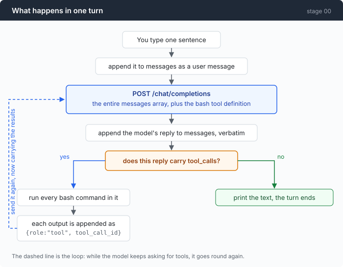

# Stage 00: The Loop — letting the model run the commands itself

`00` → [01](../../01-dont-die/doc/README.md) → 02 → 03 → 04 → 05 → 06 → 07 → 08 → 09 → 10 → 11 → 12

> One tool, one loop. By the end of this chapter you have an agent that can act
> on its own, and that is dangerously fragile — the next twelve chapters are
> about the second half of that sentence.

---

## The problem

A script in some directory is failing. You paste the traceback to a model and
ask what is going on.

It says: show me what's in `stats.py`.

You run `cat stats.py`, select the output, paste it back. It reads it and says
line 14 can divide by zero, change it like this. You make the edit, run the
script again, and get a different error. You copy that. You paste that.

This can go on for twenty minutes. The model knows what to do next the whole
time, but it cannot reach your machine. You can, so you have become the hand.

The part worth noticing is that **you made no decisions**. You did not choose
which file to look at, you did not choose the fix. You moved text between two
windows.

This chapter hands that job to a program.

---

## The idea

A loop.



Each reply from the model may carry a request: *run this command*. The program
runs it, feeds the output back, and asks again. The first reply that asks for
nothing ends the turn.

| What the reply contains | What it means | What the program does |
|---|---|---|
| `tool_calls` | the model wants a command run | run it, append the output, send again |
| no `tool_calls` | the model thinks it is done | print the text, leave the loop |

That is the only condition in the whole design. The program never interprets
what the model said; it only looks at whether a tool was asked for.

---

## Building it

The code is [`00-loop/code/main.go`](../code/main.go). Here it is a piece at a
time.

### Step 1: the conversation is an array that only grows

```go
msgs := []message{{Role: "system", Content: systemPrompt}}
// ...
msgs = append(msgs, message{Role: "user", Content: line})
```

Every request sends **the whole array** again. The server remembers nothing
between calls; what feels like a conversation is you re-transmitting the entire
history each time.

Right now that sentence sounds like a technicality. Stage 04 is where you get
billed for it.

### Step 2: tell the model it has a hand

A tool is a description, sent along with the request:

```go
t.Function.Name = "bash"
t.Function.Description = "Execute a bash command and return its combined stdout and stderr."
t.Function.Parameters = map[string]any{
    "type": "object",
    "properties": map[string]any{
        "command": map[string]any{
            "type":        "string",
            "description": "The shell command to execute.",
        },
    },
    "required":             []string{"command"},
    "additionalProperties": false,
}
```

One tool. There is no `read_file`, no `edit_file`, no `search`. Reading a file
is `cat`, editing one is `sed`, finding one is `find` — your machine already has
these, and unlike a fixed set of tools they compose, so one call can do four
things.

That is where the repository's name comes from, and it is the only bet it makes.

### Step 3: send it

```go
body, err := json.Marshal(chatRequest{
    Model:     c.model,
    MaxTokens: 4096,
    Messages:  msgs,
    Tools:     []toolDef{bashTool()},
})
// ...
req, err := http.NewRequest("POST", c.baseURL+"/chat/completions", bytes.NewReader(body))
// ...
req.Header.Set("Content-Type", "application/json")
req.Header.Set("Authorization", "Bearer "+c.apiKey)
```

No SDK. Underneath one, this is what there is: a POST, a bearer token, some
JSON. It is worth seeing once, because stage 03 swaps in a second protocol and
you will be glad there was no opaque layer in between.

### Step 4: put the reply back unchanged

```go
choice := resp.Choices[0]
msgs = append(msgs, choice.Message) // echo the assistant turn back verbatim

if choice.Message.Content != "" {
    fmt.Printf("\n%s\n", choice.Message.Content)
}
if len(choice.Message.ToolCalls) == 0 {
    fmt.Println()
    break // no tools requested: the turn is over
}
```

Two easy mistakes live in those eight lines.

**Append it verbatim.** Do not take the reply apart, pull out the fields you
care about, and build a fresh message from them. There may be fields you do not
recognise yet, and the next request will not line up without them.

**Text and tool calls arrive together.** The model routinely says "let me look
at that file" *and* makes the call in the same reply. So print the text first
and check for tools second — the other order silently drops the sentence.

### Step 5: run it — and here is the decision people get wrong

Start with the signature:

```go
func runBash(shell, command string) string {
```

One string back. **No error.**

Almost everyone writes the other version the first time, and writes it with
confidence:

```go wrong
func runBash(shell, command string) (string, error) {   // <- the first mistake
    out, err := cmd.CombinedOutput()
    if err != nil {
        return "", err                                   // <- the inevitable second
    }
```

The trouble is in the phrase "the command failed". `python stats.py` exits 1 and
prints a ZeroDivisionError traceback — your program did not fail. It did exactly
its job: it ran a command and collected the output. That traceback is the single
most valuable thing in the turn, the only evidence the model has about the bug.

Turning it into a Go error cuts the agent off precisely where it was about to be
useful.

What the code actually does is treat failure as part of the output:

```go
out, err := cmd.CombinedOutput()

result := string(out)
if err != nil {
    result += fmt.Sprintf("\n[exit: %v]", err)
}
if strings.TrimSpace(result) == "" {
    result = "[no output]"
}
return result
```

The `[no output]` line is not cosmetic. An empty string reads to the model like
the tool never ran, and it will helpfully run the same command again.

This judgement call comes back in every later chapter wearing different clothes:
**your job is to report the world to the model accurately, not to shield the
model from it.**

### Step 6: every tool_call must be answered

```go
for _, call := range choice.Message.ToolCalls {
    var args struct {
        Command string `json:"command"`
    }
    if err := json.Unmarshal([]byte(call.Function.Arguments), &args); err != nil {
        // Malformed arguments are the model's problem to fix, so hand
        // the parse error back instead of crashing.
        msgs = append(msgs, message{
            Role:       "tool",
            ToolCallID: call.ID,
            Content:    fmt.Sprintf("could not parse tool arguments: %v", err),
        })
        continue
    }

    fmt.Printf("\n  $ %s\n", args.Command)
    started := time.Now()
    output := runBash(shell, args.Command)
    fmt.Printf("%s\n  [%d bytes in %s]\n", indent(output), len(output), took(started))

    msgs = append(msgs, message{
        Role:       "tool",
        ToolCallID: call.ID,
        Content:    output,
    })
}
```

`call.Function.Arguments` is **a string with JSON inside it**, not a nested
object. Everyone trips on this once. Always `json.Unmarshal` it; never match
against the raw string.

Notice that the parse-failure branch still appends a message. If the model asked
for three commands and you answer two, the next request is malformed — the
server rejects it because one call is left dangling. So even a command that
never ran owes a reply explaining why.

### Putting it together

```go
for turn := 1; ; turn++ {
    if turn > maxTurns {
        fmt.Printf("\n[stopped: hit %d turns]\n\n", maxTurns)
        break
    }

    resp, err := c.callModel(msgs)
    if err != nil {
        fmt.Printf("\n[error: %v]\n\n", err)
        break
    }
    choice := resp.Choices[0]
    msgs = append(msgs, choice.Message) // echo the assistant turn back verbatim

    fmt.Printf("  [tokens: prompt=%d completion=%d]\n",
        resp.Usage.PromptTokens, resp.Usage.CompletionTokens)

    if choice.Message.Content != "" {
        fmt.Printf("\n%s\n", choice.Message.Content)
    }
    if len(choice.Message.ToolCalls) == 0 {
        break
    }

    for _, call := range choice.Message.ToolCalls {
        // ...
    }
}
```

That is the entire agent. `main.go` is 346 lines, or 253 once comments and blank
lines are dropped, and `main()` itself is 106 of them — the rest is JSON struct
definitions and a function that goes looking for bash.

The `maxTurns = 25` fuse deserves one sentence of its own. Without it, a model
stuck in a loop keeps calling tools until your credit runs out. Today it is a
constant; stage 01 turns it into an actual budget.

---

## Run it

> It runs whatever the model says, with no confirmation and no filtering.
> **Use an empty directory.**

```sh
go build -o agent ./00-loop/code

mkdir -p sandbox && cd sandbox
set -a && . ../.env && set +a       # AGENT_BASE_URL / AGENT_API_KEY / AGENT_MODEL
../agent
```

Drop a small broken script in there, then try these three:

1. `what's in this directory?`
2. `there's a bug in the code here. find it, fix it, and prove the fix works.`
3. `count the total lines across every .py file under this directory`

**What to watch for:**

- The `[tokens: prompt=… completion=…]` line at the top of each turn. Watch the
  `prompt` number. It climbs every turn, and in the second experiment it climbs
  visibly.
- On the third prompt the model writes one command with pipes in it and gets the
  whole answer in a single call. That is what having exactly one tool buys.
- On the second prompt, the script errors and the model does not stop — it reads
  the traceback and goes to edit the file. Had step 5 returned an error, the
  agent would halt at exactly that point.

---

## Measured

One real run of prompt 2 above, finished in six turns: find the file, read it,
run it and get the traceback, patch it, read it back, run it again.

| Turn | What it did | Prompt tokens |
|---:|---|---:|
| 1 | `ls -la` | 429 |
| 2 | `cat README.md; cat stats.py` | 613 |
| 3 | `python stats.py` → traceback | 737 |
| 4 | `sed -i ...` to patch | 932 |
| 5 | `cat stats.py` | 1079 |
| 6 | `python stats.py` → clean | 1192 |

Add the right-hand column: **this session paid for 4982 prompt tokens** to hold
a conversation that ended up being **1192 tokens** long. A factor of 4.2.

That is not a bug. It is the literal meaning of step 1's "every request sends
the whole array again", and it grows quadratically: in a 40-turn session, turn
one's content is paid for forty times.

Keep this table. It is the baseline for everything that follows. Stage 04 runs
the same experiment twice — once normally, once with `--break-cache` — and turns
this 4.2× into a number denominated in money.

---

## Next

The agent works now. It will also do all of the following, today:

- The model runs `find /`, several hundred megabytes of paths pour into the
  context window, the turn dies, and you are billed for it.
- The model runs `npm run dev`. That command never returns, so the agent hangs.
  You press Ctrl-C, and the process is still running on your machine.
- The model's reply is cut off by `max_tokens` mid-sentence, with half a tool
  call in it — and the code cannot tell, so it reports a parse failure.
- The model runs `rm -rf .`, because your prompt said "clean up the temp files".

These four have one thing in common: none of them are caused by the model being
insufficiently clever. **There is nowhere in this loop where any of them could
have been stopped.**

[Stage 01](../../01-dont-die/doc/README.md) bolts four things onto the loop:
output truncation, a command timeout, process-tree cleanup, and a gate that runs
before the command does.
