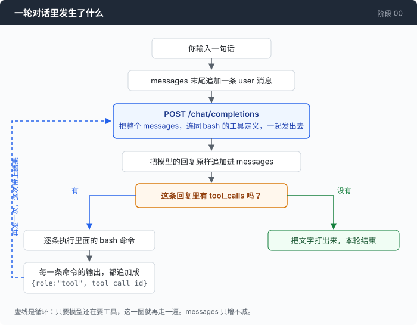

# 阶段 00：循环 —— 让模型自己把命令跑起来

`00` → [01](../../01-dont-die/doc/README_zh.md) → 02 → 03 → 04 → 05 → 06 → 07 → 08 → 09 → 10 → 11 → 12

> 一个工具，一个循环。这一章结束时你会有一个能自己动手的 agent，同时它非常脆弱 —— 后面十二章都在补这件事。

---

## 问题

你手上有个目录，里面的脚本报错了。你把报错贴给模型，问它怎么回事。

它回你：先看看 `stats.py` 写了什么。

你 `cat stats.py`，把输出复制粘贴回去。它看完说，第 14 行的除数可能是 0，改成这样。你照着改，再跑一次，又是一个新报错。你再复制，再粘贴。

这个来回可以持续二十分钟。整个过程里，模型知道下一步该做什么，但它够不着你的机器；你够得着，于是你成了那只手。

值得注意的是，在这些来回里**你没有做任何判断**。你没有决定该看哪个文件，没有决定怎么改，你只是在两个窗口之间搬运文本。

这一章就是把这只手交给程序。

---

## 办法

一个循环。



模型的每次回复里，可能带着一段「我要执行这条命令」的请求。程序照做，把命令的输出接回去，再问一次。哪一次它不再要求执行命令，这一轮就结束。

| 回复里有什么 | 意思 | 程序做什么 |
|---|---|---|
| 带 `tool_calls` | 模型要跑命令 | 跑，把输出接回去，再发一次 |
| 不带 `tool_calls` | 模型认为说完了 | 打印它的话，退出循环 |

判断条件只有这一个。不去理解模型说了什么，只看它有没有要工具。

---

## 怎么做的

代码在 [`00-loop/code/main.go`](../code/main.go)。下面一步步把它拼出来。

### 第 1 步：对话是一个只增不减的数组

```go
msgs := []message{{Role: "system", Content: systemPrompt}}
// ...读到用户输入之后：
msgs = append(msgs, message{Role: "user", Content: line})
```

每次请求都要把**整个数组**重新发一遍。服务端不记得上一次说过什么，所谓"对话"只是你每次都把前面所有内容再送一次的结果。

这句话现在听起来平淡无奇。第 04 章会让你为它付钱。

### 第 2 步：告诉模型它有一只手

工具就是一段描述，跟着请求一起发过去：

```go
t.Function.Name = "bash"
t.Function.Description = "Execute a bash command and return its combined stdout and stderr."
t.Function.Parameters = map[string]any{
    "type": "object",
    "properties": map[string]any{
        "command": map[string]any{
            "type":        "string",
            "description": "The shell command to execute.",
        },
    },
    "required":             []string{"command"},
    "additionalProperties": false,
}
```

只有这一个工具。没有 `read_file`，没有 `edit_file`，没有 `search`。读文件是 `cat`，改文件是 `sed`，找文件是 `find` —— 这些命令你的机器上已经有了，而且它们能用管道接起来，一次调用干四件事。

这是整个仓库名字的由来，也是它唯一的赌注。

### 第 3 步：发出去

```go
body, err := json.Marshal(chatRequest{
    Model:     c.model,
    MaxTokens: 4096,
    Messages:  msgs,
    Tools:     []toolDef{bashTool()},
})
// ...
req, err := http.NewRequest("POST", c.baseURL+"/chat/completions", bytes.NewReader(body))
// ...
req.Header.Set("Content-Type", "application/json")
req.Header.Set("Authorization", "Bearer "+c.apiKey)
```

没有 SDK。SDK 底下也就是这几行 —— 一个 POST，一个 Bearer，一段 JSON。这件事之所以值得说一遍，是因为后面第 03 章要换一种协议，那时候你会庆幸中间没有一层黑盒。

### 第 4 步：把回复原样接回去

```go
choice := resp.Choices[0]
msgs = append(msgs, choice.Message) // echo the assistant turn back verbatim

if choice.Message.Content != "" {
    fmt.Printf("\n%s\n", choice.Message.Content)
}
if len(choice.Message.ToolCalls) == 0 {
    fmt.Println()
    break // no tools requested: the turn is over
}
```

两个容易踩的地方：

**原样接回去。** 不要把回复拆开、取出你关心的字段、再拼一条新消息。里面可能有你还不认识的字段，下一次请求少了它们就对不上。

**文字和工具调用可以同时出现。** 模型经常一边说"我先看看这个文件"一边发起调用。所以先打印文字，再判断有没有工具 —— 顺序反过来的话，那句话就丢了。

### 第 5 步：执行 —— 这里有个很容易做错的决定

先看这个函数的签名：

```go
func runBash(shell, command string) string {
```

只返回一个字符串，**没有 error**。

几乎每个人第一次都会写成另一个样子，而且写得理直气壮：

```go wrong
func runBash(shell, command string) (string, error) {   // ← 第一步错
    out, err := cmd.CombinedOutput()
    if err != nil {
        return "", err                                   // ← 于是必然的第二步
    }
```

问题出在"命令失败了"这个说法上。`python stats.py` 退出码是 1、吐出一段 ZeroDivisionError 的堆栈 —— 你的程序并没有出错，它完成了它的工作：它跑了一条命令，拿到了输出。那段堆栈恰恰是这一轮里最有价值的东西，是模型定位 bug 的唯一线索。

把它变成 Go 的 error 返回，就等于在这个 agent 最有用的地方把它掐断。

真实的写法是把失败也当成输出的一部分：

```go
out, err := cmd.CombinedOutput()

result := string(out)
if err != nil {
    result += fmt.Sprintf("\n[exit: %v]", err)
}
if strings.TrimSpace(result) == "" {
    result = "[no output]"
}
return result
```

`[no output]` 那一行不是为了好看。空字符串会让模型以为工具没跑起来，然后原样重试一遍。

这个判断在后面每一章都会再出现一次，形式不同，内核一样：**你的职责是如实把世界报告给模型，不是替模型挡住世界。**

### 第 6 步：每一个 tool_call 都必须有一条结果

```go
for _, call := range choice.Message.ToolCalls {
    var args struct {
        Command string `json:"command"`
    }
    if err := json.Unmarshal([]byte(call.Function.Arguments), &args); err != nil {
        // Malformed arguments are the model's problem to fix, so hand
        // the parse error back instead of crashing.
        msgs = append(msgs, message{
            Role:       "tool",
            ToolCallID: call.ID,
            Content:    fmt.Sprintf("could not parse tool arguments: %v", err),
        })
        continue
    }

    fmt.Printf("\n  $ %s\n", args.Command)
    started := time.Now()
    output := runBash(shell, args.Command)
    fmt.Printf("%s\n  [%d bytes in %s]\n", indent(output), len(output), took(started))

    msgs = append(msgs, message{
        Role:       "tool",
        ToolCallID: call.ID,
        Content:    output,
    })
}
```

`call.Function.Arguments` 是**一个字符串，里面装着 JSON**，不是嵌套对象。所有人都会在这里被绊一次。永远 `json.Unmarshal` 它，永远不要拿字符串去匹配。

另外注意解析失败那一支也追加了一条消息。模型要了三条命令，你只回两条，下一次请求就是非法的 —— 服务端会因为有一个调用悬空而拒绝。所以哪怕这条命令根本没跑，也得回一条说明为什么。

### 拼起来

```go
for turn := 1; ; turn++ {
    if turn > maxTurns {
        fmt.Printf("\n[stopped: hit %d turns]\n\n", maxTurns)
        break
    }

    resp, err := c.callModel(msgs)
    if err != nil {
        fmt.Printf("\n[error: %v]\n\n", err)
        break
    }
    choice := resp.Choices[0]
    msgs = append(msgs, choice.Message) // echo the assistant turn back verbatim

    fmt.Printf("  [tokens: prompt=%d completion=%d]\n",
        resp.Usage.PromptTokens, resp.Usage.CompletionTokens)

    if choice.Message.Content != "" {
        fmt.Printf("\n%s\n", choice.Message.Content)
    }
    if len(choice.Message.ToolCalls) == 0 {
        break
    }

    for _, call := range choice.Message.ToolCalls {
        // ...第 6 步那段
    }
}
```

这就是 agent 的全部。`main.go` 一共 346 行，去掉注释和空行是 253 行，其中 `main()` 占 106 行 —— 剩下的都是 JSON 结构体定义和一个找 bash 的函数。

`maxTurns = 25` 那根保险丝值得单独说一句：没有它，一个陷进死循环的模型会一直调工具，直到你的额度用完。它现在只是一个常量，第 01 章会把它变成一个真正的预算。

---

## 跑一下

> 它会执行模型说的任何命令，没有确认，没有过滤。**用一个空目录。**

```sh
go build -o agent ./00-loop/code

mkdir -p sandbox && cd sandbox
set -a && . ../.env && set +a       # 填好 AGENT_BASE_URL / AGENT_API_KEY / AGENT_MODEL
../agent
```

在里面放一个有 bug 的小脚本，然后试这三句：

1. `这个目录里有什么？`
2. `这个目录里的代码有个 bug。找出来，修好，然后验证你修对了。`
3. `统计一下这个目录下所有 .py 文件的总行数`

**观察重点：**

- 每一轮开头那行 `[tokens: prompt=… completion=…]`。盯着 `prompt` 那个数，它每一轮都在涨。第二个实验里它会涨得很明显。
- 第 3 句话你会看到模型直接写一条带管道的命令，一次调用做完。这就是"只给一个工具"换来的东西。
- 第 2 句话里，脚本报错之后模型没有停 —— 它读到了堆栈，然后去改代码。如果第 5 步写成了返回 error，agent 会正好停在这个位置。

---

## 量一量

上面第 2 句话的一次真实运行，六轮做完（找文件 → 读文件 → 跑一次拿到报错 → 打补丁 → 再读一遍 → 再跑一次验证）：

| 轮次 | 做了什么 | prompt tokens |
|---:|---|---:|
| 1 | `ls -la` | 429 |
| 2 | `cat README.md; cat stats.py` | 613 |
| 3 | `python stats.py` → 堆栈 | 737 |
| 4 | `sed -i ...` 打补丁 | 932 |
| 5 | `cat stats.py` | 1079 |
| 6 | `python stats.py` → 干净 | 1192 |

把右边那列加起来：**这次会话一共为 4982 个 prompt token 付了钱**，而对话本身最后只有 **1192 个 token**。多付了 4.2 倍。

这不是 bug，这就是第 1 步那句"每次请求都要把整个数组重新发一遍"的字面意思。而且它是二次增长的：一段 40 轮的会话，第 1 轮的内容会被付费 40 次。

把这张表留着。它是后面所有章节的基准线。第 04 章会把同一个实验跑两遍 —— 一遍开缓存，一遍用 `--break-cache` 关掉 —— 那时候这个 4.2 倍会变成一个可以直接换算成钱的数字。

---

## 接下来

现在这个 agent 能干活了。它也能干出下面这些事，而且今天就会：

- 模型执行 `find /`，几百 MB 的路径灌进上下文窗口，这一轮直接崩掉，钱照付。
- 模型执行 `npm run dev`，那条命令永远不返回，agent 就挂在那里。你 Ctrl-C 退出，那个进程还留在系统里跑着。
- 模型的回答被 `max_tokens` 截断在半句话中间，工具调用的参数只写了一半 —— 而代码看不出来，只会当成一次解析失败。
- 模型执行 `rm -rf .`，因为你在提示词里说了"清理一下临时文件"。

这四件事有一个共同点：它们都不是模型不够聪明造成的，而是**这个循环里没有任何一个地方能拦住它们**。

[阶段 01](../../01-dont-die/doc/README_zh.md) 会给这个循环装上四样东西：输出截断、命令超时、进程树清理，以及一道在命令跑起来之前的闸门。
