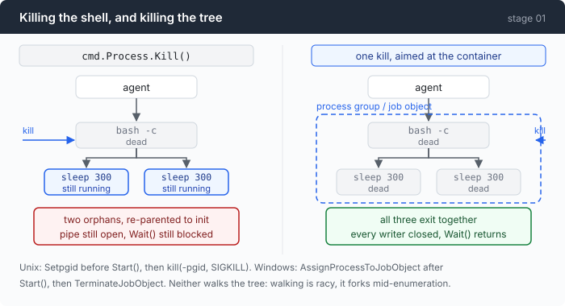
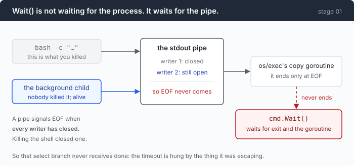

# Stage 01 · part 1: killing a process tree completely

[← back to stage 01](README.md)

> The timeout in the main chapter is four lines. Making the kill it performs
> actually kill everything takes two platform files and one test that has to be
> designed to fail.

---

## The problem

You have a timeout now. Try it on this:

```sh
(sleep 300 &) ; echo started ; sleep 300
```

`started` comes back. Five seconds later the timeout fires and kills the command.
Then, in another terminal:

```sh
$ pgrep -c sleep
1
```

One survivor. The parenthesised `sleep 300 &` was disowned by the shell before
the shell died, so the thing you killed was the parent of a process that no
longer had any link to it.

This is not a contrived line. It is what `npm run dev`, `docker compose up -d`,
and every "start the server in the background so I can test it" command look
like from the operating system's side. Run an agent for a day and you accumulate
a small population of these.

And there is a second half that is worse than the leak. Try the same thing with
output attached, and the timeout does not merely fail to clean up — **it does
not fire at all.** The agent hangs. The mechanism you added to escape hangs has
itself hung.

---

## The idea

Stop aiming the kill at a process. Aim it at a container that the process and
everything it spawns belong to.



Both operating systems have one; they are spelled differently and they have
different weaknesses.

| | Unix | Windows |
|---|---|---|
| the container | process group | job object |
| joined | before `exec()`, by the kernel | after `CreateProcess`, by a call |
| killed by | `kill(-pgid, SIGKILL)` | `TerminateJobObject` |
| can a child escape? | yes, by calling `setpgid` itself | no, membership is permanent |
| airtight? | yes | almost — see step 3 |

Neither one walks the process tree, and that is not an implementation
preference. Walking is racy by construction: between enumerating the children
and killing them, any of them can fork. On Windows it is worse than racy — a
process records its creator's PID, but that PID is recycled aggressively, so an
unrelated process can look exactly like your grandchild.

---

## Building it

Two files with the same four methods, so that
[`main.go`](../code/main.go) cannot tell which platform it is on:
[`proc_unix.go`](../code/proc_unix.go) and
[`proc_windows.go`](../code/proc_windows.go).

```
newProcGroup()  -> allocate the container
attach(cmd)     -> before Start()
adopt(cmd)      -> after Start()
kill()          -> terminate everything in it
Close()         -> release it
```

Two entry points, `attach` and `adopt`, for a reason that only becomes visible
in step 3.

### Step 1: first, see what `Wait()` is actually waiting for

Before any of it, the hang. It is the more interesting bug and it is the one
people misdiagnose.



`cmd.Wait()` does two things: it reaps the process, and it waits for the
goroutines that copy the pipes into your buffers. Those goroutines finish when
they read EOF. A pipe gives EOF when **every** write end is closed.

The shell handed its stdout to the backgrounded grandchild. Killing the shell
closes one write end. The grandchild still holds the other, and it intends to
hold it for five minutes.

So `Wait()` blocks. So `done` never receives. So the `select` waiting on the
timeout has already fired, called a kill that did not work, and is now waiting
on a channel nothing will send to.

This is why a half-kill is not "a leak we can clean up later". It wedges the
agent, and it wedges it inside the code written to prevent wedging.

### Step 2: Unix — act in the gap between `fork()` and `exec()`

```go
func (g *procGroup) attach(cmd *exec.Cmd) {
    if cmd.SysProcAttr == nil {
        cmd.SysProcAttr = &syscall.SysProcAttr{}
    }
    cmd.SysProcAttr.Setpgid = true
}
```

This must run before `cmd.Start()`. It tells the Go runtime to call
`setpgid(0, 0)` in the child, in the window after `fork()` and before the child
has executed a single instruction of shell code.

That timing is the entire reason Unix is airtight here. There is no interval in
which the shell could spawn something into the wrong group, because the shell
has not started running yet.

`Pgid` is deliberately left at zero, which means "make this child the leader of a
brand new group whose ID is its own PID". Setting it to a non-zero value joins an
existing group — and if that group were the agent's, the kill below would take
out the agent.

After `Start()` there is nothing left to do but remember the number:

```go
func (g *procGroup) adopt(cmd *exec.Cmd) error {
    if cmd.Process == nil {
        return fmt.Errorf("adopt called before Start")
    }
    g.mu.Lock()
    defer g.mu.Unlock()
    g.pgid = cmd.Process.Pid
    return nil
}
```

Caching the PID here rather than reading `cmd.Process` at kill time is not
fussiness. At kill time another goroutine is sitting inside `cmd.Wait()`, and
`exec.Cmd` is not safe to read concurrently with that.

The kill itself is one line, and the minus sign is the whole trick:

```go
func (g *procGroup) kill() {
    g.mu.Lock()
    pgid := g.pgid
    g.mu.Unlock()

    if pgid <= 0 {
        return
    }
    _ = syscall.Kill(-pgid, syscall.SIGKILL)
}
```

`kill(-N, sig)` delivers the signal to every process in group N. Descendants
that were re-parented to init when the shell died are still in the group —
membership is inherited through `fork` and survives the leader's death, which is
precisely the property an orphan-killer needs.

The `pgid <= 0` guard is not defensive padding. Group 0 means *my own group*, so
without that line an agent that killed before starting anything would kill
itself.

`SIGKILL` rather than `SIGTERM` because this is already the last resort — the
timeout has expired — and a program with a hanging "graceful shutdown" handler
is not hypothetical. A gentler design sends `SIGTERM`, waits, then `SIGKILL`;
that is a reasonable change, but only once you have a way to abandon that wait,
or you have just rebuilt the hang.

### Step 3: Windows — you can only act once it is already alive

```go
func (g *procGroup) attach(cmd *exec.Cmd) {}
```

Empty, and the emptiness is the lesson. Windows offers no way to declare a
process's container before the process exists. `CreateProcess` hands you
something that is already running.

The container is created up front:

```go
job, err := windows.CreateJobObject(nil, nil)
```

```go
var info windows.JOBOBJECT_EXTENDED_LIMIT_INFORMATION
info.BasicLimitInformation.LimitFlags = windows.JOB_OBJECT_LIMIT_KILL_ON_JOB_CLOSE
```

That flag means "when the last handle to this job closes, terminate everything
still inside". It buys a safety net Unix does not have: if the agent crashes or
is killed from Task Manager, the kernel closes the handles and the runaway tree
dies with them. On Unix the orphans would be adopted by init and keep going.

It also produces a real behavioural difference between the two files, which is
worth stating rather than hiding: `nohup npm start &` **survives** a tool call on
Linux and macOS, and **does not** survive one on Windows. For an agent, dying is
arguably the better default — nothing should outlive its tool call without the
agent knowing — but you should know which one you have.

Joining happens after `Start()`:

```go
h, err := windows.OpenProcess(
    windows.PROCESS_SET_QUOTA|windows.PROCESS_TERMINATE,
    false,
    uint32(cmd.Process.Pid),
)
```

```go
if err := windows.AssignProcessToJobObject(g.job, h); err != nil {
```

And here is the residual race, stated plainly: between `CreateProcess` returning
and `AssignProcessToJobObject` taking effect, there is a window. A shell that
spawns a grandchild as its very first act could put it outside the job. The
window is microseconds wide and in practice this does not fire — which is
exactly the sentence people write above the bug they ship.

The airtight fix is `CREATE_SUSPENDED`: start the process with its main thread
suspended, assign the job while nothing can run, then resume. `os/exec` makes
that awkward rather than impossible — it exposes the PID but not the thread
handle, so resuming means a `CreateToolhelp32Snapshot` of every thread on the
machine, filtered by owning PID. Roughly sixty lines. (`os/exec` refuses to
support `CREATE_SUSPENDED` for its own reason: a suspended process its reaper
never resumes would hang `cmd.Wait()`.)

The trade taken here is to accept the window and say so. If you are writing a
sandbox rather than a teaching repo, use `CreateProcess` directly, where the
flag and the thread handle are both in `PROCESS_INFORMATION`.

One race that is *not* present, though it looks like it should be: `OpenProcess`
by PID cannot hit a recycled PID here. `os.Process` holds an open handle from
`Start()` until `Wait()`, and Windows will not recycle a PID while a handle to
it is open.

The kill:

```go
_ = windows.TerminateJobObject(g.job, 1)
```

Exit code 1 is arbitrary. The only value to avoid is 259 — `STILL_ACTIVE` —
which would make a dead process indistinguishable from a running one to anyone
calling `GetExitCodeProcess`.

### Step 4: the escape hatch needs its own deadline

Both `kill()` implementations swallow their errors. That is deliberate: the
errors that occur in practice are "nothing left in that group" (the happy case)
and "permission denied", and there is no recovery for either that an agent
should attempt on its own.

But swallowing the error means `kill()` cannot tell you it failed, so the caller
must not assume it worked. That is what the second `select` in
[`runBash`](../code/main.go) is for — the five-second reap deadline in the main
chapter, and the reason the agent will discard a command's output rather than
read buffers a goroutine may still be writing to.

The same discipline shows up in the test file:

```go
func reap(cmd *exec.Cmd) {
    done := make(chan struct{})
    go func() {
        _ = cmd.Wait()
        close(done)
    }()
    select {
    case <-done:
    case <-time.After(5 * time.Second):
    }
}
```

Every `Wait` in this stage has a deadline over it, including the ones in the
test harness. `Wait` is the specific call that hangs when a tree was killed
incompletely, so a test that calls it bare can hang your CI on exactly the bug
it was written to detect.

### Step 5: proving it actually killed everything

The tempting test calls `kill()` and asserts no error came back. **That test
passes against an implementation that does nothing**, which is how orphan-leaking
agents ship with green CI.

So the fixture starts real processes and asks the operating system about them:

```sh
sleep 300 & p=$!; cat /proc/$p/winpid 2>/dev/null || echo $p
sleep 300 & p=$!; cat /proc/$p/winpid 2>/dev/null || echo $p
wait
```

`sleep 300 &` inside `bash -c` makes a *grandchild* — our child is the shell,
the sleep is the shell's child. That is the exact relationship naive timeouts
break on. The trailing `wait` keeps the shell alive so the tree stays up.

The `cat /proc/$p/winpid` is the nastiest portability detail in the stage. On
Windows the shell is Git Bash, which is MSYS2, which keeps its own POSIX PID
namespace on top of Windows PIDs. `$!` gives you the MSYS pid; the real Windows
process has a different number entirely. Observed: MSYS `48908`, Windows
`56176`. Handing the MSYS number to `OpenProcess` does not fail — it silently
queries whatever unrelated process owns that number. A test built on `$!` alone
would pass on Windows while proving nothing, and a *kill* built on it would
murder a bystander.

Then the baseline, without which everything after it passes vacuously:

```go
for _, pid := range pids {
    if !processAlive(pid) {
        g.kill()
        g.Close()
        t.Fatalf("grandchild %d was never alive; the fixture is broken", pid)
    }
}
```

The claim itself:

```go
func TestProcGroupKillsWholeTree(t *testing.T) {
    g, cmd, pids := startTree(t)
    defer cleanup(g, cmd)

    g.kill()

    if alive := stillAlive(pids, 5*time.Second); len(alive) != 0 {
        t.Fatalf("orphans survived kill(): %v — the process tree escaped", alive)
    }
```

`stillAlive` polls rather than checking once, because process death is
asynchronous on both platforms: `SIGKILL` only marks a process ready to die, and
`TerminateJobObject` returns before the kernel has finished with its members.

And then the control experiment, which is the more valuable of the two. It
changes exactly one thing and asserts the **opposite** result:

```go
if err := cmd.Process.Kill(); err != nil {
    t.Fatalf("killing the shell: %v", err)
}
```

```go
if alive := stillAlive(pids, 2*time.Second); len(alive) != len(pids) {
```

Every grandchild is *required* to survive. If someone later reduces `procGroup`
to a wrapper around `cmd.Process.Kill()`, the first test could stay green on the
theory that the processes died somehow — this one goes red, because the two
paths are supposed to differ.

---

## Run it

```sh
go test ./01-dont-die/code/ -run TestProcGroup -v
```

Three tests, and the `-v` output is the point:

```
shell pid=52048, live grandchildren=[56176 41924]
all grandchildren [56176 41924] are gone after kill()
as expected, grandchildren [22140 39604] outlived the shell (pid 18412) — this is the orphan bug
```

Then break it on purpose. In `proc_windows.go`, comment out the
`TerminateJobObject` line; on Unix, change `syscall.Kill(-pgid, ...)` to
`syscall.Kill(pgid, ...)` — one character.

**What to watch for:** the first test must go red. If you can delete the body of
`kill()` and keep a green suite, the suite was testing that the function exists.

---

## Measured

The mutation above, run for real. `TerminateJobObject` replaced with a no-op:

```
proc_test.go:209: orphans survived kill(): [18592 36592] — the process tree escaped
--- FAIL: TestProcGroupKillsWholeTree (5.22s)
```

Five seconds of that is `stillAlive` polling out its budget, which is what a
real failure costs to detect.

And the end-to-end number from the main chapter, repeated here because it is the
one that matters: with a 5s timeout and
`(sleep 300 &) ; echo started ; sleep 300`, the count of surviving `sleep`
processes is **0 before and 0 after**. Without the group, it is 2.

---

## Next

The kill works, and you cannot see any of it.

Everything in this stage prints as it happens and then scrolls away. You know a
command timed out because a line said so, once. You cannot ask afterwards what
the model saw on turn 30, how long each call took, or where the tokens went —
and if you want to study a session, you have to have been present for it.

[Stage 02](../../02-see-everything/doc/README.md) turns the agent inside out:
every event goes to one place, and one of the listeners is a file.
