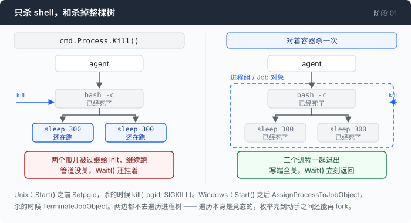
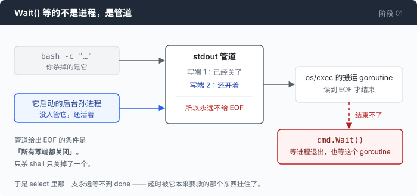

# 阶段 01 · 一：杀干净一棵进程树

[00](../../00-loop/doc/README_zh.md) → `01` → [02](../../02-see-everything/doc/README_zh.md) → 03 → 04 → 05 → 06 → 07 → 08 → 09 → 10 → 11 → 12

> [阶段 01](README_zh.md) 的第 1 步展开。一个超时为什么会被它本来要救的东西挂住，以及两个操作系统各自怎么解决这件事。

---

## 问题

你已经知道 `npm run dev` 会把 agent 挂在那儿，所以你装了一个超时：三十秒还没返回，就把这个进程杀掉。

你测了一下，好像是对的。`sleep 60` 到三十秒被干掉，状态行打出来，模型收到「超时了」，继续往下走。

然后有一天，模型执行了一条这样的命令：

```
(cd server && npm start &) ; sleep 2 ; curl -s localhost:3000/health
```

三十秒到了，你的代码杀掉了那个 shell。然后 agent 停住了。不是等三十秒，是**永远**。你按 Ctrl-C，进程退出，你在另一个窗口 `ps`，npm 还在跑。

超时装上了，也触发了，杀也杀了，agent 照样死。而且这一次它死得更难看：上一次它至少是在等一条明摆着不会返回的命令；这一次它是在等一件已经被你亲手杀掉的事情。

**你为了从挂起里逃出来而写的那段代码，被它本来要救的那个东西挂住了。**

---

## 办法

不要去遍历进程树。遍历本身是竞态的 —— 你枚举完到你动手之间，进程可以再 fork 一个出来，而你已经不看它了。

让操作系统替你记住「这个 shell 和它生出来的一切」，然后对着那个记录一次杀掉。两个平台都有这样一个东西，形状差得很远。



| | Unix | Windows |
|---|---|---|
| 容器是什么 | 进程组，本质上是一个整数 | Job 对象，一个真的内核句柄 |
| 什么时候装进去 | `Start()` **之前** | `Start()` **之后**（进程必须先存在） |
| 一次杀掉 | `kill(-pgid, SIGKILL)` | `TerminateJobObject` |
| 严密程度 | 严密 | 留了一个微秒级的窗口 |

两边共用一个 `procGroup` 接口，`main.go` 分不出自己在哪个平台上。差别都在 `proc_unix.go` 和 `proc_windows.go` 里面，而且下面每一条差别都不是风格问题。

---

## 怎么做的

### 第 1 步：先看清 `Wait()` 到底在等什么

`runBash` 里这三行，是整个挂起的起点：

```go
	var stdout, stderr bytes.Buffer
	cmd.Stdout = &stdout
	cmd.Stderr = &stderr
```

给 `cmd.Stdout` 赋一个 `bytes.Buffer`（而不是一个 `*os.File`），`os/exec` 就必须自己造一个管道，再起一个 goroutine 把管道里的东西往这个 buffer 里搬。而 `cmd.Wait()` 的语义是：等进程退出，**并且**等那些搬运 goroutine 结束。

搬运 goroutine 什么时候结束？读到 EOF 的时候。管道什么时候给出 EOF？**所有**持有写端的进程都关掉它的时候。



`npm start &` 生出来的那个孙进程，继承了同一个写端。shell 退出了，它没退。于是：进程死了，管道没关，`Wait()` 不返回，你的 `select` 那一支永远等不到。

这个坑深到连测试自己都得绕着走。`proc_test.go` 里那个夹具故意不给 `Stderr` 挂 buffer，只给 stdout 挂了一个管道：

```go
	stdout, err := cmd.StdoutPipe()
```

因为在测试进程里复现这个死锁，结果就是测试自己挂住。

### 第 2 步：Unix —— 在 `fork()` 和 `exec()` 之间下手

```go
	if cmd.SysProcAttr == nil {
		cmd.SysProcAttr = &syscall.SysProcAttr{}
	}
	cmd.SysProcAttr.Setpgid = true
```

`Setpgid` 让 Go 运行时在 `fork()` 之后、`exec()` 之前调用 `setpgid(0, 0)`。这个时机是 Unix 这边严密、Windows 那边不严密的**全部原因**：孩子在执行它自己的第一条指令之前，就已经在一个新组里了。不存在任何一个瞬间，能让一个孙进程被生到组外面去。

`Pgid` 留在零，意思是「让这个孩子成为一个全新的组的组长，组号等于它的 PID」。填一个非零的 `Pgid` 是加入一个已有的组 —— 在这里千万不要，否则 `kill(-pgid)` 会把 agent 自己也带走。

`adopt` 在 `Start()` 之后只做一件事：记住组号。

```go
	g.pgid = cmd.Process.Pid
```

为什么要记下来，而不是杀的时候现读 `cmd.Process.Pid`？因为杀的那一刻，有一个 goroutine 正坐在 `cmd.Wait()` 里面。把号缓存下来，`kill()` 就永远不会和它并发碰同一份 `exec.Cmd` 状态。

杀就是一个负号：

```go
	if pgid <= 0 {
		// ...
		return
	}
	_ = syscall.Kill(-pgid, syscall.SIGKILL)
```

`kill(-N, sig)` 的意思是「把这个信号发给 N 号组里的每一个进程」。组关系是 fork 时继承的，而且**组长死了组还在** —— 所以 shell 死后被过继给 init 的那些孙子，仍然在组里，照样收到信号。这正好是一个收孤儿的工具需要的性质。

那个 `pgid <= 0` 的判断不是形式主义。`kill(-0, SIGKILL)` 的意思是「我自己所在的组」，也就是 agent 自杀。

用 `SIGKILL` 不用 `SIGTERM`，是因为「一个装了优雅退出处理、结果那个处理自己挂住了的程序」不是假想敌，而这一步已经是超时之后的最后手段了。更温和的设计是先 `SIGTERM`，等一秒，再 `SIGKILL` —— 这是一个合理的改动，但只有在你已经有办法放弃那次等待之后才能做，否则你刚刚把自己要逃的那个挂起又请回来了。

### 第 3 步：Windows —— 只能等它先活起来

Windows 没有 Unix 意义上的进程组，而且 —— 这是最容易被忽略的一半 —— 也没有可靠的父子关系。一个进程记录了创建它的那个 PID，但那个 PID 不会因此被保住，不会被继承，还会被积极回收。所以「顺着父指针杀掉整棵子树」在 Windows 上不只是竞态，而是**错的**：一个被回收的 PID 能让毫不相干的进程看起来像你的孙子，然后你杀掉了别人的活。

对应的原语是 Job 对象，一个进程可以被指派进去的内核容器，孩子自动继承，可以整体终止。它在进程存在之前就建好：

```go
	job, err := windows.CreateJobObject(nil, nil)
	if err != nil {
		return nil, fmt.Errorf("CreateJobObject: %w", err)
	}

	var info windows.JOBOBJECT_EXTENDED_LIMIT_INFORMATION
	info.BasicLimitInformation.LimitFlags = windows.JOB_OBJECT_LIMIT_KILL_ON_JOB_CLOSE
```

那个 flag 是配置这个 job 的唯一理由：**最后一个句柄关闭时，把里面还活着的东西全部终止。** 这给了 Windows 一张 Unix 这边根本没有的安全网 —— agent 自己崩了、被任务管理器杀了，内核替你关句柄，跑飞的那棵树跟着一起死；Unix 那边孤儿会被过继给 init 继续跑下去。

两个直接后果要记住。第一，这个类型的 `Close()` 不是被动清理，它会杀人，所以 `runBash` 里那句 `defer g.Close()` 是有承重作用的。第二，`nohup npm start &` 这种故意要活过这次工具调用的命令，在 Linux/macOS 上活得下来，在 Windows 上活不下来。这是两个文件之间真实的行为差异，不是谁写漏了。

然后是那个不对称的地方。`attach` 在 Windows 上什么都不做：

```go
func (g *procGroup) attach(cmd *exec.Cmd) {}
```

因为 job 只能指派给一个**已经在跑**的进程，而 `CreateProcess` 给你的进程已经在跑了。所以动作挪到了 `Start()` 之后：

```go
	h, err := windows.OpenProcess(
		windows.PROCESS_SET_QUOTA|windows.PROCESS_TERMINATE,
		false,
		uint32(cmd.Process.Pid),
	)
```

只要这两个权限，不要 `PROCESS_ALL_ACCESS`：`AssignProcessToJobObject` 真正检查的是 `PROCESS_SET_QUOTA`（job 在形式上是一个配额与限制的容器），`PROCESS_TERMINATE` 是它要求的另一半。只要这两个，受限令牌下也能用。

```go
	if err := windows.AssignProcessToJobObject(g.job, h); err != nil {
		// ...
		return fmt.Errorf("AssignProcessToJobObject: %w", err)
	}
```

这里要老实说清楚两件事。

**残留的竞态。** `CreateProcess` 返回，到 `AssignProcessToJobObject` 生效，中间有一个几微秒的窗口。shell 如果第一件事就是起一个后台进程，那个孙子不在 job 里，`kill()` 碰不到它。堵死它的办法是 `CREATE_SUSPENDED`：主线程挂起着启动，在什么都跑不起来的时候完成指派，然后 `ResumeThread`。`os/exec` 让这件事变得别扭而不是不可能 —— 它给你 `cmd.Process.Pid`，但不给你主线程的句柄，于是唤醒要走 `CreateToolhelp32Snapshot` 枚举全机线程、按 PID 过滤、`OpenThread`、`ResumeThread`，大约六十行。（`os/exec` 刻意不支持 `CREATE_SUSPENDED`，因为一个 Go 的收尸代码永远不会去唤醒的挂起进程，会把 `cmd.Wait()` 挂住。）这里选择接受这个窗口，并且把它说出来 —— 「实践中没见它发生过」正是人们写在自己发布的 bug 上面的那句话。

**这一步失败不是致命的。** 最典型的失败是 `ERROR_ACCESS_DENIED`，因为这个进程已经在一个禁止嵌套的 job 里了（嵌套 job 要 Windows 8 以上；有些 CI runner 和容器宿主会把每个进程都塞进一个锁死的 job）。`runBash` 把它降级成一句警告：

```go
	if err := g.adopt(cmd); err != nil {
		// ...
		fmt.Fprintf(os.Stderr, "warning: process group adoption failed: %v\n", err)
	}
```

命令照跑，只是超时现在只能杀掉那个 shell 本身。说出来，比假装这棵树被围住了要好。

最后，`Close()` 里那个把句柄清零的顺序值得看一眼：

```go
	g.closed = true
	job := g.job
	g.job = 0
	if job == 0 {
		return nil
	}
	return windows.CloseHandle(job)
```

Windows 回收句柄值很积极。对一个已关闭的句柄调 `TerminateJobObject` 不是一个无害的错误 —— 它可能落在碰巧继承了这个编号的另一个内核对象上。所以在锁里先把它清零。

### 第 4 步：逃生口自己也要有期限

`g.kill()` 是让 `Wait()` 解除阻塞的手段。但这一节的整个教训就是逃生口也会挂，所以这个逃生口自己也要有期限：

```go
		select {
		case waitErr = <-done:
		case <-time.After(5 * time.Second):
			unreaped = true
		}
```

5 秒还收不上尸就放弃。代价是泄漏那个 `Wait` goroutine —— 它会一直拿着输出缓冲区，直到操作系统最终释放那个管道。这个交换是划算的：泄漏一个 goroutine 能活，卡死整个 agent 不能。

代价还有第二半，容易漏掉：

```go
	if unreaped {
		// ...
		res.ExitCode = -1
		return res
	}
```

`Wait` 没返回，就意味着那些搬运 goroutine **可能还在往 buffer 里写**。这时候读 `stdout.String()` 是一个 data race。所以什么都不取，只把情况报上去 —— 模型收到的是 `[TIMED OUT after … and could not be reaped — output was discarded as unsafe to read. Do not run this command again.]`。

### 第 5 步：怎么证明它真的杀干净了

最容易写的测试是：调 `kill()`，断言它没返回错误。这个测试对着一个**什么都不做**的实现也是绿的，绿色 CI 的漏进程 agent 就是这么发布出去的。

所以测试只做唯一一件真的能证明什么的事：起真的后台进程，拿到真的 PID，然后问操作系统这些 PID 还在不在。

```go
const grandchildScript = `
sleep 300 & p=$!; cat /proc/$p/winpid 2>/dev/null || echo $p
sleep 300 & p=$!; cat /proc/$p/winpid 2>/dev/null || echo $p
wait
`
```

`sleep 300 &` 写在 `bash -c` 里面，造出来的正是**孙进程**：我们的孩子是 shell，sleep 是 shell 的孩子。这就是压垮天真超时的那个关系。

那句 `cat /proc/$p/winpid` 不是装饰，它是这一节里最阴的一个可移植性细节。Windows 上跑的是 Git Bash，也就是 MSYS2，它在 Windows PID 之上维护了一套自己的 POSIX PID。`$!` 给出的是 MSYS 的号，真实的 Windows 进程是另一个号 —— 观察到的一次是 `msys_pid=48908`，而 `ps -W` 显示真正的 WINPID 是 `56176`。把 MSYS 的号交给 `OpenProcess` **不会报错**，它会去查那个号碰巧属于的、毫不相干的另一个 Windows 进程。一个只靠 `$!` 的测试因此会在 Windows 上「通过」而什么都没证明，一个只靠 `$!` 的 kill 会杀掉一个无辜的旁人。MSYS2 在 `/proc/<pid>/winpid` 提供了翻译，真 Unix 上这个路径不存在，`cat` 失败，`|| echo $p` 退回到本来就正确的那个号。

问「这个 PID 还在吗」也各有一个坑。Unix 用 0 号信号：

```go
	return syscall.Kill(pid, syscall.Signal(0)) == nil
```

它对**僵尸进程**也返回真 —— 一个已经死了但还没人收尸的进程。所以要轮询，不要只查一次。Windows 这边不要用那个看起来最顺手的 `GetExitCodeProcess`，它对运行中的进程报 `STILL_ACTIVE`（259），而 259 本身是一个完全合法的退出码，于是一个以 259 退出的进程看起来永生：

```go
	event, err := windows.WaitForSingleObject(h, 0)
	if err != nil {
		return false
	}
	// ...
	return event != windows.WAIT_OBJECT_0
```

顺带一个只有 Windows 有的性质：只要系统上还有任何一个指向这个死进程的句柄没关，它的 PID 就不会被回收，`OpenProcess` 对它照样**成功**。所以「`OpenProcess` 成功了」不是活着的证据，必须接着问句柄有没有被置信号。

两个测试，一个断言杀干净了，另一个 —— 更有价值的那个 —— 只改一处（`cmd.Process.Kill()` 换掉 `g.kill()`），断言**相反的结果**：孙子全都活着。如果以后有人把 `procGroup` 掏空成一层 `cmd.Process.Kill()` 的包装，第一个测试还会以「反正进程死了」为理由保持绿色，第二个会红。

---

## 跑一下

```sh
go test -run TestProcGroup -v ./01-dont-die/code
```

三个测试，其中一个会打印出它故意造出来的孤儿。然后是真的 agent：

```sh
go build -o agent ./01-dont-die/code
mkdir -p sandbox && cd sandbox
set -a && . ../.env && set +a
../agent --timeout 5s
```

让它执行这条命令：

```
(sleep 300 &) ; echo started ; sleep 300
```

**观察重点：**

- `started` 还在输出里。超时之前已经打出来的东西没有被丢掉，状态行只是加在它后面。
- 状态行说的是 `the process tree was killed`，不是 `the command was killed`。这两句话的差别就是这一整节。
- 跑完之后在另一个窗口数一下还剩几个 `sleep`。Linux/macOS 用 `pgrep -c sleep`，Windows 上的 Git Bash 用 `ps -W | grep -c sleep`。应该是 0。
- 把 `--timeout` 调成 `1s` 再来一次。它照样干净 —— 这一步没有任何地方依赖「时间足够长」。

---

## 量一量

5 秒超时，输入 `(sleep 300 &) ; echo started ; sleep 300`：

```
started
[TIMED OUT after 5.046s — the process tree was killed]
```

整个来回 18 秒左右，其中 5 秒是超时本身。`ps -W | grep -c sleep` 跑之前是 0，跑之后还是 0 —— 那两个后台 `sleep` 一个都没漏出去。

然后是变异测试，因为「测试通过了」本身不是证据。把 `TerminateJobObject` 换成一个什么都不做的函数，再跑：

```
proc_test.go:209: orphans survived kill(): [18592 36592] — the process tree escaped
--- FAIL: TestProcGroupKillsWholeTree (5.22s)
```

`18592` 和 `36592` 是两个真实的、当时还在运行的 Windows 进程号。这条输出是这一节唯一有说服力的东西：它证明这个测试盯着的不是「函数返回了 nil」，而是「那两个进程真的不在了」。

---

## 接下来

进程现在跑不飞了，也漏不出去了。超时能生效，逃生口自己也有期限，两个平台各自的手段都在同一个接口后面。

但这只解决了「命令不返回」这一种死法。那些**乖乖返回**的命令还有另一种方式压死你：一条 `find /` 会在几秒内正常退出，退出码 0，然后把几百 MB 的路径塞进你的下一个请求体里。这条路上没有任何超时会被触发。

回到 [阶段 01](README_zh.md) 的第 2 步：输出回来之后要做什么。
