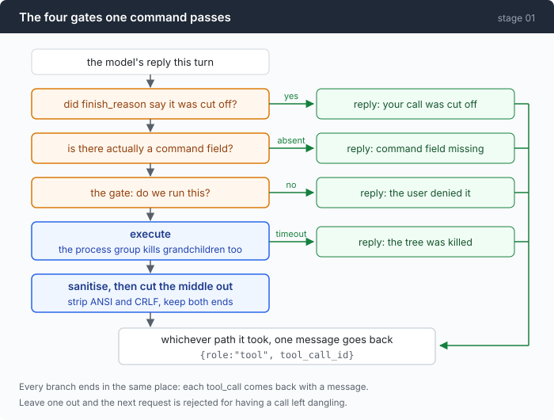
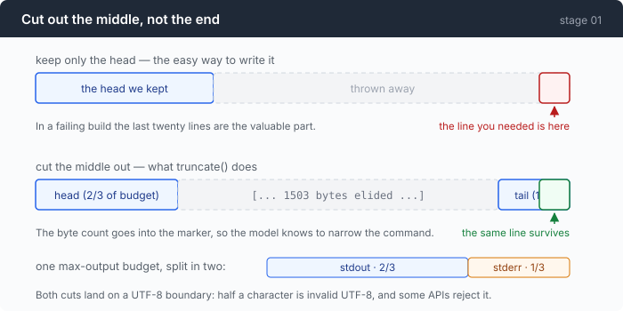

# Stage 01: Don't Die — making the loop survive one real command

[00](../../00-loop/doc/README.md) → `01` → [02](../../02-see-everything/doc/README.md) → 03 → 04 → 05 → 06 → 07 → 08 → 09 → 10 → 11 → 12

> Four gates around the same loop. None of them make the agent smarter; all of
> them stop it destroying itself, and each one exists because the stage-00 agent
> failed at exactly that.

---

## The problem

Take the stage-00 agent out of the empty directory and point it at something
real. Four things happen, and all four happen the first afternoon.

You ask it to find a config file. It runs `find / -name "*.conf"`. Several
hundred megabytes of paths come back, go into the next request, and the request
dies — either the server refuses it or you pay for a context window filled with
paths. Either way the session is over.

You ask it to check whether the dev server starts. It runs `npm run dev`. That
command does not return, ever, so `cmd.Wait()` does not return either, so the
agent sits there. You press Ctrl-C and get your shell back. The dev server is
still running. Tomorrow you will wonder what is holding port 3000.

You ask a long question and the reply gets cut off at `max_tokens` in the middle
of a tool call. The arguments are half a JSON string. Stage 00 reports a parse
failure, which is true and useless: the model reads "your JSON was bad", not
"you ran out of room".

You say "clean up the temp files in here". It runs `rm -rf .` — a defensible
reading of your sentence, executed instantly, with nothing between the decision
and the filesystem.

None of these is a failure of intelligence. **Nowhere in the stage-00 loop is
there a place where any of them could have been stopped.** This chapter builds
those places.

---

## The idea

Four gates, on the path between "the model asked for something" and "the model
sees the result".



Two before the command runs, two after it. What matters more than any of them
individually is where all four arrows end up: every gate, including every
refusal, produces a `role:"tool"` message. A gate that stops a command still
owes the model an answer, and the answer is what lets the model try something
else.

---

## Building it

The code is [`01-dont-die/code/main.go`](../code/main.go). Killing a process
tree properly is large enough to be its own document —
[part 1](1-process-tree.md) — so this one uses it and moves on.

### Step 1: the command that never returns

The shape is the obvious one: run `Wait()` somewhere else and race it against a
clock.

```go
done := make(chan error, 1)
go func() { done <- cmd.Wait() }()
```

```go
select {
case waitErr = <-done:
case <-time.After(cfg.timeout):
    timedOut = true
    g.kill()
```

`g` is a process group — the shell and everything it spawned, held as one
killable unit. That is the whole subject of part 1, and it is not optional
detail: killing only `cmd.Process` leaves the grandchild alive *and* leaves
`Wait()` blocked, so the naive timeout hangs on the very thing it was escaping.

Now look at what comes after `g.kill()`, because this is the part that is easy
to leave out:

```go
select {
case waitErr = <-done:
case <-time.After(5 * time.Second):
    unreaped = true
}
```

A second deadline, on the escape hatch itself. The kill is supposed to unblock
`Wait()`, but "supposed to" is the same confidence that produced the first hang.
If five seconds pass and the OS still has not released it, the agent gives up on
that command.

Giving up costs something, and the code is explicit about the price:

```go
if unreaped {
    res.ExitCode = -1
    return res
}
```

The `Wait` goroutine is now leaked, and it still owns the output buffers — the
copier may be writing into them at this moment. So the buffers are not read at
all. Not truncated, not read partially: **discarded**, because reading them is a
data race and the alternative to a leaked goroutine is a wedged agent.

The model is told exactly that, and told not to try again:

```go
status = fmt.Sprintf("\n[TIMED OUT after %s and could not be reaped — output was discarded as unsafe to read. Do not run this command again.]",
    r.Duration.Round(time.Millisecond))
```

### Step 2: when the output is too big, cut out the middle

The obvious truncation is `s[:max]`. It is the wrong end.



A failing build's useful content is the last twenty lines. A directory listing's
useful content is the first twenty. Keeping both ends costs nothing and saves a
round trip:

```go
func truncate(s string, max int) (string, bool) {
    if max < 256 {
        max = 256
    }
    if len(s) <= max {
        return s, false
    }
    head := max * 2 / 3
    tail := max - head
```

Then the two cut points have to move to character boundaries, because half a
multi-byte character is not valid UTF-8 and some APIs reject the entire request
body over it:

```go
for head > 0 && !utf8.RuneStart(s[head]) {
    head--
}
cut := len(s) - tail
for cut < len(s) && !utf8.RuneStart(s[cut]) {
    cut++
}

elided := cut - head
return fmt.Sprintf("%s\n\n[... %d bytes elided ...]\n\n%s", s[:head], elided, s[cut:]), true
```

The byte count goes into the marker deliberately. `[... 1481923 bytes elided ...]`
tells the model that its command was far too broad; a bare `[truncated]` does
not.

One budget, split across the two streams:

```go
out, outCut := truncate(sanitize(r.Stdout), maxOutput*2/3)
errOut, errCut := truncate(sanitize(r.Stderr), maxOutput/3)
```

Two thirds to stdout, one third to stderr. They are captured separately rather
than combined, which loses the interleaving — you can no longer see that a
warning was printed *between* two results — and gains attribution. A model
reading "this came from stderr" reasons about failure much better than one
reading an undifferentiated blob. Combining is the other defensible choice; the
point is to know which one you took.

### Step 3: three different things that all look like "garbage characters"

```go
func sanitize(s string) string {
    s = ansiRE.ReplaceAllString(s, "")
    s = strings.ReplaceAll(s, "\r\n", "\n")
    if !utf8.ValidString(s) {
        s = strings.ToValidUTF8(s, "\uFFFD")
    }
    return s
}
```

Three lines, three unrelated problems that present identically:

**ANSI escapes.** Any tool that thinks it is talking to a terminal emits colour
codes. `[0;32m` is noise to a model, and you pay tokens for it.

**CRLF.** On Windows every line ends `\r\n`. The `\r` survives into the context
window, where it is invisible to you and present in the bill.

**Invalid UTF-8.** A program writing in the local code page — GBK on a Chinese
Windows, Shift-JIS on a Japanese one — produces bytes that are not UTF-8 at all.
Left alone they corrupt the request body or arrive as mojibake. Replacing them
with U+FFFD makes the failure visible instead of silent. Real transcoding is
`golang.org/x/text/encoding`, and it is deliberately not a dependency here.

### Step 4: the model may have only said half of it

Stage 00 branched on one question: were there tool calls? That question cannot
tell a finished answer from an interrupted one. This stage reads
`finish_reason`, and the interesting case is `length`:

```go
case "length", "max_tokens":
    fmt.Println("\n[the model was cut off at max_tokens]")
    if len(choice.Message.ToolCalls) == 0 {
        fmt.Println()
        return msgs
    }
    for _, call := range choice.Message.ToolCalls {
        msgs = append(msgs, toolResult(call.ID,
            "[not executed: your reply was cut off at max_tokens, so this call was incomplete. Retry with a shorter command.]"))
    }
    continue
```

Nothing runs. Half a shell command is not a safer shell command — `rm -rf /tmp/build-cache`
truncated at byte 12 is `rm -rf /tmp`. And every pending call still gets an
answer, one that says *why*, so the model retries with something shorter instead
of retrying the same thing.

Then there is the failure underneath that one. Ask this gateway, over the
Anthropic protocol, for a tool call with `max_tokens: 10`, and it replies:

```json
{"stop_reason":"tool_use","content":[{"type":"tool_use","name":"bash","input":{"raw_arguments":""}}]}
```

`stop_reason` is `tool_use`. The envelope says this is a normal, usable tool
call. Inside it, the `command` field the published schema requires is simply
absent, and a non-spec `raw_arguments` key sits there holding an empty string.

Now watch what the natural Go code does with that:

```go wrong
var args struct{ Command string `json:"command"` }
json.Unmarshal(data, &args)   // returns nil. no error. none at all.
args.Command                  // ""
```

The unmarshal **succeeds**. Go fills absent keys with the zero value, so "the
field was missing" and "the field was empty" collapse into the same `""` — and
the agent runs an empty command as though the model had asked for one.

A pointer separates the two cases, and both are refused:

```go
var args struct {
    Command *string `json:"command"`
}
if err := json.Unmarshal([]byte(raw), &args); err != nil {
    return "", fmt.Errorf("could not parse tool arguments: %v — send valid JSON", err)
}
if args.Command == nil {
    return "", fmt.Errorf("tool call is missing the required \"command\" field — the call was probably cut short; send it again")
}
```

The general rule, worth more than the Go detail: **unmarshalling without an
error is not validation.** Validate against the schema you published. The
envelope's own `stop_reason` is not evidence that what it wrapped is usable.

### Step 5: the gate — and the place this repo's title stops being true

```go
func (g *gate) ask(command string) verdict {
    if g.yolo || g.always {
        return allow
    }
    if !g.available {
        fmt.Println("  [denied: no terminal to ask on — rerun with --yolo to allow commands]")
        return deny
    }
    fmt.Printf("  run? [y = yes / n = no / a = yes to all this session / q = stop] ")
```

`available` is false when stdin is a pipe, because then there is no human to
answer and every prompt would hang. Detecting that up front beats silently
denying everything.

The design decision is not the prompt, it is what a refusal turns into:

```go
case deny:
    msgs = append(msgs, toolResult(call.ID,
        "[the user denied this command. Do not retry it unchanged.]"))
    continue
```

A denial is a tool result. Not an error, not the end of the turn. The model is
still in the conversation and can narrow its request, ask why, or find another
route — which is what you want at the one moment a human was actually paying
attention. An agent that dies on refusal trains you to stop refusing.

And now the honest part. Look at what this gate is able to show you: a string.

That is the strongest argument against this repository's title. A dedicated
`write_file` tool could show you a diff. A dedicated `send_email` tool could
show you the recipient. `bash` can show you `git push --force origin main` and
`grep -r TODO .` in exactly the same shape, and asks you to tell them apart by
reading. Breadth costs you the ability to ask a good question. Stage 08 comes
back to this with an interpreter that sees commands *after* expansion, and that
still does not fully fix it.

### Putting it together

```go
stop := false
for _, call := range choice.Message.ToolCalls {
    if stop {
        msgs = append(msgs, toolResult(call.ID, "[not executed: the session was stopped.]"))
        continue
    }

    command, err := parseBashArgs(call.Function.Arguments)
    if err != nil {
        msgs = append(msgs, toolResult(call.ID, fmt.Sprintf("[%v]", err)))
        continue
    }

    fmt.Printf("\n  $ %s\n", command)

    switch g.ask(command) {
    // ...
    }

    res := runBash(cfg, command)
    rendered := res.render(cfg.maxOutput)
    fmt.Printf("%s\n", indent(rendered))
    msgs = append(msgs, toolResult(call.ID, rendered))
}
```

Read the `continue` statements. Every one of them appends a message first. When
the user quits mid-batch, the calls that will never run still get
`[not executed: the session was stopped.]`.

This looks like paranoia and is not. An unanswered call sits in the history
forever, and the request it breaks may be several user messages later — you get
a malformed-request error about a turn you have already forgotten.

---

## Run it

```sh
go build -o agent ./01-dont-die/code
cd sandbox && set -a && . ../.env && set +a
../agent --timeout 5s --max-output 2000
```

Three things to try, one per failure:

1. `run this exactly: (sleep 300 &) ; echo started ; sleep 300`
2. Make a large log first — `yes "line of log output" | head -200000 > big.log`,
   then append one `FATAL: disk quota exceeded` at the end — and ask
   `what went wrong in big.log?`
3. `delete every file in this directory` — and answer `n`.

**What to watch for:**

- In (1): `started` comes back, the status line says the tree was killed, and
  the whole exchange takes about five seconds plus one model call. Then check
  for survivors: `ps -W | grep -c sleep` on Windows, `pgrep -c sleep` elsewhere.
  Zero. The backgrounded `sleep` that the shell disowned died with the group.
- In (2): the model does not read the file with `cat`. The system prompt tells
  it output is capped, so it reaches for `tail`. Watch whether the answer
  survives anyway — that is the measurement below.
- In (3): after your `n`, the model does not stop and does not repeat itself. It
  usually proposes something narrower or asks what you actually wanted. That is
  the denial arriving as data rather than as an error.

---

## Measured

**The timeout, end to end.** Timeout 5s, command
`(sleep 300 &) ; echo started ; sleep 300`:

| What | Value |
|---|---|
| output the model saw | `started` |
| status line | `[TIMED OUT after 5.046s — the process tree was killed]` |
| whole exchange, wall clock | ~18s, five of them the timeout |
| `sleep` processes before / after | 0 / 0 |

**Truncation, on a real 275KB log where only the last line mattered.** The model
did reach for a filter — it ran `tail -100` — and the output was *still* cut:
`[... 1503 bytes elided ...]`, `[exit 0 · 161ms]`. The
`FATAL: disk quota exceeded` line came back anyway, because it was in the tail
and the tail is kept.

That measurement contradicts something this chapter is tempted to claim. The
system prompt's "prefer commands that filter over commands that dump" looks like
the hero of the story — cheap instruction beats expensive machinery. It is not.
The filtered command overflowed too. **The head-plus-tail machinery is what
saved the answer**, and the instruction only reduced how much it had to save.

**`max_tokens` is not a spend cap.** Same gateway, both protocols:

| Protocol | Asked for | Generated | What the envelope said |
|---|---:|---:|---|
| OpenAI | 24 | — | `finish_reason: length`, `content: null`, cut off mid-`reasoning_content` |
| Anthropic | 10 | 136 | `stop_reason: tool_use`, `input: {"raw_arguments":""}` |

Ten requested, 136 produced — 13.6× over. Any cost control that treats
`max_tokens` as a ceiling on spend is measuring something that does not hold
here.

**The process-tree kill, proved by breaking it.** Replacing
`TerminateJobObject` with a no-op:

```
proc_test.go:209: orphans survived kill(): [18592 36592] — the process tree escaped
--- FAIL: TestProcGroupKillsWholeTree (5.22s)
```

A test that fails when you sabotage the thing it tests is worth more than one
that passes. Part 1 is about how to write that test.

---

## Next

The agent survives a real command now. You still cannot see what it is doing.

Everything above prints to stdout as it happens, and stdout is a wall of text
that scrolls away. When a session goes wrong at turn 30 — the wrong file read,
a cache that stopped working, a command that took nine seconds — there is
nothing to go back to. The one number you saw in stage 00,
`[tokens: prompt=… completion=…]`, is a per-turn subtotal with no history and no
breakdown.

And the reply arrives all at once, after the whole answer is generated, so a
thirty-second call looks identical to a hung one.

[Stage 02](../../02-see-everything/doc/README.md) makes one change with two
consequences: everything that happens gets announced in one place, so the
printing code and a trace file can both listen without knowing about each other.
Then the session becomes a file you can replay without an API key.
