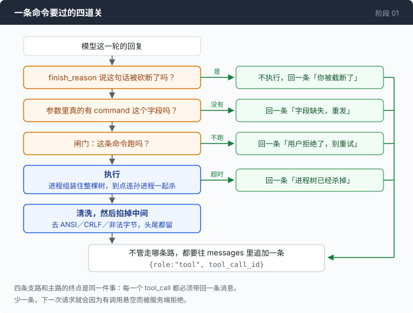
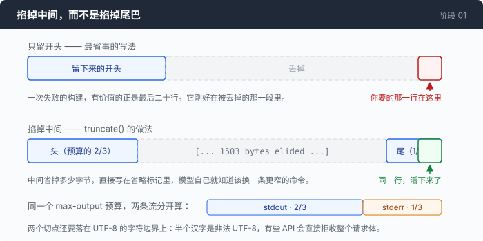

# 阶段 01：别死 —— 让这个循环撑得住一条真实的命令

[00](../../00-loop/doc/README_zh.md) → `01` → [02](../../02-see-everything/doc/README_zh.md) → 03 → 04 → 05 → 06 → 07 → 08 → 09 → 10 → 11 → 12

> 四样东西：命令跑之前的一道闸门，跑的时候的一个超时，回来时的一次截断，以及一个「模型这句话是不是只说了一半」的判断。

---

## 问题

你把上一章那个 agent 放进一个真实的目录，让它做点事。

你说「看看这个项目里有哪些配置文件」。它执行 `find / -name "*.json"`。几百 MB 的路径开始往回灌，你还没反应过来，这一轮已经因为塞不进上下文窗口崩掉了。钱照付。

你说「把开发服务器起起来，看看有没有报错」。它执行 `npm run dev`。那条命令的设计目的就是永远不返回。终端停在那儿，光标不动。你等了两分钟，按 Ctrl-C 退出。

然后你在另一个窗口里敲 `ps`，发现那个 npm 还在跑。你 Ctrl-C 掉的是 agent，不是 agent 启动的东西。

你说「清理一下临时文件」。它执行 `rm -rf .`。

这四件事有一个共同点，第 00 章末尾已经说过了：它们都不是模型不够聪明造成的。**在这条命令和你的机器之间，现在什么都没有。**

---

## 办法

一次工具调用，从模型开口到结果回去，中间有四个位置会出事。每个位置装一样东西。



| 出事的位置 | 装什么 | 模型收到什么 |
|---|---|---|
| 模型这句话本身就是半截的 | 读 `finish_reason`，再校验参数 | 一条说明：你被截断了，重发 |
| 这条命令你不想让它跑 | 一道闸门，跑之前问你一句 | 一条说明：用户拒绝了，别原样重试 |
| 命令永远不返回 | 超时，到点杀掉整棵进程树 | 一条说明：超时了，进程树已经杀掉 |
| 输出太大，或者带着脏字节 | 掐掉中间，清洗，再回去 | 头和尾，中间标一句省略了多少字节 |

右边那一列长得一样，这是这一章唯一的结构性约定：**不管中间发生了什么，每一个 `tool_call` 都要带回一条消息。** 少一条，下一次请求就是非法的。

---

## 怎么做的

代码在 [`01-dont-die/code/`](../code/)。

### 第 1 步：命令永远不返回

一条命令不能跑到天荒地老，所以起一个 goroutine 等它，主线程和一个计时器抢：

```go
	done := make(chan error, 1)
	go func() { done <- cmd.Wait() }()

	var timedOut, unreaped bool
	var waitErr error
	select {
	case waitErr = <-done:
	case <-time.After(cfg.timeout):
		timedOut = true
		g.kill()
```

到点了要杀谁？几乎每个人第一次都写这个：

```go wrong
	case <-time.After(cfg.timeout):
	    cmd.Process.Kill()      // ← 只杀了那个 shell
```

它有时候能用，有时候会把你的 agent 挂死到底，而且挂死的方式很难猜到 —— `cmd.Wait()` 等的不是进程退出，是那个 stdout 管道关闭，而管道的写端还在一个你没杀掉的孙进程手里。

这件事够写一节，而且它是这一章里唯一一处两个操作系统给出完全不同答案的地方，所以单独放在一篇里：

> **[一、杀干净一棵进程树](1-process-tree_zh.md)** —— `Wait()` 为什么会永远不返回，Unix 的进程组和 Windows 的 Job 对象各自怎么解决它，以及逃生口自己挂住的时候怎么办。

上面那段 `g.kill()`，看完那一篇你就知道它凭什么能杀干净。这里继续往下：命令终于返回了，输出回来了。

### 第 2 步：输出太大的时候，掐掉中间

最省事的写法是只留开头。它是错的，而且错在最要命的地方：一次失败的构建，有价值的是**最后**二十行；一个目录列表，有价值的是**开头**二十行。两头都留，成本是零。

```go
	head := max * 2 / 3
	tail := max - head
```

中间那段直接换成一句话，说清楚少了多少字节：

```go
	for head > 0 && !utf8.RuneStart(s[head]) {
		head--
	}
	cut := len(s) - tail
	for cut < len(s) && !utf8.RuneStart(s[cut]) {
		cut++
	}

	elided := cut - head
	return fmt.Sprintf("%s\n\n[... %d bytes elided ...]\n\n%s", s[:head], elided, s[cut:]), true
```

那两个 `RuneStart` 循环是给中文准备的。一个汉字在 UTF-8 里是三个字节，按字节切几乎一定切在字符中间；半个字符是非法 UTF-8，有些 API 会直接拒收整个请求体。



预算是分开的，stdout 拿三分之二，stderr 拿三分之一：

```go
	out, outCut := truncate(sanitize(r.Stdout), maxOutput*2/3)
	errOut, errCut := truncate(sanitize(r.Stderr), maxOutput/3)
```

这里还有一个和第 00 章不一样的决定：stdout 和 stderr 是**分开捕获**的，不再是 `CombinedOutput`。代价是丢掉了交错顺序 —— 你没法再看出某条警告是在两个结果**中间**打出来的；换来的是归属，而一个读到「这句话来自 stderr」的模型，比读到一坨混在一起的文本的模型，判断失败的能力强得多。合并是另一种站得住脚的选择，你只要知道自己选了哪个。

### 第 3 步：三种都长得像「乱码」的东西

```go
func sanitize(s string) string {
	s = ansiRE.ReplaceAllString(s, "")
	s = strings.ReplaceAll(s, "\r\n", "\n")
	if !utf8.ValidString(s) {
		s = strings.ToValidUTF8(s, "\uFFFD")
	}
	return s
}
```

三件不同的事，在你查清楚之前都表现为「有奇怪的字符」。**ANSI 转义**：颜色码对模型是纯噪声，而且要花 token。**CRLF**：Windows 上每一行都以 `\r\n` 结尾，那个 `\r` 会一路进到上下文窗口里，看不见，也没有任何用处。

**非法 UTF-8**：一个按本地代码页输出的原生程序 —— 中文 Windows 上的 GBK，日文上的 Shift-JIS —— 吐出来的字节根本不是合法的 UTF-8。放着不管，要么请求出错，要么变成一团乱码。这里换成 U+FFFD，让这次失败**看得见**，而不是安静地烂在里面。测试里那四个字节 `0xD6 0xD0 0xCE 0xC4`，在 GBK 里是两个汉字，在 UTF-8 里什么都不是。真要转码，那是 `golang.org/x/text/encoding` 的事，这个仓库刻意不引它。

最后，状态行放在最后面：

```go
	status := fmt.Sprintf("\n[exit %d · %s]", r.ExitCode, r.Duration.Round(time.Millisecond))
	if r.TimedOut {
		status = fmt.Sprintf("\n[TIMED OUT after %s — the process tree was killed]", r.Duration.Round(time.Millisecond))
	}
```

放最后，是因为模型自己那一侧也会丢掉一些上下文，而这一行离它的下一个念头最近。

### 第 4 步：模型这句话，可能只说了一半

第 00 章只判断一件事：有没有 `tool_calls`。这等于把「一句被砍断的话」当成「一句说完了的话」。所以要读 `finish_reason`：

```go
		case "length", "max_tokens":
			// ...
			fmt.Println("\n[the model was cut off at max_tokens]")
			if len(choice.Message.ToolCalls) == 0 {
				fmt.Println()
				return msgs
			}
			for _, call := range choice.Message.ToolCalls {
				msgs = append(msgs, toolResult(call.ID,
					"[not executed: your reply was cut off at max_tokens, so this call was incomplete. Retry with a shorter command.]"))
			}
			continue
```

被砍断的调用，参数是一段截了一半的 JSON 字符串，绝对不能跑：**半条 shell 命令不是一条更安全的 shell 命令。** 但那些悬空的调用还是各要回一条说明，否则下一次请求非法。

正常那一支里藏着一个观察，值得写死在代码里：

```go
		case "stop", "end_turn", "":
			if len(choice.Message.ToolCalls) == 0 {
				fmt.Println()
				return msgs
			}
			// Some providers say "stop" while still emitting tool calls; trust
			// the calls, not the label.
```

还有一个你不认识的值：原样把那个字符串打出来，然后当这一轮结束了。猜一个语义是更糟的选择。

```go
		default:
			fmt.Printf("\n[unknown finish_reason %q — treating as a finished turn]\n\n", choice.FinishReason)
			return msgs
```

不过信封说这次调用是好的，不代表里面装的东西能用。下面这段是所有人都会写的，它有一个安静的 bug：

```go wrong
	var args struct{ Command string `json:"command"` }
	json.Unmarshal(data, &args)   // ← 返回 nil。没有 error。一个都没有。
	args.Command                  // ← ""
```

Go 会把不存在的字段填成零值，于是「必填字段缺失」和「字段是空字符串」塌成了同一个值，然后 agent 拿着一条空命令去跑了。**`Unmarshal` 没报错不等于校验过了。** 用 `*string` 就能把这两者分开：

```go
	var args struct {
		Command *string `json:"command"`
	}
	if err := json.Unmarshal([]byte(raw), &args); err != nil {
		return "", fmt.Errorf("could not parse tool arguments: %v — send valid JSON", err)
	}
	if args.Command == nil {
		return "", fmt.Errorf("tool call is missing the required \"command\" field — the call was probably cut short; send it again")
	}
	if strings.TrimSpace(*args.Command) == "" {
		return "", fmt.Errorf("the \"command\" field was empty — send an actual shell command")
	}
```

这不是防御性编程的习惯问题。它防的是一条真实的回复，下面「量一量」里有原文。

### 第 5 步：闸门，以及它证明了这个仓库的标题是错的

```go
	fmt.Printf("  run? [y = yes / n = no / a = yes to all this session / q = stop] ")
	if !g.in.Scan() {
		return abort
	}
	switch strings.ToLower(strings.TrimSpace(g.in.Text())) {
	case "y", "yes":
		return allow
	case "a", "all":
		g.always = true
		return allow
```

设计上真正的重点不在这个 switch，在**被拒绝之后发生了什么**：模型会收到一条 tool 结果，告诉它用户拒绝了。这不是一个 error，也不结束这一轮。于是 agent 还站在能调整的位置上 —— 换一条更窄的命令，或者反问你一句 —— 而不是在唯一一个有人正盯着屏幕的时刻死掉。

stdin 是管道的时候没有人可以问，所以要提前发现，而不是安静地把每条命令都拒掉：

```go
	if !g.available {
		fmt.Println("  [denied: no terminal to ask on — rerun with --yolo to allow commands]")
		return deny
	}
```

现在说这一章最不舒服的一件事。这道闸门能给你看的，永远只是一个不透明的命令字符串。一个专门的 `write_file` 工具可以给你看 diff，一个专门的 `send_email` 工具可以给你看收件人。`bash -c` 什么都干得了，代价就是 `grep` 和 `git push` 在形状上无法区分，任何检查都只能对着一个字符串做。**这是「bash is all you need」这个赌注的账单，它就在这一页上。**

### 拼起来

四道关在同一个循环里排开，每一条支路的结尾都是一次 `append`：

```go
		stop := false
		for _, call := range choice.Message.ToolCalls {
			if stop {
				msgs = append(msgs, toolResult(call.ID, "[not executed: the session was stopped.]"))
				continue
			}

			command, err := parseBashArgs(call.Function.Arguments)
			if err != nil {
				msgs = append(msgs, toolResult(call.ID, fmt.Sprintf("[%v]", err)))
				continue
			}

			fmt.Printf("\n  $ %s\n", command)

			switch g.ask(command) {
			case deny:
				msgs = append(msgs, toolResult(call.ID,
					"[the user denied this command. Do not retry it unchanged.]"))
				continue
			case abort:
				stop = true
				msgs = append(msgs, toolResult(call.ID, "[the user stopped the session.]"))
				continue
			}

			res := runBash(cfg, command)
			rendered := res.render(cfg.maxOutput)
			fmt.Printf("%s\n", indent(rendered))
			msgs = append(msgs, toolResult(call.ID, rendered))
		}
```

数一下 `continue`：四条，每一条前面都有一次 `append`。这个不变量是重构时最容易弄丢的东西。

---

## 跑一下

```sh
go build -o agent ./01-dont-die/code

mkdir -p sandbox && cd sandbox
set -a && . ../.env && set +a
../agent --timeout 5s --max-output 8000
```

两件事，一件一件试（第三件 —— 让命令挂住 —— 在[分篇](1-process-tree_zh.md)里）：

1. 在目录里放一个几百 KB 的日志，最后一行写 `FATAL: disk quota exceeded`，然后问它「这个日志里最后一次致命错误是什么」。
2. 让它执行一条你会拒绝的命令，在提示上按 `n`，然后看它下一步做什么。

**观察重点：**

- 第 1 件里，注意模型收到截断通知之后的下一步。它很可能一次发两个 `tool_calls`（观察到的是 `tail -20` 和 `grep -c 'error\|fatal'` 装在同一条 assistant 消息里）。这就是为什么那里是 `for _, call := range`，不是 `calls[0]`。
- 第 2 件里，模型没有停。它会换一条更窄的命令再试，或者问你为什么。这是因为「拒绝」是作为**数据**回去的。观察到的一次完整过程是：`ls -la` 被拒 → 收窄成 `ls` → 又被拒 → 它转而问了一个澄清问题，全部发生在同一轮里。
- 把 `--max-output` 调到 `1000` 再跑第 1 件，看看模型会不会自己想办法换一条更窄的命令。

---

## 量一量

**截断。** 一个 275KB 的日志，只有最后一行有用。模型选了 `tail -100`：

```
[... 1503 bytes elided ...]
[exit 0 · 161ms]
```

`FATAL: disk quota exceeded` 活下来了，因为尾巴被留住了。另一次直接 dump 整个文件的运行里，中间省掉的是 `[... 1481923 bytes elided ...]`，状态行是 `[exit 0 · 3.2s] [output truncated — rerun with a filter such as grep/head/tail]`。

这里有一句话必须写下来，因为它跟这一章自己的说法拧着。系统提示词里写了「prefer commands that filter (grep, head, wc) over commands that dump」，模型确实照做了 —— 它选了 `tail -100`。**然后这个已经被过滤过的输出，仍然被截断了。** 那一行 FATAL 之所以活下来，靠的是掐头去尾这套机制，不是那句提示词。「便宜的指令胜过昂贵的机器」这个说法在这次测量里不成立：救回答案的是机器。

**`max_tokens`，同一个网关，两个协议。** OpenAI 协议，`max_tokens: 24`：

```json
{"finish_reason":"length","message":{"content":null,"tool_calls":null,
 "reasoning_content":"The user wants to search for Go files containing the word \"deadline\" in the"}}
```

在思考阶段就被砍断，工具调用一次都没发出来。换成 Anthropic 协议，`max_tokens: 10`：

```json
{"stop_reason":"tool_use","usage":{"output_tokens":136},
 "content":[{"type":"tool_use","name":"bash","input":{"raw_arguments":""}}]}
```

三件事同时不对。要 10 个输出 token，生成了 136 个 —— **超了 13.6 倍**，所以 `max_tokens` 在这个网关上根本不是花钱的上限，任何拿它当预算的设计，量的都是别的东西。`stop_reason` 说的是 `tool_use`，也就是「这次调用可以用」，而不是 `max_tokens`。而 `input` 里，发布过的必填字段 `command` 不见了，多出来一个协议里根本没有的 `raw_arguments`，值是空字符串。

第 4 步那个 `*string`，防的就是这一条回复。`render_test.go` 里把它连同另外五种畸形载荷一起钉住了。

---

## 接下来

现在这个 agent 不会再把自己搞死了。它跑不飞，杀得干净，输出灌不爆，命令跑之前会问你一句。

然后你让它做完一件事，抬头看屏幕：它跑了大概四十秒，调了四次命令，最后给了你一段话。

于是你想知道几件事，一件都答不上来。刚才那一轮花了多少钱？第一个字为什么等了那么久 —— 是网络、是排队，还是模型在想？发出去的那个请求体里到底装了什么，它看见的和你以为它看见的是不是同一个东西？这段对话现在有多大了，离窗口上限还有多远？

更难受的是最后这条：你想把刚才那次会话给同事看，你唯一能做的是截图。终端里的字符已经滚上去了，没有第二份记录。**这个 agent 现在能干活，但它是不透明的。**

[阶段 02](../../02-see-everything/doc/README_zh.md) 换一个结构：核心一个字都不打印，它只发事件，所有你能看见的东西 —— 终端、trace 文件、回放 —— 都是订阅者。
