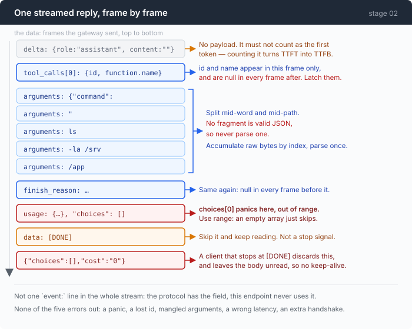

# Stage 02 · part 1: reading the stream correctly

[← back to stage 02](README.md)

> Five things this endpoint does that the specification does not prepare you
> for. None of them raises an error. One is a panic on the second-to-last frame
> of every request, and the other four are wrong answers delivered calmly.

---

## The problem

Switching to streaming is one header:

```go
req.Header.Set("Accept", "text/event-stream")
```

What comes back is not one JSON object, it is a sequence of them, and the
sequence is where an agent gets the numbers that make it feel alive: text
appearing as it is written, a time-to-first-token figure, a tool call you can
name on screen before its arguments have finished arriving.

The trouble is that the natural way to read it is wrong five times over, and
every one of the five looks fine in testing.

Your first version indexes `choices[0]`, because every frame has a choice in it.
It runs beautifully for two days, then panics — and when you go looking, the
frame it died on is the one carrying the token counts, which is the frame you
added streaming to get.

Your second version stops reading at `[DONE]`, which is what the sentinel is
for. Now every turn costs an extra TLS handshake and you will never work out
why.

Your third version assigns `acc.id = tc.ID` on every chunk, which is the
obvious thing to write. The id is correct for one chunk and `null` afterwards,
so the finished tool call has complete arguments and no id — and a tool call
with no id cannot be answered, because the reply must quote it.

---

## The idea

Split the reader in two, along the line where the knowledge changes.



| | knows about | does not know about |
|---|---|---|
| `readSSE` | blank lines, `data:`, `event:`, comments | OpenAI, tool calls, tokens |
| `parseOpenAIStream` | one vendor's chunk schema | how bytes become frames |

The split earns its keep exactly one chapter later. Stage 03 adds the Anthropic
protocol, which is a completely different chunk schema carried over the *same*
framing. It reuses the first half verbatim and writes a second parser beside the
second. As one function, that stage would have been a rewrite.

---

## Building it

The code is [`sse.go`](../code/sse.go). Everything below is written against
[`external/wire-notes.md`](../../external/wire-notes.md) §B4/§B5/§B7, which
recorded what this endpoint actually sends rather than what the spec says. Where
they disagree, the bytes win.

### Step 1: framing, with no knowledge of what it is framing

```go
func readSSE(r io.Reader, fn func(sseFrame) error) error {
    br := bufio.NewReader(r)
```

`bufio.Reader`, not `bufio.Scanner`, and this is the first decision that matters.
`Scanner` refuses a token over 64KB by default and reports it as an error for
the *whole read*. The frame that trips it is a large tool result echoed back in
one delta — so it never happens while you are developing and always happens in
production.

A frame is lines until a blank one:

```go
case line == "":
    // Blank line: end of frame.
    if derr := dispatch(); derr != nil {
        return derr
    }
```

```go
case strings.HasPrefix(line, ":"):
```

Comment lines are keep-alives that proxies send so an idle connection is not
reaped mid-generation. They carry nothing and must not end the frame — and this
case has to be tested *before* the field split below, or `: ping` parses as a
field with an empty name.

The field split has two rules and both matter:

```go
field, value := line, ""
if i := strings.IndexByte(line, ':'); i >= 0 {
    field, value = line[:i], line[i+1:]
    value = strings.TrimPrefix(value, " ")
}
```

Only the **first** colon separates — every payload here is JSON, which is full
of colons. And exactly **one** leading space of the value is stripped; get that
wrong and every byte of every message shifts by one.

Then the ending, which is trap zero:

```go
if err == io.EOF {
    return dispatch()
}
```

`ReadString` hands back the bytes it managed to read *alongside* `io.EOF`. A
server that closes without a trailing blank line still has its final frame
sitting in the buffer. Check the error first and you silently drop the last
frame of every such stream — which is usually the one carrying usage.

Note what `readSSE` does not have: any idea what `[DONE]` means. A sentinel
belongs to the payload protocol, not to the framing, and pushing it down here is
how you end up unable to reuse the reader.

### Step 2: `[DONE]` is not a stop signal

```go
const sseDoneSentinel = "[DONE]"
```

```go
if payload == sseDoneSentinel {
    // Skip it, keep reading. See sseDoneSentinel for why.
    return nil
}
```

Every spec-conforming client stops here. §B4 frame 13 is a real frame that
arrives **after** the sentinel:

```json
{"choices":[],"cost":"0"}
```

Three reasons to keep draining:

**Correctness.** That is data the endpoint is trying to give you.

**Connection hygiene.** Abandoning a response body with bytes still in it means
the HTTP transport cannot return the connection to the keep-alive pool. You pay
a fresh TLS handshake every turn, and nothing anywhere tells you so.

**Robustness.** If usage ever moves to after the sentinel — and on an endpoint
that already puts `cost` there, that is not a wild guess — a client that stops
early reports zero tokens, confidently.

Draining costs nothing; the server closes immediately afterwards.

### Step 3: `choices` can be an empty array

```go
Choices []sseChoice `json:"choices"`
```

On the usage frame (§B4 frame 11) and on the post-`[DONE]` cost frame, this
array is empty.

`chunk.Choices[0]` reads fine, passes every happy-path test, and panics with
index-out-of-range on the second-to-last frame of **every real request**. The
fix is one word:

```go
for _, ch := range c.Choices {
```

`range` over an empty slice does not run the body. That is the difference
between this file working and this file crashing.

There is a subtler version of the same hazard in the structs. On this endpoint
**every field is emitted explicitly as `null`** rather than omitted. Go turns
`null` into the zero value with no error, which is what we want — and it means
"the key was present" tells you nothing at all here. Test the value, always.

### Step 4: id and name arrive in one frame and are null afterwards

§B4 frame 2 carries `id` and `function.name`. Frames 3–9 carry
`"id":null,"function":{"name":null}`.

So the assignment has to be a latch:

```go
if tc.ID != "" {
    acc.id = tc.ID
}
if tc.Function.Name != "" {
    acc.name = tc.Function.Name
}
```

Write `acc.id = tc.ID` unguarded and the id is blanked on the very next chunk.
What you end up with is a tool call with complete arguments that cannot be
answered, because the `tool_call_id` the API demands in your reply is gone.

`finish_reason` is latched for the same reason and would break the same way:

```go
if ch.FinishReason != "" {
    res.FinishReason = ch.FinishReason
}
```

There is one more thing tying fragments together, and it is not the id:

```go
Index int `json:"index"`
```

Parallel tool calls interleave their fragments. `index` is the only thing that
says which call a fragment belongs to; accumulate by anything else and one
call's arguments end up spliced into another's.

### Step 5: the arguments are a byte stream, not a JSON stream

```go
Arguments string `json:"arguments"`
```

§B4 observed this split:

```
{"command":     "     ls     -la /srv     /app     "     }
```

Mid-token and mid-path. **There is no point in the sequence at which a fragment
is parseable JSON** — not the first one, not any of them.

So they are appended raw and never inspected:

```go
acc.args.WriteString(tc.Function.Arguments)
```

and parsed exactly once, by the caller, after the stream ends. Any design that
tries to be clever here — parse each fragment, or wait until the braces balance
— is building on a property the wire does not have.

### Step 6: which token is actually the first one

```go
markFirstToken := func() {
    if firstSeen {
        return
    }
    firstSeen = true
    res.TTFT = time.Since(started)
    emit(Event{Kind: KindFirstToken, Millis: res.TTFT.Milliseconds()})
}
```

Two decisions are buried in that.

**The role opener does not count.** §B4 frame 1 carries `content: ""` and no
payload. Counting it turns TTFT into time-to-first-*byte*, which on a model that
thinks for four seconds before speaking is a number that looks excellent and
means nothing.

**Reasoning does count.** On a thinking model it is genuinely the first thing
generated, and the question TTFT answers is "how long until this thing started
working".

The clock also starts in the right place:

```go
started := time.Now()
resp, err := c.http.Do(req)
```

`started` is when the request went out, not when the parser was called. Measure
from the moment the response header arrived and you hide the entire latency you
were trying to see.

### Step 7: usage is a direction reversal, not a rename

The wire, §B4 frame 11:

```json
"prompt_tokens": 506, "prompt_tokens_details": {"cached_tokens": 192}
```

506 is the full prompt. The 192 cached tokens are counted **inside** it.

This repo's `Usage.Input` means "billed at full price", so the cached portion has
to come back out:

```go
func (u sseUsage) normalise() Usage {
    cached := u.PromptTokensDetails.CachedTokens
```

```go
input := u.PromptTokens - cached
if input < 0 {
    input = 0
}
```

`Input = 506 - 192 = 314`, `CacheRead = 192`, and `Prompt()` comes back to 506.

Copy the field across unchanged instead and `Prompt()` reports **698 for a
506-token prompt**. Look at the shape of that error: it is exactly the size of
the cache hit. It is *zero on a cold first request*, so it looks perfect while
you test, and it gets worse the better your caching works. That is why this is a
function and not a struct tag.

The Anthropic side reverses it again — there `input_tokens` is only the uncached
remainder, so it maps straight to `Input` with nothing subtracted. Two
protocols, opposite conventions, one normalised struct: that is the argument for
having a normalised struct at all.

One small thing at the emit:

```go
sent := u
emit(Event{Kind: KindUsage, Usage: &sent})
```

A copy. Handing out `&res.Usage` would alias the event to a field the caller can
still write to, and a subscriber that serialises lazily would record whatever it
later became.

### Step 8: when the stream breaks, do not say it ended

```go
if err != nil {
    return res, err
}
```

Two deliberate things here.

**The partial result is returned along with the error.** A stream that died
after producing a complete tool call is a different situation from one that
produced nothing, and the caller can only tell them apart if it is handed what
did arrive.

**No `KindResponseEnd` is emitted.** The response did not end, it broke. Emitting
one would tell every subscriber a clean lie, and the trace is supposed to be
evidence.

There is a quieter version of the same honesty at the end of a stream that
finished but never said why:

```go
emit(Event{
    Kind:         KindResponseEnd,
    FinishReason: res.FinishReason,
    Millis:       time.Since(started).Milliseconds(),
})
```

`res.FinishReason` is `""` when the stream ended without one — which is how this
protocol reports certain truncations, by simply not mentioning them. Passing the
empty string through keeps that visible instead of inventing a `stop` that never
happened.

And finally, the ordering:

```go
sort.Slice(ordered, func(i, j int) bool { return ordered[i].index < ordered[j].index })
```

The accumulators live in a map, and Go randomises map iteration deliberately.
Without this sort the tool-call order differs run to run — a bug that reproduces
once a week and gets blamed on the model.

---

## Run it

The stream parser has a test suite built from recorded frames, which is the only
honest way to test this:

```sh
go test ./02-see-everything/code/ -run TestSSE -v
go test ./02-see-everything/code/ -run TestParseOpenAI -v
```

Then watch a real one:

```sh
cd sandbox && set -a && . ../.env && set +a
../agent --trace session.jsonl
> list the go files here and count their lines
```

Afterwards, look at what arrived:

```sh
grep -c '"kind":"tool_args_delta"' session.jsonl
jq -r 'select(.kind=="tool_args_delta") | .text' session.jsonl
```

**What to watch for:** the fragments printed by that last command. They do not
break where you would break them. Then find the `first_token` event and compare
its `ms` against the `response_end` for the same turn — the gap between them is
generation, and the value itself is waiting.

---

## Measured

From the recorded stream in §B4, one call:

| | |
|---|---|
| `event:` lines in the entire stream | **0** |
| frames after `data: [DONE]` | **1**, carrying real data |
| chunks carrying `id` / `function.name` | **1** of 9 |
| argument fragments that are valid JSON on their own | **0** |
| frames where `choices` is `[]` | **2** (usage, and the post-DONE cost frame) |

And from §B7, on a thinking model: **44 frames carried `reasoning_content` and
1 carried `content`.** If your renderer hides reasoning, that session looks like
one frame of output arriving after a long silence.

The mis-normalisation from step 7, measured: copying `prompt_tokens` straight
into `Input` reports **698 tokens for a 506-token prompt**.

---

## Next

The stream is read correctly and the numbers are right. They are still only on
your screen.

[Part 2](2-trace-replay.md) makes the second subscriber — a file that survives
the agent being killed, and a replay that reads it back through the same
renderer with no API key.
