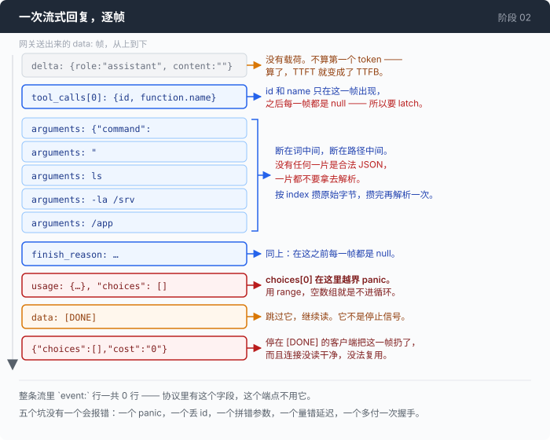

# 阶段 02 · 一：把流读对

[00](../../00-loop/doc/README_zh.md) → [01](../../01-dont-die/doc/README_zh.md) → `02` → [03](../../03-babel/doc/README_zh.md) → 04 → 05 → 06 → 07 → 08 → 09 → 10 → 11 → 12

> [阶段 02](README_zh.md) 第 4 步的展开。一次流式回复在真实的字节上长什么样，以及照着协议文档写，会在哪几个地方安静地出错。

---

## 问题

你决定改成流式，理由很实在：你想知道第一个字等了多久，而不流式的调用只有一个时刻 —— 你问完，几秒钟之后整个答案一次到齐。那里面没有「第一个 token」这件事，所以那个数不存在。

改起来看着不难。请求里加一个 `stream: true`，响应体按行读，`data:` 后面那一截拿去解析，取出增量文字打到屏幕上。你跑了一次，字一个一个出现了。看起来对了。然后是三件事。

**它会 panic。** 不是偶尔，是每一次真实请求。而且发生在最后几帧 —— 文字已经全部打完，命令也已经拿到了，你以为这一轮成功了之后。

**工具调用会丢 id。** 参数攒得完完整整，命令是对的，但那个必须回填到下一条消息里的调用 id 是空字符串。于是**下一次**请求被服务端拒绝，理由是有一个调用没有回复。这个错离真正的原因隔了一整轮，看上去和解析流毫无关系。

**你量出来的首字延迟好得可疑。** 一个明显要想几秒钟才开口的模型，报出来的数只有几十毫秒。这个数不是错，它量的是另一件事，而你不知道。

三件事有一个共同点：**协议文档写的东西和这个端点真正送出来的字节不是一回事，而它们不一致的地方，一处都不报错。**

---

## 办法

把这件事切成两半，中间那条线画在「字节怎么分帧」和「帧里装的是谁家的字段」之间。



| 一半 | 它知道 | 它不知道 |
|---|---|---|
| `readSSE` | 空行分帧、`data:` 行、注释行、CRLF | OpenAI、工具调用、token、`[DONE]` |
| `parseOpenAIStream` | 一家的 chunk 字段长什么样 | 字节是怎么变成帧的 |

这条线画在这里，回报在下一章：阶段 03 要接的第二种协议，chunk 格式完全不同，但**分帧方式一模一样**。上半截原样复用，只在下半截旁边再写一个解析器。这两件事写在一个函数里的话，那一章就是重写而不是新增。

---

## 怎么做的

代码在 [`02-see-everything/code/sse.go`](../code/sse.go)，测试在 [`sse_test.go`](../code/sse_test.go)。

### 第 1 步：分帧，一个字节都不认识上层协议

```go
func readSSE(r io.Reader, fn func(sseFrame) error) error {
	br := bufio.NewReader(r)
```

第一个决定在第二行。**用 `bufio.Reader`，不要用 `bufio.Scanner`。** `Scanner` 默认给一个 token 封了 64KB 的顶，超过就把**整次读取**判为失败。而一个大号的工具结果被模型原样引回来，正好就是那一帧 —— 这种事只在生产里发生。

主循环里是第二个决定：

```go
	for {
		line, err := br.ReadString('\n')

		if line != "" {
			line = strings.TrimSuffix(line, "\n")
			line = strings.TrimSuffix(line, "\r")
```

`line` 先处理，`err` 后处理。因为 `ReadString` 会把**它读到的那些字节和 `io.EOF` 一起交给你**：服务端最后没有多打一个空行就把连接关了，最后一帧就还在 `line` 里躺着。先判 err，就等于把每一条这样的流的最后一帧默默丢掉，而那一帧通常装着 usage。

```go
		if err != nil {
			if err == io.EOF {
				// ...
				return dispatch()
			}
			return err
		}
```

去行尾用两次 `TrimSuffix`，一次一个，不用 cutset —— 数据本身以回车结尾是合法的。以 `:` 开头的注释行（网关拿它当保活）必须在字段切分**之前**判掉，否则 `: ping` 会被当成一个名字为空的字段。然后是第三个决定，切字段：

```go
				field, value := line, ""
				if i := strings.IndexByte(line, ':'); i >= 0 {
					field, value = line[:i], line[i+1:]
					value = strings.TrimPrefix(value, " ")
				}
				switch field {
				case "event":
					name = value
				case "data":
					data = append(data, value)
					sawData = true
				}
```

两条规则都不能省：**只有第一个冒号是分隔符**（这里每一帧装的都是 JSON，值里冒号成堆），**值前面的一个空格要去掉，而且只去一个**。空格规则弄错，每一条消息的每一个字节都会平移一位。

一帧攒够了就交给回调，然后清空缓冲。没有 `data:` 行的帧不算一帧 —— 这条规则让连续空行和保活注释免费，否则每一个都变成一次空回调。这一半到此结束。它不知道 `[DONE]` 是什么意思 —— 那是载荷协议的事，不是分帧的事，把它下沉到这里，就是让这个读取器没法复用。

### 第 2 步：`[DONE]` 不是停止信号

```go
		if payload == sseDoneSentinel {
			// Skip it, keep reading. See sseDoneSentinel for why.
			return nil
		}
```

跳过它，继续读到 EOF。这一条刻意违反常规写法，因为这个端点在 `[DONE]` **之后**还会送一帧真数据：

```
data: {"choices":[],"cost":"0"}
```

每一个照着协议停在 `[DONE]` 的客户端都会把它扔掉。不当那样的客户端，有三个理由。一是这是端点想给你的数据。二是**连接卫生**：响应体里还有字节没读完就撒手，HTTP 传输层没法把这条连接放回复用池，于是你每一轮都多做一次 TLS 握手，而且永远不知道为什么慢。三是稳健：一个已经把 `cost` 放在哨兵之后的端点，哪天把 usage 也放过去不是荒唐的假设，而提前停下的客户端会报零 token，并且非常自信。继续读的代价是零 —— 服务端紧接着就把流关了。

### 第 3 步：每一帧的 `choices` 都可能是空数组

这就是那个 panic。

```go
	Choices []sseChoice `json:"choices"`
```

它是数组，而 usage 那一帧里它是**空的**（`[DONE]` 之后那一帧也是）。于是所有人都会写的这一行：

```go wrong
	choice := c.Choices[0]        // ← 幸福路径全通过，倒数第二帧崩
	if choice.Delta.Content != "" {
```

它读起来毫无问题，happy path 测试全过，然后在每一次真实请求的倒数第二帧越界 panic。修法是一个词：

```go
		for _, ch := range c.Choices {
			d := ch.Delta
```

`range` 在空数组上就是不进循环。这一个词是这个文件能用和这个文件必崩之间的全部差别。

顺便说一件贯穿这个协议的事：这个端点上**每一个不用的字段都显式送 `null`，而不是省略**。Go 的解码器把 `null` 变成字符串的零值、切片的 nil、结构体的原样不动，安静地，不报错。这正是我们想要的，同时也是陷阱：在这里，「这个 key 在」什么信息都不提供。要判就判值。

### 第 4 步：id 和 name 只来一帧，之后全是 null

这就是丢 id 的那个 bug。调用 id 和工具名只在**一帧**里出现，之后每一帧那两个字段都是 `null`。于是所有人都会写的这一行：

```go wrong
	acc.id = tc.ID                 // ← 下一帧就把它清成 ""
	acc.name = tc.Function.Name
```

它在下一帧就把刚拿到的 id 抹掉了。最后你手上是一个参数完整、无法回复的工具调用 —— 因为 API 要求回复里带的那个 id 已经不在了。要写成「只在来的值非空时才赋」：

```go
					if tc.ID != "" {
						acc.id = tc.ID
					}
					if tc.Function.Name != "" {
						acc.name = tc.Function.Name
					}
```

同一个形状还有一处，`finish_reason` —— 除了最后那一帧，其他每一帧都是 null：

```go
			if ch.FinishReason != "" {
				res.FinishReason = ch.FinishReason
			}
```

拿到名字之后广播一声 `KindToolCallStart`，只广播一次。它存在的理由是：屏幕上能在参数还没传完的时候就显示出「模型要调 bash 了」。

### 第 5 步：参数是一串字节，不是一串 JSON

参数分片**不按 JSON 边界切**。真实观察到的一次分法是这样五片：

```
{"command":        "        ls         -la /srv        /app
```

没有任何一个时刻手上那一片是能解析的 JSON —— 它可能断在一个词中间，也可能断在一条路径中间。所以只做一件事：原样接上去，一次都不看内容。

```go
	Args string // the concatenated raw JSON string; NOT parsed here
```

攒的时候按 `index` 归位，因为并行的多个工具调用会**交错**着送分片，而 `index` 是唯一能把一片和它所属的那次调用连起来的东西。用别的东西归位，你会把一次调用的参数拼进另一次里：

```go
					acc := calls[tc.Index]
					if acc == nil {
						acc = &sseToolAccum{index: tc.Index}
						calls[tc.Index] = acc
					}
```

分片也各发一条事件出去，于是屏幕上（和 trace 里）能看到参数是怎么一点点长出来的：

```go
					if tc.Function.Arguments != "" {
						acc.args.WriteString(tc.Function.Arguments)
						emit(Event{
							Kind:     KindToolArgsDelta,
							ToolID:   acc.id,
							ToolName: acc.name,
							Text:     tc.Function.Arguments,
						})
					}
```

最后交出去之前按 `index` 升序排一次，不是按到达顺序。Go 的 map 遍历顺序是故意随机的，少了那一行 `sort.Slice`，同样的输入在不同次运行里给出不同的调用顺序 —— 一周复现一次，然后被归咎于模型。

### 第 6 步：第一个 token 到底是哪一个

首字延迟只发一次事件，发在**第一个真正的输出**上：

```go
	markFirstToken := func() {
		if firstSeen {
			return
		}
		firstSeen = true
		res.TTFT = time.Since(started)
		emit(Event{Kind: KindFirstToken, Millis: res.TTFT.Milliseconds()})
	}
```

哪些算「真正的输出」，是这一步全部的内容。流的第一帧只带一个角色声明，`content` 是空字符串，没有任何载荷。**它不算。** 把它算进去，TTFT 就变成了「第一个字节到达的时间」，而在一个会先想好几秒才开口的模型上，这个数好看且毫无意义 —— 上面那三件怪事里的第三件就是这么来的。

思考内容算。在这个协议里，思考不是另一种事件也不是另一种块，它和正文挤在同一个增量对象里，靠哪一个字段非空来区分：

```go
			if d.ReasoningContent != "" {
				markFirstToken()
				reasoning.WriteString(d.ReasoningContent)
				emit(Event{Kind: KindReasoningDelta, Text: d.ReasoningContent})
			}
```

工具调用的结构也算 —— 一次纯工具调用的回复里一个正文字符都没有，只盯着正文，那种回复的 TTFT 永远是零。还有一个容易搞错的地方不在这个文件里，在调用方：起点是**请求发出去的时刻**，不是这个函数开始跑的时刻。

```go
	started := time.Now()
	resp, err := c.http.Do(req)
```

从响应头到达之后开始算，正好把你想看的那段延迟整个藏起来。

### 第 7 步：usage —— 一次方向反转，不是一次改名

这个协议里，prompt 的总数是**全量**，缓存命中数嵌在它**里面**。而 `Usage.Input` 在这个仓库里的含义是「按全价计费的部分」（见[主篇](README_zh.md)第 5 步），所以缓存那一段必须减出来：

```go
func (u sseUsage) normalise() Usage {
	cached := u.PromptTokensDetails.CachedTokens
```

```go
	input := u.PromptTokens - cached
	if input < 0 {
		input = 0
	}

	return Usage{
		Input:     input,
		CacheRead: cached,
		Output:    u.CompletionTokens,
```

把字段原样抄过去 —— 这是最自然的写法 —— 会让 `Prompt()` 把缓存那一段数两遍。误差**正好等于缓存命中的那一段**，所以：冷启动的第一个请求上误差是零，你在测试里一次都看不见它，而且**你的缓存越好用，它错得越多**。这就是这里是一个函数、而不是一个 struct tag 的全部理由。

那个 `if input < 0` 不是防御性习惯。夹一下的理由是：一个负的 `Input` 会传进 `Prompt()`，再传进每一处成本估算；万一端点报的缓存数比 prompt 总数还大，丢掉这个矛盾也比导出一个负的 token 数好。`CacheWrite` 留 0，而且这个 0 有含义：不是「没有东西被缓存」，是**这个协议不报写缓存这件事**。

### 第 8 步：流断在中间的时候，不要说「结束了」

一帧解析不出来，不该毁掉一轮已经拿到了有效工具调用的对话 —— 发一条 `KindNotice`，继续读。整条流断了是另一回事：

```go
	if err != nil {
		// No KindResponseEnd: the response did not end, it broke. Emitting one
		// would tell every subscriber a clean lie, and the trace is supposed to
		// be evidence.
		return res, err
	}
```

这里连 `res` 一起返回，是刻意不写成 `return nil, err`：一条在完整工具调用之后才断掉的流，和一条什么都没产出的流，是两种处境，而调用方只有拿到已经到手的东西才分得出来。

正常结束那一支里藏着最后一个决定：

```go
	emit(Event{
		Kind:         KindResponseEnd,
		FinishReason: res.FinishReason,
		Millis:       time.Since(started).Milliseconds(),
	})
```

`FinishReason` 在这里可能是空字符串 —— 流结束了但从来没说过为什么结束，这个协议报截断的方式就是不提。空字符串原样传出去，让这件事在调用方那里**看得见**，而不是替它编一个从来没发生过的 `stop`。第 01 章整整一章讲的就是截断没被发现之后会怎样。

---

## 跑一下

先跑测试，它们全部是用录下来的真实帧喂进去的：

```sh
go test ./02-see-everything/code/ -run 'SSE|Stream|Usage|TTFT|Tool' -v
```

然后自己看一次原始字节。这一步值得做，因为上面每一条都是从这里看出来的：

```sh
set -a && . .env && set +a
curl -N -s "$AGENT_BASE_URL/chat/completions" \
  -H "Authorization: Bearer $AGENT_API_KEY" \
  -H 'Content-Type: application/json' \
  -d '{"model":"'"$AGENT_MODEL"'","stream":true,"max_tokens":64,
       "messages":[{"role":"user","content":"用一句话说明 ls 是干什么的"}]}'
```

**观察重点：**

- 把输出存下来，`grep -c '^event:'` 数一下，是 0。这条流里一行 `event:` 都没有 —— 而协议文档里有，阶段 03 的那个协议里也有。
- 第一帧的 `content` 是 `""`。这就是第 6 步不肯把它算成第一个 token 的那一帧。
- 中间几帧里 `"id":null,"function":{"name":null}`。这就是第 4 步那个 latch 要防的东西。
- 倒数几帧里那个带 usage 的，`"choices":[]`。这就是 panic 的位置。
- 最后：`data: [DONE]` **后面还有一行**。
- 把问题换成一个会触发工具调用的（比如「列一下 /srv/app 下面的文件」），再看 `arguments` 那一串是怎么被切开的。它不会切在你希望的地方。

---

## 量一量

**首字延迟，冷启动。** 同一次会话里，第 1 次调用的 TTFT 是 **13042ms**，第 2 次是 **1239ms**，差 **10.5 倍左右**。这个差不是网络，也不是模型第二次变快了；它是第一次请求在网关那边什么都还没准备好。装上 TTFT 之前，这件事表现为「有时候第一句话特别慢」—— 一个没法讨论、也没法验证的印象。这也是为什么 TTFT 和 tok/s 在仪表盘上是两个数：慢在第一个字，原因是排队或者 prompt 太长；慢在吞吐，原因是模型本身。它们坏起来的原因不一样，合成一个「平均速度」就都看不见了。

**归一化写错的代价。** 把 `prompt_tokens` 直接抄进 `Input`，一个 **506** token 的 prompt 会被报成 **698**。多出来的那一段正好等于缓存命中的那一段，因为它被数了两遍。

这个数值得记住的地方不是它大，而是它的错法：冷请求上误差是 0，测试里看不见，然后随着缓存开始起作用一天天变大 —— 而且它一直是个**看起来合理**的数字，没有人会回头再验一次。

---

## 接下来

流读对了，事件出来了：首字延迟、每一段增量文字、思考内容、工具调用的名字和参数分片、token 分项、结束原因。主篇的仪表盘和 trace 文件里的每一个数字都是从这里出去的。

代价在这一页上写得很清楚：除了 `readSSE` 那一半，上面**每一步都是一家的 chunk 格式**。`choices` 是数组、`finish_reason` 只在最后一帧非空、`prompt_tokens` 是全量而 `cached_tokens` 嵌在里面、`[DONE]` 表示要结束了 —— 这四句话没有一句是「LLM API 就是这样」。

[阶段 03](../../03-babel/doc/README_zh.md) 会把另一种协议接进来，那边这四句话基本全是反的。

先回到 [阶段 02](README_zh.md) 的第 5 步：这些 token 分项怎么变成屏幕上那一根条。
