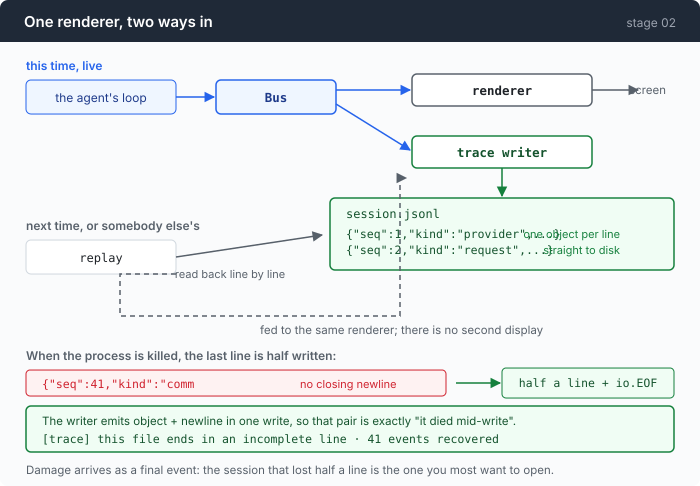

# Stage 02 · part 2: a record that survives the crash

[← back to stage 02](README.md)

> A trace is only useful for the session that went wrong, and the session that
> went wrong is the one where the process was killed. Every decision in this
> file follows from that sentence.

---

## The problem

The bus has one subscriber and it draws on a terminal. So you still have exactly
what you had before: something to look at while it happens.

Add a file and the questions change. What did this session cost — not roughly,
in total? What did the model see on turn 30? Why did the cache hit rate collapse
at 15:42? Someone else hit a bug in their agent: can you look at their session
without reproducing it?

But a file introduces a failure the terminal never had. The trace exists to
explain sessions that ended badly, and the worst endings are the ones where
nothing got a chance to shut down cleanly — `kill -9`, a panic, a laptop lid.
**A format that needs a clean close is a format that is unreadable exactly when
you need it.**

A JSON array is that format. The closing `]` is written last, by a process that
by definition did not get there.

---

## The idea

One JSON object per line, written straight through, with no state to close.



Two properties, and both come from the same choice:

- **An interrupted write costs you the last record, not the file.** Everything
  before the torn line parses.
- **Replay is not a second display.** The renderer takes events; a recorded
  event and a live one are the same type. Reading the file back means calling
  `OnEvent` again.

---

## Building it

The code is [`trace.go`](../code/trace.go) and [`replay.go`](../code/replay.go).

### Step 1: one object per line

```go
f, err := os.OpenFile(path, os.O_APPEND|os.O_CREATE|os.O_WRONLY, 0o644)
```

`O_APPEND`, not `O_TRUNC`. A resumed session extends its own trace rather than
deleting it, and under `O_APPEND` every write lands at the current end of the
file as one operation — so two agents pointed at the same trace interleave whole
lines instead of overwriting each other's offsets.

A line looks like this:

```
{"seq":1,"t":"2026-08-27T03:15:34.33+08:00","kind":"user_message","text":"..."}
```

Readable with your eyes, greppable, and `jq`-able with no schema. Those are not
nice-to-haves — a trace you need a tool to read is a trace you do not open.

### Step 2: no buffer, and no `fsync` either

```go
if _, err := w.f.Write(line); err != nil {
    w.failLocked(fmt.Errorf("write to %s: %w", w.path, err))
}
```

There is no `bufio.Writer` in this path and its absence is the design.

A 64KB buffer would batch a few hundred events into one syscall and lose every
one of them the moment the agent is killed — which is precisely the moment the
trace existed for. Unbuffered costs one `write(2)` per event: a few microseconds
into the kernel's page cache, against model calls measured in hundreds of
milliseconds. The trade is not close.

The interesting decision is the one *not* taken. `f.Sync()` would additionally
survive a power cut, and costs **0.1ms on an SSD, ~10ms on a spinning disk or a
network mount** — on every text delta, inside the bus lock. Three orders of
magnitude more, to defend against a rarer failure than the one already covered.

The line worth keeping: once `Write` returns, the data survives `SIGKILL`, a
panic, and `os.Exit` with no further help. `fsync` is about the machine dying,
not the process.

One `Write` per line also keeps a line atomic under `O_APPEND`, which is what
stops a concurrent writer splicing an unparseable record into the middle.

### Step 3: no goroutine, no queue, and silence after the first failure

"Never block the bus" is normally answered with an async writer. Follow that
through: a queue has exactly two behaviours when it fills. Block the producer,
which is the thing you were avoiding. Or drop events — a trace that lies by
omission, silently, under exactly the load you most wanted recorded.

A local append never waits unboundedly, so the synchronous version has neither
problem. The rule the bus actually needs is **"no unbounded wait"**, not "no
I/O": no `fsync`, no network, no lock held across a channel send.

The second half is what happens when the disk fills:

```go
if w.closed || w.err != nil {
    // Already degraded. Count it, so Close can say how much of the session
    // is missing: a trace that is silently short is worse than no trace at
    // all, because it looks complete.
    w.dropped++
    return
}
```

```go
func (w *TraceWriter) failLocked(err error) {
    w.dropped++
    if w.err != nil {
        return // already reported once; stay quiet and keep counting
    }
```

Loud exactly once, then quiet and counting. A writer that reports every failure
turns a full disk into ten thousand lines of noise on the terminal the user was
trying to read the agent on. `Close` reports the damage as one number.

And the whole method is wrapped in a `recover`:

```go
defer func() {
    if r := recover(); r != nil {
        w.fail(fmt.Errorf("panic writing event %d (%s): %v", e.Seq, e.Kind, r))
    }
}()
```

Swallowing errors is normally a bug. Here it is the contract: `Bus.Emit`
dispatches synchronously while holding its own lock, so a panic in this file
does not crash "the trace", it crashes the agent mid-turn, with a half-streamed
reply and an unreaped child process. Nothing this file can get wrong is worth
that.

### Step 4: `>` makes "the exact bytes" untrue

`json.Marshal` escapes `<`, `>` and `&` into `\u003c`, `\u003e` and `\u0026`.
The part that bites: `encoding/json` applies that **inside a
`json.RawMessage`** too, while compacting it.

`Event.Request` is a `RawMessage` holding the exact bytes the adapter posted.
So without care:

```
posted:  {"command":"ls 2>&1 <in"}
traced:  {"command":"ls 2\u003e\u00261 \u003cin"}
```

Nothing errors. The JSON is equivalent, and every consumer that decodes it gets
the right string back. What breaks is the *claim*: `events.go` calls `Request`
"the exact bytes about to be sent", stage 06's wire view promises "byte for
byte", and a byte-level comparison of a live run against a replayed one shows a
diff that is entirely this.

A shell agent's requests are mostly `2>&1`, `>/tmp/out` and `<<EOF`, so this is
not a corner case. Found in a real trace, where **all 24 recorded requests
carried the escapes**.

```go
enc.SetEscapeHTML(false)
```

```go
return bytes.TrimRight(buf.Bytes(), "\n"), nil
```

The trim is there because `Encoder.Encode` appends a newline that `Marshal` does
not, and the caller adds its own — two would be a blank line in the middle of a
JSONL file.

A trace is evidence. The moment it is not byte-identical, it stops being
evidence about bytes.

### Step 5: the torn last line is not corruption, it is what a kill looks like

Reading back:

```go
r := bufio.NewReaderSize(f, 64*1024)
```

`bufio.Reader` again, and this time the reason is specific: `Scanner` caps a
token at 64KB and fails the *entire read* with `ErrTooLong` on the first line
that exceeds it. The most valuable line in any trace is the request body, and
that is the one that grows past 64KB somewhere around turn thirty.

`ReadBytes` has no cap, and it returns a final line with no trailing newline
**together with** `io.EOF`. That pair is the signal:

```go
line, rerr := r.ReadBytes('\n')
atEOF := rerr == io.EOF
```

```go
case json.Unmarshal(trimmed, &e) != nil:
    if atEOF {
        truncated = len(trimmed)
    } else {
        corrupt++
    }
```

Two different situations that a careless reader would collapse into one.

**No trailing newline and it does not parse** — the writer emits object plus
newline in a single write, so this is a write the kernel only partly committed
before the process died. Expected.

**A complete line that does not parse** — the bytes after it survived, so this
is damage in the middle of an otherwise intact file. Different thing, counted
separately.

Neither is returned as an error, and that is the decision this step exists for:

```go
events = append(events, traceDamageNotice(path, events, truncated, corrupt))
```

Returning an error here invites the reflex `if err != nil { fatal }` and throws
away the four hundred events that explain the crash. So damage is reported *in
the event stream*, with its own marker so nobody mistakes it for something the
agent said:

```go
const TraceNoticePrefix = "[trace] "
```

The notice borrows the last real event's timestamp and turn, so a time-ordered
renderer puts it at the end of the session where a reader will actually see it.

One more thing this reader deliberately does not do: validate `e.Kind` against
the constants in `events.go`. A trace written by a newer build carries kinds
this binary has never heard of, and rejecting them would mean every future kind
breaks replay of every file recorded after it. Unknown kinds load, replay, and
reach the renderer.

### Step 6: replay controls *when*, never *what*

```go
sub.OnEvent(e)
```

That is the whole of replay's contact with the display. Everything else is
pacing.

```go
const maxReplayGap = 5 * time.Second
```

A real session contains a human who went to lunch between two prompts.
Reproducing a 41-minute gap faithfully is not fidelity, it is a hang — the
reader sees a frozen terminal and kills it.

Five seconds is chosen so that everything replay exists to convey survives
untouched: TTFT (0.3–2s), the pacing of text deltas (milliseconds), a command's
wall clock (usually under 5s). Above that is a person being idle, which the
timestamps already report better than a wait does.

```go
gap := e.T.Sub(prev)
if gap > maxReplayGap {
    gap = maxReplayGap
}
```

```go
time.Sleep(time.Duration(float64(gap) / opts.Speed))
```

The cap applies to the *recorded* gap, before `Speed` scales it, so `--speed 2`
still halves it and a deliberate `--speed 0.5` can still stretch it to ten
seconds.

What replay must never do is restamp `Event.T`. "As if it were happening now" is
about pacing, not about lying: the recorded timestamps are the evidence, and a
renderer showing TTFT is reading them. This is also what lets a test compare a
replayed run against a live one event for event.

### Putting it together

The summariser is where one small mistake would undo the whole chapter:

```go
case KindTurnStart:
    s.Turns++
```

Counted at the *start*. The traces worth reading stop mid-turn: a session killed
during turn 12 did twelve turns, and counting `turn_end` reports eleven — hiding
the exact turn you opened the file to look at.

```go
s.TotalUsage = addUsage(s.TotalUsage, *e.Usage)
```

Every field summed separately, with the prompt total derived afterwards:

```go
func (s TraceSummary) PromptTokens() int { return s.TotalUsage.Prompt() }
```

Summing `Input` alone is the exact bug the `Usage` doc comment warns about: a
cached turn reports `Input: 18` while really sending 18,000. A total built from
`Input` is out by three orders of magnitude and plausible enough that nobody
re-checks it.

---

## Run it

```sh
cd sandbox && set -a && . ../.env && set +a
../agent --trace session.jsonl
> find every TODO in this directory and summarise them
```

Then read it back with no key in the environment at all:

```sh
../agent --replay session.jsonl              # original pacing
../agent --replay session.jsonl --speed 4
../agent --replay session.jsonl --step       # Enter for each event, q to quit
```

Now break it on purpose. Start a session, wait until it is mid-command, and
kill the process from another terminal (`kill -9`, or Task Manager). Then:

```sh
tail -c 200 session.jsonl
../agent --replay session.jsonl
```

**What to watch for:**

- `tail` shows a line that stops mid-object, with no newline after it.
- Replay loads anyway, plays everything that survived, and ends with a
  `[trace]` line saying how many bytes were lost and how many events were
  recovered.
- The header before the replay reports turns and commands counted at their
  *start*, so the turn you were killed inside is in the count.

---

## Measured

The five-call session from the main chapter, as a file:

| | |
|---|---|
| events | 196 |
| size | 40KB |
| header | `trace · 196 events · 5 turns · 5 commands · 25.34s` |
| tokens line | `prompt 3941 (full 869 · write 0 · read 3072) · output 419` |

**`fsync`, measured before declining it:** 0.1–10 ms per call, against
microseconds for an unbuffered write into the page cache. Three orders of
magnitude, per event, inside the bus lock.

**The escaping bug, found in a real trace:** all 24 recorded request bodies
carried `\u003e` where the posted bytes had `>`.

**The 64KB ceiling:** `bufio.Scanner` fails the whole read at that size, and the
request-body event crosses it around turn thirty. So the failure arrives on long
sessions only — the ones with the most to lose.

---

## Next

You have a file, and the file can be read back through the same renderer with no
key. Everything measured so far, though, is measured through one protocol's
vocabulary.

[Stage 03](../../03-babel/doc/README.md) adds a second protocol, and the trace
format is about to be tested: `Usage` was designed to be neutral, and the next
chapter is where it either holds or does not.
