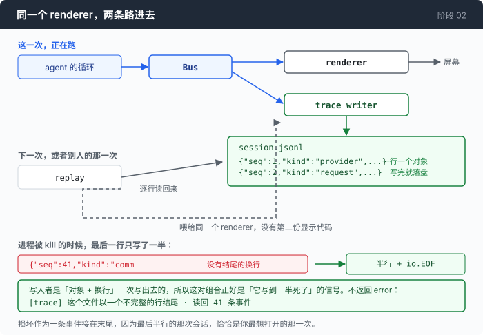

# 阶段 02 · 二：一个能在崩溃时活下来的记录

[00](../../00-loop/doc/README_zh.md) → [01](../../01-dont-die/doc/README_zh.md) → `02` → [03](../../03-babel/doc/README_zh.md) → 04 → 05 → 06 → 07 → 08 → 09 → 10 → 11 → 12

> [阶段 02](README_zh.md) 最后那一步的展开。事件怎么变成一个文件，以及为什么把那个文件读回来不需要第二份显示代码。

---

## 问题

总线跑起来了，终端上什么都看得见。现在你要那份能留下来的记录。

你写了一个订阅者，把每条事件收进一个数组，退出的时候整个数组序列化成一个 JSON 文件。这是最自然的写法，跑起来也对。

然后有一天你按了 Ctrl-C。

那一次正好是你最想看的一次 —— 模型在第七轮开始干奇怪的事，你不想再等它，掐掉了。你打开那个文件，它是空的。退出时才写的东西，非正常退出就不会写。

你改成边发生边写：每来一条事件就往文件里追加一段 JSON。这回文件里有东西了，但它以一个逗号结尾 —— 那个数组的右方括号是退出时才补的，而你的进程没有活到那一刻。于是**记录这次崩溃的文件，因为这次崩溃而解析不了**。

你想起标准库里有 `bufio.Writer`，一次系统调用写一大块，性能好看。于是几百条事件攒在一个 64KB 的缓冲里，进程被 kill 的时候一起消失 —— 而那几百条正是崩溃前的那几百条。

你也想起「不要在锁里做 I/O」，于是打算起一个 goroutine，用 channel 送事件过去慢慢写。这个方案有一个问题在写代码之前就存在：队列满了怎么办。堵住生产者，就是你本来要避开的那件事；丢事件，就是一份**靠省略来撒谎**的记录，而且恰好在负载最高、你最想要记录的时候撒谎。

**一份只在正常退出时才完整的记录，正好在你需要它的那一刻不存在。**

还有第二半。假设文件有了，谁来读它？如果为了回放再写一份显示代码，你就有了两份 UI 实现，它们迟早会不一致 —— 而这一章存在的全部理由，就是消灭「屏幕上写的和真相不一样」。

---

## 办法

一行一个 JSON 对象。写完一行就已经落盘，中间不攒。读回来的时候喂给**同一个** `renderer`。



| 出的事 | 你损失什么 |
|---|---|
| 进程被 kill、panic、`os.Exit` | 最后一行的一部分 |
| 磁盘满、文件句柄坏了 | 从第一次失败起停止记录，退出时报出漏了多少条 |
| 请求体里的字节不是合法 JSON | 那一个字段，事件本身还在 |

三行都在说同一件事：**损失是局部的、可数的、写在文件里的。** 一个 JSON 数组做不到第一行，一个带缓冲的写入器做不到第一行，一个异步队列做不到第二行。

---

## 怎么做的

代码在 [`trace.go`](../code/trace.go)（写）和 [`replay.go`](../code/replay.go)（读和放）。

### 第 1 步：一行一个对象

一条事件长这样，一行写完，末尾一个换行：

```
{"seq":1,"t":"2026-08-27T03:15:34.33+08:00","kind":"user_message","text":"..."}
```

这个格式叫 JSONL，选它的第一个理由已经在「问题」里了：它是唯一一种「写到一半被打断，代价是最后一条记录、而不是整个文件」的文本格式。

打开方式是 `O_APPEND`，不是 `O_TRUNC`：

```go
	f, err := os.OpenFile(path, os.O_APPEND|os.O_CREATE|os.O_WRONLY, 0o644)
```

两个后果。一个会话续跑时是在自己的记录后面接着写，不是把它删了重来。而在 `O_APPEND` 下，每次写入落在文件当前末尾这件事是一个操作 —— 所以两个 agent 指着同一个文件写，结果是整行交错，而不是互相盖掉对方的偏移。

### 第 2 步：不加缓冲，而且也不 `fsync`

写入路径上没有 `bufio.Writer`。它的缺席就是这里的设计：

```go
	if _, err := w.f.Write(line); err != nil {
		w.failLocked(fmt.Errorf("write to %s: %w", w.path, err))
	}
```

一条事件一次 `write(2)`，几微秒进内核的页缓存，对面是一次动辄几百毫秒的模型调用。这个交换不需要犹豫。而这一次 `Write` 返回之后，这些字节已经能扛住 SIGKILL、panic 和 `os.Exit`，不需要我们再做任何事。

然后**刻意停在 `f.Sync()` 之前**。`fsync` 多扛住的是断电，代价是每一条事件都要等一次真实的磁盘延迟 —— 而且是在总线的锁里面。它防的那种故障（机器没了）比已经防住的那种（进程没了）罕见得多，而它贵三个数量级。这个数在「量一量」里。

一次 `Write` 写一整行还有一个附带作用：在 `O_APPEND` 下这一行是原子的，所以另一个写入者没法把半条记录插进文件中间。

### 第 3 步：没有 goroutine，没有队列，一次失败之后闭嘴

「不要堵住总线」这句话的标准答案是异步写入器，而它有队列，队列有满的时候。这个文件的答案写在一段注释里，位置就在那些代码本该在的地方：

```go
// Note the shape of what is *not* here: no goroutine, no channel, no queue.
//
// "Never block the bus" is usually answered with an async writer, and a queue
// has exactly two behaviours when it fills — block the producer (the thing we
// were avoiding) or drop events (a trace that lies by omission, silently, under
// exactly the load you most wanted recorded). A local append never waits
// unboundedly, so the synchronous version has neither problem. The rule the bus
// actually needs is "no unbounded wait", not "no I/O": no fsync, no network, no
// lock held across a channel send.
```

写失败了要怎么办，这是这一步的另一半。答案不是每次都报：

```go
	err     error
	dropped int
```

`err` 只存**第一次**失败。一个每次失败都喊一声的写入器，会把一块满了的磁盘变成终端上一屏又一屏的噪声 —— 而那个终端正是用户在读 agent 的地方。所以喊一次，之后安静地数着，退出时把损失报成一个数：

```go
	if w.err != nil {
		return fmt.Errorf("trace %s: %d event(s) went unrecorded after the first failure: %w",
			w.path, w.dropped, w.err)
	}
```

一份**安静地少了一段**的记录，比没有记录更糟，因为它看起来是完整的。

同一个思路还管着一种更窄的情况：某条事件里那段原始请求体不是合法 JSON（比如换了个适配器，直接把对方的响应字节塞进来了）。这时候丢掉那个字段，保住这条事件：

```go
		degraded := e
		degraded.Request = json.RawMessage(`{"trace_error":"request body was not valid JSON and was dropped"}`)
```

少一个请求体的记录还是一份记录；`seq` 序列里少一个号，是六个月后没人能解开的谜。

### 第 4 步：`>` 把「原样的字节」这个说法作废了

`encoding/json` 默认会把 `<`、`>`、`&` 三个字符转义成 `\u003c`、`\u003e`、`\u0026` 这种六个字符的写法。而它对 `json.RawMessage` 里面的内容**也这么干** —— 一边压缩，一边转。

于是一个 shell agent 的记录会变成这样 —— 它的请求体本来就满是 `2>&1`、`>/tmp/out`、`<<EOF`：

```go
//	posted:  {"command":"ls 2>&1 <in"}
//	traced:  {"command":"ls 2\u003e\u00261 \u003cin"}
```

没有任何东西报错。JSON 是等价的，任何解码器读出来的字符串都是对的。坏掉的是**那句话**：`events.go` 说 `Request` 是「the exact bytes about to be sent」，而一次真实运行和一次回放做字节比对时，差异全都是这个。一份记录是证据；它不再逐字节相同的那一刻，它就不再是关于字节的证据了。所以编码器要自己造，把转义关掉：

```go
func marshalEvent(e Event) ([]byte, error) {
	var buf bytes.Buffer
	enc := json.NewEncoder(&buf)
	enc.SetEscapeHTML(false)
	if err := enc.Encode(e); err != nil {
		return nil, err
	}
```

这个 bug 是在一份真实的记录里发现的，那里面记下的每一个请求都带着转义。

### 第 5 步：最后半行不是损坏，是被 kill 的正常形状

读的那一头，还是 `bufio.Reader`，还是同一个理由，只是这次数字更具体：

```go
	r := bufio.NewReaderSize(f, 64*1024)
```

`Scanner` 给一个 token 封了 64KB 的顶，超过就用 `ErrTooLong` 让**整次读取**失败。而记录里最有价值的那一行 —— 请求体 —— 正好是在三十轮左右越过 64KB 的那一行。

`ReadBytes` 除了没有上限，还有一个刚好用得上的性质：它会把一个**没有结尾换行的最后一行**和 `io.EOF` 一起交给你。而这对组合就是「写入者写到一半死了」的信号，因为写入者是把「对象 + 换行」一次写出去的。

```go
			case json.Unmarshal(trimmed, &e) != nil:
				if atEOF {
					// ...
					truncated = len(trimmed)
				} else {
					// ...
					corrupt++
				}
```

两种情况要分开：没有换行、又解析不了，是内核只提交了一部分那一次写入 —— 预期之内。一行完整的、但解析不了，是文件中间的真损坏，因为它后面的字节都还在。

关键的决定是这两种都**不返回 error**：

```go
	if truncated > 0 || corrupt > 0 {
		events = append(events, traceDamageNotice(path, events, truncated, corrupt))
	}
	return events, nil
```

最后半行的会话，恰恰是你最想打开的那个会话。这里返回一个 error，会引出那句条件反射 `if err != nil { fatal }`，然后把解释这次崩溃的那几百条事件一起扔掉。所以损坏是**作为一条事件报出去的**，接在末尾，回放时它会在它该在的位置出现：

```go
		parts = append(parts, fmt.Sprintf("ends in a %d-byte partial line (the agent was killed mid-write)", truncated))
```

还有一件同样重要的事是刻意**没做**的：`kind` 字段一次都不去校验。一份新版本写的记录里会有这个二进制从没听过的 kind，拒收它们，等于让每一个未来的新 kind 都悄悄毁掉它之后录的所有文件。

```go
			default:
				// ...
				events = append(events, e)
```

### 第 6 步：回放控制什么时候调，不控制传什么进去

```go
		if !e.T.IsZero() {
			prev = e.T
		}
		sub.OnEvent(e)
```

事件原样交出去，`T` 一个字都不改。「像正在发生一样」说的是节奏，不是撒谎：那些时间戳就是证据本身，而屏幕上的 TTFT 和命令耗时正是在读它们。回放只决定 `OnEvent` 什么时候被调用。

这也正是为什么一次实时运行和一次回放可以逐条比对 —— 编号是总线盖的，时间戳是原件，`renderer` 里没有 `time.Now()`，也没有网络。

节奏本身有一个上限：

```go
const maxReplayGap = 5 * time.Second
```

记录里的间隔是真的，而一段真实会话里有一个去吃饭的人。把那段间隔忠实重放出来不是保真，是卡死：学生看到一个不动的终端，然后把它杀了。

```go
		case opts.Speed > 0 && !prev.IsZero():
			gap := e.T.Sub(prev)
			if gap > maxReplayGap {
				gap = maxReplayGap
			}
			if gap > 0 {
				// ...
				time.Sleep(time.Duration(float64(gap) / opts.Speed))
			}
```

五秒这个数是这样选的：回放要传达的东西全部在它下面 —— 首字延迟、增量文字的节奏、一条命令的耗时；在它上面的是一个人在发呆，而那件事时间戳报得比等待更清楚。上限夹的是**记录里的**间隔，在 `Speed` 缩放之前，所以 `--speed 2` 依然把它砍半。

### 拼起来

回放这条路在 `main` 里，比你以为的短：

```go
	if *replayPath != "" {
		events, err := ReadTrace(*replayPath)
		if err != nil {
			fmt.Fprintln(os.Stderr, err)
			os.Exit(1)
		}
		opts := ReplayOpts{Speed: *speed, Step: *step}
		if err := Replay(events, view, opts, os.Stdin, os.Stdout); err != nil {
			fmt.Fprintln(os.Stderr, err)
			os.Exit(1)
		}
		return
	}
```

`view` 就是实时运行时用的那个 `renderer`，一个字没改。这一段之所以能这么短，是因为核心一个字都不打印 —— 如果 `renderer` 接收的是打印语句而不是事件，那么一条录下来的事件就没法冒充一条实时事件，回放就得是第二份 UI 实现。

这段代码在 API key、shell、网络之前，所以三样都不需要。

---

## 跑一下

先录一次，然后把它掐掉：

```sh
go build -o agent ./02-see-everything/code
mkdir -p sandbox && cd sandbox
set -a && . ../.env && set +a
../agent --trace session.jsonl --window 131072
```

给它一件要跑好几条命令的事（「统计这个目录下每种后缀各有多少文件，按数量排序」），等它跑到中间，Ctrl-C。然后：

```sh
../agent --replay session.jsonl --speed 2
../agent --replay session.jsonl --step
```

**观察重点：**

- 回放最后会多出一行 `[trace] …`，说明这个文件以一个不完整的行结尾，以及一共读回来多少条事件。这不是报错 —— 上面所有事件都正常放完了。
- `--speed 2` 之下，模型的文字仍然是一个一个出现的，节奏是当时的一半。首字那一段等待也还在。
- `--step` 每敲一次回车走一条事件，行首会打出 `[3/196 text_delta]` 这样的编号和 kind。这是最适合看清「一次回复到底由多少条事件组成」的方式。
- 不设 `AGENT_API_KEY` 再回放一次。它照样能放 —— 这一条是这个功能的全部意义。
- 用 `jq` 直接查那个文件，比如 `jq -r 'select(.kind=="usage") | .usage' session.jsonl`，或者 `jq -r 'select(.kind=="command_start") | .command' session.jsonl` 把这次会话跑过的命令全列出来。扁平的一行一个对象就是为了这个。

---

## 量一量

**一份记录有多大。** 上面主篇那次五轮会话，记录是 **196 条事件 / 40KB**。回放开头的两行是这样：

```
trace · 196 events · 5 turns · 5 commands · 25.34s
tokens · prompt 3941 (full 869 · write 0 · read 3072) · output 419
```

196 条事件对 5 次模型调用，比例听起来很高，但绝大多数是增量文字 —— 一条事件一个片段，那正是回放能重现出打字节奏的原因。

**为什么不 `fsync`。** 一次不带 `fsync` 的写入，是几微秒进页缓存；一次 `fsync` 是 **0.1 到 10 毫秒**，取决于是 SSD、机械盘还是网络盘。差**三个数量级**，而且这个代价要付在**每一段增量文字**上，还是在总线的锁里面。换来的是多扛住一次断电。这个交换没有做。

**64KB 那道线。** `bufio.Scanner` 的默认上限是 64KB，超过就用 `ErrTooLong` 让整次读取失败。而请求体这一条事件，会在**三十轮左右**越过 64KB。也就是说：用 `Scanner` 写的读取器，在短会话上永远是对的，在长会话上永远是错的，而长会话正是你想读记录的场合。

---

## 接下来

现在一次会话是一个文件。它在进程被杀之后仍然可读，它逐字节等于当时发出去的东西，把它读回来喂给同一个 `renderer` 就能重看一遍 —— 不要 key，不要网络，不要钱。

而这份记录的中立程度，只等于里面那些事件的中立程度。

打开任何一行看看：`full 869 · write 0 · read 3072` 是三个字段，它们的含义来自一次减法（`prompt_tokens` 减掉嵌在里面的 `cached_tokens`）；`finish_reason` 是一个字符串，它的取值表来自一家的文档；`write 0` 那个 0 不是「没有写缓存」，是「这个协议不报这件事」。这些都写在文件里了，写成了字段名。

于是一个很实际的问题：换一种协议录下来的记录，还能和这些放在同一张表里比吗？如果两边的数字进了同一个字段却不是同一个意思，那么每一份记录都是一句谎话，而且是一句自称是证据的谎话。

[阶段 03](../../03-babel/doc/README_zh.md) 处理这件事。先回到 [阶段 02](README_zh.md) 的「接下来」。
