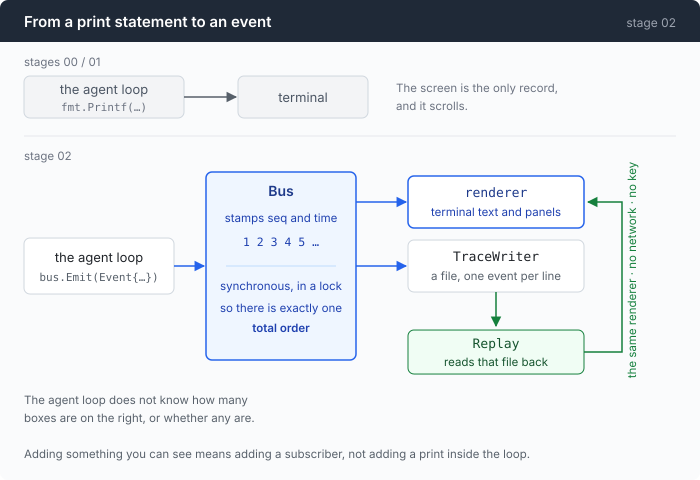

# Stage 02: See Everything — the core prints nothing, and everything you see is a subscriber

[01](../../01-dont-die/doc/README.md) → `02` → [03](../../03-babel/doc/README.md) → 04 → 05 → 06 → 07 → 08 → 09 → 10 → 11 → 12

> One constraint: the agent loop may not print. It emits events instead, and
> the terminal, the trace file and the replay viewer are three subscribers to
> the same stream. Almost everything the rest of this repo does falls out of
> that.

---

## The problem

Your agent has been running for four minutes. It has read six files, run a test
suite, patched something, and is now on turn 14. You look at the terminal and it
says:

```
  $ go test ./...
  | ok  	example/pkg	0.412s
```

That is all you have. Not what it sent — the actual bytes of turn 14's request,
which is the only place you could find out that a file you thought was in
context was never there. Not what the last call cost. Not whether the 9 seconds
that turn took were spent waiting for the first token or generating the answer,
which are two different problems with two different fixes. Not what any of it
adds up to.

Then it does something inexplicable, and you want to look at turn 8 again. Turn
8 is gone. It was printed, it scrolled, and printing was the only record anyone
kept.

Ask three questions about your own agent and see how it feels:

- **Where did the prompt tokens go on the last call?** Not "how many" — how many
  were full price, how many were written to cache, how many were read back.
- **What did this session cost?** In your currency, right now, not at the end of
  the month.
- **What did the model see on turn 30?** Exactly. Byte for byte.

If your answer to any of them starts with "well, I could add some logging",
that is the problem this chapter is about, and adding logging is not the fix.

---

## The idea

Take every `fmt.Printf` out of the loop and put nothing back.



The loop announces what happened. Displaying it is somebody else's job, and
"somebody else" turns out to be a list you can extend:

| Subscriber | What it does with the same events |
|---|---|
| `renderer` | prints text and instrument panels to the terminal |
| `TraceWriter` | appends one JSON object per line to a file |
| `Replay` | reads that file back and feeds it to `renderer` again |

Replay is the payoff and it is worth seeing why it costs almost nothing here.
The renderer accepts events. A recorded event is indistinguishable from a live
one. So replaying a session is fifty lines of file reading, and not a second
implementation of the whole display.

The lesson is not "use an event bus". It is that **observability is a shape you
pick at the start, not logging you add at the end.**

---

## Building it

The code is [`events.go`](../code/events.go), [`render.go`](../code/render.go),
[`trace.go`](../code/trace.go) and [`replay.go`](../code/replay.go). Two pieces
are large enough to be their own documents: [part 1](1-streaming.md) is reading
the stream correctly, [part 2](2-trace-replay.md) is the file and the replay.

### Step 1: an event is one flat struct, not a hierarchy

```go
type Event struct {
    Seq  int       `json:"seq"` // monotonic; the only ordering you should trust
    T    time.Time `json:"t"`
    Kind Kind      `json:"kind"`
```

Then about fifteen optional fields — `Text`, `Command`, `ExitCode`, `Usage`,
`Millis` — every one of them `omitempty`.

In Go the elegant version is an interface with a type per event, and it would be
worse here for three specific reasons. It needs custom unmarshalling to replay.
It hides the data's shape behind a type switch. And it makes a trace line
something you read with a decoder instead of with your eyes:

```
{"seq":1,"t":"2026-08-27T03:15:34.33+08:00","kind":"user_message","text":"..."}
```

`jq` works on that with no schema. Adding a field is one line.

The kinds themselves are strings, and they are written into files:

```go
KindUserMessage Kind = "user_message" // the human said something
KindTurnStart   Kind = "turn_start"   // one model round begins
KindTurnEnd     Kind = "turn_end"     // the model stopped asking for tools
```

Renaming one silently breaks replay of every session recorded before the rename.
That is the price of a format, and it is worth paying on purpose rather than
discovering.

One field is worth pointing at on its own:

```go
Request json.RawMessage `json:"request,omitempty"`
```

The full JSON body about to be sent. It makes the request inspector possible,
and in a trace it is the single most useful thing there is — the only record of
what the model actually saw. Everything else in a transcript is a
reconstruction.

### Step 2: the caller does not get to fill in the sequence number

```go
func (b *Bus) Emit(e Event) {
    b.mu.Lock()
    defer b.mu.Unlock()
    b.seq++
    e.Seq = b.seq
    if e.T.IsZero() {
        e.T = time.Now()
    }
    for _, s := range b.subs {
        s.OnEvent(e)
    }
}
```

`Seq` and `T` are stamped here, so no caller can forge them and every subscriber
sees the same numbers.

Dispatch is synchronous, inside the lock, and that is a deliberate trade. It
means ordering is **total and identical for everyone** — the trace file and the
terminal cannot disagree about what happened first. An async bus with a queue
per subscriber would scale better and would stop the trace being evidence.

What the bus actually requires of a subscriber is not "do no I/O", it is **"do
not wait unboundedly"**. A local file append never does. A network call would.
Part 2 comes back to this, because "never block the bus" is normally answered
with a goroutine, and the goroutine is the wrong answer.

### Step 3: replace the printfs in the loop — all of them

```go
bus.Emit(Event{Kind: KindCommandStart, Turn: turn, ToolID: tc.ID, Command: command})
```

```go
bus.Emit(Event{
    Kind: KindCommandEnd, Turn: turn, ToolID: tc.ID, Command: command,
    ExitCode: r.ExitCode, TimedOut: r.TimedOut, Truncated: truncated,
    Bytes: len(rendered), Millis: r.Duration.Milliseconds(),
})
```

The interesting one is the tool result, because it is the place the old code
could quietly lie:

```go
func toolResult(bus *Bus, turn int, callID, content string) message {
    bus.Emit(Event{Kind: KindToolResult, Turn: turn, ToolID: callID, Text: content})
    return message{Role: "tool", ToolCallID: callID, Content: content}
}
```

One function, one string, two destinations. What you read on screen and what the
model was told are the same bytes by construction — not by two call sites that
were correct on the day they were written.

**"All of them" is the rule, and partial compliance is worse than none.** A loop
that emits events *and* keeps four printfs produces a trace with four holes in
it, and holes are invisible: the file looks complete.

### Step 4: to see how long the first word took, you have to stream

Turn 14 took nine seconds. Was the model slow to start, or slow to write?

A non-streaming call cannot tell you, because it has exactly one moment in it.
So this stage switches to Server-Sent Events, and time-to-first-token becomes a
measurable thing.

```go
req.Header.Set("Accept", "text/event-stream")
```

That one header buys the number and costs a great deal more than one header's
worth of care. Reading the stream correctly is [part 1](1-streaming.md), and it
is five separate traps, none of which raises an error.

### Step 5: the bar — prompt tokens split three ways

Here is the single most important thing on the panel, and the reason a plain
token count is not enough:

```go
type Usage struct {
    Input      int `json:"input"`                 // billed at full price
    CacheWrite int `json:"cache_write,omitempty"` // ~1.25x
    CacheRead  int `json:"cache_read,omitempty"`  // ~0.1x
    Output     int `json:"output"`
    Reasoning  int `json:"reasoning,omitempty"` // subset of Output, where reported
}
```

Three input numbers, because they cost roughly 1×, 1.25× and 0.1×. A session
that looks expensive by token count can be cheap, and the other way round.

Now the part that catches everyone. **No single API field reports the size of
your prompt.** On an Anthropic-style protocol, `input_tokens` is only the
*uncached remainder* — an agent running for an hour can honestly report
`input_tokens: 18` while sending eighteen thousand. On an OpenAI-style protocol,
`prompt_tokens` is the whole figure with `cached_tokens` nested *inside* it. The
conventions are opposites.

Which is why the real number is a method, not a field:

```go
func (u Usage) Prompt() int { return u.Input + u.CacheWrite + u.CacheRead }
```

And why the display is a bar rather than three numbers — three numbers are
readable, a bar is *glanceable*, and the thing worth noticing is a change in
proportion between turns. When the green disappears, something invalidated your
cache, and you want to know on the turn it happens rather than in next month's
bill.

```go
cells := func(n int) int {
    if n == 0 {
        return 0
    }
    c := n * width / total
    if c == 0 {
        c = 1 // never let a non-zero component render as nothing
    }
    return c
}
```

Twenty cells. A component that is small but non-zero is forced to one cell,
because "too small to draw" and "zero" must not look the same.

### Step 6: one call, two instrument panels

The first working version of this printed the panel twice per call. The first
copy was all zeroes; the second had the real numbers.

Both were emitted by something that believed it owned `KindResponseEnd`: the
stream parser, which knows when the response actually ended, and the agent loop,
which had "the call finished" written into it from stage 01.

This is worth dwelling on, because the design was adopted *to remove*
divergence, and the first thing it did was create two owners of one fact. Event
buses do not prevent that class of bug; they relocate it. The rule that fixes it
is one line: **exactly one component emits each kind, and it is the one closest
to the evidence.** Here that is the parser:

```go
emit(Event{
    Kind:         KindResponseEnd,
    FinishReason: res.FinishReason,
    Millis:       time.Since(started).Milliseconds(),
})
```

There is a second, smaller version of the same lesson in the renderer. Usage and
the end of a response are two events, and the first version read the numbers
only off `KindResponseEnd` — hence the zeroes. The fix is not to care which
event a number rode in on:

```go
u := e.Usage
if u == nil {
    u = &r.lastUsage // see lastUsage: usage rides on its own event
}
```

### Putting it together

```go
bus := NewBus(view)
```

```go
bus.Subscribe(tw)
```

That is the entire wiring. `view` is the renderer, `tw` is the trace writer when
`--trace` was given. The loop below never learns whether either exists.

Which is what makes the CLI flags cheap. `--plain`, `--trace`, and later a whole
TUI are choices of subscriber, not forks of the agent.

---

## Run it

```sh
go build -o agent ./02-see-everything/code
cd sandbox && set -a && . ../.env && set +a
../agent --trace session.jsonl --price-in 0.27 --price-out 1.10
```

Then:

1. `look around this directory and tell me what this project is`
2. Once it finishes, run it again with `--show-request` and watch the first
   call.
3. Then, with no key at all: `../agent --replay session.jsonl --speed 2`

**What to watch for:**

- The panel under each call. The bar is the thing — watch the green (cache read)
  grow as the session goes on, and watch what happens to it the first time the
  conversation changes near its beginning.
- `TTFT` and `tok/s` are separate numbers because they fail separately. A slow
  first token is a queue or a long prompt; slow throughput is the model itself.
- In (2), the request body is enormous and it is the point. Nine times in ten,
  a model doing something inexplicable is a prompt that did not contain what you
  assumed.
- In (3), replay reproduces the pacing — including TTFT — from timestamps alone.
  No network, no key, no money. It works just as well on somebody else's trace.

---

## Measured

One real five-call session. Here is the panel from call 5:

```
  ┌─ call 5 · stop
  │ in 1066   ███████████████████   full 106 · write 0 · read 960
  │ out 117    TTFT 2943ms · total 4533ms · 73.6 tok/s
  │ $0.000201    session $0.000856 over 5 calls
  └ context 1066 / 131072 (0.8%)
```

And the session summary:

| | |
|---|---|
| calls / commands | 5 / 5 |
| prompt tokens billed | **3941** (full 869 · write 0 · read 3072) |
| output tokens | 419 |
| cost | $0.000856 |
| re-send ratio | **3.7×** (3941 billed for a final context of 1066) |
| trace | 196 events, 40KB |

**This contradicts stage 00.** That chapter measured the re-send tax at 4.2× and
presented it as the cost this repo has to fix. Instrumented, the same shape of
session is 3.7× — and **3072 of those 3941 prompt tokens, 78%, were cache
reads** at roughly a tenth of the price. The token multiple is real. The money
it implies is about four times too pessimistic, and nothing before this stage
could have told you.

That is the argument for the whole chapter in one number. The instrument did not
confirm the estimate; it corrected it.

**Cold start, same session:** call 1's TTFT was **13042ms**, call 2's was
**1239ms** — 10.5× apart, on the same model, for adjacent turns. A mean latency
figure over that session describes nothing that happened in it.

---

## Next

Everything above is true of exactly one protocol.

`sseChunk`, `sseDelta`, `prompt_tokens`, `finish_reason`, arguments arriving as
a JSON string — that is the OpenAI shape, and the parser is written directly
against it. Point this agent at an Anthropic-compatible endpoint and nothing
works: different framing (it uses `event:` lines, which this stream never has),
different content blocks, different tool-call encoding, and token accounting
that runs in the opposite direction.

The tempting fix is a library that hides the difference. The problem with
hiding it is that the differences are exactly where the bugs live — you saw one
of them already, in `normalise()`, where copying `prompt_tokens` straight across
reports 698 tokens for a 506-token prompt.

[Stage 03](../../03-babel/doc/README.md) puts both protocols behind one neutral
core, keeping every disagreement visible in the place where it is decided.
