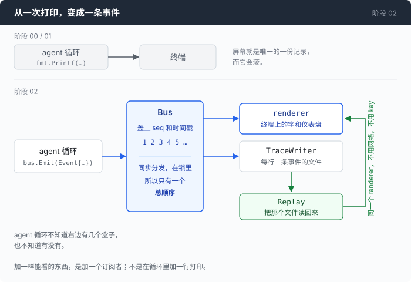

# 阶段 02：看见一切 —— 核心一个字都不打印，你看见的每样东西都是订阅者

[00](../../00-loop/doc/README_zh.md) → [01](../../01-dont-die/doc/README_zh.md) → `02` → [03](../../03-babel/doc/README_zh.md) → 04 → 05 → 06 → 07 → 08 → 09 → 10 → 11 → 12

> 一条带编号的事件流，两个订阅者：终端上的仪表盘，和一个每行一条事件的文件。把那个文件读回来喂给同一个终端，就是回放。

---

## 问题

你让上一章那个 agent 做完一件事。它跑了大概四十秒，调了四次命令，最后给你一段话。它没崩，没跑飞，命令跑之前还问过你。看起来挺好。

然后你想知道这一轮花了多少钱。

屏幕上是有数字的 —— 每一轮开头那行 `[tokens: prompt=… completion=… · finish=…]`。但它是**一次**调用的数，四次调用你得自己把四行加起来，而前面几行已经滚上去了。就算加出来也不够：prompt token 里有一部分是按全价算的，有一部分是缓存命中、单价只有全价的十分之一左右，而这一个数字里分不出来。所以「刚才那一轮多少钱」这个问题，你手上的数据根本不够回答，差的不是精度，是分项。

你想知道第一个字为什么等了那么久。是网络慢，是网关在排队，还是模型自己在想事情？这三件事要做的处理完全不同，而屏幕上只有一段已经打完的文字，它上面没有时间轴。

你想知道那个请求体里到底装了什么。你以为系统提示词在里面，你以为上一条命令的输出在里面 —— 但那几十 KB 的 JSON 你一次都没见过。模型看见的东西和你以为它看见的东西，你没有任何办法对一下。

你想知道这段对话现在多大了，离窗口上限还有多远。这个数决定你还能不能再问一句，而你只能猜。最难受的是最后一件：你想把刚才这次会话给同事看。你唯一能做的是截图，而且只能截到还没滚走的那一屏。

你的第一反应是加一行 `fmt.Printf`。这对第一个问题有用。然后你想把同样的数字存进一个文件，明天再看，于是循环里同一个位置有了第二段代码，两段代码各算一遍同一个数。然后你想要一个安静模式，于是每个 printf 前面多一个 `if`。然后你想让同事能重放你这次会话 —— 而唯一存在过的记录，是那些已经打到终端上、并且已经滚走的字符。

问题不在于 printf 打得不够多：

**这个 agent 干过的每一件事，都只在一个地方存在过一次，而那个地方会滚。**

---

## 办法

核心一个字都不打印。它把发生的每一件事**说一声**。

用户说了什么，请求发出去了，第一个 token 到了，又到了一段文字，某个工具调用要跑哪条命令，命令跑完了退出码是几，这次调用花了多少 token —— 每一声都是一条带编号的事件，全部交给同一个地方。谁想看，谁去订阅。



| 你想看的东西 | 谁在看 | 它需要认识 agent 吗 |
|---|---|---|
| 终端上的字和仪表盘 | `renderer` | 不需要 |
| 一份明天还能读的记录 | `TraceWriter` | 不需要 |
| 昨天那次会话 | `Replay` 把文件喂给同一个 `renderer` | 不需要，也不需要 API key |

最后一列是这一章唯一的结构性约定。反过来说也一样重要：**一个数字只有一个来源。** 谁知道这件事，谁把它放进事件里；剩下所有人都只是读。这句话听起来像废话，这一章结尾会给你看它被违反的时候长什么样。

---

## 怎么做的

代码在 [`02-see-everything/code/`](../code/)。

### 第 1 步：事件是一个扁平的结构体，不是一套接口

先定一张表，说清楚有哪些事情值得说一声：

```go
	KindUserMessage Kind = "user_message" // the human said something
	KindTurnStart   Kind = "turn_start"   // one model round begins
	KindTurnEnd     Kind = "turn_end"     // the model stopped asking for tools
```

模型调用那一段是这一章的重点，它被拆得比你以为的细：

```go
	KindRequest        Kind = "request"         // the exact bytes about to be sent
	KindFirstToken     Kind = "first_token"     // TTFT lands here
	KindTextDelta      Kind = "text_delta"      // visible assistant text
	KindReasoningDelta Kind = "reasoning_delta" // thinking, where the model streams it
	KindUsage          Kind = "usage"           // token accounting for one call
	KindResponseEnd    Kind = "response_end"    // finish_reason and timings
```

这些字符串会被写进文件，所以它们不能改名 —— 改一个，之前录下的每一次会话都放不出来了。

装事件的结构体只有一个，扁平的，所有字段挤在一起，用不上的靠 `omitempty` 消失：

```go
type Event struct {
	Seq  int       `json:"seq"` // monotonic; the only ordering you should trust
	T    time.Time `json:"t"`
	Kind Kind      `json:"kind"`
```

Go 里更漂亮的写法是每种事件一个类型，一个接口装起来。这里没有这么写，理由很具体：那样一来，从文件里读回来就得手写反序列化，而且数据的形状藏在一个 type switch 后面。扁平的结果是一行 JSON 你用眼睛就能读，`jq` 不需要 schema 就能查，加一个字段是加一行。其中有一个字段是这一章最值钱的东西：

```go
	// Request is the full JSON body about to be sent. It is what makes the
	// request inspector possible, and it is the single most useful thing in a
	// trace when you are trying to work out why a model did something: it is
	// the only record of what the model actually saw.
	Request json.RawMessage `json:"request,omitempty"`
```

会话记录里的其他东西都是重建出来的，只有这一段是原件。

### 第 2 步：编号不能由调用方自己填

订阅者只需要认识一个方法：

```go
type Subscriber interface {
	OnEvent(Event)
}
```

发事件的那一头是这样：

```go
func (b *Bus) Emit(e Event) {
	b.mu.Lock()
	defer b.mu.Unlock()
	b.seq++
	e.Seq = b.seq
	if e.T.IsZero() {
		e.T = time.Now()
	}
	for _, s := range b.subs {
		s.OnEvent(e)
	}
}
```

十二行里有三个决定。

**编号和时间戳在这里盖。** 调用方交上来的 `Seq` 会被覆盖掉，所以没人能伪造顺序，也没人会忘。同样重要的是：一次真实运行和一次回放里，同一件事拿到的是同一个编号，于是「回放出来的和当时看到的是不是同一份」变成了一个可以逐条比对的问题。

**分发是同步的，而且在锁里面。** 这不是偷懒。它换来的是：所有订阅者看到的顺序完全一样，一件事只可能有一个先后。文件里的顺序和屏幕上的顺序永远不会对不上，因为它们根本就是同一次遍历。

**代价是任何一个订阅者卡住，整个 agent 就卡住。** 这个代价是知情的：真正的规则不是「订阅者里不能有 I/O」，而是「订阅者里不能有无上限的等待」。往本地文件追加一行属于前者，不属于后者。这件事和 trace 文件是同一个话题，放在[第二篇](2-trace-replay_zh.md)里说。

### 第 3 步：把循环里的 printf 换掉，一个不留

上一章那段执行命令的代码，每一步后面都跟着一个 `fmt.Printf`。现在每一步后面跟着一个 `bus.Emit`：

```go
			bus.Emit(Event{Kind: KindCommandStart, Turn: turn, ToolID: tc.ID, Command: command})
			r := runBash(cfg.shell, command, cfg.timeout)
			rendered, truncated := r.render(cfg.maxOutput)
			bus.Emit(Event{
				Kind: KindCommandEnd, Turn: turn, ToolID: tc.ID, Command: command,
				ExitCode: r.ExitCode, TimedOut: r.TimedOut, Truncated: truncated,
				Bytes: len(rendered), Millis: r.Duration.Milliseconds(),
			})
			msgs = append(msgs, toolResult(bus, turn, tc.ID, rendered))
```

闸门的判决也变成了一条事件，于是半年以后你还能看到当时是谁拒了哪条命令：

```go
			v, why := g.ask(command)
			bus.Emit(Event{Kind: KindGateVerdict, Turn: turn, ToolID: tc.ID, Verdict: string(v), Text: why})
```

上面最后那行 `toolResult` 值得单独看。它做了两件事，而且只能一起做：

```go
func toolResult(bus *Bus, turn int, callID, content string) message {
	bus.Emit(Event{Kind: KindToolResult, Turn: turn, ToolID: callID, Text: content})
	return message{Role: "tool", ToolCallID: callID, Content: content}
}
```

发出去给人看的那段文字，和追加进 `msgs` 里给模型看的那段文字，是同一个 `content`。写成两句话就有两个来源，两个来源迟早会不一样，而「屏幕上写的和模型收到的不一样」正是这一章要消灭的那种 bug。

这个原则有一处是真的被违反过的，就在这一章里。命令跑完之后，`renderer` 最初会打一行页脚：退出码、耗时、字节数。看起来很合理，直到你发现模型收到的那段 tool 结果**本来就以退出码和耗时结尾** —— 那是第 01 章写的，写给模型看的。于是这个专门解决「看不见」的阶段，自己给人打了一份比模型收到的更好看的摘要。最后的处理是只数不打：

```go
	case KindCommandEnd:
		// Counted, not printed. The tool result that follows already ends with
		// the exit code and duration, because that text was written for the
		// model — and showing you a different summary than the model got is
		// exactly the kind of divergence this stage exists to eliminate.
		r.commands++
```

那个页脚函数还留在 `render.go` 里，没有人调用它。留着是因为它比这段注释更能说明问题：那段代码写得没有错，它只是在回答一个不该问的问题。

### 第 4 步：要看见「第一个字等了多久」，就必须改成流式

不流式的调用只有一个时刻：你问完，几秒钟之后整个答案一次到齐。这里面没有 TTFT 可言 —— 没有「第一个 token」这个事件，就没有那个数。

改成流式之后，一次回复变成一串分片，而这一章想看的东西全都长在这串分片上：文字一边生成一边出现，一个可以和总耗时分开的首字延迟，一个在参数还没传完时就能报出名字的工具调用。

代价是解析。这不是「多读几帧」的事：按协议文档写出来的解析器，在这个网关上会 panic，会把工具调用的 id 弄丢，会把一个已经过滤过的字段当成有效值。这些都是看过真实字节才知道的，所以单独放一篇：

> **[一、把流读对](1-streaming_zh.md)** —— SSE 的分帧、`[DONE]` 之后还有一帧数据、id 只出现一次、参数分片不按 JSON 边界切，以及为什么把 `prompt_tokens` 直接抄进 `Input` 会让报出来的数越准越错。

从这里往下，假设那一篇已经做完了：流已经解析好，事件已经发出来了。

### 第 5 步：那根条 —— 把 prompt token 分成三份

`in 1066` 这一个数是不够的，第 01 步就说过原因。分项的形状定在 `Usage` 里，三份分开存：

```go
func (u Usage) Prompt() int { return u.Input + u.CacheWrite + u.CacheRead }
```

三份的单价大致是全价 1 倍、写缓存 1.25 倍、读缓存 0.1 倍。把差十倍的三个东西加在一起报一个总数，是 agent 成本统计最常见的错法：同样 1066 个 token，全是全价和全是缓存读，账单差十倍左右。所以仪表盘第一行是一个数加一根条：

```go
	bar := r.cacheBar(*u)
	r.p("  %s in %s %s  %s\n",
		r.c(cDim, "│"),
		pad(fmt.Sprint(prompt), 6),
		bar,
		r.c(cDim, fmt.Sprintf("full %d · write %d · read %d", u.Input, u.CacheWrite, u.CacheRead)))
```

条子是二十个格，按三份的比例染三种颜色。三个数字放在旁边也能读，但你真正想注意的是**比例在两次调用之间变了** —— 绿色突然消失，说明有什么东西把你的缓存作废了。这件事你要在它发生的那一轮看见，而不是在月底的账单上。

### 第 6 步：一次调用打了两块仪表盘

上面所有东西第一次跑通的时候，屏幕上是这样的：每次模型调用打**两块**仪表盘。前一块所有数字是 0，紧接着一块是真的。

`renderer` 的仪表盘挂在 `KindResponseEnd` 上，所以问题是这个事件被发了两次。发它的一个是流解析器 —— 它知道流什么时候结束、结束得干不干净；另一个是 agent 循环 —— 组装完 assistant 消息之后，顺手也发了一条。两边都觉得「这一轮的响应结束了」是自己该宣布的事。

值得停一下看清楚这件事的形状。事件总线的全部理由，是让**一件事只有一个总顺序、一个事实只有一个主人**。而它上线的第一个版本，恰恰是同一个事实有了两个主人。这个设计是为了消灭分歧才引入的，它造出来的第一个 bug 就是分歧。

而且它不崩。两个主人不会引发冲突，只会各说一次；先说的那个手上还没有 usage，于是打一块空的。放在代码里的修法是一句注释，写在那个多余的 `Emit` 曾经在的位置上：

```go
		// Note what is NOT here: a KindResponseEnd. The stream parser already
		// emitted one, because it is the component that knows when the response
		// actually ended and whether it ended cleanly. Emitting a second from
		// here is the bug this comment exists to stop you re-introducing — two
		// components each believing they own an event is the most common way an
		// event-driven design goes wrong, and it shows up as a duplicated,
		// half-empty panel rather than as a crash.
```

顺手把订阅者那一侧也改结实了。原来的 `renderer` 只从 `KindResponseEnd` 上取 usage，而 usage 是自己一条事件，两者不在同一个时刻到：

```go
	u := e.Usage
	if u == nil {
		u = &r.lastUsage // see lastUsage: usage rides on its own event
	}
```

规则可以写成一句话：**订阅者不该关心一个数字是搭哪条事件来的，它只该记住自己最后一次被告知的值。**

### 拼起来

整个接线在 `main` 里，一共十行：

```go
	bus := NewBus(view)
	if *tracePath != "" {
		tw, err := NewTraceWriter(*tracePath)
		if err != nil {
			fmt.Fprintln(os.Stderr, err)
			os.Exit(1)
		}
		defer tw.Close()
		bus.Subscribe(tw)
	}
```

`view` 是终端，`tw` 是文件。不给 `--trace` 就只有一个订阅者，agent 的行为一字不变 —— 因为它根本不知道有几个。这就是这一章的全部结构。以后那个 TUI 是换一个订阅者，不是分叉一份代码；测试断言的是一串事件，而不是去抓 stdout；回放是把文件读回来喂给同一个 `renderer`。这三件事都不是额外写的功能，是那一个约定的直接结果。

trace 文件和回放各有一堆自己的决定，在第二篇：

> **[二、一个能在崩溃时活下来的记录](2-trace-replay_zh.md)** —— 为什么是 JSONL、为什么不加缓冲也不 `fsync`、被 kill 的会话最后半行怎么读、以及回放为什么不给事件重新盖时间戳。

---

## 跑一下

```sh
go build -o agent ./02-see-everything/code

mkdir -p sandbox && cd sandbox
set -a && . ../.env && set +a
../agent --trace session.jsonl --window 131072
```

`--window` 是模型的上下文窗口，用来算仪表盘最后一行那个百分比。价钱那三个开关（`--price-in` / `--price-out` / `--price-cache-read`，单位是每一百万 token 多少美元）要填你自己那份价目表上的数；不填的话第三行打一个破折号，而不是 `$0.00` —— 一个编出来的零比没有数字更糟，因为它是会被人引用的那个数。

在一个有几个文件的目录里试这三句：

1. `这个目录里最大的三个文件是什么？`
2. `逐个读一下这几个文件，然后告诉我这个项目是干什么的。`
3. `--show-request` 重跑一次第 1 句。

**观察重点：**

- 第 1 句结束后那块仪表盘，`in` 后面那根条基本是整根红的 —— 冷启动，几乎没有东西能命中缓存。
- 第 2 句会连着调好几次模型。盯着那根条的颜色比例：红的那段基本不动，绿的那段一轮一轮变长。这就是「每次都把整个数组重发一遍」这件事，在有缓存的情况下真实的样子。
- 同一块仪表盘上，`TTFT` 和 `tok/s` 是两个数。第一次调用的 TTFT 会明显大于后面几次，而 `tok/s` 不会 —— 这两个数分开报，是因为它们坏起来的原因不一样。
- 第 3 句会在请求发出去之前把整个请求体打出来。第一次看它的人通常会发现，里面装的东西和自己以为的不一样。
- 退出之后 `wc -l session.jsonl`。整个会话在那个文件里，逐行、有编号。怎么读它是[第二篇](2-trace-replay_zh.md)的事。

---

## 量一量

一次五轮的真实会话，其中一块仪表盘：

```
  ┌─ call 5 · stop
  │ in 1066   ███████████████████   full 106 · write 0 · read 960
  │ out 117    TTFT 2943ms · total 4533ms · 73.6 tok/s
  │ $0.000201    session $0.000856 over 5 calls
  └ context 1066 / 131072 (0.8%)
```

`in 1066` 里只有 106 个 token 是按全价算的，960 个是缓存命中。同一次会话结束时的汇总：

```
  ── session ──────────────────────
  5 calls · 5 commands
  prompt tokens billed: 3941  (full 869 · write 0 · read 3072)
  output tokens: 419
  cost: $0.000856
  re-send ratio: 3.7x (billed 3941 for a final context of 1066)
```

**现在说这一章最重要的一个结果，它推翻的是这个仓库自己的说法。**

第 00 章的「量一量」把重发倍数量成了 **4.2 倍**（付了 4982，对话最后只有 1192），并且把它立成了后面所有章节要解决的那个成本问题。这里同样形状的一次会话，装上仪表之后量出来是 **3.7 倍**（付了 3941，最后的上下文是 1066）。

3.7 和 4.2 的差别不重要 —— 那是两次不同的会话，任务不一样，倍数本来就会飘。真正的结果在括号里那一行：

**3941 个 prompt token 里，3072 个（78%）是缓存读，单价大约是全价的十分之一。**

token 倍数是真的，第 00 章那句「二次增长」也是真的。但**它当时换算出来的钱，大约悲观了四倍**，因为那个倍数里绝大部分根本不按全价收。

这件事值得记住的地方不是「谁错了」。第 00 章那个数是从 API 返回的 `prompt_tokens` 里读的，那是当时唯一能读到的东西 —— 而这个字段本身不区分全价和缓存价，任何单一字段都不区分。所以在这一章之前，这个仓库**没有任何办法知道自己那个结论是偏的**。数字没错，仪表不够。

一个专门讲「看清楚」的阶段，第一件事就是把自己前作的头号数字打开看看，然后发现它高估了。

**冷启动。** 同一次会话，第 1 次调用 TTFT **13042ms**，第 2 次 **1239ms**，差 **10.5 倍左右**。这个差不是网络，也不是模型变快了；它就是第一次请求在网关那边什么都还没准备好。装上 TTFT 之前，这件事表现为「有时候第一句话特别慢」，一个没法讨论的印象。

---

## 接下来

现在你什么都看得见了：每一次调用的 token 分项、TTFT 和吞吐、上下文水位、发出去的原始请求体，以及一个可以明天再读、也可以给同事的记录文件。

代价在一个你可能没注意的地方。把这一章新加的东西列一列：`prompt_tokens` 减去 `cached_tokens` 得到全价部分；`choices` 是个数组，usage 那一帧它是空的；`finish_reason` 只在最后一帧非空；`data: [DONE]` 表示流要结束了；流里没有 `event:` 行。仪表盘上那三个数、那根条、trace 文件里每一个字段名，全部建立在这几句话上。

而这几句话，一句都不是「LLM API 就是这样」。它们是**一家的 chat-completions 协议是这样**。你手上这个端点还讲另一种协议。在那一种里，`input_tokens` 只是**没命中缓存的那一部分** —— 一个跑了一小时的会话可以老老实实报 18 个 input token，同时真的发出去一万八。同一根条，同一个 `full · write · read`，数字从相反的方向送进来。流的结束不是一个 `[DONE]` 帧，是连接直接关掉；而且那边的流有 `event:` 行。

于是这一章交出来的东西全都要重新问一遍：这个仪表盘量的是真的东西，还是只是一家的字段名？trace 文件里那些 `full 869 · write 0 · read 3072`，换一个协议还能不能放在同一张表里比？

[阶段 03](../../03-babel/doc/README_zh.md) 是巴别塔：同一个 agent，两种协议，一套事件。
