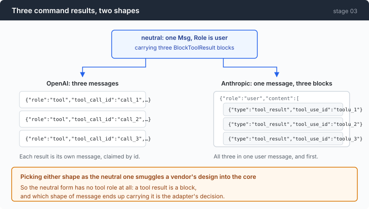
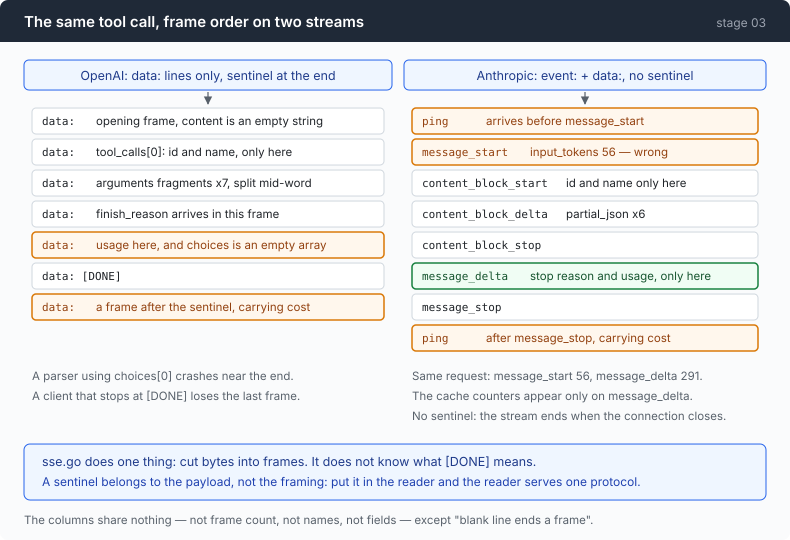

# Stage 03 · part 1: four disagreements, on the wire

[← back to stage 03](README.md)

> Where the system prompt lives, what shape a tool result is, how the stream is
> framed, and what the stop reason is called. Four places where the natural code
> is wrong, and none of them raises an error.

---

## The problem

You have the neutral language. Writing the second adapter looks like an
afternoon of renaming fields.

It is not, because three of these four are not renames — they are shape changes,
and a shape change has no field to rename. The system prompt does not move to a
different key, it stops being a message. A tool result does not get a new name,
three of them collapse into one message. And the stop reason is the same word in
two protocols meaning two different things.

Worse, each one fails silently in its own way:

- Put the system prompt in `messages` and the API accepts it. The model just
  behaves slightly worse forever.
- Send tool results as separate messages and the API returns a 400 you will
  misread as a schema problem.
- Reuse the OpenAI frame reader and every frame parses. You simply see nothing,
  because the payloads are keyed differently.
- Map an unfamiliar stop string to "finished" and the agent silently treats a
  refusal as an answer.

---

## The idea

Write down each disagreement as a fact from the recording, then let the type
system carry it where possible and a loud error carry it where not.

The four, in the order the code meets them:

| | OpenAI | Anthropic | how the code carries it |
|---|---|---|---|
| system prompt | first message | top-level field | a separate parameter on `BuildRequest` |
| tool results | one message each | blocks in one user message | a block kind, not a role |
| framing | `data:` + `[DONE]` | `event:` + `data:`, no sentinel | shared reader, separate payload parsers |
| stop reason | `finish_reason` | `stop_reason` | a normalised enum with an `unknown` member |

---

## Building it

### Step 1: the system prompt — make the interface refuse to take one

```go
System string `json:"system,omitempty"`
```

A top-level field. Not a message with a role.

The neutral language cannot represent this by choosing a side — it would smuggle
one protocol's shape into the core — so it represents it by keeping the system
prompt out of the conversation entirely and passing it as its own argument.

Which leaves one question: what happens when a caller does it the other way
anyway?

```go
return nil, fmt.Errorf("anthropic: a system message in msgs — this protocol takes the system prompt as a top-level field, pass it as BuildRequest's system argument")
```

Loud, not lenient. The tolerant version relabels the message `user` and sends it,
and everything appears to work — the model gets the text, roughly in the right
place, with slightly the wrong framing. You would ship that. You would then
spend a week wondering why one provider gives worse answers than the other.

There is a smaller version of the same care one field down:

```go
Tools []anthropicTool `json:"tools,omitempty"`
```

`omitempty`, so an empty tool list is *absent* rather than `[]`. A
present-but-empty array is a different prompt prefix from an absent one, and a
different prefix is a cache miss. Stage 04 is where that costs money.

And the header, which looks trivial and is a real trap:

```go
req.Header.Set("x-api-key", p.apiKey)
```

```go
req.Header.Set("anthropic-version", anthropicVersion)
```

Not `Authorization: Bearer`. Send the OpenAI header to this endpoint and you get
an `AuthError` saying **"Missing API key."** — which reads like a configuration
problem and is actually a protocol confusion. You will check your key three
times before you check your scheme.

### Step 2: tool results — three commands, two shapes



The model asked for three commands in one turn. You have three results. On one
protocol that is three messages; on the other it is one message with three
blocks in it, and those blocks must come first.

The neutral form is three `BlockToolResult` blocks in one `Msg`. Rendering them
for Anthropic means accumulating and flushing:

```go
var (
    out     []anthropicMessage
    pending []anthropicContent // tool_result blocks not yet flushed
)

flush := func() {
    if len(pending) == 0 {
        return
    }
    out = append(out, anthropicMessage{Role: string(RoleUser), Content: pending})
    pending = nil
}
```

```go
case BlockToolResult:
    pending = append(pending, anthropicContent{
        Type:      "tool_result",
        ToolUseID: b.ID,
```

Results go into `pending` rather than straight into a message, and `pending` is
flushed as **one** user message when the next non-result content appears.

Two more things this loop has to get right, both learned from 400s:

**An empty text block is rejected.** "text content blocks must be non-empty" is
a real error from a real API, so empty ones are skipped.

**A message that renders to nothing must not become `content: []`.** That is
also a 400, and an assistant turn that was pure thinking renders to exactly
that.

Which brings up the decision this adapter makes that costs something real:

```go
case BlockThinking:
```

Dropped. Not rendered at all.

The spec says a thinking block must be replayed with the `signature` the model
returned, or the API rejects it. On this endpoint the signature is **always the
empty string** — in non-streaming responses, in `signature_delta` frames,
everywhere. There is no signature to round-trip, so a replayed thinking block is
a block that cannot validate.

Sending nothing loses the model's private reasoning from the next turn's
context, which is a genuine cost, not a free simplification. Sending an unsigned
block risks a 400 that kills the session. The trace still has every thinking
token, so nothing is lost from the *record* — only from the *prompt*.

### Step 3: SSE framing — exactly one shared rule



Read the two columns. Different frame counts, different frame names, different
payload fields, one with a sentinel and one without, one with `ping` frames
before the first real event *and* after the last.

What they share is a single rule: `field: value` per line, blank line ends a
frame.

That rule is the whole of [`sse.go`](../code/sse.go), and the file is reused
untouched by both adapters. It was written in stage 02 without a second protocol
in sight, and it survives because of one restraint: **it does not know what
`[DONE]` means.** A sentinel is a convention of the payload, not of the framing.
Put it in the frame reader and the frame reader serves one protocol forever.

Two payload-level facts from the recording are worth carrying:

**Usage is wrong on the first frame.** On the Anthropic stream, `message_start`
reports `input_tokens: 56` for a request whose real figure — from
`message_delta` — is **291**. The cache counters appear only on `message_delta`
too. A parser that latches the first usage it sees is wrong on every call and
looks plausible on all of them.

**The gateway leaks its own scaffolding.** Sometimes a `</think>` tag falls out
of thinking extraction and into a real text block. That is not the model
speaking; it is the harness showing through a seam.

```go
func anthropicHarnessResidue(s string) bool {
    switch strings.TrimSpace(s) {
    case "</think>", "<think>":
        return true
    }
    return false
}
```

Note how narrow the test is: the **whole delta**, trimmed, must be exactly the
tag. The tempting version is `strings.ReplaceAll(text, "</think>", "")`, and it
would silently mangle a model explaining how think-tags work — a perfectly
normal thing to ask a coding agent. Corrupting real output to tidy up vendor
garbage is the worse failure.

And the residue is dropped from the display but **reported as a notice**, so the
terminal stays clean and the trace keeps the evidence. Silently swallowing it
would mean nobody ever finds out the gateway is broken.

### Step 4: an unfamiliar stop string is not "probably fine"

```go
func normaliseStop(raw string) StopReason {
    switch raw {
    case "stop", "end_turn":
        return StopEndTurn
    case "tool_calls", "tool_use":
        return StopToolUse
    case "length", "max_tokens":
        return StopMaxTokens
    case "content_filter", "refusal":
        return StopFiltered
    default:
        return StopUnknown
    }
}
```

The interesting line is the last one.

The natural default is `StopEndTurn` — the turn is over, print what you have,
move on. It is natural because every string you have *seen* means roughly that.
The strings you have not seen are new safety stops, quota events, and refusals,
and mapping those to "finished" means the agent quietly reports a blocked
response as an answer.

`StopUnknown` propagates, and the loop prints the literal string it did not
recognise. You find out on the first occurrence rather than on the first
complaint.

This is also why `RawStop` is carried alongside. On this gateway a tool call
truncated at `max_tokens` returns `stop_reason: "tool_use"` with an unusable
body — the normalised value says the agent should run a tool, and the raw value
is what it was told. Both are in the trace, and the discrepancy between them is
the diagnosis.

---

## Run it

The adapters are pure functions — no I/O, no bus — so both are tested against
recorded frames rather than against a live endpoint:

```sh
go test ./03-babel/code/ -run TestAnthropic -v
go test ./03-babel/code/ -run TestOpenAI -v
```

Then look at the two shapes for yourself, with no model call at all:

```sh
cd sandbox && set -a && . ../.env && set +a
../agent --provider ant --trace ant.jsonl
> run these three at once: pwd, whoami, date
```

```sh
jq -r 'select(.kind=="request") | .request' ant.jsonl | tail -1 | jq '.messages[-1]'
```

**What to watch for:** one `user` message whose `content` array holds three
`tool_result` blocks, before any text. Run the same prompt through
`--provider oai` and the same turn is three separate `role:"tool"` messages.

Then break something on purpose. In `anthropicMessages`, delete the `flush()`
call that runs before appending a normal message, so results are emitted in the
wrong order:

**What to watch for:** a 400 from the API, not a wrong answer. This is one of
the few places in this repo where the wrong shape fails loudly, and it is worth
seeing which ones do and which ones do not.

---

## Measured

From the recorded streams:

| | OpenAI | Anthropic |
|---|---|---|
| `event:` lines | **0** in the whole stream | on every frame |
| sentinel | `[DONE]`, with a frame after it | none — the connection closing is the end |
| frames carrying a call's id and name | 1 | 1 (`content_block_start`) |
| usage reports per call | 1, on a frame whose `choices` is `[]` | 2, and the first one is **wrong** |
| where `cost` hides | a frame after `[DONE]` | an extra key on the trailing `ping` |

`message_start` said `input_tokens: 56`; `message_delta` said `291`. Same
request.

The frame counts are not comparable and that is worth saying rather than
tabulating: one recorded OpenAI tool call is **13 `data:` frames**, while one
recorded Anthropic reply carrying two tool calls and a text block is **24
events**, because that protocol brackets every content block with its own start
and stop.

And the framing shared between the two columns, counted honestly: **one rule**.
Everything else in `sse.go` — the comment handling, the multi-line `data:`
joining, the last-line-before-EOF case — is shared too, and none of it needed to
change when the second protocol arrived. That is the return on having split the
file in stage 02, collected one chapter later.

---

## Next

Both protocols work, and the panel from the Anthropic run says `read 0`.

Implicit caching gave the OpenAI arm 78% cache reads for free. The Anthropic
protocol caches only what you explicitly mark, and nothing here marks anything.

[Stage 04](../../04-the-cache/doc/README.md) turns it on, measures what it is
worth, and works out what it forbids — because a cache keyed on a prefix means
every byte you put near the front of a prompt is now load-bearing.
