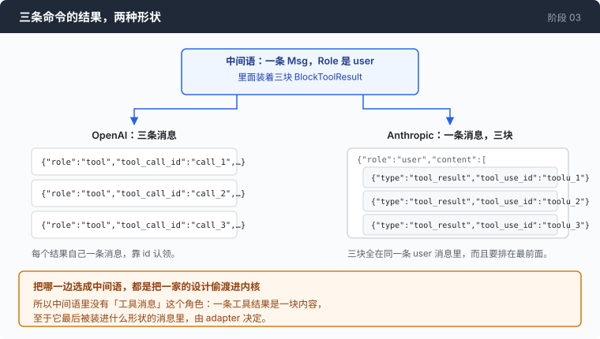
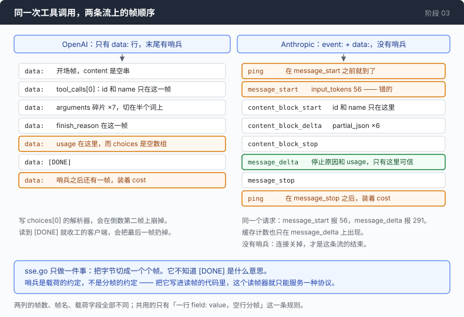

# 阶段 03 · 落到线上的四处形状分歧

[00](../../00-loop/doc/README_zh.md) → 01 → 02 → `03` → [04](../../04-the-cache/doc/README_zh.md) → 05 → 06 → 07 → 08 → 09 → 10 → 11 → 12

> [回到本章主线](README_zh.md)。这一篇是主线第 5 步展开：中间语定完了，接下来把它落到两条真实的线上。

---

## 问题

中间语已经定好了 —— `Msg`、`Block`、`StopReason`、`Usage`，循环只认这四个。

然后你要把它变成真正发出去的字节，而这时候会发现一件让人烦躁的事：**每一处形状对不上，给你的错误都不像是形状对不上。**

系统提示词放错位置，你不会收到「系统提示词放错了」。你会收到一次成功的调用，模型语气正常，只是完全不知道自己是个 agent —— 那一大段提示词被当成一条普通用户消息，或者干脆被忽略了。

工具结果的形状错了，你会收到一个 400，说有一个工具调用没有对应的结果。你明明回了三条。

认证头用错了协议，你会收到 `Missing API key.` —— 读起来像是你的 key 没配好，实际上是你把 `Authorization: Bearer` 发给了一个只认 `x-api-key` 的接口。

这四类错误的共同点是:**它们都会把你引向错误的地方去找。** 所以这一篇不讲「有哪些字段不一样」，讲的是每一处不一样会以什么面目出现，以及为什么最后是 adapter 咽下它、而不是循环。

---

## 办法

四处分歧，两条应对原则。

| 分歧 | OpenAI | Anthropic | 错了之后你看到什么 |
|---|---|---|---|
| 系统提示词放哪儿 | 消息数组第一条，`role:"system"` | 请求体顶层 `system` 字段，不能是消息 | 调用成功，模型不知道自己是 agent |
| 工具结果什么形状 | 每条结果自己一条 `role:"tool"` 消息 | 全部装进同一条 user 消息的 `tool_result` 块 | 400，说有调用没结果 |
| SSE 怎么分帧 | 只有 `data:` 行，末尾 `[DONE]` 哨兵 | `event:` + `data:`，没有哨兵 | 流读到一半停住，或者最后一帧被丢掉 |
| 停止原因叫什么 | `stop` / `tool_calls` / `length` | `end_turn` / `tool_use` / `max_tokens` | 状态机把没见过的字符串当成「大概没事」 |

两条原则：

**第一，哪一边都不能当中间语。** 上面每一行,两边都是合理设计，选任何一边当"标准"，就是把那一家的设计偷渡进内核。中间语的做法是**两个都不选**：它只说「这是一块工具结果」，至于这块最后被装进什么形状的消息里，adapter 决定。

**第二，形状不对要吵，不要将就。** 下面第 1 步那个 `return nil, nil, fmt.Errorf(...)` 是这一篇里最重要的五行代码。

---

## 怎么做的

### 第 1 步：系统提示词 —— 让接口自己说它不接受

OpenAI 这边，系统提示词就是第一条消息：

```go
// DISAGREEMENT 1 — where the system prompt lives.
//
// Here it is just another message, first in the array, with role "system".
// On the Anthropic protocol it is a top-level `system` field and cannot be
// a message at all. That asymmetry is why Provider.BuildRequest takes the
// system prompt as its own parameter: neither placement can be the neutral
// one, so the neutral form refuses to choose.
if system != "" {
    out = append(out, oaiMessage{Role: "system", Content: system})
}
```

Anthropic 这边，它是请求体上一个顶层字段：

```go
body, err := anthropicMarshal(anthropicRequest{
    Model:     p.model,
    MaxTokens: maxTokens,
    System:    system,
    Messages:  wireMsgs,
    Tools:     anthropicTools(tools),
    Stream:    true,
})
```

这就是为什么 `BuildRequest` 的签名把系统提示词单独拎出来，而不是让它待在 `msgs` 里：

```go
BuildRequest(system string, msgs []Msg, tools []Tool, maxTokens int) (*http.Request, []byte, error)
```

现在关键的一步。如果调用方还是按 OpenAI 的习惯，把系统提示词塞进了 `msgs`，Anthropic 这边该怎么办？

有一个非常自然、非常有害的选择：把它改成 `role:"user"` 发出去。请求会成功，你今天不会发现任何问题。

代码选的是另一条：

```go
if m.Role == RoleSystem {
    // Loud, not lenient. The system prompt is a top-level field on this
    // protocol and Provider.BuildRequest passes it separately for
    // exactly that reason; a system Msg here means the caller built the
    // conversation the OpenAI way. Quietly re-labelling it "user" would
    // send a subtly different prompt and produce a subtly worse agent,
    // which is the hardest class of bug to ever notice.
    return nil, fmt.Errorf("anthropic: a system message in msgs — this protocol takes the system prompt as a top-level field, pass it as BuildRequest's system argument")
}
```

「一个稍微差一点的 agent」是这里真正的代价，而它不会以 bug 的形式出现。没有报错，没有异常，测试全绿，只是它做题的水平低了一档 —— 而你手上没有任何线索指向系统提示词。

同一条原则在这个文件里还出现了两次，都是宁可现在报错：

```go
if len(msgs) == 0 {
    // The gateway's answer to this is a 400 with no error envelope (§D11).
    // Fail here, where the message can say something useful.
    return nil, nil, fmt.Errorf("anthropic: refusing to send a request with no messages")
}
```

### 第 2 步：工具结果 —— 三条命令，两种形状

一轮里模型要了三条命令，你跑完了，现在要把三份输出发回去。



OpenAI：三条独立消息，每条靠 `tool_call_id` 认领它回答的是哪次调用。

```go
case BlockToolResult:
    out = append(out, oaiMessage{
        Role:       "tool",
        ToolCallID: b.ID,
        Content:    b.Text,
    })
```

Anthropic：三块 `tool_result` 装在同一条 **user** 消息里，而且要排在这条消息的最前面。

这个「攒起来再一起发」的要求，逼出了 `anthropicMessages` 里的一个小状态机。工具结果先进 `pending`，不立刻落地：

```go
flush := func() {
    if len(pending) == 0 {
        return
    }
    out = append(out, anthropicMessage{Role: string(RoleUser), Content: pending})
    pending = nil
}
```

而如果下一条消息本身就是 user 消息（比如用户在工具跑完之后又说了一句话），那就不能 flush 出一条、再接一条 —— 得合并：

```go
if len(pending) > 0 && m.Role == RoleUser {
    // Merge rather than flush: two user messages in a row is a shape
    // this protocol dislikes, and tool_result blocks are required to
    // come first in the message that carries them.
    merged := make([]anthropicContent, 0, len(pending)+len(own))
    merged = append(merged, pending...)
    merged = append(merged, own...)
    own = merged
    pending = nil
} else {
    flush()
}
```

回头看 `provider.go` 里那个空缺，现在它有意义了：中间语的 `Role` 只有 system / user / assistant，**没有 `RoleTool`**。

```go
const (
	RoleSystem    Role = "system"
	RoleUser      Role = "user"
	RoleAssistant Role = "assistant"
)
```

如果当初加了 `RoleTool`，那就是把 OpenAI 的设计写进了内核，Anthropic adapter 从此要做一件更别扭的事：把一个「工具消息」拆开，重新装进 user 消息里。中间语里工具结果是**一块内容**，不是一条消息，就没有这个问题。

### 第 3 步：SSE 分帧 —— 共用的只有一条规则

两条流唯一的共同点是：一行 `field: value`，空行分帧。别的全都不一样。



所以 `sse.go` 被切成只做一件事 —— 把字节切成帧，不解释任何一帧的意思：

```go
type sseFrame struct {
	Name string
	Data string
}
```

`Name` 在 OpenAI 那条流上永远是空的，因为那条流一行 `event:` 都没有。它还是存在，理由写在那个类型的注释里：一个「以后再教它认 event: 行」的读帧器，是一个在那之前一直写错的读帧器。

有两个陷阱值得单独记下，它们都在图里：

**`[DONE]` 是载荷的约定，不是分帧的约定。** OpenAI 那条流末尾有个 `[DONE]` 哨兵，Anthropic 那条流没有 —— 它靠连接关闭结束。把「读到 `[DONE]` 就收工」写进读帧器，这个读帧器就只能服务一种协议了；更糟的是在 OpenAI 那条流上它会把哨兵之后那一帧丢掉，而那一帧装着 `cost`。

**`choices` 会是空数组。** OpenAI 那条流里，`usage` 单独占一帧，而那一帧的 `choices` 是空的。任何一个直接写 `choices[0]` 的解析器，会在倒数第二帧上崩掉 —— 不是第一帧，不是随机某帧，而是稳定地在快结束的时候。

### 第 4 步：停止原因 —— 没见过的字符串不能算「大概没事」

两边同一件事三个名字。归一化本身没什么可说的：

```go
func normaliseStop(raw string) StopReason {
	switch raw {
	case "stop", "end_turn":
		return StopEndTurn
	case "tool_calls", "tool_use":
		return StopToolUse
	case "length", "max_tokens":
		return StopMaxTokens
	case "content_filter", "refusal":
		return StopFiltered
	default:
		return StopUnknown
	}
}
```

值得说的是 `default` 那一支。它没有落到 `StopEndTurn`。

```go
// Unknown strings map to StopUnknown rather than to StopEndTurn, and the agent
// loop reports them instead of continuing. A state machine that maps anything
// unrecognised to "probably fine" will eventually map a refusal, a quota event,
// or a new safety stop to "probably fine".
```

以及一件更要紧的：归一化之后，原始字符串**没有被丢掉**。

```go
	// RawStop is the provider's literal string, kept alongside the normalised
	// value and written into the trace.
	RawStop string
```

理由是这条线上观察到的一个事实：`max_tokens` 砍断一次工具调用之后，`stop_reason` 回的是 `tool_use`，也就是「这次调用可以用」，而里面的载荷根本不能用（`external/wire-notes.md` §A3c）。**信封在说谎。**

出问题的时候，归一化后的值告诉你 agent 当时**相信**了什么，`RawStop` 告诉你它当时**被告知**了什么，而 bug 就在这两者的缝里。把原始值归一化掉，等于把你唯一的证据擦了。

---

## 跑一下

这四处分歧最好的观察方式，是把同一段对话在两条协议上各发一次，然后比较落到线上的字节。

```sh
go build -o agent ./03-babel/code

mkdir -p sandbox && cd sandbox
set -a && . ../.env && set +a

../agent --protocol openai    --trace oa.jsonl -p "列出当前目录，然后告诉我有几个文件"
../agent --protocol anthropic --trace an.jsonl -p "列出当前目录，然后告诉我有几个文件"
```

**观察重点：**

- 两份 trace 里请求体那一条，`system` 在哪儿。一份在 `messages[0]`，一份在顶层。
- 工具结果那一条。一份是若干条 `role:"tool"`，一份是一条 `role:"user"` 里若干个 `tool_result`。
- 把 `--protocol anthropic` 那次的 trace 里 SSE 的帧名列出来（`event:` 那一行），跟 OpenAI 那次比 —— 后者一个都没有。
- 两份 trace 里 `raw_stop` 字段。它和归一化后的 `stop` 并存，这是故意的。

---

## 接下来

四处形状分歧全部关在两个 adapter 文件里，循环一个字都看不见。

剩下第五处，它没被关进去，因为循环必须读它：**token 账目**。而这一处的分歧不是形状，是方向 —— 两边对「输入 token」这个词的定义，差着一次缓存命中的量。

回到主线：[第 6 步 —— token 账目的方向是反的](README_zh.md#第-6-步token-账目的方向是反的)。
