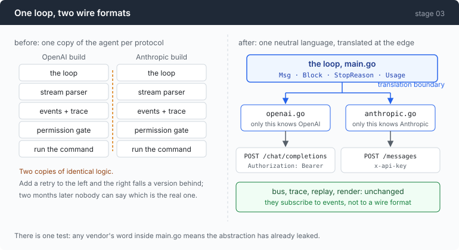
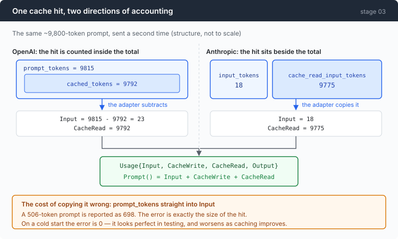

# Stage 03: Babel — one loop that speaks two protocols

[02](../../02-see-everything/doc/README.md) → `03` → [04](../../04-the-cache/doc/README.md) → 05 → 06 → 07 → 08 → 09 → 10 → 11 → 12

> The agent loop is not allowed to contain a vendor's word. That one rule is
> what makes the second protocol an adapter instead of a hundred `if`
> statements — and it is why nothing downstream, not the bus, not the trace, not
> replay, changes by a line.

---

## The problem

The endpoint you have been using goes down, or gets expensive, or the model you
want lives somewhere else. You point the agent at an Anthropic-compatible URL
and it does not work.

Not "works differently". Nothing works. The system prompt is in the wrong place,
so the model has no instructions. Tool definitions are rejected because they
arrive wrapped in a `function` object this API has never heard of. Tool results
come back as `role:"tool"` messages, which this protocol does not have, so the
model never learns what any command printed. The stream is framed with
`event:` lines your parser ignores.

So you copy the agent. Now there are two.

Two weeks later you add a retry to the OpenAI copy and forget the other. Two
months later somebody adds a feature to whichever one they opened first. The
bug you are chasing exists in one of them and you no longer remember which is
the real agent.

The instinct is to hide the difference behind a library. That is the wrong
instinct here for a reason you have already seen once: in stage 02,
`normalise()` reported **698 tokens for a 506-token prompt** because the two
protocols count in opposite directions. Hiding a difference like that does not
remove it, it removes your ability to see it.

---

## The idea

Give the loop a vocabulary of its own, and translate at the outer edge.



Four types are the whole language: `Msg`, `Block`, `StopReason`, `Usage`. The
loop appends `Msg`s, reads `Block`s, branches on `StopReason`, and displays
`Usage`. It never sees `tool_calls`, `stop_reason`, `input_tokens`, or a URL.

The test is mechanical: **grep `main.go` for a vendor's word. If you find one,
the abstraction has already leaked.**

---

## Building it

The code is [`provider.go`](../code/provider.go) (the language),
[`openai.go`](../code/openai.go) and [`anthropic.go`](../code/anthropic.go) (the
two adapters), and [`config.go`](../code/config.go) (which picks one).

### Step 1: count the disagreements before designing anything

Not from the two specifications — from the recorded bytes in
[`external/wire-notes.md`](../../external/wire-notes.md). The specs agree with
each other more than the endpoints do.

| | OpenAI protocol | Anthropic protocol |
|---|---|---|
| system prompt | `messages[0]`, `role:"system"` | a top-level `system` field |
| tool definitions | nested under `{"type":"function","function":{…}}` | flat `{"name","description","input_schema"}` |
| tool call arguments | a JSON **string** | a JSON **object** |
| tool results | one `role:"tool"` message **per call** | all results as blocks in **one `user` message** |
| stop reason | `finish_reason` | `stop_reason`, different values |
| reasoning | `reasoning_content`, a sibling field | a separate indexed content block |
| SSE framing | `data:` only, `[DONE]`, plus a frame after it | `event:` + `data:`, no sentinel, `ping` at both ends |
| where usage lives | a chunk whose `choices` is empty | `message_delta` only; `message_start` is wrong |
| token accounting | `cached_tokens` nested *inside* `prompt_tokens` | cache counters *beside* `input_tokens` |

Nine rows. Two of them — tool results and token accounting — are the ones that
shape the design, and the rest follow. Getting this list before writing any code
is the difference between designing an abstraction and discovering one four
refactors later.

### Step 2: the neutral language has no such thing as a tool message

```go
const (
    RoleSystem    Role = "system"
    RoleUser      Role = "user"
    RoleAssistant Role = "assistant"
)
```

Three roles. There is deliberately no `RoleTool`.

Look at the table row again. One protocol answers a tool call with its own
`role:"tool"` message, one per call. The other answers with `tool_result` blocks
inside a single **user** message. Pick either as the neutral form and you have
smuggled one vendor's design into the core; the other adapter then spends its
life undoing your choice.

So the neutral form has neither. A tool result is a **block**:

```go
func ToolResultBlock(callID, content string) Block {
    return Block{Kind: BlockToolResult, ID: callID, Text: content}
}
```

and what shape of message ends up carrying it is each adapter's business. That
single decision is why this file uses blocks at all:

```go
type Msg struct {
    Role   Role
    Blocks []Block
}
```

### Step 3: tool arguments are stored as raw bytes

```go
Args string
```

A string, not a decoded `map[string]any`, and it is worth being precise about
why — there are two reasons and the second one is expensive.

**Round-tripping.** One protocol sends arguments as a JSON string, the other as
a JSON object. The only representation that survives both without
re-serialising is the raw bytes.

**Caching.** Decode into a map and re-encode, and Go emits the keys in
randomised order, because map iteration order in Go is deliberately not stable.
Different bytes for the same call means a different prompt prefix, which means a
cache miss — on a turn where nothing changed. Stage 04 is about how expensive
that is.

### Step 4: the interface has four methods

```go
type Provider interface {
```

```go
    Protocol() string
```

```go
    Model() string
```

```go
    BuildRequest(system string, msgs []Msg, tools []Tool, maxTokens int) (*http.Request, []byte, error)
```

```go
    ParseStream(r io.Reader, bus *Bus, turn int, started time.Time) (*CallResult, error)
```

Two of those signatures encode a decision.

`BuildRequest` takes `system` as its **own parameter**, separate from `msgs`.
That is the first table row made structural: the protocols disagree about where
the system prompt belongs, and the disagreement must not reach the caller. The
Anthropic adapter goes further and refuses a system message it finds in `msgs`,
loudly, rather than quietly re-labelling it `user` — a quietly re-labelled
system prompt produces a subtly worse agent, which is the hardest kind of bug
to ever notice.

`BuildRequest` also returns the marshalled body alongside the request, because
the caller emits it as `KindRequest`. Reading it back off the request would
mean draining `req.Body` and rebuilding it. And the adapter does not emit the
event itself: giving `BuildRequest` a bus would cost it the property — pure
function, no I/O — that makes both adapters testable.

Then there is the field on the result that looks redundant and is not:

```go
RawStop string
```

The provider's literal stop string, kept beside the normalised value and written
into the trace. On this gateway a tool call truncated at `max_tokens` comes back
with `stop_reason: "tool_use"` and an unusable body — **the envelope lies.**
When a session goes wrong, the normalised value tells you what the agent
believed and `RawStop` tells you what it was told. The gap between them is the
bug.

Never normalise away your only evidence.

Normalisation itself has one rule worth stating:

```go
func normaliseStop(raw string) StopReason {
```

```go
    default:
        return StopUnknown
    }
```

Unknown strings map to `StopUnknown`, and the loop **reports** them instead of
carrying on. A state machine that maps anything unrecognised to "probably fine"
will eventually map a refusal, a quota event, or a new safety stop to "probably
fine".

### Step 5: the four shape disagreements, on the wire

The system prompt's home, the shape of a tool result, the framing of the stream,
and what the stop reason is called. Each of them is a place where the obvious
code is wrong in a way that does not raise an error.

That is [part 1](1-on-the-wire.md), with the recorded frames.

### Step 6: token accounting runs in opposite directions



The same cache hit, reported two ways.

OpenAI puts the hit **inside** the total, so the adapter subtracts:

```go
input := u.PromptTokens - cached
if input < 0 {
    input = 0
}
```

Anthropic puts it **beside** the total, so the adapter copies:

```go
func (u anthropicUsage) normalise() Usage {
    return Usage{
        Input:      u.InputTokens,
        CacheWrite: u.CacheCreationInputTokens,
        CacheRead:  u.CacheReadInputTokens,
        Output:     u.OutputTokens,
```

Same struct, opposite arithmetic. And each mistake has its own shape: subtract
on the OpenAI side and you get the right answer; subtract on the Anthropic side
and every warm call reports a **negative** prompt. Copy on the OpenAI side and a
506-token prompt reads as 698.

This is where `Usage`'s design pays off, and it is worth being exact about what
paid off. The struct did survive the second protocol without a field changing —
because its names describe *meaning* (billed at full price, written to cache,
read from cache) rather than any vendor's field name. But the naming is not
where the work was. **The work was in the two normalisers, and they are
inverses of each other.**

### Putting it together

Choosing a provider is thirteen lines, and they are the only lines in the
repository that map a protocol name onto an implementation:

```go
switch c.Protocol {
case "openai":
    return newOpenAIProvider(base, key, c.Model), nil
case "anthropic":
    return newAnthropicProvider(base, key, c.Model), nil
default:
    return nil, fmt.Errorf("unknown protocol %q", c.Protocol)
}
```

Configuration is a small JSON file, with one field worth pointing at:

```go
APIKeyEnv string `json:"api_key_env"`
```

The name of an environment variable. **The key itself has nowhere to sit in the
file at all** — a config file gets committed eventually, every one of them does,
and the only defence that works is not having a field for the secret.

The environment-variable path from stages 00–02 still works with no config file,
because making the simple case require a config format is how tools become
annoying.

---

## Run it

```json
{
  "default": "oai",
  "providers": {
    "oai": {"protocol": "openai", "base_url": "…", "api_key_env": "AGENT_API_KEY",
            "model": "…", "window": 131072},
    "ant": {"protocol": "anthropic", "base_url": "…", "api_key_env": "AGENT_API_KEY",
            "model": "…", "window": 200000}
  }
}
```

```sh
go build -o agent ./03-babel/code
cd sandbox && set -a && . ../.env && set +a

../agent --provider oai --trace oai.jsonl
> count the .py files here

../agent --provider ant --trace ant.jsonl
> count the .py files here
```

Then compare the two recordings:

```sh
jq -r .kind oai.jsonl | uniq | tr '\n' ' '
jq -r .kind ant.jsonl | uniq | tr '\n' ' '

jq -r 'select(.kind=="request") | .request | keys | join(",")' oai.jsonl | head -1
jq -r 'select(.kind=="request") | .request | keys | join(",")' ant.jsonl | head -1
```

**What to watch for:** the first pair of lines should be identical. The second
pair should share almost nothing. That gap is the entire chapter.

Then, for the property that only exists because of the event bus:

```sh
env -u AGENT_API_KEY ../agent --replay ant.jsonl
```

An Anthropic-protocol session replays with no key and no provider configured at
all — because what was recorded was events, not wire format.

---

## Measured

Same task, same binary, both protocols. Collapsed event-kind sequences:

```
user_message turn_start request first_token reasoning_delta tool_call_start
tool_args_delta usage response_end tool_call_ready gate_verdict command_start
command_end tool_result turn_start request first_token reasoning_delta
text_delta usage response_end turn_end
```

**Identical, item for item, on both.** The loop genuinely did not know.

The request bodies share nothing beyond the basics:

| | keys sent |
|---|---|
| openai | `max_tokens, messages, model, stream, stream_options, tools` |
| anthropic | `max_tokens, messages, model, stream, system, tools` |

And one wire fact worth keeping: on the Anthropic stream, `message_start`
reports **input_tokens 56** for a request whose real figure, from
`message_delta`, is **291**. The first usage report on that protocol is simply
wrong, and a parser that latches the first one it sees will under-report every
call.

### An observation that cuts against this chapter

The panels from those two identical runs are not identical:

```
openai    / mimo-v2.5     in 579   full 131 · write 0 · read 448
anthropic / qwen3.7-plus  in 592   full 592 · write 0 · read 0
```

Same size of conversation. The Anthropic arm cached **nothing**, because that
protocol caches only when you ask it to, and `cache_control` does not arrive
until stage 04.

So the abstraction worked, and what it successfully hid from the loop was a
100%-versus-0% difference in caching — the most expensive fact in the run. An
abstraction that hides the wire is doing its job. It is also, by construction,
hiding the thing you most need to see, which is why the instrument panel from
stage 02 sits *outside* it and reads normalised numbers rather than wire ones.

---

## Next

The bar on that panel says `read 0` for one of the two runs, and that is not a
detail. It means every token of a nine-thousand-token prompt was billed at full
price on every turn.

Stage 00 measured the re-send tax at 4.2×; stage 02 corrected it to 3.7× and
showed that 78% of it was already being served from cache — on the protocol
where caching is implicit. On the other one, nothing is cached until the request
says so.

[Stage 04](../../04-the-cache/doc/README.md) is about what that costs, what
turns caching on, and the discipline it demands of everything you put in a
prompt: one byte changed near the front, and the whole prefix is billed again.
