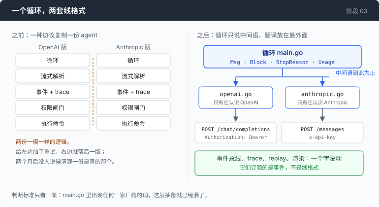
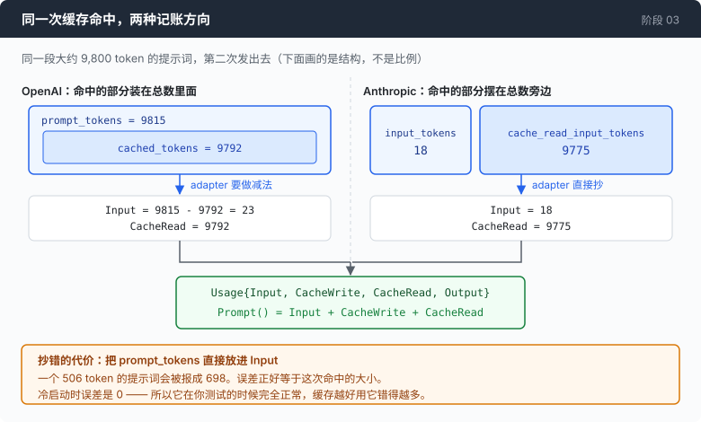

# 阶段 03：巴别塔 —— 让同一个循环说两种协议

[00](../../00-loop/doc/README_zh.md) → 01 → 02 → `03` → [04](../../04-the-cache/doc/README_zh.md) → 05 → 06 → 07 → 08 → 09 → 10 → 11 → 12

> 加一种协议，不许改循环。这一章结束的时候，`main.go` 里不会剩下任何一家厂商的词。

---

## 问题

你手上的 agent 已经很像样了。它一边生成一边往外吐字，每一次工具调用、每一条命令、每一次计费都记在一份 JSONL 里，出了问题可以离线回放一遍。

然后你拿到一个新的接口地址和一把 key。可能是因为新模型更适合你的任务，可能是因为原来那家在你这边不稳定，也可能只是因为这把 key 是别人给你的。你把地址填进去，跑。

第一个请求没成，路径不对：对面的接口不叫那个名字。

改掉路径，再跑。401。认证头不对，对面不收你发的那种。

改掉认证头，再跑。这次通了，但模型完全不知道自己是个 agent —— 你写的那一大段系统提示词整段消失了。原因是对面根本不把它当成一条消息，它是请求体上一个单独的顶层字段。

把系统提示词挪对位置，模型开始要工具了。你把命令跑完，把输出发回去，对面报错，说有一个工具调用没有对应的结果。可你明明回了，只是形状不对：这一家不接受一条一条分开的工具结果，它要你把这一轮所有结果塞进同一条消息里。

改到这里你就该发现，你不是在"改几个字段"。你是在用另一套语法把同一段逻辑重写一遍，而且流式怎么分帧、token 怎么记账、停止原因叫什么名字，这三样都还没开始改。

这时候最省事、也最常见的做法是：把 `main.go` 复制一份，一份连旧的，一份连新的。当天下午就能跑起来。

一个月后你给第一份加了失败重试。两个月后第二份多了一段处理截断的逻辑。两份都还能跑，但它们已经不是同一个 agent 了，而且你没法回答一个很基本的问题：这两份里哪一份是真的那一份。

**你要的是一个 agent 会两种语言，不是两个 agent 各会一种。**

---

## 办法



循环只说一套自己的词：一条消息是 `Msg`，消息里的每一块内容是 `Block`，停下来的原因是 `StopReason`，token 账目是 `Usage`。两个 adapter 各认识一种线格式，在最外面把这套词翻译出去、再翻译回来。

| 谁 | 说什么 | 知道对面是谁吗 |
|---|---|---|
| 循环 `main.go` | 中间语 | 不知道 |
| `openai.go` / `anthropic.go` | 中间语 ↔ 自己那一种线格式 | 只知道自己那一半 |
| 渲染、trace、replay | 事件 | 不知道 |

验收标准只有一条，而且可以直接 grep：`main.go` 里不许出现 `tool_calls`、`finish_reason`、`input_tokens` 这类词。漏出去一个，第二种协议就不再是一个 adapter，而是一个 `if`；然后是一百个 `if`。

---

## 怎么做的

代码在 [`03-babel/code/`](../code/)。

### 第 1 步：先把分歧数清楚

设计中间语之前得先知道要调和的是什么。下面每一行都是在线上抓到的，不是从文档上抄的，原始记录在 [`external/wire-notes.md`](../../external/wire-notes.md)：

| | OpenAI 协议 | Anthropic 协议 |
|---|---|---|
| 系统提示词 | `messages[0]`，角色 `system` | 顶层的 `system` 字段 |
| 工具定义 | 套在 `{"type":"function","function":{…}}` 里，模式叫 `parameters` | 平铺的三个字段，模式叫 `input_schema` |
| 工具调用参数 | 一个装着 JSON 的**字符串** | 一个 JSON **对象** |
| 工具结果 | 每个结果一条 `role:"tool"` 消息 | 所有结果放进**同一条** `user` 消息 |
| 停止原因 | `finish_reason`：tool_calls / stop / length | `stop_reason`：tool_use / end_turn / max_tokens |
| 思考过程 | `reasoning_content`，和正文在同一个 delta 里 | 一个独立编号的内容块，`thinking_delta` |
| SSE 分帧 | 只有 `data:`，有 `[DONE]` 哨兵，**哨兵后面还有一帧** | `event:` + `data:`，没有哨兵，`ping` 在 `message_start` **之前**和 `message_stop` **之后**各一个 |
| usage 在哪一帧 | 一个 `choices` 是**空数组**的帧 | 只在 `message_delta`；`message_start` 上那个是错的 |
| token 记账 | `prompt_tokens` 是总数，`cached_tokens` 嵌在**里面** | `input_tokens` 是**没命中的余数**，缓存计数**摆在旁边** |
| 缓存控制 | 只有隐式的，按 64 token 一块对齐，每次结果不一样 | `cache_control` 钉住精确的前缀 |

十行分歧里只有最后两行直接关于钱，而它们恰好是最容易抄错的两行。

### 第 2 步：中间语里没有"工具消息"这个东西

第一个诱惑是照着自己最熟的那种协议来定中间语。既然 OpenAI 那边工具结果是一条 `role:"tool"` 的消息，那中间语里就加一个 `RoleTool`，让 Anthropic 那个 adapter 负责把这些消息重新收拢成一条。

反过来同样成立：中间语按 Anthropic 来定，让 OpenAI 那边负责拆开。

两种都能跑，两种都把一家的设计偷渡进了内核。所以中间语两种都不选：

```go
const (
	RoleSystem    Role = "system"
	RoleUser      Role = "user"
	RoleAssistant Role = "assistant"
)
```

三个角色，没有第四个。一条工具结果不是一条消息，它是一**块**内容：

```go
func ToolResultBlock(callID, content string) Block {
	return Block{Kind: BlockToolResult, ID: callID, Text: content}
}
```

至于这块内容最后被装进什么形状的消息里，由 adapter 决定。这也是中间语用"块"而不是用"一段正文字符串"的唯一理由。

### 第 3 步：工具参数存成原始字节

```go
type Block struct {
	Kind BlockKind

	Text string
// ...
	ID   string
	Name string // tool name, on BlockToolCall

	// Args is the tool call's arguments as a raw JSON string.
	Args string
}
```

`Args` 是一个字符串，里面装着 JSON，不是 `map[string]any`。存成 map 是更"干净"的写法，第一次写的时候没有任何东西会提醒你它不对。

问题出在两件事叠在一起：一边的协议要一个字符串，另一边要一个对象；而每一轮都要把整段历史重发一遍。存成 map 就意味着每一轮都要把同一个工具调用重新序列化一次，而 `encoding/json` 会把 map 的键排序 —— 模型原本写出来的顺序留不住。

字节一变，前缀就对不上。为什么"对不上"要花钱，第 04 章会给出数字。原始字节是唯一一种在两边都不需要动、因此也不会被动坏的形式。

### 第 4 步：接口只有四个方法

```go
type Provider interface {
	Protocol() string
	Model() string
	BuildRequest(system string, msgs []Msg, tools []Tool, maxTokens int) (*http.Request, []byte, error)
	ParseStream(r io.Reader, bus *Bus, turn int, started time.Time) (*CallResult, error)
}
```

`BuildRequest` 单独收一个 `system` 参数，因为两种协议对"系统提示词该放哪儿"的答案不一样，中间语没办法替它们选一个 —— 选了哪个都是偷渡。

它同时返回 `*http.Request` 和请求体的字节。后者是给请求检查器和 trace 用的：想知道模型到底看到了什么，就得是真正发出去的那串字节，而不是把同一个结构体再序列化一遍的结果，那两者可以不一样。

还有一件这个接口里看不见但很重要的事：两个 adapter 都不持有 `*http.Client`，也不做任何 I/O。超时、代理、连接池对两种协议是同一套策略，属于调用方；每个 adapter 各建一个 client，就是两个地方要记得设超时。副作用是这两个 adapter 纯到可以拿一个 `strings.Reader` 驱动 —— 所以它们的测试不需要网络，也不需要 key。

### 第 5 步：往线上落的四处形状分歧

中间语到这里定完了。剩下的活是把它落到两条真实的线上，而这两条线在四个地方形状对不上：系统提示词放哪儿、工具结果长什么样、SSE 怎么分帧、停止原因叫什么名字。

这四处一步一步都在 [**`1-on-the-wire_zh.md`**](1-on-the-wire_zh.md)，形式和这里一样。它们全部关在两个 adapter 文件里，循环一处都看不见。

只有 token 账目留在这里讲，因为它是循环唯一会读的那一半 —— 也是这一章里唯一直接变成钱的那一半。

### 第 6 步：token 账目的方向是反的



OpenAI 那边 `prompt_tokens` 是总数，命中缓存的部分嵌在它里面。而这个仓库里 `Usage.Input` 的意思是"按全价计费的那一部分"，所以要把命中的减出去：

```go
func (u sseUsage) normalise() Usage {
	cached := u.PromptTokensDetails.CachedTokens
// ...
	input := u.PromptTokens - cached
	if input < 0 {
		input = 0
	}

	return Usage{
		Input:     input,
		CacheRead: cached,
		Output:    u.CompletionTokens,
		Reasoning: u.CompletionTokensDetails.ReasoningTokens,
	}
}
```

Anthropic 那边正好相反：`input_tokens` 只是没命中的余数，缓存计数摆在它旁边。这边什么都不用做：

```go
func (u anthropicUsage) normalise() Usage {
	return Usage{
		Input:      u.InputTokens,
		CacheWrite: u.CacheCreationInputTokens,
		CacheRead:  u.CacheReadInputTokens,
		Output:     u.OutputTokens,
	}
}
```

两边最后汇进同一个加法：

```go
func (u Usage) Prompt() int { return u.Input + u.CacheWrite + u.CacheRead }
```

把上面那个减法省掉会怎样：线上抓到过一帧 `prompt_tokens` 是 506、`cached_tokens` 是 192，直接抄进去，`Prompt()` 会报出 698。误差正好等于这次命中的大小，所以冷启动的第一个请求误差是 0 —— 你测试的时候它完全正常，而你的缓存越好用，它错得越多。

这一步值得单独说一句。`Usage` 这个结构体从第 02 章一路活到现在，一个字段都没改。但**它能活下来靠的不是名字起得准，靠的是每个 adapter 里那段方向相反的算术**。真正的工作量在归一化，不在命名。

### 拼起来

从协议名字到具体实现的映射，全仓库只有这一处：

```go
func (c providerConfig) build() (Provider, error) {
	key := os.Getenv(c.APIKeyEnv)
	if key == "" {
		return nil, fmt.Errorf("environment variable %s is empty", c.APIKeyEnv)
	}
	base := strings.TrimSuffix(c.BaseURL, "/")
	switch c.Protocol {
	case "openai":
		return newOpenAIProvider(base, key, c.Model), nil
	case "anthropic":
		return newAnthropicProvider(base, key, c.Model), nil
	default:
		return nil, fmt.Errorf("unknown protocol %q", c.Protocol)
	}
}
```

函数体 13 行。这就是"多支持一种协议"在调用方这一侧的全部代价。顺便说一句配置里那个字段：它叫 `api_key_env`，存的是环境变量的名字，不是 key 本身 —— 配置文件迟早会被提交上去，每一个都会，唯一可靠的防线是让密钥在文件里根本没有位置可放。

而循环这一头，一次模型调用长这样：

```go
func call(p Provider, httpc *http.Client, bus *Bus, turn int, msgs []Msg) (*CallResult, error) {
	req, body, err := p.BuildRequest(systemPrompt, msgs, []Tool{bashToolDef()}, 4096)
	if err != nil {
		return nil, err
	}
// ...
	return p.ParseStream(resp.Body, bus, turn, started)
}
```

一个协议的名字都没有。检验这层抽象好不好，不是看它编不编得过，而是看**加上第二种实现之后，上面这段有没有改**。它没改：你现在读的这个循环就是第 02 章那个，只是把词换掉了。

---

## 跑一下

```sh
go build -o agent ./03-babel/code

mkdir -p sandbox && cd sandbox
set -a && . ../.env && set +a
../agent --providers ../providers.json --list-providers
```

会列出配置好的几个 provider，带星号的是默认的那个。然后同一个问题问两遍，一遍走一种协议：

```sh
../agent --providers ../providers.json --provider opencode-oai --trace oai.jsonl
../agent --providers ../providers.json --provider opencode-ant --trace ant.jsonl
```

两次都问同一句：`数一下这个目录下有几个 .py 文件`。

**观察重点：**

- 屏幕上两次输出的形状是一样的。一样的命令提示，一样的仪表面板，一样的收尾方式。你看不出来底下换了协议。
- 加 `--show-request` 再各跑一次。这一次两边完全不一样：顶层字段名不同，工具定义的嵌套层数不同，系统提示词的位置不同。翻译发生在这里，也只发生在这里。
- 比一比两份 trace 的事件序列，`jq -r .kind oai.jsonl` 和 `jq -r .kind ant.jsonl`。
- 最后回放那份 Anthropic 的 trace：`../agent --replay ant.jsonl --speed 0`。它不需要 key，不需要网络，甚至不需要配置任何 provider —— 因为录下来的是事件，不是线格式。

---

## 量一量

同一个问题、同一个二进制、两种协议各跑一次，下面是 agent 自己打出来的仪表行：

```
openai    / mimo-v2.5     in 579   full 131 · write 0 · read 448
anthropic / qwen3.7-plus  in 592   full 592 · write 0 · read 0
```

两份 trace 的事件种类序列，把连续重复的折叠掉之后，**逐项相同**：

```
user_message turn_start request first_token reasoning_delta tool_call_start
tool_args_delta usage response_end tool_call_ready gate_verdict command_start
command_end tool_result turn_start request first_token reasoning_delta
text_delta usage response_end turn_end
```

而同样这两次调用，请求体的顶层字段名除了最基本的那几个之外，没有一个是共同的：

| | 顶层字段 |
|---|---|
| openai | `max_tokens, messages, model, stream, stream_options, tools` |
| anthropic | `max_tokens, messages, model, stream, system, tools` |

选实现的那段代码：函数体 13 行。

### 一个和本章结论相反的观察

回头看上面那两行仪表读数，最右边不一样。

`read 448` 对 `read 0`。走 OpenAI 协议那一次，579 个 prompt token 里有 448 个是从缓存里读出来的；走 Anthropic 协议那一次，592 个全部按全价算。

这一章想证明的是"两条路径在循环看来完全一样"，而这两行说明：**它们看起来一样，账不一样。** 抽象成功地把"有缓存"和"完全没有缓存"这个差别挡在了循环外面，而这是这两次运行里最贵的一件事。

差别本身有解释。OpenAI 那边的缓存是隐式的，默认就开；Anthropic 那边只有你明确要求才缓存，而这一章里 `system` 还是一个普通字符串，挂不上任何标记。所以这不是 bug，是这一章故意没做的事。

但它说明：抽象层挡住的东西里，有一些是你必须看见的。这个仓库处理它的办法是仪表面板 —— `full / write / read` 三个数一直摆在每一次调用下面，哪一列突然没了，你当场就能看见，而不是月底看账单。

---

## 接下来

现在这个 agent 会两种协议了，换一家服务商是配置文件里改一个词。

而第 00 章那张表上的数字，一个都没动。

那次会话一共为 **4982 个 prompt token 付了钱**，而对话本身最后只有 **1192 个 token**，多付了 4.2 倍。原因还是第 00 章第 1 步那句话：每次请求都要把整个数组重新发一遍。而且它是二次增长的 —— 一段 40 轮的会话，第 1 轮的内容会被付费 40 次。

这一章没有改变这件事的任何一点。它只是让你可以在两种协议上以同样的方式多花钱。

[阶段 04](../../04-the-cache/doc/README_zh.md) 处理这个问题：如果重发的那一段字节和上一次一模一样，能不能不要再按全价算一遍。
