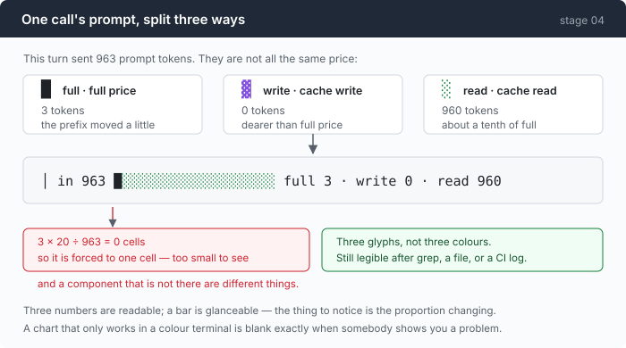

# Stage 04 · part 1: the instrument

[← back to stage 04](README.md)

> Twenty cells and three glyphs. It is the smallest thing in this repository and
> nothing in the last chapter could have been established without it.

---

## The problem

You have added cache markers. Did they work?

The API will not tell you. It returns 200 whether or not a marker took effect,
and there is no field that says "your breakpoint was ignored". What you get
instead is three token counts, buried in a usage object, that you have to
interpret.

And the number people reach for is the wrong one. "Prompt tokens" is a single
figure on one protocol and a partial figure on the other, so a warm call can
honestly report `input_tokens: 18` for a prompt of eighteen thousand. Compute a
hit rate against that and you will get something close to 100% no matter what
you do — including when caching is completely broken.

The turn where the cache dies looks exactly like every other turn, until the
invoice arrives.

---

## The idea

Three numbers, in the proportion you are being billed in, on every call.



| | glyph | roughly |
|---|---|---|
| full price | `█` | 1× |
| cache write | `▓` | 1.25× |
| cache read | `░` | 0.1× |

The bar is not decoration for the numbers next to it. Three numbers are
readable; a bar is *glanceable*, and the thing you need to notice is a **change
in proportion between turns**. When the reads vanish, something you did two
turns ago invalidated a prefix, and you want to see that on the turn it happens.

---

## Building it

The code is in [`render.go`](../code/render.go).

### Step 1: three numbers, not one

```go
r.p("  %s in %s %s  %s\n",
    r.c(cDim, "│"),
    pad(fmt.Sprint(prompt), 6),
    bar,
    r.c(cDim, fmt.Sprintf("full %d · write %d · read %d%s", u.Input, u.CacheWrite, u.CacheRead, hitRate(*u))))
```

`prompt` is `Usage.Prompt()` — input plus write plus read — never the raw
`Input` field. Stage 02 explained why; here is the same point as an assertion:

```go
u := Usage{Input: 18, CacheRead: 17967}
if u.Prompt() != 17985 {
```

Eighteen versus 17,985. Reading `Input` as the prompt size under-reports a warm
call by about 1000×, and it does so plausibly.

### Step 2: twenty cells, in proportion

```go
func (r *renderer) cacheBar(u Usage) string {
    const width = 20
    total := u.Prompt()
```

Twenty is chosen so the bar fits beside the numbers on an 80-column terminal and
still resolves 5% differences. It is not a chart; it is a gauge.

### Step 3: a non-zero component may not render as nothing

```go
cells := func(n int) int {
    if n == 0 {
        return 0
    }
    c := n * width / total
    if c == 0 {
        c = 1 // never let a non-zero component render as nothing
    }
    return c
}
```

Three tokens out of 963 is 0.06 of a cell, which rounds to zero.

But **"too small to see" and "not there at all" are different facts**, and on
this particular gauge the difference is the whole point: `full 3` means the
prefix moved slightly, `full 0` means it did not move at all. Forcing a
non-zero component to one cell keeps that distinction visible.

Then the total has to come back to twenty, and the full-price cells are the ones
that give way:

```go
full, write, read := cells(u.Input), cells(u.CacheWrite), cells(u.CacheRead)
for full+write+read > width && full > 0 {
    full--
}
```

### Step 4: three **glyphs**, not three colours

```go
return r.c(cFull, strings.Repeat("█", full)) +
    r.c(cWrite, strings.Repeat("▓", write)) +
    r.c(cRead, strings.Repeat("░", read)) +
    strings.Repeat(" ", max(0, pad))
```

This shipped first as one glyph in three colours, and it was **blank** the
moment output passed through `grep`, into a file, or into a CI log — because
`colorEnabled` correctly refuses to emit ANSI to a pipe.

Which is to say it was blank in exactly the situation the instrument exists for.
Nobody pastes a screenshot of a healthy session; they pipe a broken one into a
file and send it to you.

`█ ▓ ░` survive all of that, and survive a colour-blind reader too. Colour is
still there, and it is now redundant rather than load-bearing.

### Step 5: when there has been no call at all

```go
if total == 0 {
    return r.c(cDim, strings.Repeat("·", width))
}
```

Dots, not an empty bar and not zeroes. "Nothing has happened yet" and "everything
was full price" must not look the same — that is the same rule as step 3, one
level up.

### Step 6: the last line of the session is stage 00's table

```go
r.p("  prompt tokens billed: %d  (full %d · write %d · read %d)\n",
    r.session.Prompt(), r.session.Input, r.session.CacheWrite, r.session.CacheRead)
```

```go
r.p("  %s\n", r.c(cDim, fmt.Sprintf("re-send ratio: %.1fx (billed %d for a final context of %d)",
    float64(r.session.Prompt())/float64(finalPrompt), r.session.Prompt(), finalPrompt)))
```

That ratio is the 4.2× from stage 00's hand-counted table, printed by the agent
itself at the end of every session. The point of an instrument is that a number
somebody once worked out by hand becomes a number that is simply there.

---

## Run it

```sh
go build -o agent ./04-the-cache/code
cd sandbox && set -a && . ../.env && set +a
../agent --provider ant --yolo
> read big.log and summarise the failures
```

Then the same session with the bar going the other way:

```sh
../agent --provider ant --yolo --break-cache
```

And prove step 4 to yourself:

```sh
../agent --provider ant --yolo -p "count the go files here" | tee run.txt
cat run.txt
```

**What to watch for:**

- Turn 2 of the first run: a bar that is nearly all `▓`. That is the write, and
  it is the most expensive turn in the session.
- Turn 3 onward: nearly all `░`, and `full 6`.
- With `--break-cache`: `▓` forever, never a `░`. Same code, same markers.
- In `run.txt`: the bar is still there, in plain text, with no colour. That is
  the difference between an instrument and a decoration.

---

## Next

The bar shows you where the prompt tokens went. The number in front of it —
`in 11276` — only goes up.

[Back to the chapter](README.md) for what that costs, and then
[stage 05](../../05-live-forever/doc/README.md) for what happens when it reaches
the end of the window.
