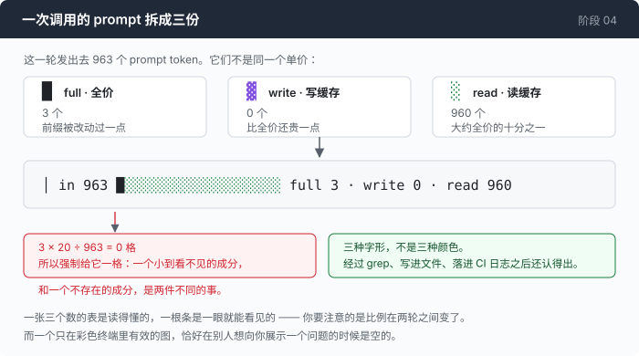

# 阶段 04 · 那个仪表

[00](../../00-loop/doc/README_zh.md) → 01 → 02 → [03](../../03-babel/doc/README_zh.md) → `04` → [05](../../05-live-forever/doc/README_zh.md) → 06 → 07 → 08 → 09 → 10 → 11 → 12

> [回到本章主线](README_zh.md)。这一篇是主线第 6 步展开：缓存装好了，但你还看不见它。

---

## 问题

前面五步之后，缓存记号都放对了位置。你跑一遍，屏幕上和昨天一模一样。

这个功能有一个很坏的性质：**它工作和它不工作，从外面看是一样的。**

答案是对的，命令跑通了，没有报错，没有慢下来。唯一的区别是账单，而账单在月底，而且到那时候你也说不清是哪一段会话干的。

更糟的是这一章的下半部分要靠数字说话 —— 主线的「量一量」有三条臂、一张对照表，还有一个"本章输给了自己的对照组"的结论。那些数字得从某个地方读出来。而现在没有任何地方可以读。

所以在测量之前，得先有仪表。

---

## 办法

每次调用之后，把这次的 prompt 拆成三份印出来：全价的、写进缓存的、从缓存读的。



一张三个数的表是**读得懂的**；一根条是**一眼就能看见的**。而你想注意到的东西恰好是"这一轮和上一轮的比例变了" —— 那种变化在数字里要对比着看，在条里是形状突然不对。

```
│ in 963    █░░░░░░░░░░░░░░░░░░░  full 3 · write 0 · read 960  100% cached
```

条和数字都印。条负责让你扫一眼就发现不对，数字负责让你把不对写进 issue 里。

---

## 怎么做的

### 第 1 步：三个数，不是一个

第 03 章那个 `Usage` 已经把三样东西分开存了，因为两个协议的记账方向是反的，归一化的时候必须分开。这里直接受益：

```go
	r.p("  prompt tokens billed: %d  (full %d · write %d · read %d)\n",
		r.session.Prompt(), r.session.Input, r.session.CacheWrite, r.session.CacheRead)
```

三个数不能合成一个，因为它们的**单价不一样**。缓存读大约是全价的十分之一，缓存写比全价还贵一点。一个把它们加起来的"prompt tokens"数字，在缓存开始工作之后就不再有任何意义 —— 它会在你省了钱的时候变大。

### 第 2 步：二十格，按比例

```go
func (r *renderer) cacheBar(u Usage) string {
	const width = 20
	total := u.Prompt()
```

二十格是一个刻意压小的数字。这根条要和 `in 963`、`full 3 · write 0 · read 960` 挤在同一行里，而那一行还要能塞进一个八十列的终端。

### 第 3 步：非零的成分不许画成零格

```go
	cells := func(n int) int {
		if n == 0 {
			return 0
		}
		c := n * width / total
		if c == 0 {
			c = 1 // never let a non-zero component render as nothing
		}
		return c
	}
```

`963` 个 token 里有 `3` 个是全价的。按比例算，`3 * 20 / 963` 是 `0`。

如果就这么画，那根条会是纯粹的 `░░░░░░░░░░░░░░░░░░░░`，看起来像"这一轮完全免费"。而它不是 —— 它有三个全价 token，而这三个恰恰是最值得看见的东西：它们说明前缀在这一轮被改动过一点点。

一个成分小到看不见，和一个成分不存在，是两件不同的事。这一行代码就是不让它们长得一样。

### 第 4 步：三种**字形**，不是三种颜色

这一步是第一版做错、然后被迫改掉的。

第一版是同一个字符 `█` 配三种颜色：全价一种色，缓存写一种，缓存读一种。在终端里很漂亮。

然后它被这样用了一次：

```sh
../agent -p "..." | grep 'in '
```

颜色没了。剩下二十个一模一样的 `█`，那根条什么都不说了。同样的事发生在把输出重定向进文件的时候，发生在 CI 的日志里，也发生在一个红绿色盲的读者面前。

而这三种场合，恰好是**人们真正会去看 agent 输出的场合** —— 你不会盯着终端看一个小时，你会把它存下来、grep 它、或者贴给别人。

改完之后是三个不同的字形：

```go
	// Three different GLYPHS, not just three colours. The bar has to survive
	// `| grep`, a file, a CI log and a colour-blind reader — all of which are
	// how people actually look at agent output. A chart that only works in a
	// colour terminal is a chart that is blank exactly when someone is trying
	// to show you a problem.
	return r.c(cFull, strings.Repeat("█", full)) +
		r.c(cWrite, strings.Repeat("▓", write)) +
		r.c(cRead, strings.Repeat("░", read)) +
		strings.Repeat(" ", max(0, pad))
```

颜色留着，因为在终端里它确实更快。但颜色是**加强**，不是信息本身。去掉颜色之后 `█▓░` 依然分得清，这才是这根条能用的条件。

这件事值得从这一章抽出来记一句，因为它是一个通用的判据：**一个仪表，要在别人试图向你展示一个问题的时候还能读。** 那个时刻通常不在一个彩色终端里。

### 第 5 步：一次调用都没有的时候，画点

```go
	if total == 0 {
		return r.c(cDim, strings.Repeat("·", width))
	}
```

不是画二十个空格。空白和"这个仪表坏了"长得一样，而二十个点在说"我在，只是还没有东西可报"。

### 第 6 步：会话结束那一行，就是第 00 章那张表

```go
// SessionSummary prints the totals. The line that matters is the last one:
// tokens billed versus the size of the conversation that produced them. Stage
// 00's docs recorded that ratio at 4.2x with no caching; this is where you
// watch it move.
```

第 00 章末尾那张表算出一个比值：为 4982 个 prompt token 付了钱，而对话最后只有 1192 个，多付 4.2 倍。当时那是一个只能手工加出来的数字。

现在它是每场会话最后自动印出来的一行。这一章真正交付的东西不是缓存记号，是**这个比值从此可以被看着变**。

主线那三条臂之所以能比，也只是因为这一行存在。

---

## 跑一下

```sh
go build -o agent ./04-the-cache/code
cd sandbox && set -a && . ../.env && set +a

../agent -p "读一遍这个目录里的每个文件，然后说说这是个什么项目"
```

**观察重点：**

- 第一次调用那根条几乎全是 `█`（全价）或者 `▓`（缓存写）。第二次开始 `░` 应该占大部分。
- 把同一条命令的输出 `| cat` 一下再看那根条。`█▓░` 三种形状都还在，只是没有颜色了 —— 这就是第 4 步。
- 加上 `--break-cache` 再跑一遍。`░` 应该基本消失。这是主线第 5 步那两个开关里的一个，它存在的唯一目的就是让你看见"没有缓存"长什么样。
- 会话末尾那一行的两个数字：billed 和 final。它们的比值就是第 00 章那个 4.2 倍，现在你可以直接读到它。

---

## 接下来

仪表有了，接下来才能谈数字。

回到主线：[量一量](README_zh.md#量一量) —— 三条臂，以及这一章为什么输给了它自己的对照组。
