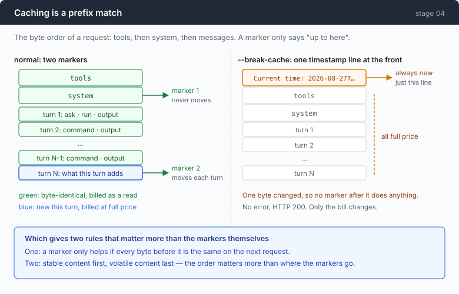
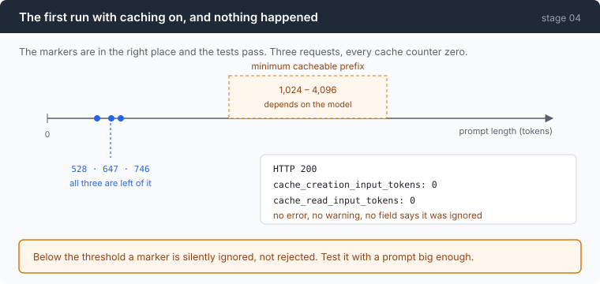
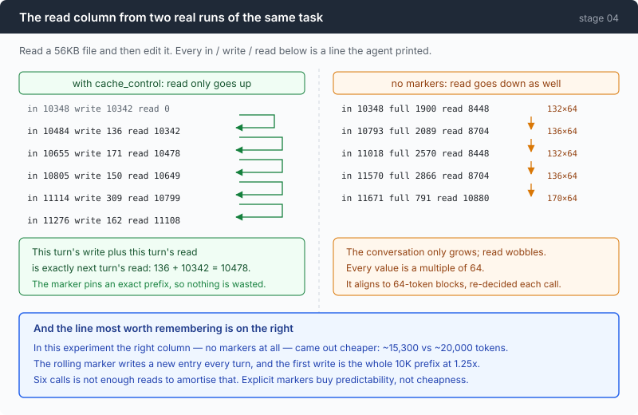

# Stage 04: The Cache — not paying full price for the same history twice

[03](../../03-babel/doc/README.md) → `04` → [05](../../05-live-forever/doc/README.md) → 06 → 07 → 08 → 09 → 10 → 11 → 12

> Forty lines of code, one measurement that goes the way you expect, and one
> that does not. This chapter's own feature loses to its own control arm, and
> the reason it loses is more useful than the feature.

---

## The problem

Stage 00 measured it and stage 02 refined it: every request re-sends the whole
conversation, so a six-turn session pays for **4982 prompt tokens** to hold a
1192-token conversation.

Now make the numbers realistic. The agent reads one 56KB file — an ordinary
thing to ask — and that file is about 10,000 tokens. From then on, every request
carries those 10,000 tokens again. Six turns later you have sent 60,000 tokens
to have one conversation about one file.

The model is not re-reading it in any useful sense. Nothing about those tokens
changed. You are paying full price for bytes the provider saw ninety seconds
ago.

Stage 03 ended with the panel showing this directly, on two protocols:

```
openai    / mimo-v2.5     in 579   full 131 · write 0 · read 448
anthropic / qwen3.7-plus  in 592   full 592 · write 0 · read 0
```

One of those arms was getting most of its prompt at a tenth of the price. The
other was paying full price for every token, every turn, because that protocol
caches only what you explicitly ask it to cache — and nothing in stage 03 asked.

---

## The idea

A cache marker says: *everything up to here is a reusable prefix.*



That word **prefix** is the whole chapter, and it has two consequences that
matter more than the markers do:

1. A marker only helps if **every byte before it** is identical on the next
   request.
2. A byte that changes early invalidates every marker after it. So the ordering
   of stable content before volatile content matters more than where you put the
   markers.

The rendered prompt is `tools`, then `system`, then `messages`. Two markers is
what an agent actually needs: one frozen over tools + system for the whole
session, one that rolls forward to the newest turn.

---

## Building it

The code is [`anthropic.go`](../code/anthropic.go), and it is about forty lines.
The instrument that makes any of it visible is [part 1](1-the-instrument.md).

### Step 1: a string cannot carry a marker

Stage 03 sent the system prompt as a plain string. This chapter's first change
is a type:

```go
System []anthropicContent `json:"system,omitempty"`
```

An array of blocks. The protocol accepts both shapes, and only one of them has
somewhere to attach this:

```go
CacheControl *anthropicCacheControl `json:"cache_control,omitempty"`
```

```go
func ephemeral() *anthropicCacheControl { return &anthropicCacheControl{Type: "ephemeral"} }
```

`ephemeral` is the only type there is, and four markers are allowed per request.
A fifth is rejected.

### Step 2: the first marker pins system, and tools come along for free

```go
func (p *anthropicProvider) systemBlocks(system string) []anthropicContent {
    if system == "" {
        return nil
    }
    b := anthropicContent{Type: "text", Text: system}
    if p.cacheBreakpoints {
        b.CacheControl = ephemeral()
    }
    return []anthropicContent{b}
}
```

One marker, on the last system block. Because `tools` renders *before* `system`,
that single marker covers both.

Which is exactly why the tool list has to be deterministic. Re-order one tool
and you have changed bytes at position zero, and this marker — and every marker
after it — stops matching. Nothing warns you.

The `omitempty` on the tools field is part of the same discipline:

```go
Tools []anthropicTool `json:"tools,omitempty"`
```

An empty tool list must be *absent*, not `[]`. A present-but-empty array is a
different prefix, and a different prefix is a miss.

### Step 3: the second marker has to move

```go
func markRollingBreakpoint(msgs []anthropicMessage) {
    if len(msgs) == 0 {
        return
    }
    last := &msgs[len(msgs)-1]
    if len(last.Content) == 0 {
        return
    }
    last.Content[len(last.Content)-1].CacheControl = ephemeral()
}
```

The last block of the last message. Every turn appends, so the marker moves with
the conversation and turn N reads the prefix that turn N-1 wrote.

Parking a marker at a fixed offset instead — after the first user message, say —
is the natural-looking mistake. It caches less of the conversation with every
turn, and it burns one of your four slots forever.

There is a trap in here worth knowing before it costs you a day. A breakpoint
searches **backwards a limited number of content blocks** — on the order of
twenty — for an existing cache entry. An agent turn that fires many parallel
tool calls can add more blocks than that in one go, and then the next marker
finds nothing and you pay full price. Silently. One tool per turn stays well
inside the window; a fan-out agent needs an intermediate marker, which is what
two of the four slots are still free for.

### Step 4: a prefix is bytes, not meaning

This is the rule that makes the cache demand things of code that has nothing to
do with caching.

```go
{Kind: BlockToolCall, ID: "t1", Name: "bash", Args: `{"zeta":1,"alpha":2}`},
```

Those keys are deliberately not alphabetical. Stage 03 kept `Block.Args` as a
raw JSON string, and this is where that decision gets paid off: decode it into a
`map[string]any` and re-encode, and Go emits the keys **sorted**. Same meaning,
different bytes, prefix moved, cache gone.

So it is a test:

```go
zeta := strings.Index(string(body), `"zeta"`)
alpha := strings.Index(string(body), `"alpha"`)
if zeta > alpha {
    t.Errorf("tool arguments were re-serialised: keys came back sorted, so the prompt prefix moved and every cached turn is now a miss")
}
```

A test whose failure message is a sentence about money rather than about JSON,
because that is what the failure means. Someone refactoring `Args` into a
`map[string]any` in six months will see it.

And the same shape of test for the rolling marker — the interesting half is not
that the newest turn is marked, it is that nothing else is:

```go
for mi, m := range got.Messages[:len(got.Messages)-1] {
    for bi, b := range m.Content {
        if b.CacheControl != nil {
            t.Errorf("message %d block %d is marked; only the newest turn should be", mi, bi)
```

### Step 5: two switches for breaking it on purpose

`--no-cache` omits the markers. That is the control arm.

`--break-cache` is the interesting one:

```go
sys := func() string { return systemPrompt }
if *breakCache {
    sys = func() string {
        return "Current time: " + time.Now().Format(time.RFC3339Nano) + "\n\n" + systemPrompt
    }
```

A timestamp at the front of the system prompt. Note the shape: `sys` is a
**function**, evaluated per request.

The first version of this flag stamped the time once at startup, and the cache
kept working perfectly — because a value that is constant for a session is a
constant prefix for that session. That failed experiment is the most useful
thing in the flag. **The bug people actually ship is `now()` inside a prompt
builder that runs on every call**, and only that version invalidates anything.
Same line of code, about thirty lines apart in the call graph, 3.4× apart in
cost.

### Step 6: you have to be able to see it

None of the above is verifiable without an instrument that separates full price
from cache write from cache read, per call, while the session runs.

That is [part 1](1-the-instrument.md) — three numbers, three glyphs, twenty
cells.

---

## Run it

### The first run, in which nothing happened

Markers placed, tests green, and this came back:



```
  │ in 528    full 528 · write 0 · read 0
  │ in 647    full 647 · write 0 · read 0
  │ in 746    full 746 · write 0 · read 0
```

HTTP 200 every time. `cache_creation_input_tokens: 0`. No error, no warning, and
no field anywhere saying the marker had been ignored.

The cause is a **minimum cacheable prefix** — model-dependent, commonly
1,024–4,096 tokens. Below it, a marker is silently discarded. Above it, the
same code works.

That is the single most important operational fact in this chapter: **you cannot
verify caching on a small prompt.** The first test of this feature has to be
something big enough to clear the floor, or you will conclude, with evidence,
that your correct code does not work.

### Three arms

One task, one 56KB file, six calls:

```sh
go build -o agent ./04-the-cache/code
cd sandbox && set -a && . ../.env && set +a

../agent --provider ant --yolo --max-output 60000              # A: explicit markers
../agent --provider ant --yolo --max-output 60000 --no-cache   # B: no markers
../agent --provider ant --yolo --max-output 60000 --break-cache # C: broken
```

Same prompt in each: `read big.log and tell me what the recurring failures are`.

**What to watch for:** the `read` column across turns. In A it should only ever
grow. In B it should move up *and down*. In C it should be zero forever.

---

## Measured

### A — explicit markers

```
  │ in 535    full 535 · write 0     · read 0
  │ in 10348  full 6   · write 10342 · read 0
  │ in 10484  full 6   · write 136   · read 10342   99% cached
  │ in 10655  full 6   · write 171   · read 10478   98% cached
  │ in 10805  full 6   · write 150   · read 10649   99% cached
  │ in 11114  full 6   · write 309   · read 10799   97% cached
  │ in 11276  full 6   · write 162   · read 11108   99% cached

  prompt tokens billed: 65217  (full 571 · write 11270 · read 53376)
```

Read this turn's `write` plus this turn's `read`, and compare to next turn's
`read`: 136 + 10342 = 10478. Exactly. The marker pins a precise prefix, so
nothing is wasted and the column is monotonic.

Also note `full 6` on every warm call. Six tokens at full price out of eleven
thousand.

### B — no markers at all

```
  │ in 10348  full 1900 · write 0 · read 8448    82% cached
  │ in 10793  full 2089 · write 0 · read 8704    81% cached
  │ in 11018  full 2570 · write 0 · read 8448    77% cached
  │ in 11570  full 2866 · write 0 · read 8704    75% cached
  │ in 11671  full 791  · write 0 · read 10880   93% cached

  prompt tokens billed: 55935  (full 10751 · write 0 · read 45184)
```



8448, 8704, 8448, 8704, 10880. The conversation only grows, and the read column
goes **down** twice.

Every one of those values is a multiple of 64: 132×64, 136×64, 170×64. The
gateway's implicit cache matches on 64-token block boundaries and re-decides
every request. It costs nothing to write and it is never quite predictable.

### C — `--break-cache`

```
  │ in 10387  full 6 · write 10381 · read 0
  │ in 10497  full 6 · write 10491 · read 0
  │ in 16352  full 6 · write 16346 · read 0
  │ in 16458  full 6 · write 16452 · read 0

  prompt tokens billed: 54267  (full 597 · write 53670 · read 0)
```

`read 0` on every call. The markers are placed correctly; a timestamp thirty
lines away makes all of them useless.

### The three arms together

Converted to full-price-equivalent tokens using industry-standard multipliers
(write ≈1.25×, read ≈0.1× — **assumed, not this provider's bill**):

| Arm | full | write | read | equivalent |
|---|---:|---:|---:|---:|
| A — explicit markers | 571 | 11,270 | 53,376 | **~20,000** |
| B — no markers | 10,751 | 0 | 45,184 | **~15,300** |
| C — broken | 597 | 53,670 | 0 | **~67,700** |

A broken cache is **3.4× worse than A** and **4.4× worse than B**.

### This chapter lost to its own control

Read the table again. **Arm B — the one that does nothing this chapter built —
is the cheapest.**

The reason is in arm A's second line: `write 10342`. The rolling marker writes a
new cache entry every turn, and the first write is the entire 10,000-token
prefix at 1.25×. Six calls does not provide enough reads to amortise that
against an implicit cache which costs nothing to write and was already hitting
75–93%.

So what did the forty lines buy? Look at the two read columns side by side:
A's is 10342, 10478, 10649, 10799, 11108 — monotonic, each exactly the previous
prompt. B's wobbles between 8448 and 10880 by rules you do not control and
cannot predict.

**Explicit markers buy determinism, not cheapness** — at least not at six calls.
That is a real benefit and it is not the one this chapter set out to
demonstrate. It is worth saying plainly rather than quietly re-framing: the
measurement changed the conclusion.

Two caveats that keep this honest. This gateway reports `cost: "0"` on every
response, so **no dollar figure here was observed** — the token counts were
measured, the money is inferred. And the arms are not perfectly controlled: the
model answered slightly differently each run, so only the proportions carry
weight.

---

## Next

The cache makes a long conversation affordable. It does not make it *possible*.

Watch the `in` column in arm A: 535, 10348, 10484, 10655, 10805, 11114, 11276.
It only goes up, because the conversation only grows. Around 130,000 it stops
being a bill and starts being a wall — the request is rejected and the session
is simply over, mid-task, with no way to continue.

And the obvious fix collides head-on with what you just learned. To keep going
you must remove old turns from the conversation, which changes bytes near the
**front** of the prefix, which is precisely the thing that invalidates
everything.

[Stage 05](../../05-live-forever/doc/README.md) is about surviving that: what to
cut, when to cut it, what a summary costs, and the measurement showing that
compaction is a survival mechanism rather than an optimisation.
