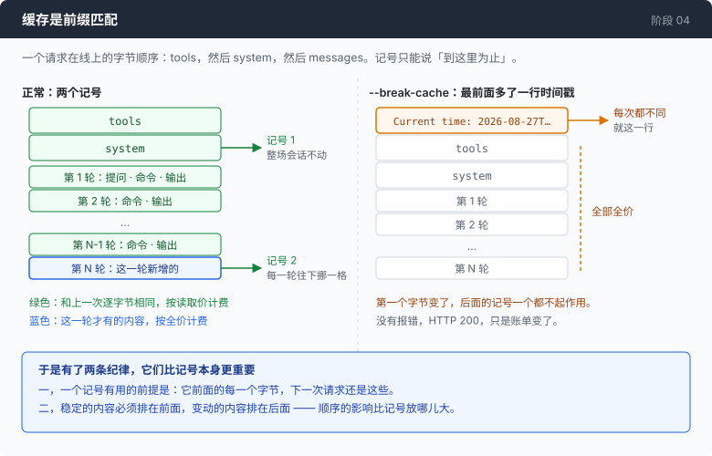
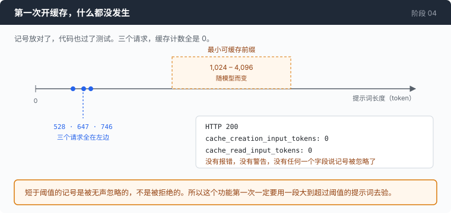
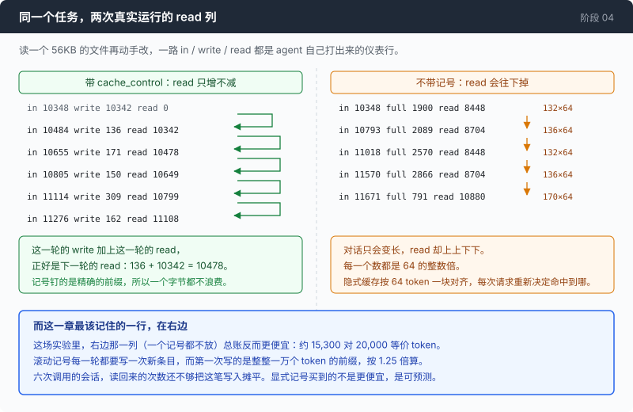

# 阶段 04：缓存 —— 同一段历史，不要按全价付第二遍

[00](../../00-loop/doc/README_zh.md) → 01 → 02 → [03](../../03-babel/doc/README_zh.md) → `04` → [05](../../05-live-forever/doc/README_zh.md) → 06 → 07 → 08 → 09 → 10 → 11 → 12

> 四十行代码，两个记号。这一章结束的时候你会有一套缓存纪律 —— 以及一组说明它在短会话里并不划算的数字。

---

## 问题

你让 agent 干一件真活。目录里有个源文件，五万多字节，你让它读一遍，找出那个函数为什么在空输入上崩掉，然后改掉。

第一轮它 `ls`，很便宜。第二轮它把那个文件 `cat` 出来 —— 五万多字节进了对话，一万个 token 量级。

从第三轮起，每一次请求都带着这一万个 token 出门。它想再确认一遍那个函数的签名，带着；它写补丁，带着；它跑测试，带着；它读测试的输出，带着。

六轮做完，任务完成了。那个文件你只让它读了一次，你付了五次。

第 00 章量过这件事的一般形式：一次六轮的会话一共为 4982 个 prompt token 付了钱，而对话本身最后只有 1192 个 token，多付了 4.2 倍。第 02 章后来把同一件事量得更细，落在 3.7 倍 —— 因为那次运行里重发的内容大部分已经被服务端自己缓存掉了，真正按全价算的只剩一小块。两个数量的是同一件事，后者更接近你实际会看到的账。

而真正要紧的不是 4.2 还是 3.7，是它的形状：每多一轮，前面所有轮的内容就再被送一次。一段 40 轮的会话，第 1 轮的内容会被付费 40 次。

第 03 章给这个循环加了第二种协议。这件事它一个字节都没省 —— 它只是让你可以在两种协议上以同样的方式多花钱。

**每一轮你都在为同一段已经发过的字节重新付一次全价，而轮数越多，重复得越多。**

---

## 办法



服务端可以把请求开头的一段存下来。下一次请求如果开头那一段和上一次**逐字节相同**，它就不重新算一遍，按一个便宜得多的价钱收。你要做的只有一件事：在请求里标出「到这里为止是可以复用的前缀」。

这个标记叫 `cache_control`，一个请求最多放四个。这个 adapter 放两个：

| 记号 | 钉住的是 | 什么时候动 |
|---|---|---|
| 1 | tools 和 system —— 整场会话都不变的那一段 | 一直不动 |
| 2 | 到最新一轮为止的整段历史 | 每一轮往后挪一格 |

第二个才是 agent 真正需要的那个。每一轮都要把整段历史重发一遍，没有它，历史每一轮都按全价重读一次。

输入的 token 从这里开始分成三种价，彼此差了一个数量级：全价、写进缓存（约 1.25 倍）、从缓存读（约 0.1 倍）。

「三种价钱」这个说法本身要先打一个折扣：**这一章没有观察到任何一个金额**。这个网关每一条回复里的 `cost` 字段都是字符串 `"0"`，包括抓到的最贵的那几次调用。所以后面凡是出现「便宜多少倍」，都是把观察到的 token 数乘上一组行业通行的倍率推算出来的。被测到的是 token，钱是算出来的。

---

## 怎么做的

代码在 [`04-the-cache/code/`](../code/)。加上缓存这件事一共大约 40 行。

### 第 1 步：一个字符串挂不住记号

第 03 章那边 `system` 是一个普通字符串。而记号是挂在「内容块」上的一个字段，字符串上没有地方放它。所以第一件事是把它换成一个数组：

```go
	// An ARRAY of text blocks, not the plain string stage 03 used. That change
	// is this chapter: a block can carry `cache_control`, a string cannot.
// ...
	System []anthropicContent `json:"system,omitempty"`
```

记号本身是块上的一个指针字段：

```go
	// CacheControl marks this block as the end of a cacheable prefix.
	//
	// A pointer with omitempty so an unmarked block serialises to exactly the
	// bytes it did before stage 04. That matters more than it looks: if adding
	// the feature changed the bytes of every *unmarked* block, turning caching
	// on would invalidate the very prefix it was meant to preserve.
	CacheControl *anthropicCacheControl `json:"cache_control,omitempty"`
```

指针加 `omitempty` 这个选择值得停一下。假如「打开缓存」这个动作顺带改动了那些**没有**记号的块的字节，那么第一次开启缓存，就会把它本来要保住的前缀作废掉 —— 而且是无声地作废。`cache_test.go` 里有一条测试专门盯这件事：开和关两次渲染出来的请求体，把 `cache_control` 那几个键抠掉之后必须一个字节不差。

### 第 2 步：第一个记号钉在 system 上，tools 跟着一起进去

渲染顺序是 tools、然后 system、然后 messages。前缀匹配意味着一个记号钉住的是它**前面的全部内容**，所以一个挂在 system 上的记号，把 tools 一起包进去了：

```go
func (p *anthropicProvider) systemBlocks(system string) []anthropicContent {
	if system == "" {
		return nil
	}
	b := anthropicContent{Type: "text", Text: system}
	if p.cacheBreakpoints {
		b.CacheControl = ephemeral()
	}
	return []anthropicContent{b}
}
```

代价是 tools 那一段必须每次渲染出完全相同的字节。这里有一个看着危险其实安全的地方：

```go
	InputSchema map[string]any `json:"input_schema"`
```

Go 的 map 遍历顺序是随机的，但 `encoding/json` 序列化 map 的时候会把键排序，所以渲染结果每次一样。工具定义坐在整个提示词的最前面，正好在缓存前缀里 —— 它要是每次不一样，每一个请求都会白付一次整段前缀的写入费。

反过来，工具**列表**的顺序不是 map 管的，是代码管的。调换两个工具的位置，就是改动第 0 号字节，后面每一个记号跟着一起作废。

### 第 3 步：第二个记号必须会动

```go
func markRollingBreakpoint(msgs []anthropicMessage) {
	if len(msgs) == 0 {
		return
	}
	last := &msgs[len(msgs)-1]
	if len(last.Content) == 0 {
		return
	}
	last.Content[len(last.Content)-1].CacheControl = ephemeral()
}
```

最后一条消息的最后一块。为什么不是一个固定位置：每一轮都往后追加，记号跟着一起往后挪，于是第 N 轮读到的正好是第 N-1 轮写下的那段前缀。钉在固定偏移量上的记号不会跟着长，能缓存到的比例每一轮都在变小。

这里有一个陷阱，源码的注释里写着：

```go
// The 20-block lookback is the trap here. A breakpoint searches backwards a
// limited number of content blocks for an existing entry, and an agent turn
// that fires many parallel tools can add more blocks than that in one go —
// after which the next marker silently finds nothing and you pay full price
// with no error and no warning. One tool per turn stays far inside the window;
// a fan-out agent needs an intermediate marker, which is what two of the four
// slots are still free for.
```

一轮里并发发起十几个工具调用，追加的块数可能一次就超过这个回看窗口，下一个记号往回找不到东西，于是全价，无声。四个槽用掉两个，剩下两个就是留给这件事的 —— 需要的时候在中间再插一个。

### 第 4 步：前缀是字节，不是意思

这一步是整章里最容易被跳过、也最容易日后无声出错的一步。缓存比的是字节，所以任何一处「意思一样、字节不一样」的改写，都是一次全额损失。

工具调用的参数是原始字节拼进去的，不解码：

```go
	// would produce an equivalent object with the keys in a different order —
	// Go sorts map keys, the model emitted them in its own order — and a
	// different byte sequence is a different prompt prefix, which is a cache
	// miss on every replayed turn. json.RawMessage is the only field type that
	// turns a string into an object by doing nothing at all.
	Input json.RawMessage `json:"input,omitempty"`
```

这条不变量由一个变异测试钉住。把请求路径上任何一处换成「解码再编码」，它会打出这句话：

```
tool arguments were re-serialised: keys came back sorted, so the prompt prefix moved and every cached turn is now a miss
```

第二处是 HTML 转义。`json.Marshal` 默认会把 `<`、`>`、`&` 转成六个字符的转义序列，所以这里换了一个编码器并且把它关掉：

```go
	enc := json.NewEncoder(&buf)
	enc.SetEscapeHTML(false)
```

这不是洁癖。这个 agent 干的活就是跑 shell 命令，而 shell 命令基本上就是这三个字符：`2>&1`、`>/tmp/out`、`<<EOF`。转义之后语义完全一样、字节完全不同，于是历史里出现一次重定向，前缀就动了。

第三处更小，但它说明这件事的粒度有多细：

```go
	// Tools carry no `function` wrapper on this protocol. Omitted entirely when
	// empty rather than sent as `[]`, because a present-but-empty tools array is
	// a different prompt prefix from an absent one, and a different prefix is a
	// cache miss.
	Tools []anthropicTool `json:"tools,omitempty"`
```

一个空数组和一个不存在的字段，在语义上是同一件事，在字节上不是。

### 第 5 步：两个用来把它弄坏的开关

这两个开关都不属于一个真的 agent，它们存在只是为了让这一章能给一句劝告配上数字：

```go
		noCache    = flag.Bool("no-cache", false, "omit cache_control breakpoints (control arm)")
		breakCache = flag.Bool("break-cache", false, "put a timestamp in the system prompt — the classic silent invalidator")
```

`--no-cache` 是对照组，两个记号都不放。`--break-cache` 更有意思，因为它复刻的是一个真实事故：

```go
	sys := func() string { return systemPrompt }
	if *breakCache {
		sys = func() string {
			return "Current time: " + time.Now().Format(time.RFC3339Nano) + "\n\n" + systemPrompt
		}
```

注意 `sys` 是一个**函数**，每次请求求一次值。这个细节就是整个实验：

```go
	// Note that this is a FUNCTION, evaluated per request, and that detail is
	// the entire experiment. The first version of this flag stamped the time
	// once at startup — and the cache kept working perfectly, because a value
	// that is constant for a session is a constant prefix for that session. The
	// bug people actually ship is `datetime.now()` inside a prompt builder that
	// runs on every call, and only that version invalidates anything.
```

在启动时盖一次时间戳，缓存完全正常，因为一个在整场会话里不变的值就是一段不变的前缀。同一行代码挪进那个每次调用都会执行的构造函数里，就是 3.4 倍。这两个位置在调用图上差三十行左右。

### 第 6 步：你得能看见它

到这里功能齐了，但屏幕上什么都没变，你没有任何办法知道它有没有在工作。而这一章后面的每一个数字都是从那个仪表上读下来的，所以它得先存在。

仪表这一段在 [**`1-the-instrument_zh.md`**](1-the-instrument_zh.md)，形式和这里一样。其中有一件事值得先提一句：那根三色的用量条第一版是**同一个字符配三种颜色**，而输出一旦经过 `grep`、写进文件、或者落进 CI 的日志，颜色就没了 —— 这个仪表恰好在最需要它的场合什么都不说。

### 拼起来

```go
	wireMsgs, err := anthropicMessages(msgs)
	if err != nil {
		return nil, nil, err
	}
	if p.cacheBreakpoints {
		markRollingBreakpoint(wireMsgs)
	}

	body, err := anthropicMarshal(anthropicRequest{
		Model:     p.model,
		MaxTokens: maxTokens,
		System:    p.systemBlocks(system),
		Messages:  wireMsgs,
		Tools:     anthropicTools(tools),
		Stream:    true,
	})
```

四行 `if`，两个函数，一个字段。循环那一头一个字都没改 —— 它不知道有缓存这回事，这也是第 03 章那层 adapter 边界现在的回报。

---

## 跑一下

### 第一次跑，什么都没发生



代码写完，测试全绿，开着缓存跑三个请求，仪表上是这样：

```
  │ in 528    full 528 · write 0 · read 0
  │ in 647    full 647 · write 0 · read 0
  │ in 746    full 746 · write 0 · read 0
```

一个字节都没缓存。没有报错，HTTP 200，`cache_creation_input_tokens` 是 0，响应里没有任何一个字段说记号被忽略了。

原因是提示词太短。缓存有一个**最小可缓存前缀**，随模型而变，常见的范围是 1,024 到 4,096 个 token。短于这个门槛的记号是被**无声忽略**的，不是被拒绝的。

这件事改变了后面所有实验的做法：验缓存必须用一段明显超过门槛的提示词。所以下面这个实验先造一个大文件，而不是问 agent「这个目录里有什么」。

### 三条臂

```sh
go build -o agent ./04-the-cache/code

mkdir -p sandbox && cd sandbox
set -a && . ../.env && set +a

cat ../04-the-cache/code/anthropic.go ../04-the-cache/code/render.go > big.go
wc -c big.go          # 和实验里那个 56KB 的文件同一个量级
```

然后同一句话问三遍，一次一条臂：

```sh
../agent --providers ../providers.json --provider opencode-ant --yolo --max-output 60000
../agent --providers ../providers.json --provider opencode-ant --yolo --max-output 60000 --no-cache
../agent --providers ../providers.json --provider opencode-ant --yolo --max-output 60000 --break-cache
```

三次都问：`读一遍 big.go，说明 markRollingBreakpoint 为什么挑最后一条消息的最后一块，然后在文件末尾追加一段注释写下你的结论。`

**观察重点：**

- 第一次调用之后那一行，`write` 是一个上万的数，`read` 是 0。这一次在**写**缓存，它比全价还贵一点。从第二次开始 `read` 才接上去。
- 开着缓存那几轮，`read` 这一列只增不减，而且每一轮的 `read` 正好等于**上一轮的 `in`**。
- `--no-cache` 那次 `write` 全程是 0，`read` 却不是 0 —— 你什么都没要求，服务端自己在缓存。而且那一列的数会往下掉。
- `--break-cache` 那次 `read` 每一轮都是 0，而屏幕上没有任何一个错误、任何一句警告。它唯一的症状是那一列数字。
- 加 `--show-request` 再跑一次，在请求体里搜 `cache_control`，看那两个记号分别落在哪。应该正好两个。

---

## 量一量

三次运行，同一个任务，同一个 56KB 的文件（读进上下文大约一万个 token），`--yolo --max-output 60000`。

先说两条限制，因为它们决定了下面这些数能拿来说什么：

- **三条臂不是严格对照。** 模型每次的回答不一样，走的步数、跑的命令都不完全相同，所以总量之间不能直接相减。只有**比例**是有意义的。
- **没有一个金额是观察到的。** 这个网关每一条回复里的 `cost` 都是字符串 `"0"`；把抓到的所有响应体里这个字段去重，只有这一个取值。所以「等价 token」那一列是把 token 数乘上一组假设的倍率（写入约 1.25 倍，读取约 0.1 倍）算出来的，它不是账单。凡是这个词出现的地方，都是在提醒你这一步是推算。

### 甲：显式记号

```
  │ in 535    full 535 · write 0     · read 0
  │ in 10348  full 6   · write 10342 · read 0
  │ in 10484  full 6   · write 136   · read 10342   99% cached
  │ in 10655  full 6   · write 171   · read 10478   98% cached
  │ in 10805  full 6   · write 150   · read 10649   99% cached
  │ in 11114  full 6   · write 309   · read 10799   97% cached
  │ in 11276  full 6   · write 162   · read 11108   99% cached

  prompt tokens billed: 65217  (full 571 · write 11270 · read 53376)
```

`read` 那一列：10342、10478、10649、10799、11108。每一个数正好是上一轮的 prompt 总数，一个字节不差，而且只增不减。`full` 那一列稳定在 6 —— 一次调用里真正按全价算的只有六个 token。

### 乙：不放任何记号

```
  │ in 10348  full 1900 · write 0 · read 8448    82% cached
  │ in 10793  full 2089 · write 0 · read 8704    81% cached
  │ in 11018  full 2570 · write 0 · read 8448    77% cached
  │ in 11570  full 2866 · write 0 · read 8704    75% cached
  │ in 11671  full 791  · write 0 · read 10880   93% cached

  prompt tokens billed: 55935  (full 10751 · write 0 · read 45184)
```

`write` 全程是 0，`read` 却在 8448 到 10880 之间 —— 你一个记号都没放，服务端自己缓存了 75% 到 93%。

而这一列**会往下掉**：8448、8704、8448、8704、10880。对话只会变长，命中的部分却上上下下。每一个数都是 64 的整数倍（132×64、136×64、170×64）。隐式缓存按 64 个 token 一块对齐，而且每次请求重新决定一遍命中到哪。



### 丙：`--break-cache`

```
  │ in 10387  full 6 · write 10381 · read 0
  │ in 10497  full 6 · write 10491 · read 0
  │ in 16352  full 6 · write 16346 · read 0
  │ in 16458  full 6 · write 16452 · read 0

  prompt tokens billed: 54267  (full 597 · write 53670 · read 0)
```

每一次调用都在写一份全新的缓存，一次都没读回来过。两个记号都还在，代码一行没改，只是 system 提示词最前面多了一行时间戳。

### 三条臂放在一起

| 臂 | full | write | read | 等价 token |
|---|---:|---:|---:|---:|
| 甲 —— 显式记号 | 571 | 11,270 | 53,376 | **约 20,000** |
| 乙 —— 只有隐式缓存 | 10,751 | 0 | 45,184 | **约 15,300** |
| 丙 —— 缓存被打断 | 597 | 53,670 | 0 | **约 67,700** |

把缓存打断，比甲贵 3.4 倍，比乙贵 4.4 倍。这一条是这张表里最结实的结论，因为三条臂之间差得足够大，控制不严也压不倒它。

### 这一章输给了它自己的对照组

看第二行。

**这一章存在的理由是加上显式 `cache_control`，而在这场实验里，一个记号都不放的乙最便宜：约 15,300 对甲的约 20,000 等价 token。**

原因不复杂。滚动记号每一轮都要写一次新条目，而第一次写的是整整一万个 token 的前缀，按 1.25 倍算 —— 那一笔就是甲的 write 列里那个 10342。乙那边隐式缓存写入不花钱，而且它本来已经命中 75% 到 93% 了。这场会话一共六次调用，读回来的次数还不够把那一笔写入摊平。

这一段留在这里，而不是换一段更长的会话重跑一遍直到数字站在自己这边。

那么显式记号买到的是什么。把两条臂的 `read` 列并排看：

| | 甲 | 乙 |
|---|---|---|
| `read` 的走向 | 只增不减 | 上上下下 |
| `read` 等于什么 | 上一轮的 prompt 总数，一个字节不差 | 64 的某个整数倍，每次请求重新决定 |
| 每轮的 `full` | 6 | 791 – 2866 |

甲的账你在发请求之前就能算出来。乙的账你只能事后看，而且下一轮会不会掉下去，你说不出来。

所以这一章开头说的是「更便宜」，量完之后能站住的是**可预测**：一个只增不减、可以提前算出来的读取量。这是一个真实的好处，但它不是这一章原本要证明的那个，而这个仓库的做法是把这次换脚说清楚，不是把它抹掉。

至于会话更长会不会翻过来 —— 一次性的写入摊到更多轮上，算术上是应该翻的。但这一章只测了六次调用，所以上面这句话是推测，不是测量。

---

## 接下来

缓存动的是价钱那一栏。上下文窗口那一栏，它一个字节都没动。

一段真实的任务跑到三十轮左右，历史会长到超过模型的上下文窗口。那时候发生的事不是变贵，是请求**直接被拒绝** —— 装不下就是装不下。缓存对这件事完全无能为力：一段读起来只要十分之一价钱的前缀，占的窗口和全价的一样多。

而这一章还顺手把这件事变得更容易撞上。它教你的纪律是：稳定的排在前面，整段历史一路留着不动，因为那样命中率最高。命中率最高的做法，也正好是让窗口填得最快的做法。

于是问题变成：历史长到装不下的时候，扔掉哪一段，才能既让请求装得下、又不让 agent 忘掉它正在干什么？

[阶段 05](../../05-live-forever/doc/README_zh.md) 处理这件事：什么时候动手裁，裁哪一段，以及裁掉的东西怎么才不算真的丢了。
