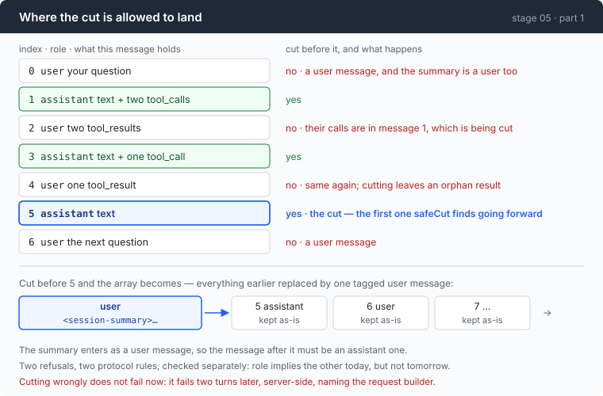

# Stage 05 · part 1: the cut — where a conversation may be broken

[← back to stage 05](README.md) · next: [2 · when](2-when.md)

> Twelve lines of function and a test that checks every index. Get it wrong and
> the API rejects you two turns later, with an error naming the wrong file.

---

## The problem

You need to drop the first eleven messages and keep the rest. So you write
`msgs = msgs[11:]`, run it, and the next request comes back:

```
messages with role 'tool' must be a response to a preceding message with tool_calls
```

Message 11 is a tool result. The tool call it answers was in message 10, which
you just deleted. The result is now an orphan, and both protocols refuse it —
the Anthropic one complains about an unexpected `tool_use_id` instead, which
sounds like a different bug and is the same one.

Now notice where that error appears. It is not thrown by the compactor. It comes
from the *next* request, built by the request builder, several seconds and
possibly several turns after the cut. The stack trace points at
`BuildRequest`. And the conversation that would let you reproduce it has already
been compacted away.

Cause and symptom are in different files and different turns. That is the
expensive part.

---

## The idea

There are only a few positions a conversation may be cut, and the rule fits in
one sentence.



**A conversation may only be cut immediately before an assistant turn.**

Two protocol facts produce that:

| | |
|---|---|
| a tool result whose call was deleted is an orphan | so the message after the cut must not contain one |
| the summary goes back in as a *user* message | so the message after the cut must not be a user message |

---

## Building it

The code is [`compact.go`](../code/compact.go).

### Step 1: deciding whether one position is legal

```go
func canCutBefore(msgs []Msg, i int) bool {
    if i <= 0 || i >= len(msgs) {
        return false
    }
    for _, b := range msgs[i].Blocks {
        if b.Kind == BlockToolResult {
            return false
        }
    }
    return msgs[i].Role == RoleAssistant
}
```

The two checks are redundant *today*. An assistant message never carries a tool
result, so the role test alone would be enough.

They are separate anyway, and the reason is worth saying: the day somebody adds
a block kind, or a protocol starts putting results somewhere else, the
implication stops holding — and a single combined check would go on returning
`true` while quietly meaning something different. A redundant check costs one
loop; a wrong one costs an afternoon of reading request builders.

### Step 2: search forward from where you wanted to cut, never backward

```go
func safeCut(msgs []Msg, want int) int {
    if want < 1 {
        want = 1
    }
    for i := want; i < len(msgs); i++ {
        if canCutBefore(msgs, i) {
            return i
        }
    }
    return -1
}
```

`want` is where the budget said to cut. It usually is not legal, so the search
moves — and the direction is a decision.

Forward means dropping *more* than intended. Backward means keeping more, which
sounds friendlier and is wrong here: compaction fires because the window is
nearly full, so the failure that must not happen is freeing less than you needed
and having to compact again on the very next turn. Backward search can also free
nothing at all.

### Step 3: write a second check, from the other end

```go
func validConversation(msgs []Msg) string {
```

This one asks a different question. `canCutBefore` says *where a cut is
allowed*; `validConversation` says *whether a message list is sendable*, derived
from the protocol's rules rather than from the cutting logic.

That difference is the entire value of having it. A check written from the same
assumptions as the code it checks will agree with the code, including when the
code is wrong.

It tracks open calls and answered ids:

```go
case BlockToolResult:
    if !open[b.ID] {
        return fmt.Sprintf("message %d answers tool call %q, which no earlier message made — the call was cut away and its result left behind", i, b.ID)
    }
```

and it catches the mirror-image bug, with one deliberate exception:

```go
for i, m := range msgs[:max(0, len(msgs)-1)] {
    for _, b := range m.Blocks {
        if b.Kind == BlockToolCall && !answered[b.ID] {
            return fmt.Sprintf("tool call %q in message %d is never answered", b.ID, i)
        }
    }
}
```

An unanswered call in the **final** message is legal — that is the state a
conversation is in while the tools are still running. Anywhere else it makes the
model believe a command it issued produced nothing, silently.

And the roles:

```go
if i > 0 && msgs[i-1].Role == m.Role {
    return fmt.Sprintf("messages %d and %d are both %s; roles must alternate", i-1, i, m.Role)
}
```

Two user messages in a row is the second failure mode, and it is worse than an
outright rejection: **some endpoints merge them, some reject them, and the ones
that merge do it differently from each other.** So the same code produces three
behaviours across three providers, and only one of them looks like a bug.

### Step 4: make a test hold the two functions against each other

```go
func TestEveryLegalCutProducesASendableConversation(t *testing.T) {
    msgs := convFixture()

    legal := 0
    for i := -1; i <= len(msgs)+1; i++ {
```

Every index, including two out of range, not one hand-picked position. The bug
this guards against is a cut that is legal at index 5 and orphans a result at
index 9, which a single-index test would never see.

```go
out := append([]Msg{summaryMsg("s")}, msgs[i:]...)
if why := validConversation(out); why != "" {
    t.Errorf("cutting before message %d is allowed but produces an unsendable conversation: %s\n"+
        "the API rejects this on the NEXT request, so the error will point at the request builder, not at the compactor", i, why)
}
```

The failure message says where the error will actually appear. That is the whole
diagnosis, written down at the moment somebody would need it.

And then the line that stops the test passing for the wrong reason:

```go
if legal < 4 {
    t.Fatalf("only %d of %d indices are cuttable; the fixture no longer exercises the invariant", legal, len(msgs))
}
```

Without it, a `canCutBefore` that returns `false` everywhere passes — and also
makes compaction silently impossible.

### Step 5: put the check where it will be used

`validConversation` is not test-only. It runs before the compacted conversation
is sent, so a compactor bug becomes a message that names the compactor rather
than a 400 that names the request builder.

Mutation testing this pair caught **all four** ways of breaking it — including
the one where removing the tool-result check leaves a suite that still passes,
because that particular fixture's cut point happens to land somewhere safe.

---

## Run it

```sh
go test ./05-live-forever/code/ -run 'TestEveryLegalCut|TestCutPoints|TestValidConversation|TestSafeCut' -v
```

Then break it on purpose, one line at a time:

1. In `canCutBefore`, delete the `BlockToolResult` loop.
2. Change `return msgs[i].Role == RoleAssistant` to `return true`.
3. In `safeCut`, change the loop to count downward.

**What to watch for:** which test goes red for each, and whether the message
tells you what you actually did. (1) should be caught by the every-index test
rather than by the obvious one — that is the whole point of testing every index.

---

## Measured

Not a measurement so much as a count: mutation testing this pair, **four out of
four** breakages were caught, and one of them only by the every-index test.

The observed rejection texts, from the two protocols, for the same illegal cut:

| protocol | what it says |
|---|---|
| OpenAI | `messages with role 'tool' must be a response to a preceding message with tool_calls` |
| Anthropic | an unexpected `tool_use_id` |

Neither one mentions compaction, because neither one knows compaction happened.

---

## Next

You know where to cut. You do not know **when**.

Deciding to compact means comparing the size of your prompt against the context
window, and the size of a prompt is measured in tokens — which requires a
tokenizer, which is a per-model dependency this repo does not have and does not
want.

[Part 2](2-when.md) gets the number for free, out of a field the API is already
sending back.
