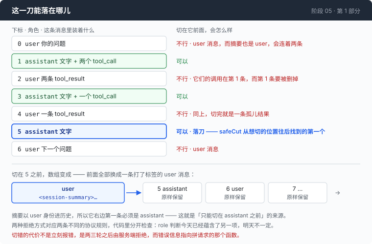

# 阶段 05 · 第 1 部分：剪一刀 —— 一段对话只能从哪里断开

[00](../../00-loop/doc/README_zh.md) → 01 → 02 → 03 → [04](../../04-the-cache/doc/README_zh.md) → `05` → [06](../../06-the-composer/doc/README_zh.md) → 07 → 08 → 09 → 10 → 11 → 12

> [返回本章目录](README_zh.md) · 下一部分：[离墙还有多远](2-when_zh.md)

---

## 问题

对话太长了，你决定把前面一大截扔掉。

这件事看上去没有难度。`msgs` 是个数组，前八条不要了，写成 `msgs = msgs[8:]`，一行。你这么做了，agent 接着跑，接下来的两轮一切正常。

第三轮，服务端拒绝了这次请求，理由是：有一条 role 是 `tool` 的消息，它前面没有一条带 `tool_calls` 的消息。

现在看这个错误指向哪儿。它指向你拼请求的那个函数 —— 那个函数从第 03 章写完之后一个字都没动过。真正出问题的地方在两百行之外，在你切下那一刀的时候，隔了三轮才发作。而能复现它的那段对话，已经被你自己删掉了。

这类 bug 有个共同点：**故障和它的成因不在一个地方，中间还隔着时间。** 你能看到的那一端是无辜的，有罪的那一端已经不在现场。

所以在写"什么时候切"之前，先得把"能切在哪儿"钉死。这一部分只解决这一件事。

---

## 办法

一句话：**一段对话只能在一条 assistant 消息之前切开。**



理由有两个，分别对应两种不同的拒绝方式：

| 想切在这条消息前面 | 会发生什么 |
|---|---|
| 装着工具结果的消息 | 它的调用在前一条里，而前一条正要被删掉。结果成了孤儿，OpenAI 和 Anthropic 两边都拒 |
| user 消息 | 摘要本身要以一条 user 消息的身份插进去，切在这里就是连续两条 user |
| assistant 消息 | 可以 |

第三行同时满足前两条：assistant 消息里从来不装工具结果。但代码里这两项还是分开检查的，理由在下面第 1 步。

---

## 怎么做的

代码在 [`05-live-forever/code/compact.go`](../code/compact.go)。

### 第 1 步：判断一个位置能不能切

```go
func canCutBefore(msgs []Msg, i int) bool {
	if i <= 0 || i >= len(msgs) {
		return false
	}
	for _, b := range msgs[i].Blocks {
		if b.Kind == BlockToolResult {
			return false
		}
	}
	return msgs[i].Role == RoleAssistant
}
```

两项检查，最后一行其实已经蕴含了中间那个循环 —— 既然 assistant 消息里不会有工具结果，只留 role 判断就够了。

保留它的理由不在今天，在以后。`Msg` 是这个仓库自己的中立结构，任何一种 block 都可以放进任何一个 role 里；哪天有人加了一种新的适配方式，把工具结果塞进一条 assistant 消息，只看 role 的那版会继续返回 true，然后安静地发出一条孤儿结果。两项检查里有一项是冗余的，但冗余的那项恰好是失效时会出事的那项。

顺便注意第一个 `if`：`i <= 0` 而不是 `i < 0`。切在 0 前面等于什么都没切掉。

### 第 2 步：从想切的位置往后找，不往前找

想切的位置多半不合法（多半正好落在一条工具结果上），得挪。往哪边挪是个真正的决定：

```go
func safeCut(msgs []Msg, want int) int {
	if want < 1 {
		want = 1
	}
	for i := want; i < len(msgs); i++ {
		if canCutBefore(msgs, i) {
			return i
		}
	}
	return -1
}
```

`i := want; i < len(msgs); i++` —— 往后，也就是往"扔掉更多"的方向找。

往前找会保住更多近期上下文，听起来更友好。但压缩是因为窗口快满了才触发的，这时候最不能发生的事情是：腾出来的空间比预期少，下一轮又得压一次。往前找在最坏情况下会一点空间都腾不出来，而每一次压缩都要重新读一遍历史、赔掉整个缓存。宁可多扔一点。

### 第 3 步：再写一个检查，而且要从另一头写

`canCutBefore` 说的是"这里允许切"。还需要有人说"切完这个结果发得出去"。

这两句话听着是一回事，把它们写成一回事就没有意义了 —— 如果压缩器判断错了，一个用同样假设写出来的检查会陪着它一起错。所以 `validConversation` 完全不看切点，它只按协议规则从头到尾扫一遍消息数组，第一个问题就返回，没有问题返回空串。

```go
		if len(m.Blocks) == 0 {
			return fmt.Sprintf("message %d (%s) has no content blocks; the Anthropic protocol rejects an empty content array", i, m.Role)
		}
		if i > 0 && msgs[i-1].Role == m.Role {
			return fmt.Sprintf("messages %d and %d are both %s; roles must alternate", i-1, i, m.Role)
		}
```

工具调用和结果用两张表配对：

```go
			case BlockToolCall:
				open[b.ID] = true
			case BlockToolResult:
				if !open[b.ID] {
					return fmt.Sprintf("message %d answers tool call %q, which no earlier message made — the call was cut away and its result left behind", i, b.ID)
				}
				delete(open, b.ID)
				answered[b.ID] = true
```

反过来那种错也要抓 —— 调用还在，结果被切走了：

```go
	for i, m := range msgs[:max(0, len(msgs)-1)] {
		for _, b := range m.Blocks {
			if b.Kind == BlockToolCall && !answered[b.ID] {
				return fmt.Sprintf("tool call %q in message %d is never answered", b.ID, i)
			}
		}
	}
```

注意这个循环少扫最后一条消息。最后一条里的调用没有结果是**合法**的：那正是命令还在跑的时候，对话所处的状态。少写这个 `len(msgs)-1`，agent 会在每一轮工具执行前指控自己写坏了对话。

而如果这条规则漏在别处，后果比孤儿结果更隐蔽：模型会认为它发出去的那条命令悄无声息地什么也没产出。

### 第 4 步：让测试把这两个函数按在一起

有了两个独立的判断，就有了一个可以直接断言的性质：**只要 `canCutBefore` 说可以，切出来的对话就必须能通过 `validConversation`。**

关键在于这个断言要对**每一个下标**都做一遍，而不是挑几个：

```go
	for i := -1; i <= len(msgs)+1; i++ {
		// ...
		if !canCutBefore(msgs, i) {
			continue
		}
		legal++
		out := append([]Msg{summaryMsg("s")}, msgs[i:]...)
		if why := validConversation(out); why != "" {
			t.Errorf("cutting before message %d is allowed but produces an unsendable conversation: %s\n"+
				"the API rejects this on the NEXT request, so the error will point at the request builder, not at the compactor", i, why)
		}
	}
```

范围从 `-1` 到 `len(msgs)+1`，越界的两头也测 —— 那两个下标要是返回了 true，紧接着的切片操作会直接 panic。

还差最后三行，否则这个测试可以被一个"永远返回 false"的 `canCutBefore` 完美通过：

```go
	if legal < 4 {
		t.Fatalf("only %d of %d indices are cuttable; the fixture no longer exercises the invariant", legal, len(msgs))
	}
```

一个永远说不的压缩器不会切坏任何对话，它只是让压缩永远不发生 —— 而且是安静地不发生。断言"至少有四个位置是可以切的"，是在给这个测试上一道防空转的锁。

### 第 5 步：把这个检查接到手边

`validConversation` 不只是给测试用的。`/context` 每次都顺手跑一遍：

```go
		if problem := validConversation(msgs); problem != "" {
			fmt.Printf("  MALFORMED: %s\n", problem)
		}
```

对话是在你自己的进程里坏掉的，那一刻它就已经是坏的了，只是还没有人问过。让它在你敲 `/context` 的时候就说出来，比让它在三轮之后从服务端绕回来要好。

---

## 跑一下

这一部分的东西全部可以离线验证，不需要 key，也不需要网络：

```sh
go test ./05-live-forever/code -run 'Cut|Valid' -v
```

然后手动破坏一次。把 `canCutBefore` 里那个 `for` 循环整段删掉（只留 role 判断），再跑一次：

```sh
go test ./05-live-forever/code -run Cut
```

**观察重点：**

- `TestCanCutBeforeRejectsAToolResultWhateverRoleCarriesIt` 会红，而 `TestEveryLegalCutProducesASendableConversation` **不一定会红**。后者用的那份对话样例，工具结果恰好都落在 user 消息里，role 判断顺手把它们挡住了。
- 这就是第 1 步说的那件事的实测形态：删掉一项冗余检查，测试套件可能整体还是绿的 —— 取决于样例里的切点碰巧落在哪儿。
- 记得把删掉的循环加回去。

---

## 量一量

对 `canCutBefore` / `validConversation` 这一对做了变异测试：把实现故意改坏，看测试会不会变红。**四种改法，四种都被抓住了。**

其中一种值得单说，就是上面手动做的那一种：把工具结果的检查删掉之后，那条"每个合法切点都必须切出可发送的对话"的不变量测试**仍然可能是绿的**，因为它是否变红取决于样例里合法切点碰巧落在哪儿。抓住它的是那条专门为这一种情况写的用例，还有 `legal < 4` 那道防空转的锁。

一个只测"正常情况"的套件，在这里会给你一个绿色的假象，然后在第 30 轮把一条孤儿结果发出去。

---

## 接下来

现在这一刀落在哪儿是确定的了。剩下两个问题，一个比一个不好回答：

**什么时候落？** 得知道现在离窗口还有多远，而这个数字只有服务端知道，它还只肯在你付过钱之后告诉你。

**落到哪儿？** `safeCut` 需要一个 `want` —— 想从哪里开始保留。这个数是按 token 预算算出来的，而 token 得先能数出来。

[第 2 部分](2-when_zh.md) 不装 tokenizer，用服务端自己报出来的数字倒推。
