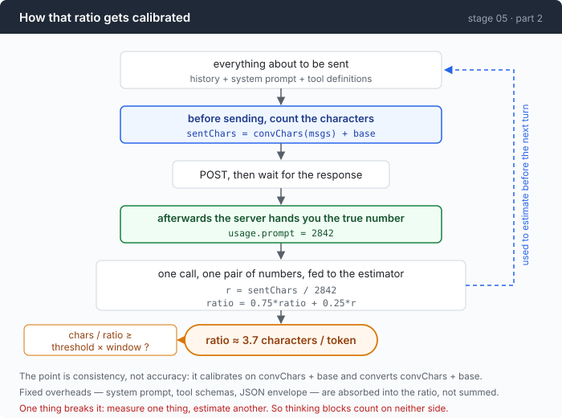
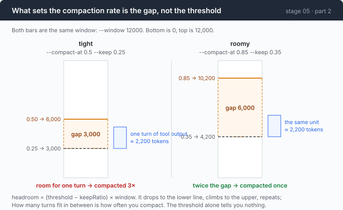

# Stage 05 · part 2: how far from the wall — counting tokens without a tokenizer

[← back to stage 05](README.md) · previous: [1 · the cut](1-cut.md) · next: [3 · the summary](3-summary.md)

> Every response you have ever received contains the exact token count of the
> prompt you just sent. Calibrating against that beats vendoring a tokenizer,
> and the reason is not that it is cheaper — it is that it is measuring the
> right thing.

---

## The problem

To decide whether to compact you have to compare two numbers: how big the next
prompt will be, and how big the window is. The second is a constant. The first
is the hard one, because prompts are measured in tokens and you have a string.

The standard answer is to vendor a tokenizer. Follow it through:

It is a large dependency, and it is **per-model** — a wrong one is confidently
wrong. It counts the text you give it, while the server counts your text *plus*
the JSON envelope, the tool schemas, and whatever framing the provider adds; so
it disagrees with the bill by an amount you cannot see. And on a gateway serving
five models from three vendors, you do not necessarily know which tokenizer is
the right one.

Then there is the version of this that is worse and much more common: use the
`prompt_tokens` from the **last** response. That is one turn too late. The tool
result that will blow the window is already sitting in the history by the time
the call that would have reported it is being built.

---

## The idea

Send a prompt, count the characters you sent, and let the response tell you what
that came to in tokens. Now you have a ratio. Do it every call.



The subtle part, and the reason this works at all:

> **The estimate does not need to be accurate. It needs to be consistent.**

It is only ever used to answer "are we near the wall", and it is calibrated
against the same character count it is later asked to convert. A systematic bias
— envelope overhead, tool schemas, the system prompt — is *absorbed into the
ratio* rather than accumulated as error.

The one thing that breaks it is measuring one thing and estimating another.

---

## Building it

The code is [`compact.go`](../code/compact.go).

### Step 1: after each call, record the answer

```go
sentChars := convChars(msgs) + base
```

```go
a.comp.est.observe(sentChars, res.Usage.Prompt())
```

Two numbers, free, on every call. `Usage.Prompt()` and not `Input` — for the
reason stage 02 spent a section on, and which would be catastrophic here: a warm
call reports `Input: 18` for eighteen thousand tokens, and an estimator fed that
would think the conversation had barely started.

### Step 2: one ratio and one counter

```go
type estimator struct {
    ratio float64 // characters per token
    obs   int
}
```

```go
func newEstimator() *estimator { return &estimator{ratio: 3.6} }
```

3.6 is a reasonable cold start for a mix of prose, code and JSON — pure English
runs nearer 4.0, dense JSON nearer 2.5. It matters for exactly one call, after
which measurement takes over.

### Step 3: absorb one sample

```go
func (e *estimator) observe(chars, tokens int) {
    if chars <= 0 || tokens <= 0 {
        return
    }
    r := float64(chars) / float64(tokens)
```

```go
    if r < 1.0 || r > 20.0 {
        return
    }
```

A ratio outside that range means the two numbers are not describing the same
request — a usage event arriving for a call whose characters were never counted,
most likely. Dropping it beats letting one bad sample drag the estimate
somewhere it takes ten calls to climb out of.

```go
    if e.obs == 0 {
        e.ratio = r
    } else {
        e.ratio = 0.75*e.ratio + 0.25*r
    }
```

The first real observation *replaces* the cold start rather than averaging with
it — 3.6 was a guess and has no evidence behind it. After that, an exponential
moving average weighted toward history: the ratio genuinely drifts, so it should
track, but it should not lurch on one unusual turn.

### Step 4: count only what gets re-sent

```go
func msgChars(m Msg) int {
    n := 0
    for _, b := range m.Blocks {
        switch b.Kind {
        case BlockText, BlockToolResult:
            n += len(b.Text)
        case BlockToolCall:
            n += len(b.Name) + len(b.Args)
        }
    }
    return n
}
```

Note which kind is missing. `BlockThinking` is not counted, because this repo
drops thinking blocks before sending — counting them here while not sending them
there is exactly the asymmetry that poisons a calibration. Measure what you
send; estimate what you send.

### Step 5: decide on the estimate, not the report

```go
func (c *compactor) due(estimated int) bool {
    if c.window <= 0 || c.threshold <= 0 {
        return false
    }
    return float64(estimated) >= c.threshold*float64(c.window)
}
```

It takes an estimate. That is the whole point of the estimator: answering the
question *before* paying to find out.

### Step 6: put the check at the top of the tool loop

```go
base := len(a.system()) + toolChars()
if est := a.comp.estimate(msgs, base); a.comp.due(est) {
```

Inside the tool loop, not the user loop. What fills a window is the tool output
within one turn — a single unfiltered command can add more than an hour of
conversation — and checking only between user messages means hitting the wall
mid-turn, where there is no graceful recovery.

### Step 7: choose what to keep by walking backward

```go
kept, want := c.est.tokens(baseChars), len(msgs)
for i := len(msgs) - 1; i >= 0; i-- {
    t := c.est.tokens(msgChars(msgs[i]))
    if kept+t > budget {
        break
    }
    kept += t
    want = i
}
```

From the newest message backward, accumulating until the keep budget is spent.
`want` ends as the oldest message that still fits, and [part 1](1-cut.md)'s
`safeCut` then moves it forward to a legal boundary.

### Step 8: the floor, and two different error messages

```go
if want >= len(msgs)-1 {
    newest := c.est.tokens(msgChars(msgs[len(msgs)-1]))
    if newest > budget {
        return -1, fmt.Sprintf("cannot compact: the newest message alone is ~%d tokens against a keep budget of %d — lower --max-output or use a command that filters", newest, budget)
    }
    return -1, fmt.Sprintf("cannot compact: a keep budget of %d tokens has room for only the newest message (~%d) — raise --keep or --window", budget, newest)
}
```

Two situations, two fixes, two messages. The first version printed the first
message in both cases, and that is worse than printing nothing.

**An error message is a claim about causation.** Get it wrong and you have not
merely failed to help: you have sent the reader to change a setting that was
never the problem, and when that does not work they conclude the diagnosis was
right and the situation is hopeless.

### Step 9: the distance between the two knobs



```
headroom = (threshold − keepRatio) × window
```

That is the number that governs how often you compact, and **it is not the
threshold** — which is the knob every tutorial exposes.

| arm | threshold | keep | headroom | one turn of tool output | compactions |
|---|---:|---:|---:|---:|---:|
| tight | 0.50 | 0.25 | 3,000 | ~2,200 | 3 |
| roomy | 0.85 | 0.35 | 6,000 | ~2,200 | 1 |

Read the third and fourth columns together: `tight` had room for **one turn**
between compactions. Each of those compactions cost a full-price read of the
whole history, a two-call cache outage, and about seven seconds.

The right unit for this knob is not a percentage. It is *turns of your actual
tool output*.

---

## Run it

```sh
cd sandbox && set -a && . ../.env && set +a
../agent --window 12000 --compact-at 0.5 --keep 0.25
> read every .go file in this directory and describe what this program does
```

**What to watch for:**

- The last line of each panel: `└ context 5893 / 12000 (49.1%) · ≈3.7 B/tok`.
  The last figure is the live ratio. Watch it move.
- The `≡ compacted:` line, and the estimate that preceded it versus the prompt
  the next call was actually billed.

Then the synthetic version, which needs no key at all:

```sh
go test ./05-live-forever/code/ -run TestEstimator -v
```

---

## Measured

**Prediction against the bill.** Three compactions in one real run, each
predicting the size of the conversation it had just produced, against what the
next call was actually charged:

```
  predicted ~3556   billed 2842   +25.1%
  predicted ~3823   billed 3624    +5.5%
  predicted ~3332   billed 3256    +2.3%
```

The first is poor and the reason is instructive: the estimator had **7 samples**,
all taken while the prompt was mostly system prompt, and was then asked about a
conversation that had become mostly Markdown. It converges within two more
compactions and stays inside 6%.

**The ratio really does drift.** One session started at **3.3 B/tok and climbed
to 3.7** — 11% within a single session, in one direction. Any fixed divisor is
wrong at one end of that.

**Bias is absorbed, not accumulated.** Against a synthetic provider charging
`chars/2.9` plus a **700-token envelope the estimator never sees**, after ten
calibration rounds it predicted **21,708 tokens against 21,389 billed — 1.5%
out**, having been told neither the divisor nor the overhead.

That last number is the argument for the whole approach. It was not accurate
about anything; it was consistent about the one thing it measures.

---

## Next

You know where to cut and when. You do not know what to put back.

The replacement is a summary, and a summary is a model call — which means it
costs tokens and seconds, and it can be wrong. [Part 3](3-summary.md) is about a
specific way it was wrong: shown only the first part of a session, the
summariser wrote that work was "never done" which had in fact been done, in the
messages it was not allowed to see.
