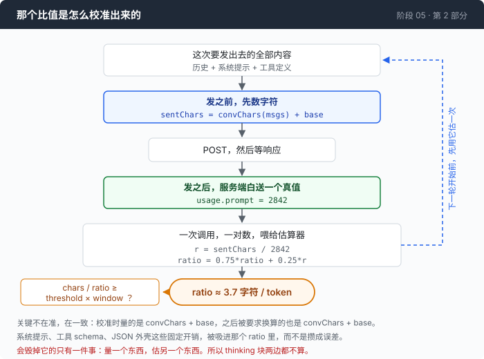
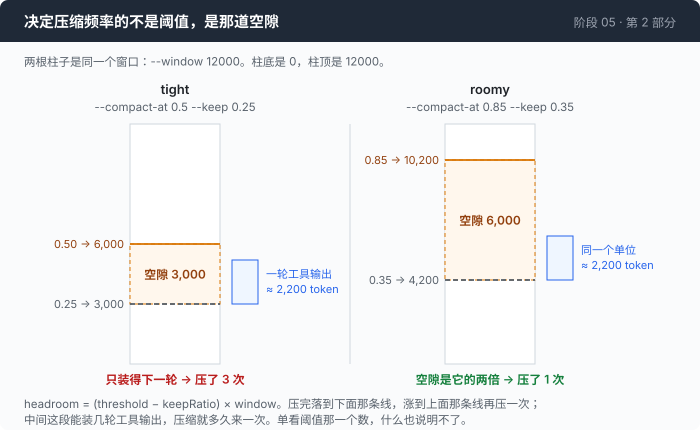

# 阶段 05 · 第 2 部分：离墙还有多远 —— 不装 tokenizer 也能数 token

[00](../../00-loop/doc/README_zh.md) → 01 → 02 → 03 → [04](../../04-the-cache/doc/README_zh.md) → `05` → [06](../../06-the-composer/doc/README_zh.md) → 07 → 08 → 09 → 10 → 11 → 12

> [返回本章目录](README_zh.md) · 上一部分：[剪一刀](1-cut_zh.md) · 下一部分：[拿什么填回去](3-summary_zh.md)

---

## 问题

这一刀能落在哪儿已经确定了。现在的问题是什么时候落。

判断必须在**发出请求之前**做出来 —— 一旦发出去，要么成功要么被整个拒掉，没有中间状态。可是"这次请求有多少 token"这个数字只有服务端知道，而它只在响应里告诉你，也就是**只在你已经付过钱之后**。

于是最顺手的写法是：拿上一次响应里报的 prompt token 数，判断这一次要不要压缩。这个写法晚一轮，而且恰好晚在最要命的那一轮上。撑爆窗口的东西通常不是聊天，是一次工具输出：一条 `grep -rn` 可以一口气加进来几千个 token。这个数字进历史的时刻，和"下一次请求会有多大"这个问题被提出的时刻，中间只隔了一次 `append` —— 而你手上那个数字，说的是这次 `append` 之前的事。

常规答案是把 tokenizer 装进来。为了回答"还有多远"这一个判断，这个价钱很奇怪：一个不小的依赖，每个模型一份，而且它和服务端对工具 schema、消息外壳这些框架开销的算法本来就不一致 —— 它算出来的数和账单上的数不是同一个数。

而真正让人不想装它的理由是：**你想要的那个数字，每一次响应里都白送给你了。**

---

## 办法

送的是"你刚刚发出去的字符数，值多少个 token"。把这两个数一除，得到一个比值；每次调用都除一遍，这个比值就会收敛到**这段会话真实的**文字、代码、JSON 混合比例上。



关键的一句，也是这个办法能成立的全部理由：**这个估算不需要准，它需要一致。**

它只用来回答一个问题 —— 快到墙了吗。而它校准时量的东西，和它之后被要求换算的东西，是同一个量（`convChars + baseChars`）。系统提示的长度、工具 schema 的开销、JSON 外壳 —— 所有这些系统性偏差都会被**吸进比值里**，而不是攒成误差。会毁掉它的只有一种做法：量的是一个东西，估的是另一个东西。

---

## 怎么做的

### 第 1 步：每次调用之后，把答案记下来

先看这个循环里的这几行，整章的估算都建立在它上面：

```go
		sentChars := convChars(msgs) + base
		res, err := a.call(turn, msgs)
		if err != nil {
			a.bus.Error("%v", err)
			return msgs
		}
		a.lastPrompt = res.Usage.Prompt()
		a.comp.est.observe(sentChars, res.Usage.Prompt())
```

`sentChars` 在调用**之前**算好，`res.Usage.Prompt()` 是服务端在调用**之后**报的。一次调用，一对数。

### 第 2 步：一个比值，一个计数

```go
type estimator struct {
	ratio float64 // characters per token
	obs   int
}
```

```go
func newEstimator() *estimator { return &estimator{ratio: 3.6} }
```

3.6 是冷启动值，混合了英文散文、代码和 JSON 的一个大致数 —— 纯英文接近 4.0，密集的 JSON 接近 2.5。它只对第一次调用有意义，之后测量就接手了。

### 第 3 步：吃掉一个样本

```go
	r := float64(chars) / float64(tokens)
	// ...
	if r < 1.0 || r > 20.0 {
		return
	}
```

那个区间不是防御性编程的装饰。落在区间外意味着这两个数**不是在量同一次请求** —— 最常见的情况是某次调用的字符数没被记下来，却收到了它的 usage。丢掉这个样本，比让一个坏样本把比值拖到需要十次调用才爬回来的地方要好。

```go
	if e.obs == 0 {
		e.ratio = r
	} else {
		e.ratio = 0.75*e.ratio + 0.25*r
	}
	e.obs++
```

第一个样本**直接顶替**冷启动值，不参与平均 —— 3.6 是猜的，一个真实测量比它可信得多。之后是指数移动平均，权重偏向历史：比值会真实地缓慢漂移（一段会话从聊天转向读 JSON 文件，比值确实在变），所以它要跟着走，但不能因为一个反常的回合就跳车。

### 第 4 步：只数会被重发的东西

```go
func msgChars(m Msg) int {
	n := 0
	for _, b := range m.Blocks {
		switch b.Kind {
		case BlockText, BlockToolResult:
			n += len(b.Text)
		case BlockToolCall:
			n += len(b.Name) + len(b.Args)
		}
	}
	return n
}
```

漏掉的那一种是 thinking 块。这个仓库在发请求之前会把它们丢掉，所以在这里数它们、在那里不发它们，正好造成"量一个东西、估另一个东西"那种偏差 —— 也就是唯一能毁掉第 3 步的那种做法。

### 第 5 步：判断，用估的，不用报的

```go
func (c *compactor) due(estimated int) bool {
	if c.window <= 0 || c.threshold <= 0 {
		return false
	}
	return float64(estimated) >= c.threshold*float64(c.window)
}
```

参数名是 `estimated`。这个函数拿不到上一次的 usage，结构上就不给它这个机会。

`c.threshold <= 0` 那一支还兼了另一件事：`--no-compact` 就是把阈值设成 0，于是压缩永远不触发。整个"对照组"是一个常量赋值，不是一条分支。

### 第 6 步：检查放在工具循环的顶上

位置也是个决定：

```go
		base := len(a.system()) + toolChars()
		if est := a.comp.estimate(msgs, base); a.comp.due(est) {
			cut, why := a.comp.plan(msgs, base)
			if cut < 0 {
				a.bus.Notice("%s", why)
			} else if out, err := a.comp.run(a.p, a.httpc, a.bus, msgs, cut, base); err != nil {
				a.bus.Error("compaction failed: %v — continuing uncompacted", err)
			} else {
				msgs = out
			}
		}
```

这段在 `runTurn` 的 `for turn` 里，也就是**每一次模型调用之前**，不是每一条用户消息之前。理由和第 1 步同一个：填满窗口的是一轮之内的工具输出，一条 `find /` 能比一小时的聊天加得更多。只在用户消息之间检查，等于把撞墙的时刻留在一轮的中间 —— 而那正是唯一没法优雅收场的位置。

注意 `plan` 返回 -1 的那一支只是打一条提示，然后继续跑。压不了不等于要退出；只是这一轮得在超额的状态下发出去，撞不撞墙由服务端说。

### 第 7 步：留多少，从后往前数

`safeCut` 要一个 `want` —— 从哪条开始保留。这个数是从预算倒推出来的：

```go
	budget := int(c.keepRatio * float64(c.window))
	// ...
	kept, want := c.est.tokens(baseChars), len(msgs)
	for i := len(msgs) - 1; i >= 0; i-- {
		t := c.est.tokens(msgChars(msgs[i]))
		if kept+t > budget {
			break
		}
		kept += t
		want = i
	}
```

`kept` 的初值是 `baseChars` 折算的 token —— 系统提示和工具定义先占掉一份，它们在压缩里是动不了的。然后从最新那条往回走，能装几条装几条，装不下就停。`want` 停在"还装得下的最老那一条"上。

再交给第 1 部分那个 `safeCut`，它会把这个下标往后挪到一个合法位置。两次遍历方向相反，刚好互补：预算从最新的一条往老的方向数出边界，`safeCut` 再从那个边界往新的方向挪到最近的合法点。挪的这一小段是多扔掉的，而多扔一点正是第 1 部分要的那个方向。

### 第 8 步：地板，和两条不同的错误信息

预算如果连最新那一条都装不下，就没有能做的事了 —— 摘要加一条消息不叫压缩。

```go
	if want >= len(msgs)-1 {
		newest := c.est.tokens(msgChars(msgs[len(msgs)-1]))
		if newest > budget {
			return -1, fmt.Sprintf("cannot compact: the newest message alone is ~%d tokens against a keep budget of %d — lower --max-output or use a command that filters", newest, budget)
		}
		return -1, fmt.Sprintf("cannot compact: a keep budget of %d tokens has room for only the newest message (~%d) — raise --keep or --window", budget, newest)
	}
```

两条信息，因为把人送到这里的是两件不同的事，要改的也是两个不同的旋钮：一种是那条消息本身太大了（一条命令吐了太多东西），一种是预算本身太小了。

第一版这两种情况打的是同一条。这比不打更糟：一条指错旋钮的错误信息，会让人去改一个根本不是原因的设置；改完没好转，他的结论会是"诊断没错，情况没救"。**错误信息是一句关于因果的断言**，说错了不叫没帮上忙，叫误导。

### 第 9 步：两个旋钮之间的距离

到这里，阈值和保留比例都出现了。它们之间的差，才是决定压缩多久发生一次的那个数：



```
headroom = (threshold − keepRatio) × window
```

压缩把上下文降到 `keepRatio × window`，然后它会重新往上涨，涨到 `threshold × window` 再压一次。中间这段空隙能装几轮，就是压缩多久来一次。而阈值调高**或者**保留比例调低，都会把这段空隙变大 —— 单看阈值这一个数，什么也说明不了。

---

## 跑一下

```sh
go build -o agent ./05-live-forever/code
cd sandbox/s05
set -a && . ../../.env && set +a
../../agent --providers ../../providers.json --window 12000 --compact-at 0.5 --keep 0.25
```

先随便聊两句让它调用几次工具，然后敲 `/context`。再让它读一个大文件，再敲一次。

估算器和预算这两块的验证不需要 key，也不需要网络：

```sh
go test ./05-live-forever/code -run 'Estimator|Due|Plan' -v
```

**观察重点：**

- 每次调用后那块面板的最后一行：`context 5893 / 12000 (49.1%) · ≈3.7 B/tok`。盯住 `B/tok` 那个数，看它在一段会话里怎么移动。
- `/context` 里那行 `estimated prompt: ~… tokens at … chars/token (… calibration samples)`，和它下面 `last call actually billed: …`。前者是预测，后者是账单，两个数应该越来越贴。
- 想看地板那条错误，让它 `cat` 一个特别大的文件，把 `--keep` 调到 0.1 再试。会看到这样一行 —— 数字取决于你的文件：
  ```
  cannot compact: the newest message alone is ~11400 tokens against a keep budget of 3000 — lower --max-output or use a command that filters
  ```

---

## 量一量

### 预测对不对

一次真实运行里的三次压缩。每次压缩之后，估算器都对它刚生成的那段对话报了一个 token 数，下一次调用的账单给出了真值：

```
  predicted ~3556   billed 2842   +25.1%
  predicted ~3823   billed 3624    +5.5%
  predicted ~3332   billed 3256    +2.3%
```

第一次差 25%，原因很具体：那时候估算器只有 **7 个样本**，而且这 7 个样本都取自提示里绝大部分是系统提示的时候 —— 然后它被要求去估一段已经以 Markdown 为主的对话。再过两次压缩就收进 6% 以内，之后一直待在里面。

### 比值确实在动

面板上那行 `≈3.7 B/tok` 是本次会话实测的字节每 token。同一段会话里，它**从 3.3 一路爬到 3.7** —— 单向漂移 11%。

这就是任何固定除数都必错的直接证据：取 3.3 在会话后半段偏保守，取 3.7 在前半段偏冒进，取中间值两头都不对。

### 偏差被吸进比值里

`TestEstimatorIsConsistentWithTheProviderItCalibratesAgainst` 造了一个假服务端，收费规则是 `chars/2.9` 再加一个**固定 700 token 的外壳开销**，而这个开销 agent 永远看不到明细 —— 正是一个 tokenizer 一定会算错的那种系统性偏差。

十轮校准之后，估算器预测 **21,708**，服务端账单 **21,389**，差 **1.5%**。它既不知道除数是 2.9，也不知道有 700 的外壳。

### 空隙有多大，压缩就有多频繁

回到第 9 步那个算式，代入本章那三组参数（窗口 12000）：

| 组 | 阈值 | 保留 | 空隙 |
|---|---:|---:|---:|
| tight | 0.50 | 0.25 | **3,000** |
| roomy | 0.85 | 0.35 | **6,000** |

`--max-output 8000` 之下，一次工具结果大约是 **2,200 个 token**。

于是 tight 那 3,000 的空隙，只装得下**一轮**。它每过一轮就压一次，一共压了三次；每一次都要全价重读一遍整个历史、赔掉缓存、花掉大约 7 秒。

而人人都在文档里暴露、人人都在调的那个旋钮是阈值。**阈值不是决定压缩频率的那个数** —— 决定它的是阈值和保留比例之间的距离，单位是你自己那些工具输出的"轮"。

---

## 接下来

现在什么时候压、压到哪儿都算得出来了。剩下的是那一刀之后要填进去的东西。

那不是一段字符串处理，是**一次真实的模型调用**：花 token，花时间，而且它会说谎 —— 它只看到会话的前半截，却会用陈述句描述整个会话。

[第 3 部分](3-summary_zh.md) 是那一次调用，和它撒的那句谎。
