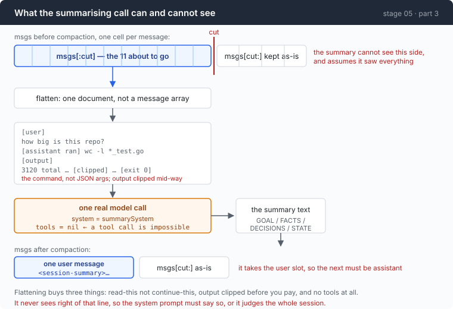

# Stage 05 · part 3: what goes back — the summary is a model call that can lie

[← back to stage 05](README.md) · previous: [2 · when](2-when.md) · next: [4 · memory](4-memory.md)

> One sentence added to the summariser's system prompt changed "Chunks 2–8 were
> never run" into "Chunks 2–8 remain outstanding as of the end of this
> transcript." The first was false, and nothing in the agent could have caught
> it.

---

## The problem

You have decided to drop messages 0 to 10. Something has to go in their place,
because the model still needs to know what the task was, which files matter, and
what has already been tried.

So: ask a model to summarise them. That is one API call, and three things about
it are easy to miss.

**It costs.** A real call, on the real model, at the real rate. Every
implementation that treats compaction as an internal detail hides this, and then
nobody can reconcile the bill.

**It is lossy, and you chose what to lose.** The summariser keeps what its
instructions tell it to keep. If those instructions say "summarise the
conversation", it will keep the *narrative* — which is the cheapest thing in the
transcript to regenerate.

**It can be confidently wrong about the session it is summarising**, in a
specific way that comes from how compaction works rather than from the model
being bad. It is shown the *first* part of a session and asked what happened. It
will tell you what happened, full stop — including about the part it cannot see.

---

## The idea

Flatten the doomed messages into a document, and ask a model to read it rather
than to continue it.



Flattening buys three separate things:

| | |
|---|---|
| the task changes | from "continue this conversation" to "read this document" |
| long output gets clipped | before you pay to send it |
| the call carries no tools | so a tool call is impossible, not merely discouraged |

And one thing the diagram makes obvious that the code cannot: the summariser
sees only the left of that line. The system prompt has to say so.

---

## Building it

The code is [`compact.go`](../code/compact.go).

### Step 1: flatten

```go
case BlockToolCall:
    cmd, err := parseBashArgs(blk.Args)
    if err != nil {
        cmd = blk.Args
    }
    fmt.Fprintf(&b, "[%s ran] %s\n", m.Role, clip(cmd, 400))
```

The **command**, not the JSON arguments. The summariser does not need to know
that the agent's tool-call protocol wraps a string in an object, and the
`tool_call_id`s do not appear at all — they are addressing, not content.

Passing the real message array instead looks more faithful and behaves worse:
given a conversation, a model continues it. It answers the last question again,
or issues the next tool call.

### Step 2: clip from the middle, not the head

```go
func clip(s string, max int) string {
    if max <= 0 || len(s) <= max {
        return s
    }
    head := max * 6 / 10
    tail := max - head
    return s[:head] + fmt.Sprintf("\n… [%d characters omitted] …\n", len(s)-max) + s[len(s)-tail:]
}
```

Same argument as stage 01's `truncate`, in a different place. A build log puts
the error at the end, a stack trace puts the cause at the end, and a diff puts
the interesting hunk anywhere. Keeping 60% of the head and 40% of the tail keeps
what the command announced and what it concluded, and loses the repetitive
middle, which was the part that was long.

### Step 3: tell it what to keep by

The selection criterion is the most portable idea in this file:

```
2. FACTS — everything discovered about this environment that would cost tool calls to rediscover: exact file paths, directory layouts, command output that mattered, version numbers, error messages verbatim, what was tried and failed.
```

**Keep what would cost tool calls to rediscover.** That is an economic test, not
a semantic one, and a model can apply it far more reliably than "keep what is
important". A file path that took three greps to find is worth a line. A
paragraph of the agent narrating its own plan is worth nothing, because
regenerating it costs nothing.

### Step 4: the lie, and the sentence that fixes it

The first version of this produced, verbatim, in a real run:

```
4. STATE
- Not done: Chunks 2–8 were never run.
```

That was false. Chunk 2 *had* run — its call and its output were sitting in the
four messages being **kept**, which the summariser never saw.

Nothing downstream could catch this. The summary is injected as established
fact; the model reads "chunk 2 was never run" and re-runs it, or reports it as
outstanding to the user. The agent has been handed a confident falsehood by its
own memory.

The fix is one rule in the summariser's system prompt:

```
- You are reading only the EARLIER part of the session. More recent messages are being kept verbatim and will appear immediately after your summary, and you cannot see them. So never write that something was "never done", "not started" or "still outstanding" as a statement about the session — it may have happened in the part you cannot see. Say "as of the end of this transcript".
```

Same task, same model, next run:

```
4. STATE — Chunk 1 has been read (twice). Chunks 2–8 remain outstanding as of
the end of this transcript.
```

Still a summary of the same messages. No longer a claim about a session it could
not see.

The general lesson is worth more than the fix: **when you hand a model a partial
view, tell it the view is partial.** It cannot infer that, and it will not
hedge on its own.

### Step 5: give the summary an identity

```go
func summaryMsg(text string) Msg {
    return TextMsg(RoleUser, "<session-summary>\nThe earlier part of this session was compacted to fit the context window. This is the summary of what happened; treat it as established fact, not as a new request.\n\n"+
        strings.TrimSpace(text)+"\n</session-summary>")
}
```

It goes back as a **user** message, because there is nowhere else to put it —
and without the tag the model treats a wall of past-tense text as something the
user just typed, and answers it.

### Step 6: actually withhold the tools

```go
req, body, err := p.BuildRequest(summarySystem,
    []Msg{TextMsg(RoleUser, "Transcript to compact:\n\n"+transcript)},
    nil, c.maxTokens)
```

`nil` for tools. The system prompt also says "no tool calls", and that is
advisory; this is structural. The summariser is not an agent and should not be
able to behave like one, and the strongest way to say that is not to send it the
list.

### Step 7: an empty summary is a failure

```go
if strings.TrimSpace(res.Text) == "" {
    return msgs, fmt.Errorf("the summarising call returned no text (stop: %s)", res.RawStop)
}
```

Refusing to proceed is correct here. A compaction that replaces the history with
nothing does not fail loudly — **the agent simply forgets everything and carries
on sounding confident**, which is the worst available outcome.

Note `res.RawStop` in the message. Stage 03 kept the provider's literal stop
string for exactly this: when a summary comes back empty, what the provider
called it is the diagnosis.

### Step 8: say the cost at the moment it is caused

```go
bus.Emit(Event{
    Kind: KindCompactEnd, Text: res.Text,
    MsgsBefore: len(msgs), MsgsAfter: len(out),
    TokensBefore: before, TokensAfter: after,
    Millis: time.Since(started).Milliseconds(),
})
```

```go
bus.Emit(Event{
    Kind:         KindCacheInvalidated,
    TokensBefore: before,
    Text:         "the prompt prefix was rewritten — every cache entry from before this point is now unreachable, and the next call is a full-price miss",
})
```

The second one is the interesting event, and it reports something that has not
happened yet. The bill for a compaction arrives on the *next* call, as a
full-price prompt that looks like a regression. Announcing it here attaches the
number to its cause.

---

## Run it

```sh
cd sandbox && set -a && . ../.env && set +a
../agent --window 12000 --compact-at 0.5 --keep 0.25 --trace c.jsonl
> split BIGFILE into 8 chunks and summarise each one in turn
```

That prompt is chosen because it produces a session with an obvious, checkable
state: which chunks are done.

Afterwards, read the summary the agent wrote about itself:

```sh
jq -r 'select(.kind=="compact_end") | .text' c.jsonl
```

**What to watch for:**

- The `STATE` section. Compare it against what the trace shows actually
  happened, and specifically against the messages that were *kept*. This is
  where the bug in step 4 lives, and it is visible in one read.
- The `≡ compacted:` line's millisecond figure. That is wall clock the user
  waited for and no tutorial mentions.
- The two calls after it in the panel: `read 0`, then `read 512`.

---

## Measured

One compaction, reported by the agent:

```
≡ compacted: 15 → 5 messages · ~7714 → ~3556 tokens (-54%) · 6976ms
```

Seven seconds, three times in one session.

The cost of summarising, against a control that did the same eight commands
without compacting:

| | roomy (1 compaction) | none |
|---|---:|---:|
| output tokens | 2,004 | 865 |

**+132%.** Summaries are output tokens, and output is the expensive side of the
bill. This is the number most easily forgotten when reasoning about compaction,
because the visible saving is on the input side.

And the correctness result, which has no number: one sentence in a system prompt
turned a false statement about the session into a true one about the transcript.
That is not a measurement, but it is the most valuable thing in this document.

---

## Next

Everything so far keeps a *session* alive. Close the terminal and all of it is
gone — including whatever the agent worked out about your project in the first
twenty minutes.

[Part 4](4-memory.md) is memory as a file, and the harder half of it: given a
piece of context, where in the prompt is it allowed to live? Stage 04 made that
a question with a wrong answer that costs 3.4×.
