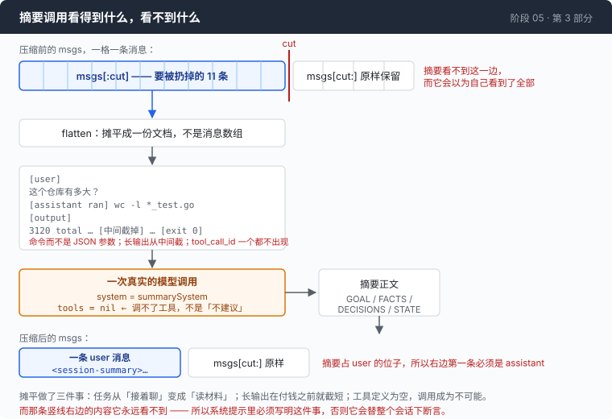

# 阶段 05 · 第 3 部分：拿什么填回去 —— 摘要是一次会撒谎的模型调用

[00](../../00-loop/doc/README_zh.md) → 01 → 02 → 03 → [04](../../04-the-cache/doc/README_zh.md) → `05` → [06](../../06-the-composer/doc/README_zh.md) → 07 → 08 → 09 → 10 → 11 → 12

> [返回本章目录](README_zh.md) · 上一部分：[离墙还有多远](2-when_zh.md) · 下一部分：[记忆，和被相信的上下文](4-memory_zh.md)

---

## 问题

前面十一条消息要删掉，得填一段东西进去。

最自然的写法是：把这十一条消息**原样**当成一次模型调用的 `messages` 发出去，系统提示改成"请总结上面的对话"。你已经有了这个数组，直接传就行。

跑一次看看会发生什么。模型不总结。它接着聊 —— 重新回答了最后那个问题，或者干脆又发起一次工具调用，要你去 `cat` 一个文件。

道理不难想：**你给它的是一段对话，而模型面对一段对话的默认动作是把它接下去。** 你在系统提示里写的那句"请总结"，和它眼前那十一条活生生的往来相比，分量太轻了。

第二个毛病更隐蔽，也更贵。摘要看的是会话的**前半截** —— 后面那截正被原样保留下来，它看不到。但它写出来的句子是关于**整个会话**的。于是它会用陈述语气告诉未来的自己：某件事从来没做过。而那件事恰恰在它看不到的那几条消息里刚刚做完。

一段摘要撒的谎，会被后面每一轮当成既定事实。

---

## 办法

两件事，都在改变"这次调用是什么任务"这个定性：

**把对话摊平成一份文档。** 不是 `messages` 数组，是一段带标记的纯文本。任务从"接着聊"变成"读这份材料并写一份纪要"。

**不带任何工具定义。** 不是在提示里劝它别调工具，是让它**没有工具可调**。



图里那条竖线是这一部分的关键：摘要调用只看得到 `msgs[:cut]`。保留的那一截就在它右边，紧挨着，它一个字都看不到。系统提示里必须有一句话告诉它这件事，否则它会以为自己看到的就是全部。

---

## 怎么做的

### 第 1 步：摊平

```go
			case BlockText:
				fmt.Fprintf(&b, "[%s]\n%s\n\n", m.Role, clip(blk.Text, maxBlock))
			case BlockToolCall:
				// ...
				fmt.Fprintf(&b, "[%s ran] %s\n", m.Role, clip(cmd, 400))
			case BlockToolResult:
				fmt.Fprintf(&b, "[output]\n%s\n\n", clip(blk.Text, maxBlock))
```

工具调用渲染成命令本身，不是那段 JSON 参数。`parseBashArgs` 解不出来才退回原始参数。摘要要读的是"它跑了 `wc -l *_test.go`"，不是 `{"command":"wc -l *_test.go | tail -1"}`。

摊平还顺手带来两样东西：长的工具输出可以在**付钱之前**截短，而且 tool_call_id 这类东西根本不会出现在文本里 —— 有一条测试专门盯着这一点，因为泄漏进摘要的 id 会在下一轮变成一个指向不存在调用的引用。

### 第 2 步：从中间截，不从头截

```go
func clip(s string, max int) string {
	if max <= 0 || len(s) <= max {
		return s
	}
	head := max * 6 / 10
	tail := max - head
	return s[:head] + fmt.Sprintf("\n… [%d characters omitted] …\n", len(s)-max) + s[len(s)-tail:]
}
```

保留前 60%、后 40%，扔中间。

条件反射是"留开头"，而对命令输出来说这正好是错的。构建日志把错误放在最后，堆栈把根因放在最后，`diff` 的关键 hunk 可能在任何地方。留住两头，等于留住了这条命令**宣布要做什么**和**最后得到了什么**，丢掉的是重复的中段 —— 而中段正是它变长的原因。

### 第 3 步：告诉它按什么标准留

系统提示的第一句就把身份说死：

```go
const summarySystem = `You are compacting a coding-agent session transcript so the agent can continue in a smaller context window. You are not continuing the session and you are not answering the user.
```

四个小节里，第二个的选取标准值得单拿出来：

```go
2. FACTS — everything discovered about this environment that would cost tool calls to rediscover: exact file paths, directory layouts, command output that mattered, version numbers, error messages verbatim, what was tried and failed.
```

判据是**"重新发现它要花多少次工具调用"** —— 一个经济学判据，不是语义判据。这比"保留重要的内容"好用得多：一个 grep 了三次才找到的路径值一行；模型自己那段"我现在去看看这个文件"的旁白值零，因为重新生成它不花任何东西。

### 第 4 步：那句谎，和修它的那一句话

第一版没有告诉摘要它只看到了前半截。它写出来的原文是：

```
4. STATE
- Not done: Chunks 2–8 were never run.
```

这句话是假的。chunk 2 已经跑过了，它那次调用和那次输出就在**正被保留下来**的四条消息里 —— 而摘要没看到那四条。

修法是往系统提示里加一段界定：

```go
- You are reading only the EARLIER part of the session. More recent messages are being kept verbatim and will appear immediately after your summary, and you cannot see them. So never write that something was "never done", "not started" or "still outstanding" as a statement about the session — it may have happened in the part you cannot see. Say "as of the end of this transcript".
```

同一个任务、同一个模型，再跑一次：

```
4. STATE — Chunk 1 has been read (twice). Chunks 2–8 remain outstanding as of the end of this transcript.
```

信息量一点没少，断言的范围缩到了它真正看得见的地方。

值得注意的是，这不是靠"让模型更小心"解决的。是把**它看不到什么**这件事写进了提示里。模型没法自己推断出这一点：它眼前的材料看起来就是完整的一份。

### 第 5 步：给摘要一个身份

```go
func summaryMsg(text string) Msg {
	return TextMsg(RoleUser, "<session-summary>\nThe earlier part of this session was compacted to fit the context window. This is the summary of what happened; treat it as established fact, not as a new request.\n\n"+
		strings.TrimSpace(text)+"\n</session-summary>")
}
```

它以一条 user 消息的身份进历史（这也是第 1 部分那条"只能切在 assistant 之前"的来源）。标签不能省：不带标签的话，模型会把这一大段过去时的文字当成用户刚刚输入的东西，然后去回应它。带上标签，它就是背景材料 —— 它本来就是背景材料。

### 第 6 步：真的不给工具

```go
	transcript := flatten(msgs[:cut], 4000)
```

```go
	req, body, err := p.BuildRequest(summarySystem,
		[]Msg{TextMsg(RoleUser, "Transcript to compact:\n\n"+transcript)},
		nil, c.maxTokens)
```

第三个参数是 `nil`。工具定义那一项是空的，所以这次调用里发起工具调用不是"不建议"，是**做不到**。

`c.maxTokens` 是 2048。摘要有上限是对的：一段和原文差不多长的摘要没有意义。

### 第 7 步：空摘要要当成失败

```go
	if strings.TrimSpace(res.Text) == "" {
		return msgs, fmt.Errorf("the summarising call returned no text (stop: %s)", res.RawStop)
	}
```

这一支必须存在，而且必须让整次压缩失败、历史保持原样。

否则的话，`out` 会变成一段空摘要加上尾巴，而这个失败**不会有任何声音**：agent 只是把前面全忘了，然后继续用非常自信的语气说话。这是本章所有失败模式里最难在事后认出来的一种 —— 因为它看上去完全正常。

### 第 8 步：在造成它的那一刻说出代价

```go
	out := append([]Msg{summaryMsg(res.Text)}, msgs[cut:]...)
	c.count++
```

```go
	bus.Emit(Event{
		Kind:         KindCacheInvalidated,
		TokensBefore: before,
		Text:         "the prompt prefix was rewritten — every cache entry from before this point is now unreachable, and the next call is a full-price miss",
	})
```

压缩本身有三个事件：开始、结束、以及这一条。前两个报的是省下了多少，第三个报的是花掉了什么。

这条消息在**压缩发生的那一刻**打出来，而它的账单要到**下一次调用**才到。中间隔着一次调用，足够让人把那次全价读当成一次莫名其妙的退化。一个不报告自己代价的压缩器，是账单最后对不上的直接原因 —— 摘要调用是一次真实的模型调用，走真实的模型，按真实的费率计费，而它在几乎所有把压缩当内部细节的实现里都是隐形的。

---

## 跑一下

```sh
cd sandbox/s05
../../agent --providers ../../providers.json --window 12000 --compact-at 0.5 --keep 0.25 --trace run.jsonl
```

让它做一件需要连续读好几段材料的事，比如把一个几百行的文件分成八块逐块读、逐块记要点。读到第三四块的时候压缩就会自己发生。也可以直接敲 `/compact` 手动触发一次。

摘要全文在 trace 里：

```sh
jq -r 'select(.kind=="compact_end") | .text' run.jsonl
```

**观察重点：**

- 屏幕上这一行，`≡ compacted: 15 → 5 messages · ~7714 → ~3556 tokens (-54%) · 6976ms`。最后那个数是这次摘要花掉的墙上时间。
- 紧跟着的红色 `!` 一行，然后**看下一次调用的缓存条** —— 绿色整条消失。这两件事之间隔着一次调用，因果就在这里。
- 读一遍摘要正文的 STATE 小节。找有没有"某某事没做"这样的句子，再回头看被保留的那几条消息里是不是刚好做了。这就是第 4 步那句谎，在你自己的会话里。
- 摘要里的路径和命令要和原文逐字一致。改写过的文件名是最坏的一种损耗 —— 后面几轮会拿着一个不存在的路径去操作。

---

## 量一量

一次压缩事件的实测：

```
≡ compacted: 15 → 5 messages · ~7714 → ~3556 tokens (-54%) · 6976ms
```

十五条消息变五条，估算 token 少了 54%，花了大约 7 秒。

（第 2 部分那个 `predicted ~3556 billed 2842 +25.1%` 就是这同一次压缩：`~3556` 是它对自己产物的估算，`2842` 是下一次调用的账单。）

代价这一侧，在同一段会话的逐次调用里看得最清楚 —— tight 组，三次压缩中的两次：

```
  #   kind     prompt   full   read  cached%
  6              5174   1654   3520     68%
  7              5258    138   5120     97%
  8 COMPACT      3310   3310      0      0%   ← 摘要调用本身
  9              2842   2330    512     18%   ← 压缩之后的第一次调用
 10              2927    111   2816     96%
 ...
 14              5701    133   5568     98%
 15 COMPACT      3383   3383      0      0%
 16              3624   3112    512     14%
 17              3709    125   3584     97%
```

**一次压缩是一次持续两个调用的缓存断供。** 第 8 号那次调用是摘要本身，缓存命中 0% —— 它是一份全新的提示，之前不可能存在。第 9 号是压缩之后的第一次真实调用，命中 18%，因为提示前缀刚被改写过。到第 10 号才回到 96%。

同一段会话里，这个模式出现了三次。

---

## 接下来

到这里，一段会话可以一直跑下去了。上下文会涨、会被压、再涨、再被压，锯齿形地活着。

然后你按了 Ctrl-C。

明天早上重开，agent 又是一张白纸。它昨天花了三条命令才找到的那个配置文件在哪儿，它不知道；你昨天明确说过"别动 `generated/`"，它也不知道。它会把昨天的活重新干一遍，用你的钱。

[第 4 部分](4-memory_zh.md) 用一个文件解决这件事 —— 顺便发现，注入进去的上下文会被**无条件相信**，包括它是错的那些时候。
