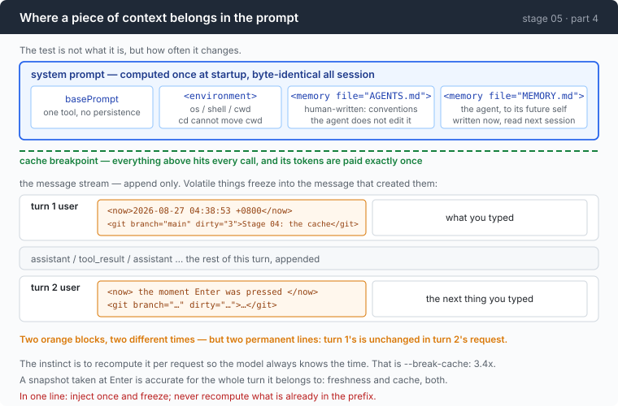

# Stage 05 · part 4: memory, and context that gets believed

[← back to stage 05](README.md) · previous: [3 · the summary](3-summary.md)

> Memory is a file. The interesting half of this document is not memory, it is
> **placement** — and the first real run of the feature made the agent look in a
> directory that did not exist, in preference to the one it was standing in.

---

## The problem

Twenty minutes into a session the agent has worked out that the tests live under
`internal/`, that the build needs a flag, and that one directory is generated
and must not be edited.

You close the terminal. Tomorrow you explain all of it again.

That is the obvious problem, and the obvious answer — write it down somewhere —
has a second problem hiding behind it. Anything you write down has to go
*somewhere in the prompt*, and stage 04 established that where you put a thing
decides whether your cache survives. Get that wrong and a helpful feature costs
3.4×.

---

## The idea

Two answers, one for each half.

**Memory is a file.** The agent reads it with `cat` and writes it with `>>`.
That is not a teaching simplification; it is what the tools you use every day
do. A file is greppable, diffable, reviewable, versionable, and editable by the
human whose project it describes — five properties an embedding index does not
have, in exchange for a similarity search that `grep` would have covered.

**Placement is decided by volatility, not by content.**



| how often its value changes | where it goes |
|---|---|
| stable for the session | the system prompt, before the cache breakpoint |
| volatile | frozen into a message at the moment that message is created |

---

## Building it

The code is [`memory.go`](../code/memory.go).

### Step 1: two files, split by author

```go
var memoryFiles = []string{"AGENTS.md", "MEMORY.md"}
```

```go
const memoryFileForWriting = "MEMORY.md"
```

The split is by **who writes it**, not by what is in it.

`AGENTS.md` is written by a human, for the agent: conventions, build commands,
"do not touch `generated/`" — the things a new colleague is told on day one. The
agent does not edit it.

`MEMORY.md` is written by the agent, for its future self: discoveries that cost
tool calls to make.

Keeping them apart means a human can review what the agent decided to remember
without wading through their own instructions, and can delete a bad memory with
an editor. **An agent that writes into the human's file eventually argues with
it.**

### Step 2: read them at startup, and only at startup

```go
func loadMemory(dir string, bus *Bus) (string, []string) {
```

```go
fmt.Fprintf(&b, "<memory file=%q>\n%s\n</memory>\n\n", name, strings.TrimSpace(string(raw)))
```

Note what this does *not* do: watch the files, re-read them per turn, or notice
that the agent just appended to `MEMORY.md`.

That is a cache decision rather than an oversight. Memory sits in the system
prompt, so re-reading it mid-session would rewrite the prefix and invalidate
everything. **A note written now takes effect next session.** Trading one turn
of latency for a session of cache hits is the right side of that trade, and it
is worth knowing you made it rather than discovering it.

### Step 3: tell the model the file exists

Loading a file into the prompt is not the same as the model knowing it can write
to one. The system prompt says so, and names the command — which is the whole
interface, because the agent already has a shell.

### Step 4: give it a command anyway

```go
func remember(dir, note string) error {
```

```go
_, err = fmt.Fprintf(f, "\n- (%s) %s\n", time.Now().Format("2006-01-02"), strings.TrimSpace(note))
```

Why a Go function at all, when the agent could run `echo … >> MEMORY.md` itself?

Because it could and it will not. Leaving memory entirely to the model's
discretion means it happens roughly never — nothing in the current turn rewards
writing a note. **Every agent that actually accumulates useful memory has an
explicit trigger**: a command, an end-of-session hook, a prompt that asks. The
mechanism being trivially simple does not make the policy question go away.

The datestamp is not decoration either. A memory whose age you cannot tell is a
memory you cannot decide to delete, and six months of undated notes is a file
nobody prunes and everybody stops reading.

### Step 5: the stable things go in the system prompt

```go
func stableContext(shell, cwd string) string {
    return fmt.Sprintf(`<environment>
os: %s/%s
shell: %s
working directory: %s
</environment>`, runtime.GOOS, runtime.GOARCH, shell, cwd)
}
```

`cwd` is in here rather than in the volatile block for a reason that is a
property of this agent rather than of directories in general: **the shell is not
persistent.** Each command runs in a fresh process, so `cd` inside a command
cannot move the agent.

Give the agent a persistent shell and `cwd` becomes volatile and has to move to
the other block. Worth noticing how a change in the execution model propagates
straight into the cache layout.

### Step 6: the moving things get probed once and frozen

```go
func volatileContext(shell string, now time.Time) string {
```

```go
const gitProbe = `git rev-parse --abbrev-ref HEAD 2>/dev/null && ` +
    `git status --porcelain 2>/dev/null | wc -l && ` +
    `git log -1 --format=%s 2>/dev/null || true`
```

One command, one process, three facts. The `|| true` matters: this runs in
directories that are not repositories, and a context probe that reports its own
failure as content teaches the model that its environment is broken.

Running git costs a process. That is affordable once per user turn and would not
be affordable once per request — which is another reason the snapshot attaches
to the user's message rather than being rebuilt at request time. The cheap design
and the cache-correct design are the same design here, which usually means the
boundary is in the right place.

### Step 7: two blocks, not one string

```go
func userTurn(text, volatile string) Msg {
    m := Msg{Role: RoleUser}
    if volatile != "" {
        m.Blocks = append(m.Blocks, Block{Kind: BlockText, Text: volatile + "\n\n"})
    }
    m.Blocks = append(m.Blocks, Block{Kind: BlockText, Text: text})
    return m
}
```

Two blocks rather than one concatenated string, because stage 06 renders them
differently: one view shows exactly what was injected, another shows the message
as the model received it. Merging them here makes that distinction
unrecoverable — and "what did the model actually see" is a question you can only
answer if you never threw the answer away.

### Step 8: the rule in one line

The instinct with volatile context is to keep it **fresh** — recompute the
timestamp on every request so the model always knows the time. That is precisely
stage 04's `--break-cache` experiment, and it measured 3.4×.

The resolution is that "fresh" and "in the prefix" are the two things you cannot
have together, and freshness is the one you can give up almost for free. A
snapshot taken when the user pressed Enter is accurate for the whole turn it
belongs to, and afterwards it sits in history unchanged — which is exactly what
a byte-stable prefix means.

So the model gets fresh information every turn **and** the cache survives,
because each turn's snapshot is a different permanent line rather than the same
line with a moving value.

> **Inject once and freeze; never recompute what is already in the prefix.**

---

## Run it

### Memory really does cross sessions

```sh
cd sandbox && set -a && . ../.env && set +a
../agent
> the tests in this project only pass with -tags=integration. remember that.
> exit
```

```sh
cat MEMORY.md
../agent
> how do I run the tests here?
```

**What to watch for:** the second session answers without looking, and the
startup line reports which memory files it loaded and how big they were. Those
bytes are in your prefix on every request of the session — which is why they are
worth reporting rather than hiding.

### Injected context gets believed

This one is worth doing deliberately, because it is the failure the feature
brings with it.

```sh
mkdir -p sandbox/s05 && cd sandbox/s05
cp ../../AGENTS.md .            # this file mentions docs/wire-notes.md
cp ../../external/wire-notes.md .
../../agent
> how many lines is wire-notes.md?
```

**What to watch for:** the agent runs `wc -l docs/wire-notes.md` and gets
`No such file or directory`. The file is in the directory it is standing in. It
believed a path mentioned in its system prompt over the filesystem in front of
it.

That is the same mechanism as the feature, seen from the other side. **Injected
context is not a hint; it is treated as fact**, and a stale line in `AGENTS.md`
is a lie the agent will act on. It is also the case for the datestamp in step 4,
and for stage 15's argument that a memory needs an expiry.

---

## Measured

No token measurement here — the interesting result is behavioural, and it is the
one above: given a system prompt naming `docs/wire-notes.md` and a working
directory containing `wire-notes.md`, the agent looked in the directory that did
not exist.

The volatile snapshot, as it appears frozen in history:

```
<now>2026-08-27 04:38:53 +0800</now>
<git branch="main" dirty="3">Stage 04: the cache</git>
```

Turn 2 gets a different one. Turn 1's is byte-identical in turn 2's request,
which is what makes both of them free after the first send.

---

## Next

[Back to stage 05](README.md) for the three-arm measurement, or on to
[stage 06](../../06-the-composer/doc/README.md), which builds the thing this
whole chapter has been working around: a way to look at a session that is not
`jq` over a JSONL file.
