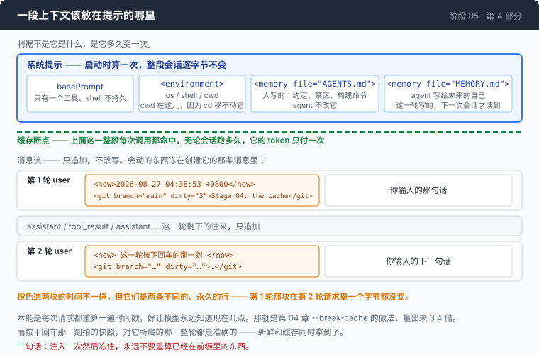

# 阶段 05 · 第 4 部分：记忆，和被相信的上下文

[00](../../00-loop/doc/README_zh.md) → 01 → 02 → 03 → [04](../../04-the-cache/doc/README_zh.md) → `05` → [06](../../06-the-composer/doc/README_zh.md) → 07 → 08 → 09 → 10 → 11 → 12

> [返回本章目录](README_zh.md) · 上一部分：[拿什么填回去](3-summary_zh.md)

---

## 问题

昨天你和这个 agent 一起干了两个小时。它翻了三次目录才找到那个配置文件在 `config/local/` 底下；它跑错了一次构建命令，你告诉它这个项目要用 `make check` 而不是 `go test`；你还明确说过 `generated/` 那个目录谁都不许动。

今天早上你重开一个会话。

它翻了三次目录才找到那个配置文件。它跑了 `go test`。然后它开始改 `generated/` 里的文件。

这不是它笨。是这个循环里**没有任何东西活过进程的生命周期** —— `msgs` 是个局部变量，进程一退就没了。昨天那两个小时里积累的每一条事实，都随着那个数组一起消失了。你付钱买过的东西，今天要再买一遍。

这个问题的标准答案是向量库：把过去的对话切块、做嵌入、建索引，每轮检索最相关的几段塞回去。

先看看真正需要的是什么：几十行事实，人也读得懂，需要的时候整份拿出来。**几十行文本用不着相似度搜索。** 用一个文件，你还顺手得到五样嵌入索引给不了的东西：可以 grep，可以 diff，可以 review，可以进版本控制，而且**项目的主人可以用编辑器直接改它**。

---

## 办法

记忆是一个文件。agent 用 `cat` 读它，用 `>>` 写它。

难的那一半不是记忆，是**位置**：一段要注入的上下文，应该放在提示的哪里？第 04 章已经定了规矩 —— 前缀必须逐字节稳定，否则缓存全灭。这一部分把它变成一条只有两种情况的规则，而判据不是这段内容是什么，而是**它多久变一次**。



| 这段上下文 | 多久变一次 | 放哪儿 |
|---|---|---|
| 记忆文件、cwd、OS、shell、模型上限 | 整个进程都不变 | 系统提示，缓存断点之前。写一次，缓存一辈子 |
| 时间、git HEAD、工作区脏不脏 | 每一轮都可能变 | 冻进创建它的那条消息里，之后永不重算 |

第二行是所有人都会做错的那一行，而且错的方向是花钱的方向。本能是让易变的上下文**保持新鲜** —— 每次请求都重算一遍时间戳，好让模型永远知道现在几点。那正是第 04 章 `--break-cache` 那个实验，量出来是 3.4 倍。

解法是承认"新鲜"和"在前缀里"这两件事不能同时要，而**新鲜是那件几乎可以免费让掉的**：用户按下回车那一刻拍的快照，对它所属的那一整轮都是准确的，之后它留在历史里再也不变 —— 而这正好就是"前缀逐字节稳定"的字面含义。每一轮都有新信息**并且**缓存活着，因为每一轮的快照是一条不同的、永久的行，不是同一行里一个会动的值。

一句话：**注入一次然后冻住，永远不要重算已经在前缀里的东西。**

---

## 怎么做的

代码在 [`05-live-forever/code/memory.go`](../code/memory.go)。

### 第 1 步：两个文件，按作者分

```go
var memoryFiles = []string{"AGENTS.md", "MEMORY.md"}
```

```go
const memoryFileForWriting = "MEMORY.md"
```

分法不是按内容，是按**谁写的**。

`AGENTS.md` 是人写给 agent 的：约定、构建命令、"别动 `generated/`" —— 一个新同事第一天会被告知的那些事。agent 不该改它。`MEMORY.md` 是 agent 写给未来的自己的：那些花了工具调用才发现的东西。

分开的好处很实际：人可以只看 agent 决定记下来的东西，不用在自己写的说明里翻；发现一条记错了，用编辑器删掉就行。一个往人的文件里写字的 agent，早晚会和那个文件吵架。

### 第 2 步：启动时读进来

```go
	for _, name := range memoryFiles {
		path := filepath.Join(dir, name)
		raw, err := os.ReadFile(path)
		if err != nil || len(strings.TrimSpace(string(raw))) == 0 {
			continue
		}
		found = append(found, name)
		fmt.Fprintf(&b, "<memory file=%q>\n%s\n</memory>\n\n", name, strings.TrimSpace(string(raw)))
		// ...
	}
```

文件不存在、读不出来、内容是空白 —— 三种情况一样处理：跳过。记忆是可选的，一个空目录里的 agent 应该照样能用。

值得注意的是这个函数**没有**做的事：它不监听文件，不每轮重读，也不会注意到 agent 刚刚往 `MEMORY.md` 里追加了一行。

这不是偷懒，是一个缓存决定。记忆坐在系统提示里，中途重读就会改写前缀，把整段会话的缓存全部作废。所以**现在写下的笔记，下一次会话才生效。** 用一轮的延迟换一整段会话的缓存命中，这笔交易是划算的那一侧 —— 但你得知道自己做了这笔交易。

### 第 3 步：告诉它这个文件的存在

整个长期记忆功能在提示里就这么几句：

```go
When you learn something about this project that would cost you tool calls to
rediscover in a future session — a build command, where something lives, a
gotcha, a decision the user made — append it:
```

```go
Record what you learned, not what you did. Notes written now take effect in your
next session, not this one.`
```

最后那两行决定了这个文件半年后还值不值得读。"记你学到的，不是你做了什么"，是知识库和日记之间的全部差别 —— 一份日记只会越长越没用。

### 第 4 步：还是给它一条命令

```go
func remember(dir, note string) error {
	path := filepath.Join(dir, memoryFileForWriting)
	f, err := os.OpenFile(path, os.O_APPEND|os.O_CREATE|os.O_WRONLY, 0o644)
	if err != nil {
		return err
	}
	defer f.Close()
	_, err = fmt.Fprintf(f, "\n- (%s) %s\n", time.Now().Format("2006-01-02"), strings.TrimSpace(note))
	return err
}
```

这里有个值得说清楚的问题：agent 自己就能跑 `echo ... >> MEMORY.md`，提示里也写了，那为什么还要一个 Go 函数？

因为完全交给模型自觉，这件事**基本上不会发生**。模型不会主动决定去写笔记 —— 当前这一轮里没有任何东西奖励这个动作，写不写对眼前的任务都没影响。真正能攒下有用记忆的 agent，都有一个明确的触发器：一条命令、一个会话结束时的钩子、一句主动问它的提示词。**机制简单到不值一提，并不代表策略问题跟着消失了。**

日期戳也不是装饰。一条看不出年龄的笔记，是一条你不敢删的笔记；半年的无日期笔记会变成一个没人清理、也没人再读的文件。

### 第 5 步：不变的那些，进系统提示

```go
func stableContext(shell, cwd string) string {
	return fmt.Sprintf(`<environment>
os: %s/%s
shell: %s
working directory: %s
</environment>`, runtime.GOOS, runtime.GOARCH, shell, cwd)
}
```

cwd 在这里而不在易变那一格，理由要绕一下才看得清：这个 agent 的 shell **不是持久的**，每条命令都是一个新进程（第 00 章），所以命令里的 `cd` 移不动它。

唯一能让这一行变错的改动是：给 agent 一个持久 shell。那一刻 cwd 就变成易变的了，必须搬到另一格去。执行模型上的一个改动，直接传导到缓存布局 —— 值得留意这条链子有多短。

### 第 6 步：会动的那些，一次探测，冻住

```go
	const gitProbe = `git rev-parse --abbrev-ref HEAD 2>/dev/null && ` +
		`git status --porcelain 2>/dev/null | wc -l && ` +
		`git log -1 --format=%s 2>/dev/null || true`
	r := runBash(shell, gitProbe, 3*time.Second)
```

一条命令，一个进程，三样东西。这个代价在**每条用户消息一次**是可以接受的，在**每次请求一次**就不行了 —— 这是快照挂在用户消息上、而不是在拼请求时重建的另一个理由。

`|| true` 那一段要紧。这个 agent 会在不是 git 仓库的目录里跑，而一个把失败当成内容报上去的环境探测，等于在教模型"你的环境是坏的"。

冻在历史里之后长这样：

```
<now>2026-08-27 04:38:53 +0800</now>
<git branch="main" dirty="3">Stage 04: the cache</git>
```

### 第 7 步：两个块，不是一个字符串

```go
func userTurn(text, volatile string) Msg {
	m := Msg{Role: RoleUser}
	if volatile != "" {
		m.Blocks = append(m.Blocks, Block{Kind: BlockText, Text: volatile + "\n\n"})
	}
	m.Blocks = append(m.Blocks, Block{Kind: BlockText, Text: text})
	return m
}
```

快照和用户原话拼成一个字符串会更省事，而且发出去的字节完全一样。分成两个块是为了第 06 章：那一章要分别渲染"注入了什么"和"模型收到的这条消息长什么样"。在这里合并掉，那个区分就永久找不回来了。

而"模型到底看到了什么"这种问题，只有在你从来没把答案扔掉的情况下才回答得出来。

### 第 8 步：拼起来

```go
	full := basePrompt + "\n\n" + stableContext(shell, wd) + memoryPrompt
	if memory != "" {
		full += "\n\n" + memory
	}
	sys := func() string { return full }
```

`sys` 是个闭包，返回一个启动时就算好的常量。它是函数而不是字符串，只为了让第 04 章 `--break-cache` 那个对照组还表达得出来 —— 一个每次请求重算的值，和一个算过一次的值，差别在这里才写得出来。

```go
		msgs = append(msgs, userTurn(line, volatileContext(shell, time.Now())))
		msgs = a.runTurn(msgs)
```

快照就在这一行拍下来，一次，然后冻进那条消息。

---

## 跑一下

### 记忆确实跨会话

```sh
cd sandbox/s05
set -a && . ../../.env && set +a
../../agent --providers ../../providers.json --window 12000
```

```
> /remember 这个项目的测试要用 make check，不是 go test
> exit
```

然后重开一次。启动的时候会多出一行 `≡ memory: …/MEMORY.md (…)`。这时候问它"这个项目怎么跑测试"，它不需要调用任何工具就能回答。

### 注入的上下文会被相信

这个实验值得亲手做一遍。在 `sandbox/s05` 里放两样东西：

1. 一份 `AGENTS.md`，里面提到某个文件在 `docs/wire-notes.md`；
2. 真正的 `wire-notes.md`，**就放在工作目录里**，不建 `docs/` 这一层。

启动 agent，问它：`wire-notes.md 有多少行？`

真实运行的结果是：它跑了 `wc -l docs/wire-notes.md`，拿到 `No such file or directory`。

**观察重点：**

- 它有 `ls`。一条命令就能看到真相，它没用 —— 它信了系统提示里的一句话，而不信它正站着的那个目录。
- 这不是幻觉。系统提示里那句话确实说了那个路径，模型只是把它当成了事实。**它本来就该当成事实** —— 你放进系统提示的东西，权重就是这么高的。
- 所以记忆功能的价值和它的风险是同一个机制：`MEMORY.md` 里一条过时的笔记，比没有这条笔记更糟，因为它会让 agent 跳过验证直接动手。第 4 步那个日期戳，是为这一刻准备的。
- 一个务实的推论：注入的事实要尽量写成可验证的形式（"构建命令是 `make check`"），而不是写成断言性的地图（"配置都在 `docs/` 底下"）。前者错了会立刻失败，后者错了会让 agent 一路走偏。

---

## 接下来

这一章结束时，agent 活得下去了：会话之内靠压缩，会话之间靠一个文件。

代价是屏幕上那些东西再也拼不出真相了。第 30 轮的时候，模型实际看到的是一段摘要、一截被保留的尾巴、每条用户消息里冻着的一个快照、加上系统提示里的两个记忆文件 —— 而屏幕上从来没有任何一处显示过这个组合。

trace 文件里全都有。`--trace` 写出来的 JSONL 一行一个事件，一次长会话下来几十 MB，一行本身就有几万个字符。`jq` 查得动它，人读不动它。

[阶段 06](../../06-the-composer/doc/README_zh.md) 在这同一个文件上开三个视图：你看到的、模型看到的、线上真正传输的。
