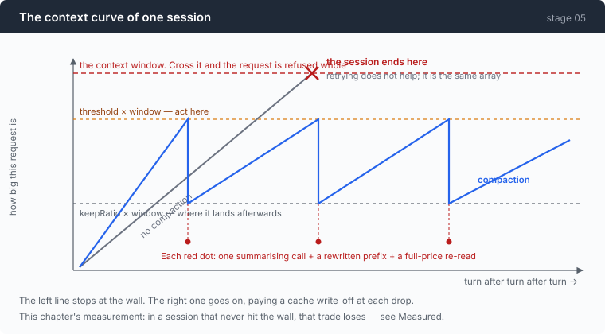

# Stage 05: Live Forever — outliving the context window

[04](../../04-the-cache/doc/README.md) → `05` → [06](../../06-the-composer/doc/README.md) → 07 → 08 → 09 → 10 → 11 → 12

> Compaction is taught everywhere as a way to control context cost. Measured
> against an identical run that did not compact, it cost **+25% in
> full-price-equivalent tokens, +132% in output tokens, and +19% in wall
> clock** — and lost information on top. It is a survival mechanism, not an
> optimisation, and the design advice inverts accordingly.

---

## The problem

Stage 04 made a long conversation affordable. It did not make one possible.

Watch the `in` column from that chapter's best arm: 535, 10348, 10484, 10655,
10805, 11114, 11276. It only goes one way, because the conversation only grows,
and a context window is a hard number. Cross it and the request is not
degraded, it is **refused** — mid-task, with the model holding everything it
had worked out, and no way to send it.

Retrying does not help. The next request is the same array.

So something has to leave. And the obvious way of making room collides head-on
with the previous chapter: removing old turns changes bytes near the **front**
of the prompt, which is exactly what invalidates the cache you just spent forty
lines earning.

---

## The idea

Replace the oldest part of the conversation with a summary of it, and keep
going.



One sentence, and four separate problems live inside it — which is why this
chapter is five documents rather than one.

| Part | Question | Why it is not obvious |
|---|---|---|
| [1 · the cut](1-cut.md) | where may a conversation be cut? | cut in the wrong place and the API rejects you *two turns later* |
| [2 · when](2-when.md) | how do you know you are near the wall? | you need a token count, and this repo has no tokenizer |
| [3 · the summary](3-summary.md) | what goes back in its place? | the summary is a model call, and it will confidently lie |
| [4 · memory](4-memory.md) | what should survive the session entirely? | and where in the prompt it may live, given stage 04 |

---

## Building it

Each part is its own document, in the order the code meets the problems. Read
them in sequence; each one's answer is the next one's premise.

The one thing that belongs here rather than in any of them is where the check
goes:

```go
base := len(a.system()) + toolChars()
if est := a.comp.estimate(msgs, base); a.comp.due(est) {
```

That sits at the top of the **tool loop**, not the top of the user loop.

The thing that fills a context window is not the conversation, it is the tool
output inside a single turn — one `find /` can add more than an hour of chat.
Check only between user messages and the wall gets hit mid-turn, which is the
one place there is no graceful recovery.

And the whole of it reports its own cost:

```go
bus.Emit(Event{
    Kind:         KindCacheInvalidated,
    TokensBefore: before,
    Text:         "the prompt prefix was rewritten — every cache entry from before this point is now unreachable, and the next call is a full-price miss",
})
```

The bill for a compaction comes due on the *next* call, and it arrives as a
number that looks like a regression. Saying so at the moment it is caused is the
difference between an instrument and a surprise.

---

## Run it

Three arms, one task, the same ten user messages in each:

```sh
go build -o agent ./05-live-forever/code
cd sandbox && set -a && . ../.env && set +a

../agent --window 12000 --compact-at 0.5  --keep 0.25 --trace tight.jsonl
../agent --window 12000 --compact-at 0.85 --keep 0.35 --trace roomy.jsonl
../agent --window 12000 --no-compact                  --trace none.jsonl
```

The window is deliberately small. A real 131k window would need an hour of
session per arm to reach; 12,000 reproduces the same mechanism in five minutes.

**What to watch for:**

- The `≡ compacted:` line, and the two calls after it. The panel's cache read
  drops to zero and takes two turns to recover.
- `└ context 5893 / 12000 (49.1%) · ≈3.7 B/tok` — the estimated ratio, live.
  Watch it move during a single session.
- The `tight` arm compacting three times while `roomy` compacts once, on the
  same work.

---

## Measured

| arm | compactions | prompt sent | full price | cache read | output | at 0.1× read | wall |
|---|---:|---:|---:|---:|---:|---:|---:|
| tight | 3 | 92,553 | 30,601 | 61,952 | 3,673 | **36,796** | 105s |
| roomy | 1 | 102,315 | 21,739 | 80,576 | 2,004 | **29,797** | 69s |
| none | 0 | 121,850 | 12,858 | 108,992 | 865 | **23,757** | 58s |

Read the first and last columns together. **The arm that sent the most tokens
paid the least**, because 89% of what `none` sent was cache reads at about a
tenth of the price.

`roomy` and `none` ran the **same eight commands**, so that pair is a clean
comparison with no confound. Against it, compaction cost:

- **+25%** full-price-equivalent tokens
- **+132%** output tokens — summaries are output, and output is the expensive side
- **+19%** wall clock

(`tight` ran three extra commands, all *before* its first compaction. That is
model variance rather than something compaction caused, but it inflates its row
by a few per cent, so the honest comparison is the other pair.)

Then there is the shape of the cost, visible per call inside the `tight` arm:

```
  #   kind     prompt   full   read  cached%
  7              5258    138   5120     97%
  8 COMPACT      3310   3310      0      0%   ← the summarising call
  9              2842   2330    512     18%   ← the first call after
 10              2927    111   2816     96%
```

**Compaction is a two-call cache outage.** The summarising call is a cold
prompt, and the first call after it re-reads a history whose prefix has just
been rewritten. Recovery to >95% takes until the third call. That happened three
times in one session.

One compaction event, in full:

```
≡ compacted: 15 → 5 messages · ~7714 → ~3556 tokens (-54%) · 6976ms
```

### What this changes about the advice

Every tutorial that exposes a threshold suggests something comfortable like
70%. The measurement says the opposite: **compact as late and as rarely as you
can.** And the knob that actually controls the frequency is not the threshold at
all — it is the *gap* between the threshold and the keep ratio, which
[part 2](2-when.md) works out in turns of your actual tool output.

### The caveat that keeps this honest

None of these sessions came near a real 131k window. On a session that would
genuinely hit the wall, compaction's cost is measured against a **dead session**
and wins by definition.

So the measurement does not say compaction is bad. It says compaction is not a
saving. Those are different claims, and only the second one is supported here.

---

## Next

The agent can now run for as long as you like. What it cannot do is show you
what happened.

Every number in this chapter — the two-call cache outage, the estimator's drift,
the exact fifteen messages that became five — came out of a trace file, read
afterwards with `jq`. That is a poor way to understand a session, and an
impossible way to understand one while it is running.

There is also a question this chapter opened and cannot answer from a terminal:
after a compaction, **what does the model actually see now?** Not the summary
text — the whole prompt, in order, as the model receives it. The scrollback
shows what was printed. The two are not the same thing, and the difference is
exactly where compaction bugs live.

[Stage 06](../../06-the-composer/doc/README.md) builds a three-view terminal UI
over any trace: what happened, what the model saw, and the raw bytes — on the
standard library, because the interesting parts of a terminal are what a
framework hides.
