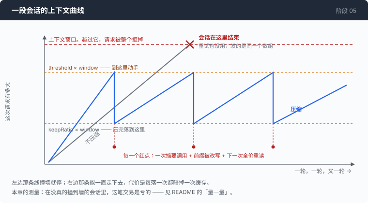

# 阶段 05：活得久一点 —— 让一段会话比它的上下文窗口活得更长

[00](../../00-loop/doc/README_zh.md) → 01 → 02 → 03 → [04](../../04-the-cache/doc/README_zh.md) → `05` → [06](../../06-the-composer/doc/README_zh.md) → 07 → 08 → 09 → 10 → 11 → 12

> 这一章把上下文窗口从一堵撞上去就停的墙，变成一个可以管理的预算。它也自己量了一遍这个办法值不值：在这几次会话里，压缩比不压缩更贵。

---

## 问题

第 04 章之后，"每次都重发整个数组"这件事不太痛了。命中缓存的那部分按十分之一收费，你可以放心让对话长下去。

于是你真的让它长下去了。一个不算大的任务：读几个文件，跑几次测试，中间有一次 `grep -rn` 把两百多行结果带了回来。第三十轮左右，你敲下回车，屏幕上既没有工具调用也没有回答，只有一行错误 —— 这次请求的长度超过了模型能接受的上限。

这次失败和前面所有的失败都不一样。

命令超时可以重跑，命令报错模型自己会读堆栈，网络抖动等一下就好。这一次没有"这一轮失败了"这回事：**请求根本没有被受理**，模型一个 token 都没看到。而且重试没有意义 —— 重试发出去的是同一个数组，它还是那么长。你唯一能做的是关掉重开，把二十九轮里查到的东西全部丢掉。

它来得也没有预兆。上一次成功的请求和这一次被拒的请求之间，只隔了一条 `cat`。

第 04 章让重发变便宜了，但**窗口没有因此变大一点**。一段会话能跑多久，仍然被一个固定的数字卡死。

---

## 办法

一个 agent 需要三个时间尺度上的上下文，前四章只做了第一个：

| 范围 | 靠什么活着 |
|---|---|
| 一次请求之内 | `messages` 数组，每次原样重发。第 00–04 章 |
| 一次会话之内 | 数组撑不下的时候，把前面一大截换成一段摘要 |
| 跨会话 | 一个文件 |

中间那行有个名字，叫压缩。做法一句话说得完：把对话前面一大截交给模型，让它写一段摘要，用这段摘要顶替掉那一截，然后接着跑。



图里那条锯齿就是这一章的全部形状，也是这一章要付的账单：每往下掉一次，提示的前缀就被改写一次，第 04 章攒了一整章的缓存在那一刻全部作废，下一次调用是全价。

有两件事最好现在就说清楚，免得读到后面觉得被骗了。

**摘要是有损的。** 你用一段几百字的纪要，换掉了十几条原始消息。换掉的那些里一定有以后会用到的东西，而且你不知道是哪些。这个机制的正确期望不是"上下文变小了"，而是"会话还没死"。

**压缩本身要花钱。** 那一次摘要调用走真实的模型、按真实的费率计费，还要赔上一次缓存。它在很多实现里是隐形的 —— 下面那节「量一量」就是把它称出来。

第三行更短：记忆是一个文件。agent 用 `cat` 读它，用 `>>` 写它。没有向量库，没有检索步骤。

---

## 怎么做的

一句话的想法，四个部分的细节。每一部分都是被前一部分逼出来的。

**[第 1 部分：剪一刀](1-cut_zh.md)** —— 一段对话只能从哪里断开。
`msgs[8:]` 这一刀砍下去，两轮之后服务端才拒绝你，而且报的是别的地方的错。协议只允许在一个位置切，这一部分找出它，并且用一个独立的检查把它钉住。

**[第 2 部分：离墙还有多远](2-when_zh.md)** —— 什么时候动手，以及留多少。
判断要在付钱之前做出来，但只有服务端知道 token 数，而且它只肯在事后告诉你。这一部分不装 tokenizer，用服务端自己报的数字校准出一个比值。顺带发现：决定压缩频率的不是那个人人都在调的阈值。

**[第 3 部分：拿什么填回去](3-summary_zh.md)** —— 那一次摘要调用。
摘要是一次真实的模型调用，花钱、花时间，而且会撒谎 —— 它只看得到会话的前半截，却会用陈述句描述整个会话。这一部分修的就是这句谎。

**[第 4 部分：记忆，和被相信的上下文](4-memory_zh.md)** —— 跨会话，以及注入的东西放在哪。
文件读进系统提示是简单的一半；难的一半是每一段注入的上下文该放在提示的哪个位置，判据只有一个：它多久变一次。这一部分还记录了这个功能第一次真跑起来时干的事 —— agent 去了一个不存在的目录，而它当时就站在正确的那个里面。

---

## 跑一下

```sh
go build -o agent ./05-live-forever/code

mkdir -p sandbox/s05 && cd sandbox/s05
set -a && . ../../.env && set +a
../../agent --providers ../../providers.json --window 12000 --compact-at 0.5 --keep 0.25
```

`--window 12000` 是这一章所有实验的关键。真实窗口是 131072，要撞到它得跑一两个小时；把窗口人为压到 12000，压缩会在三五轮之内发生，你可以在几分钟里看完整个过程。

给它一个会产生大量输出的任务，比如让它逐段读一个几百行的文件并逐段总结。然后：

- `/context` 打印当前对话折算成多少 token，以及估算用的比值
- `/compact` 立刻压一次，不等阈值
- `/remember <一句话>` 往 `MEMORY.md` 里追加一行

**观察重点：** 屏幕上那两行 `≡ compacting` / `≡ compacted`，紧跟着的那行红色 `!`，以及**再下一次调用**的缓存条 —— 绿色会整条消失。三件事的因果关系就是这一章。

下面这一节的三组数字，你可以自己跑出来。同一个任务、同一批输入，换三套参数，各写一份 trace：

```sh
../../agent --providers ../../providers.json --window 12000 --yolo \
    --compact-at 0.5  --keep 0.25 --trace tight.jsonl < task.txt
../../agent --providers ../../providers.json --window 12000 --yolo \
    --compact-at 0.85 --keep 0.35 --trace roomy.jsonl < task.txt
../../agent --providers ../../providers.json --window 12000 --yolo \
    --no-compact                  --trace none.jsonl  < task.txt
```

`task.txt` 是一份写好的输入，一行一句，从 stdin 喂进去 —— 三组必须读同一份文件，否则比出来的数没有意义。管道进来之后就没有终端可以问了，所以要 `--yolo`，也因此**必须在一个空目录里跑**。`--no-compact` 那一组是把阈值设成 0，压缩永不触发。

---

## 量一量

同一个任务，同一批输入（十条用户消息，从 trace 里逐条核对过是逐字节相同的），`--window 12000`，跑三组：

```
tight: --compact-at 0.5  --keep 0.25
roomy: --compact-at 0.85 --keep 0.35
none:  --no-compact
```

| 组 | 压缩次数 | 发出的 prompt | 全价 | 缓存读 | 输出 | 折合全价 | 墙上时间 |
|---|---:|---:|---:|---:|---:|---:|---:|
| tight | 3 | 92,553 | 30,601 | 61,952 | 3,673 | **36,796** | 105s |
| roomy | 1 | 102,315 | 21,739 | 80,576 | 2,004 | **29,797** | 69s |
| none | 0 | 121,850 | 12,858 | 108,992 | 865 | **23,757** | 58s |

"折合全价"那一列，是把缓存读按 0.1 倍折算之后加起来的合计 —— 也就是 `全价 + 缓存读 × 0.1`。三列原始数字都从 trace 里读出来：

```sh
jq -s '[.[] | select(.kind=="usage") | .usage]
       | {full: (map(.input) | add),
          read: (map(.cache_read // 0) | add),
          out:  (map(.output) | add)}' none.jsonl
```

每次调用的账单单独走一条 `usage` 事件，所以这样加不会重复计数。"压缩次数"数的是 `compact_end` 事件，"墙上时间"是第一条和最后一条事件的时间差。

**发出去最多的那一组，付的钱最少。** `none` 一共发了 121,850 个 prompt token，其中 108,992 个是缓存读，占 89%。

roomy 和 none 跑的是**同样的八条命令**，所以这两行可以直接相减，中间没有别的变量：

- 折合全价的 token：**+25%**
- 输出 token：**+132%**。摘要是输出，而输出是贵的那一侧
- 墙上时间：**+19%**

tight 那一行多跑了三条命令（`ls -la`、`cat task.txt`，还有一个重复读的块），三条都发生在它第一次压缩**之前**，是模型自己的抖动而不是压缩造成的，但确实把这一行抬高了几个百分点。

结论和几乎所有讲 agent 上下文的材料反着：**压缩不是省钱手段。** 三项指标全都更贵，而且摘要还是有损的 —— 你为更贵的账单换来的是一段比原文少的信息。

诚实的那半句必须跟在后面：**这三次会话没有一次接近真正的窗口。** 实验开在 12000 上，真实模型的窗口是 131072。一段真会撞墙的会话，压缩的对手是一段**已经死掉的**会话，那时候它赢得毫无悬念。

所以这个测量说的不是"压缩不好"，而是一句更精确的话：**压缩是保命机制，不是优化手段。** 顺着这句话，设计建议会整个反过来 —— 尽可能晚、尽可能少地压缩，而不是在一个听起来很稳妥的 70% 就动手。这个仓库自己的默认值 `--compact-at 0.70` 也在这句批评的范围里。

---

## 接下来

现在这个 agent 撑得过一段长会话了。撑过的每一次，都在 trace 文件里留下一条更长的记录：每次请求的完整 body、每次响应的每一个分片、每次压缩前后的 token 数、那段摘要的全文。

`--trace` 写出来的是 JSONL，一行一个事件。一次长会话下来是几十 MB，一行本身就有几万个字符。`jq` 能查询它，但没有人能读它。

而这一章刚好制造了一个只有读它才能回答的问题：**第 30 轮的时候，模型实际看到的是什么？** 那时候前面已经被压掉了两次，它看到的既不是你输入过的原文，也不是屏幕上滚过去的东西 —— 是一段摘要，加上一截被保留的尾巴，加上冻在每条用户消息里的环境快照。屏幕上没有任何一个地方显示过这个组合。

[阶段 06](../../06-the-composer/doc/README_zh.md) 在这个文件上开三个视图：你看到的、模型看到的、线上真正传输的。同一份 trace，三种读法。
