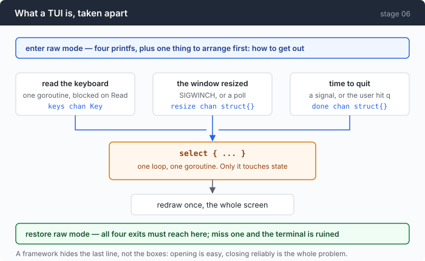
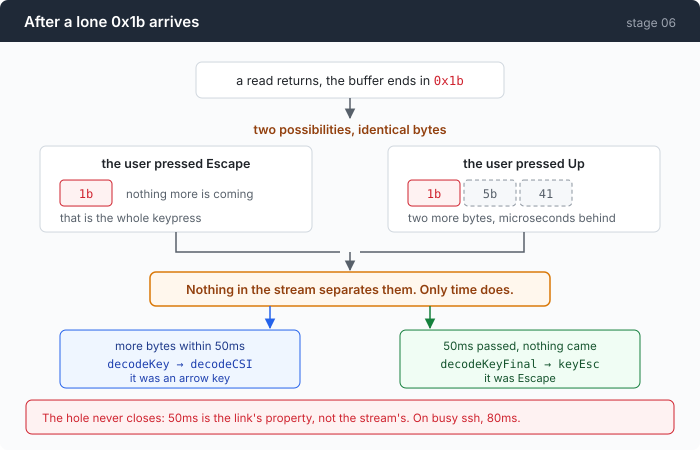
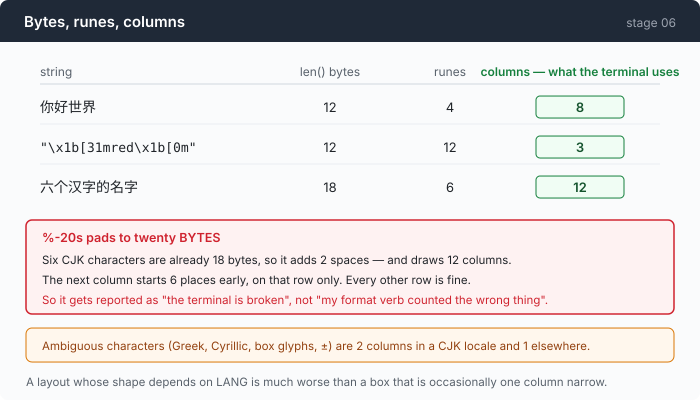

# Stage 06 · part 1: taking the terminal back — three things a TUI framework hides

[← back to stage 06](README.md)

> Entering raw mode is four `printf`s. Leaving it, on every path including the
> ones you did not plan, is the whole problem — and it is the first of three
> things a framework does for you that you should see once.

---

## The problem

You want a full-screen view over a trace, so you reach for a TUI library.

That is a reasonable decision and this chapter does not make it. The reason is
narrow: the three things a framework hides are the three things this chapter is
about.

**Raw mode is a global change to a device you do not own.** Your program turns
off line editing and echo on the user's terminal. If it exits without turning
them back on — and there are four ways to exit, and `os.Exit` skips every
`defer` — the user is left in a shell with no echo, no line editing, and no
cursor, wondering what they typed.

**The Escape key is ambiguous, and no amount of care fixes it.** A lone `0x1b`
is either Escape or the first byte of an arrow key still in flight. The bytes are
identical. Only elapsed time distinguishes them, and a slow link can beat the
timeout.

**A column is not a byte and not a rune.** `%-20s` pads to twenty *bytes*, so
one CJK filename shears your carefully aligned table in half, on that row only,
and the bug gets reported as "the terminal is broken".

A framework gets all three right and you learn none of them. Here, all three are
load-bearing for the views in the main chapter.

---

## The idea

A TUI is four parts, and only one of them is interesting.



Three producers into one `select`, one goroutine owning all state, one full
redraw per event. That part is about thirty lines.

The interesting part is the bar at the bottom of the diagram: **every exit path
has to reach the restore.**

---

## Building it

The code is [`term.go`](../code/term.go), [`keys.go`](../code/keys.go) and
[`width.go`](../code/width.go).

### Step 1: opening is four printfs

```go
io.WriteString(out, altScreenOn+cursorHide+mouseOn+pasteOn)
```

```go
altScreenOn  = "\x1b[?1049h"
```

The alternate screen is why a TUI can exit and leave your scrollback intact: you
draw on a second buffer, and closing it restores what was underneath, including
the scroll position.

The synchronised-output markers are worth knowing about:

```go
syncOn  = "\x1b[?2026h"
```

They tell the terminal "do not paint until I say I am done", which removes
tearing on a large redraw. They are safe to send unconditionally — a terminal
that does not know the sequence ignores it — which makes them the rare terminal
feature you do not have to detect.

### Step 2: closing is the entire problem

```go
io.WriteString(t.out, pasteOff+mouseOff+cursorShow+altScreenOff)
```

One line, and getting it to *run* is the work.

There is a specific trap here that is worth stating plainly: **`os.Exit` and
`log.Fatal` do not run deferred functions.** In raw mode that leaves the user's
terminal with no echo and no line editing, and prints your error message onto an
alternate screen that is about to be discarded — so they get a broken terminal
and no message.

### Step 3: four exits, and a real TUI takes all of them

| exit | how it arrives |
|---|---|
| the user pressed `q` | your own event loop |
| the input stream closed | `read` returns EOF |
| a signal | SIGINT, SIGTERM, SIGHUP |
| a panic | somewhere in the draw code |

The signal path is the one with a subtlety worth copying. The honest sequence is:
restore the terminal, reset the handler to default, then **re-send the signal to
your own process** — rather than `os.Exit(130)`. The two look the same in a
shell and are not: only the first lets a parent process tell "died on a signal"
from "exited non-zero".

### Step 4: `0x1b` is ambiguous and the hole never closes



A read returns and the buffer ends in `0x1b`. There are two possibilities and
the bytes are identical.

The decoder refuses to guess:

```go
func decodeKey(buf []byte) (key, int, bool) { return decodeOne(buf, false) }
```

```go
func decodeKeyFinal(buf []byte) (key, int, bool) { return decodeOne(buf, true) }
```

`decodeKey` returns `ok=false` on a lone ESC, meaning "this is a prefix, wait".
`decodeKeyFinal` is for the caller that has already waited, and resolves it to
`keyEsc`.

Two functions rather than one with a flag, because the *caller* is the only
thing that knows whether time has passed — and encoding that knowledge in the
call site is what stops somebody adding a "reasonable default" later.

The same shape appears for a different reason with UTF-8:

```go
if !utf8.FullRune(buf) {
```

`utf8.DecodeRune` returns `(RuneError, 1)` for both "invalid" and "not finished
yet". Skipping `FullRune` is how a UI ends up showing a replacement character
every time someone types an emoji that straddles a read boundary — the bytes
were fine; the decoder looked too early and then destroyed the evidence.

**And the hole does not close.** 50ms is a property of the link, not of the byte
stream. On a saturated ssh session the two remaining bytes of an arrow key can
take 80ms, and your program will report Escape. Every terminal program in
existence has this bug; the fix is not available.

### Step 5: the timer, armed and disarmed in one line

```go
if len(buf) > 0 {
    escTimer = time.After(escTimeout)
} else {
    escTimer = nil
}
```

A `nil` channel blocks forever, so assigning `nil` disarms the timer and
assigning a channel arms it. No boolean, no `Stop()`, no leaked `Timer`.

The rest is a `select` with three cases:

```go
case <-escTimer:
    for len(buf) > 0 {
        k, n, ok := decodeKeyFinal(buf)
        if !ok {
            break
        }
```

and the resize case, which contains a small correctness point:

```go
case <-t.resize:
    c.w, c.h = t.Size()
```

The channel says "it changed" and carries no payload. That is deliberate:
by the time you look, it may have changed again, so a size in the message would
be a size that is already stale. Ask for the size; never trust the notification
to carry it.

### Step 6: one key, eight byte forms

Home and End each arrive in **eight** different byte sequences depending on
terminal, terminfo entry, and mode. Arrow keys arrive as `\x1b[A` *or* `\x1bOA`
depending on application cursor mode — so a decoder that knows only the first
one works fine until somebody runs it inside `tmux`.

None of this is discoverable from a specification, and all of it is why a key
decoder is a table rather than a parser.

### Step 7: a column is not a byte



Three numbers get confused for each other and only the third one lays anything
out:

```go
func runeWidth(r rune) int {
```

```go
if r < 0x7f {
    if r < 0x20 {
        return 0 // C0 controls, \t and \n among them — see above
    }
    return 1
}
```

Note what that means for tab. **A tab is zero columns here**, because a tab does
not have a width, it has a *destination* — its effect depends on the cursor's
current column, which a function of one rune cannot know. Callers expand tabs
before measuring.

Then the part people forget: the strings a TUI measures are usually already
coloured.

```go
func ansiLen(s string, i int) int {
```

```go
case ']': // OSC
```

The OSC case is the one that bites. An OSC-8 hyperlink embeds a URL, and a URL
is full of letters — a scanner that stops at the first letter eats four bytes of
`ESC ]8;;h` and then measures `ttps://example.com` as visible text. Every
hyperlinked cell comes out eighteen columns too wide.

### Step 8: cutting a line is not `s[:w]`

```go
func truncCols(s string, n int) string {
```

Two failures that slicing produces, both of which outlive the line they happen
on:

**A cut inside an escape sequence** leaves `\x1b[3` in the output. The terminal
takes the next character you print as that sequence's final byte and eats it —
one missing letter, several lines later, from an unrelated part of the program.

**A cut inside a multi-byte rune** emits half a character, whose width nothing
agrees on, which desynchronises the column count for the rest of the line.

And the state problem:

```go
if open {
    b.WriteString(sgrReset)
}
```

A colour is a *mode*, not an event. One left open at the cut leaks onto
everything printed afterwards — including the shell prompt after your program
exits, which is how a user ends up with a permanently red terminal and no idea
which program did it.

### Putting it together

```go
func frameBytes(lines []string, w, h int) string {
```

```go
b.WriteString(syncOn)
b.WriteString(cursorHome)
```

```go
b.WriteString(truncCols(lines[i], w))
```

```go
b.WriteString(clearLine)
```

Note what is *not* here: `\x1b[2J`. Clearing the screen before each frame is the
classic flicker cause — for one refresh the terminal is genuinely blank, and the
eye sees it. Home the cursor and clear each line as you pass it instead, and
nothing is ever empty.

And `truncCols`, not `lines[i][:w]`, for the reason in step 8. A line that
overflows by one column wraps, which pushes every line below it down by one and
turns a cosmetic bug into a corrupted frame.

---

## Run it

```sh
go build -o composer ./06-the-composer/code
./composer --composer session.jsonl
```

Then try to break it, in this order:

1. Resize the window while it is running.
2. Press Escape, then immediately an arrow key.
3. `Ctrl-C` it, and then check your shell still echoes.
4. `./composer --composer-dump session.jsonl --view god --width 40`

**What to watch for:**

- (1) works on Unix through SIGWINCH. On Windows there is no such signal, so it
  polls — and the reason is in the measurement below.
- (3) is the one that matters. If your prompt comes back invisible, the restore
  did not run.
- (4) at width 40, every line is cut with `truncCols`. Look for a coloured line
  that got cut and check the colour ends.

---

## Measured

```
len("你好世界")                    // 12   bytes
utf8.RuneCountInString("你好世界")  //  4   runes
dispWidth("你好世界")               //  8   columns
```

| case | measured |
|---|---|
| combining mark: `é` | 3 bytes, 2 runes, **1 column** |
| fullwidth: `ＡＢ` | **4 columns** |
| ANSI: `"\x1b[31mred\x1b[0m"` | 12 bytes, **3 columns** |

### One part of this measurement is wrong

```
👨‍👩‍👧‍👦   measures 8, draws 2
```

Four people joined by three zero-width joiners. `width.go` gets it wrong by 4×,
and it is not a bug that can be fixed inside `runeWidth`: **width is a property
of a grapheme cluster**, and `runeWidth` is handed one rune at a time. Flags,
skin-tone modifiers and VS16 emoji are all the same bug from different
directions.

Doing it properly needs UAX #29 extended grapheme cluster segmentation — a
table-driven state machine about the size of the whole file, and the reason the
good third-party packages exist.

It is written down rather than quietly omitted because the failure is otherwise
inscrutable: the table looks perfect for a week and then one user with an emoji
in a commit message reports ragged borders.

### The other numbers

| | |
|---|---|
| Escape disambiguation timeout | **50ms** |
| byte forms of Home/End | **8** |
| Windows resize polling | **4Hz** — a syscall every 250ms, forever |
| the event loop | **~30 lines** |
| dump mode (`--composer-dump`) | **8 lines** |
| live subscription (`bus.Subscribe(tui)`) | **1 line** |
| dependencies | stdlib plus `x/sys` for 3 ioctls and 5 console calls |

The polling number deserves an honest note. It is usually defended as a platform
limitation — there is no SIGWINCH on Windows — and that is true but incomplete.
The Win32 alternative reads `WINDOW_BUFFER_SIZE_EVENT` records off the console
input queue, and that queue is unavailable here **because this design turned on
`ENABLE_VIRTUAL_TERMINAL_INPUT`**, which is exactly what converts the queue into
a byte stream.

So it is a self-inflicted constraint, chosen for a good reason (one input path
on both platforms), and the syscall every 250ms is what it costs.

---

## Next

[Back to stage 06](README.md) for the three views, or on to
[stage 07](../../07-multiply/doc/README.md), which puts two agents in one trace
and breaks every view's assumption of a single timeline.
