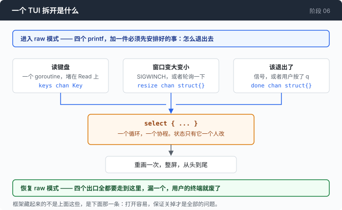
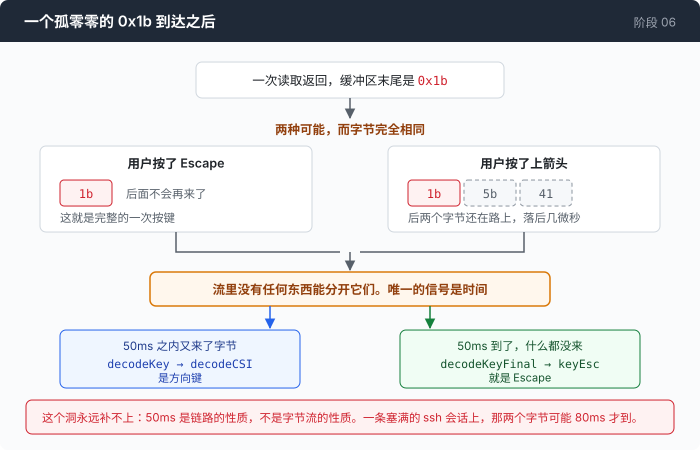
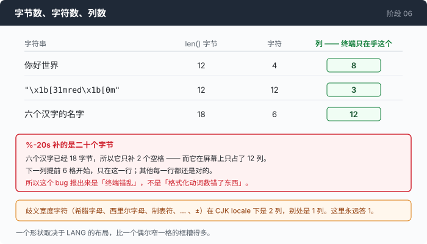

# 阶段 06 · 第 1 部分：拿回终端 —— 一个 TUI 框架替你藏起来的三样东西

[00](../../00-loop/doc/README_zh.md) → 01 → 02 → 03 → 04 → [05](../../05-live-forever/doc/README_zh.md) → `06` → [07](../../07-multiply/doc/README_zh.md) → 08 → 09 → 10 → 11 → 12

> [返回本章目录](README_zh.md)

---

## 问题

三个视图已经是 `[]string` 了。剩下的事听起来很小：打到屏幕上，让方向键能滚。于是你去找一个 TUI 框架 —— 这是对的默认选择，没有人应该为了滚动一段文本去写终端控制码。

然后是三件看起来毫不相干的事，隔着几天分别发生：

有人按 Ctrl-C 退出了程序。回到 shell 之后，他打字看不见回显，方向键打出 `^[[A`，鼠标划不动文字。他不知道该怎么办，就把窗口关了。

另一个人说 Escape 键要按两下才管用。你在自己机器上按了十次，十次都正常。他是 ssh 进来的。

第三个人的项目目录叫「后端服务」。他的状态栏右半边跑到了屏幕中间，而其他每一行都对得整整齐齐 —— 所以他报的 bug 是"终端显示错乱"。

这三件事你一行代码都没写。它们发生在你和终端之间那一层里，而那一层你看不见。**框架把这三样东西藏得很好，一直很好，直到其中一样出了问题 —— 那时候你连它出在哪一层都不知道。**

---

## 办法

把框架拿掉之后，一个 TUI 是三个函数和一个 `select`。



循环本身 30 行。所有难的东西都在这三层的旁边，而且恰好就是上面那三个 bug：

| 藏起来的 | 出事时看到的 | 真正的问题 |
|---|---|---|
| raw 模式怎么还回去 | 退出后 shell 没有回显 | 你改的是一个不属于你的全局状态 |
| 键盘解码 | Escape 慢半拍，tmux 里方向键失灵 | `0x1b` 既是 Escape，也是所有序列的第一个字节 |
| 显示宽度 | 一个中文名字把表格切歪 | 字节数、字符数、列数是三个不同的数 |

---

## 怎么做的

代码在 [`term.go`](../code/term.go)、[`keys.go`](../code/keys.go)、[`width.go`](../code/width.go)、[`tui.go`](../code/tui.go)。

### 第 1 步：打开是四个 printf

一个 TUI 要从终端拿四样东西：**raw 模式**（按键按字节到达而不是按行，Ctrl-C 不再是信号）、**备用屏幕**（用户的滚屏历史被挪到一边，退出时原样还回去）、**鼠标上报**（点击和滚轮变成转义序列送进来）、**括号粘贴**（粘进来的文本带着包装，不会被当成一串按键）。

打开它们就是一句话：

```go
io.WriteString(out, altScreenOn+cursorHide+mouseOn+pasteOn)
```

四样东西的共同点值得停一下：**每一样都是对一个不属于你的资源的全局改写。** 终端是用户的，不是你的。

### 第 2 步：关掉它才是全部的问题

因为打开它们的这个进程，是这世界上唯一知道该怎么关掉它们的东西。

```go
// Exact reverse of the enable order.
io.WriteString(t.out, pasteOff+mouseOff+cursorShow+altScreenOff)
return leaveRaw(t.in, t.out, t.saved)
```

顺序是打开顺序的严格倒序。终端被弄坏最常见的原因，就是某个模式在一个地方打开、在另一个不会执行到的地方关闭。

`Close` 还必须可以重复调用：

```go
t.mu.Lock()
if t.closed {
    t.mu.Unlock()
    return nil
}
t.closed = true
t.mu.Unlock()
```

这把锁不是装饰。`Close` 有三个地方能到：defer、信号处理、panic 路径，运气不好三个一起到。`go test -race` 能抓到它；人抓不到，因为它需要"关闭过程中恰好来了一个信号"。

顺着这一步会掉出一条规矩，它会静默地废掉一个在别处完全正确的习惯：

> **进了 raw 模式之后，`os.Exit` 和 `log.Fatal` 就是 bug。**

它们跳过 defer。三层之下一句 `log.Fatalf("bad config")` —— Go 里最平凡的一行 —— 现在会让用户的终端坏掉，而且它打出来的那句错误信息还看不见，因为备用屏幕还盖在上面。

### 第 3 步：四个出口，一个真 TUI 全都会走

```go
defer func() {
    signal.Stop(sigs)
    close(sigs)
    t.Close()
    if r := recover(); r != nil {
        panic(r)
    }
}()
```

`fn` 正常返回、返回错误、panic，这三个都靠这个 defer。错误是在恢复**之后**才打印的 —— 打在用户真正的屏幕上，他能看见能复制，而不是打在一块马上就要被丢掉的备用屏幕上。panic 同理，恢复之后重新抛出；代价是栈顶变成了这一行，而另一种选择是一份正确的栈追踪打在一块即将消失的屏幕上。

第四个出口是信号：

```go
t.Close()
signal.Reset(syscall.SIGINT, syscall.SIGTERM)
if p, e := os.FindProcess(os.Getpid()); e == nil {
    _ = p.Signal(s)
}
```

不是 `os.Exit(130)`，是把信号重新发给自己。一个被 SIGTERM 杀掉的进程应该**如实报告**自己是被 SIGTERM 杀掉的 —— 它的父进程可能是一个 shell、一个 supervisor，或者一个要区分"被信号杀死"和"非零退出"的测试框架。先把处理器恢复成默认，再把信号发给自己，这是"清理干净但不撒谎"的写法。

### 第 4 步：`0x1b` 有歧义，而且这个洞永远补不上



Escape 是 `0x1b`。它同时也是每一个方向键、每一个功能键、每一次鼠标上报、每一次粘贴的第一个字节。

所以当一次读取返回的缓冲区以一个孤零零的 `0x1b` 结尾时，只有两种可能：用户按了 Escape；或者用户按了上箭头，而这次读取恰好落在 `\x1b[A` 的两个字节之间。

**字节是完全一样的。** 没有长度前缀，没有终止符，没有标志位。流里没有任何东西能区分这两种情况，而且永远不会有 —— 这套编码当初就是给一台"Escape 键"和"转义序列引导符"故意是同一个键的终端设计的。

唯一能分开它们的信号是**时间**。终端发出的序列是一次爆发：剩下的字节已经躺在 pty 缓冲区里，落后几微秒。人按 Escape，到他按下一个键之间会有几十毫秒的间隔。

这个判断被刻意留在解码器**外面**：

```go
func decodeKey(buf []byte) (key, int, bool) { return decodeOne(buf, false) }
func decodeKeyFinal(buf []byte) (key, int, bool) { return decodeOne(buf, true) }
```

歧义就落在这一处：

```go
if len(buf) == 1 {
    // The centrepiece. See the comment block above decodeKey.
    if !final {
        return key{}, 0, false
    }
    return key{Kind: keyEsc, Raw: "\x1b"}, 1, true
}
```

两个理由。第一个是正确性：**正确的超时不是字节流的属性，是链路的属性。** 25ms 在本地 pty 上很宽裕，在一条塞满的 ssh 会话上远远不够，所以这个数字属于知道链路情况的那一层，不属于一个看不见链路的解析器。

第二个更实际：一个解码器一旦持有时钟，它就不可测了。你没法为"过了 50ms"写表驱动测试，只能写 `sleep`，而一套满是 sleep 的测试是一套人们会不再跑的测试。一个对输入是纯函数的解码器，一毫秒能吃掉一万条字节序列。

### 第 5 步：那个计时器，一行装上，一行卸掉

```go
if len(buf) > 0 {
    escTimer = time.After(escTimeout)
} else {
    escTimer = nil
}
```

一个 `nil` 的 channel 在 `select` 里永远阻塞，所以这一行既是装保险丝也是拆保险丝。缓冲区里还有字节，说明有一个没解开的前缀；缓冲区空了，说明什么都不欠。

`const escTimeout = 50 * time.Millisecond` 是一条策略，不是一个事实：太短，一条慢的 ssh 链路会把方向键变成 Escape；太长，Escape 用起来像坏的。50ms 是大部分终端程序收敛到的值。

### 第 6 步：同一个键，八种字节形式

```go
switch buf[1] {
case '[':
    return decodeCSI(buf, final)
case 'O':
    return decodeSS3(buf, final)
}
```

`ESC O` 那一支不是为了完整。它是 DECCKM，"应用光标键模式" —— 一个由应用自己打开的模式，打开之后方向键从 `\x1b[A` 变成 `\x1bOA`。只认前一种的解码器在你的笔记本上完美无缺，然后在有人把它跑进 `tmux` 的那一刻失灵，bug 报告写的是"方向键打出一个字母"。

Home 和 End 更糟：它们一共有**八种**字节形式在野外流通，来自四条互不相干的血统 —— VT220 的编号、rxvt 重新编过的号、xterm 自己的形式，以及这两个键在 DECCKM 打开之后的形式。八种全接，六行代码；接六种，换来一句"我从 Mac 上 ssh 进来 Home 键没反应"。

### 第 7 步：一列不是一个字节



三个数字经常被当成同一个，而只有最后一个是终端在乎的：`你好世界` 是 12 个字节、4 个字符、**8 列**。下面 量一量 那一节把这几个数列全了。

`%-20s` 补的是二十个**字节**。所以一个六个汉字的名字（18 字节，12 列）一个空格都补不到，下一列提前八格开始，而其他每一行都还是对的 —— 这就是为什么这个 bug 报出来是"终端错乱"，而不是"我的格式化动词数错了东西"。

```go
func dispWidth(s string) int {
    w := 0
    for i := 0; i < len(s); {
        if n := ansiLen(s, i); n > 0 {
            i += n
            continue
        }
        r, size := utf8.DecodeRuneInString(s[i:])
        w += runeWidth(r)
        i += size
    }
    return w
}
```

`ansiLen` 那一支是必须的，因为一个 TUI 要量的字符串通常已经上过色了。`"\x1b[31mred\x1b[0m"` 是 12 字节、3 列；按字节量，每一个带颜色的格子都宽出九格。

`runeWidth` 里有一个决定值得单说：东亚**歧义宽度**字符 —— 希腊字母、西里尔字母、制表符、`…`、`±` —— 在 CJK locale 下是 2 列，在别处是 1 列。这里永远答 1。另一种做法是在测量的时候去读 `LANG`，而一个形状取决于环境变量的布局，比一个偶尔窄一格的框糟得多。

### 第 8 步：切一刀，不能用 `s[:w]`

```go wrong
out = append(out, line[:w])    // ← 一行里藏了两种坏法
```

第一种：切在 `"\x1b[31m"` 中间，输出里留下 `"\x1b[3"`，终端会把你**下一个**打印的字符当成这个序列的结束字节吃掉 —— 少一个字母，出现在好几行之后，来自程序里完全不相干的另一个地方。第二种：切在一个多字节字符中间，吐出半个汉字，一个宽度谁都不同意的替换字形，从此这一行的列数再也对不上。

```go
r, size := utf8.DecodeRuneInString(s[i:])
rw := runeWidth(r)
if w+rw > n {
    cut = true
    break
}
b.WriteString(s[i : i+size]) // copy the bytes; never re-encode the rune
w += rw
i += size
// ...循环之后：
if open {
    b.WriteString(sgrReset)
}
if cut && w < n {
    b.WriteString(strings.Repeat(" ", n-w))
}
```

先关颜色，再补空格。在一个还开着的背景色下面补空格，会在那个缺口里刷出一块彩色的方块，而这正是"截断的格子看起来像渲染 bug"的那个具体现象。

### 拼起来

```go
for {
    select {
    case chunk, ok := <-in:
        if !ok {
            return nil // stdin closed
        }
        buf = append(buf, chunk...)
        // Drain every COMPLETE key. What is left is a prefix, and the
        // only correct response to a prefix is to wait for more bytes.
        for len(buf) > 0 {
            k, n, ok := decodeKey(buf)
            if !ok {
                break
            }
            buf = buf[n:]
            if !c.handle(k) {
                return nil
            }
        }

    case <-escTimer:
        // ...decodeKeyFinal，同一段循环

    case <-t.resize:
        // Ask for the size; do not trust the notification to carry it.
        c.w, c.h = t.Size()
        c.relayout()
    }

    // ...第 5 步那两行，装上或卸掉计时器
    c.draw(t)
}
```

`resize` 那一支只送一个空的 `struct{}`，不带尺寸。channel 说的是"它变了"，而等你去看的时候它可能又变了 —— 这正是这个通知不带任何内容的原因。拖窗口边一次会产生上百个 SIGWINCH，每一个的含义都一样：去问一下现在多大。channel 容量 1，满了就丢。

最后一帧一次写完：

```go
b.WriteString(syncOn)
b.WriteString(cursorHome)
for i := 0; i < h; i++ {
    if i < len(lines) {
        b.WriteString(truncCols(lines[i], w))
    }
    b.WriteString(clearLine)
    if i < h-1 {
        b.WriteString("\r\n")
    }
}
b.WriteString(syncOff)
```

两件它刻意不做的事。它不清屏：每帧之前来一个 `\x1b[2J` 是闪烁的经典成因，因为有一次刷新的时间里终端上真的什么都没有；它改成把光标归位，然后一行一行地边重写边擦，于是每个格子要么被覆盖要么被显式清掉，没有哪一帧是空的。它也不一行一行地写：一个缓冲区，一次系统调用，外面包一对同步输出标记 —— 这是"重绘"和"看得见一道从上往下扫过去的痕迹"之间的区别。不认识 `\x1b[?2026h` 的终端会忽略它，所以这一对可以无条件发。

---

## 跑一下

```sh
go build -o agent ./06-the-composer/code
../agent --composer session.jsonl
```

**观察重点：**

- 拖窗口边改大小。画面重排，没有残留，也没有一行溢出到下一行。
- 按 Escape。它有大约 50ms 的迟滞，而且这个迟滞是所有终端程序共有的 —— 不是这段代码慢。
- 按 Ctrl-C 退出，然后在 shell 里打两个字。有回显，方向键正常，鼠标能选文字。这就是第 2 步和第 3 步换来的东西。
- 把 trace 放进一个中文名字的目录里再打开：表头左边是路径，右边那串统计应该还贴着屏幕右边缘。窄一点也试试 —— `../agent --composer-dump session.jsonl --view god --width 40`，每一行都不超过 40 列。

---

## 量一量

宽度这几件事，逐一量过：

| 输入 | 字节 | 字符 | 列 |
|---|---:|---:|---:|
| `你好世界` | 12 | 4 | 8 |
| `é`（e 加一个组合音标） | 3 | 2 | 1 |

组合音标是 **0** 列，所以 `é` 三个字节、两个字符、**1** 列。全角形式是 **2** 列，所以 `ＡＢ` 是 **4** 列。ANSI 转义序列是 **0** 列，所以 `dispWidth("\x1b[31mred\x1b[0m")` 是 **3**。

### 这套测量本身有一处是错的

上面整套列数机器，被摆在"它是你和一帧被搞坏的画面之间那道防线"的位置上。而它把 ZWJ 组合的 emoji 量错了四倍：

`👨‍👩‍👧‍👦` 是四个人被三个 ZWJ 连起来的，屏幕上一个字形、**2 列**，这里量出来是 `4×2 + 3×0 = 8`。这不是漏了一个范围表项。宽度是**字素簇**的属性，而 `runeWidth` 一次只拿到一个 rune；正确的修法需要 UAX #29 的扩展字素簇切分，那是一台跟整个 `width.go` 差不多大的表驱动状态机。这也正是那些好的第三方库存在的理由。

把它写下来而不是藏起来，因为它的失败方式很难查：范围表完美无缺地跑了一个星期，然后某个 commit message 里带 emoji 的用户报告说边框参差不齐。如果你要把用户提供的 emoji 放进一个固定布局里，你需要的是真东西。

### 其他量到的数

- Escape 消歧超时 **50ms**；Home / End 有 **8** 种字节形式在野外流通。
- 旧的鼠标编码把列号打包成 `32 + n` 一个字节，所以它**说不出第 223 列以后的任何一列**。现代宽终端上那不是边缘情况，那是屏幕的右半边 —— 这就是为什么要 SGR 编码。
- Windows 上没有 SIGWINCH，尺寸变化靠轮询：**4Hz**，也就是**每 250ms 一次系统调用，永远**。
- 依赖：标准库，加 `golang.org/x/sys` —— Unix 上用它做**三个 ioctl**，Windows 上做**五次控制台调用**。
- 事件循环 **~30 行**。`--composer-dump` 那个无界面模式 **8 行**。把 composer 挂成第 02 章那个总线的订阅者，**1 行**：`bus.Subscribe(tui)`。

Windows 那个 4Hz 值得一句不客气的话。它常被辩护成"没有别的办法"，但更准确的说法是：**这是这套设计自己造成的约束。** Win32 本来有办法 —— 从控制台输入队列里读 `WINDOW_BUFFER_SIZE_EVENT` 记录 —— 而 `ENABLE_VIRTUAL_TERMINAL_INPUT` 恰恰就是把那个队列变成字节流的那个开关。要了字节，就拿不到记录。代价是一个空闲的 UI 每 250ms 进一次内核，直到进程结束。

---

## 接下来

这三个文件现在有两份。`external/tui/` 下面躺着 `term.go`、`keys.go`、`width.go` 的另一个副本 —— 那是从第 06 章起打开的那个交互界面在用的，注释被拿掉了。改了这边一处行为，那边得手工跟一遍；不跟，这一部分里的说法就不再成立。

"小到能装进脑子里"是有代价的，而这里量到的代价不是省下来的文件，是多出来的文件。这件事没有解：这个仓库选的是"你能读完全部"，而不是"没有重复"，两个都要就得再引一个包。

回到 [本章目录](README_zh.md) 看这一章自己的接下来 —— 一个 agent，一个上下文，和一件有四个互不相干部分的任务。
