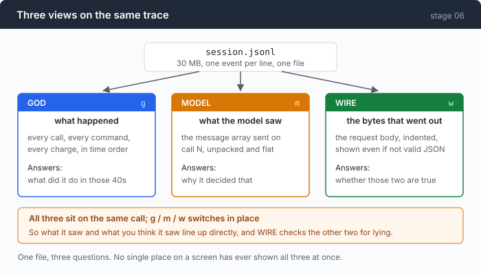
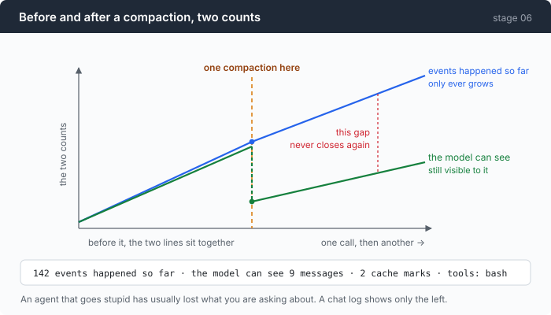

# Stage 06: The Composer — three views on one trace, and letting them disagree

[05](../../05-live-forever/doc/README.md) → `06` → [07](../../07-multiply/doc/README.md) → 08 → 09 → 10 → 11 → 12

> On call 12 of a real session: **629 events happened, and the model could see
> 11 messages.** Both numbers are correct. A chat log only ever shows you the
> first one, and the gap between them is where the bugs are.

---

## The problem

Five chapters of instrumentation and the way you actually read a session is
this:

```sh
jq -r 'select(.kind=="request") | .request' session.jsonl | tail -1 | jq .messages
```

That works, and it answers one question at a time, badly. Try to answer three:

**What happened in those forty seconds?** You want the calls, the commands, the
charges, in order. `jq` gives you a stream you have to reassemble in your head.

**What did the model see on call 12?** Not the transcript — the actual message
array that went out, after compaction dropped eleven messages and thinking
blocks were discarded and a 40kB command output was truncated to 8kB. This is
the question that explains most inexplicable behaviour, and it is the one no
chat interface has ever shown anyone.

**Were the first two telling the truth?** Both are rendered by code you wrote,
and code that renders can be wrong. This one sounds paranoid until it catches
something, which it does in this chapter.

And there is one specific failure the third question exists for. After a
compaction, the scrollback still contains everything that happened. The model's
context does not. The two have permanently diverged, and nothing on your screen
says so.

---

## The idea

Three views over the same file, on the same call, switched with one keystroke.



| view | key | question | answers |
|---|---|---|---|
| GOD | `g` | what happened | every call, command and charge, in time order |
| MODEL | `m` | what the model saw | the message array as sent on call N |
| WIRE | `w` | the bytes | the request body, indented, verbatim |

They all stay on the same call, so switching is a change of *lens*, not of
place. And WIRE exists to check the other two, which is a thing worth having
because it earns its keep in the Measured section below.

---

## Building it

The code is [`views.go`](../code/views.go) (session → `[]string`),
[`tui.go`](../code/tui.go) (the loop), and [`term.go`](../code/term.go) (the
bytes). Getting a terminal to behave at all is [part 1](1-terminal.md).

### Step 1: cut the flat event stream into one segment per call

```go
func indexSession(path string, events []Event) *session {
```

```go
case KindRequest:
    s.Calls = append(s.Calls, call{
        Seq: e.Seq, Turn: e.Turn, At: e.T, Request: e.Request,
        Compaction: inCompaction,
    })
```

A trace is one flat sequence. Every view is per-call, so the first job is to
work out where the calls are — and `KindRequest` is the marker, because a
request is by definition the start of a call.

```go
if n := len(s.Calls); n > 0 {
    s.Calls[n-1].Events = append(s.Calls[n-1].Events, events[i])
}
```

Everything after a request belongs to that request until the next one. Events
before the first request belong to nothing, and are dropped from the per-call
index rather than being forced into call zero.

`Compaction: inCompaction` matters more than it looks. The summarising call from
stage 05 is a real request and shows up here as a call — so without that flag,
"call 8 of 24" silently includes calls the *agent* never made.

### Step 2: fold a thousand deltas into one line

```go
streaming := func(k Kind) bool {
    return k == KindTextDelta || k == KindReasoningDelta || k == KindToolArgsDelta
}
```

```go
s.Display = collapseDeltas(events)
```

A streamed answer of 400 tokens is 400 events. Rendered one per line, the God
view is unusable — and worse, it is *misleading*, because it makes a routine
answer look like the busiest thing in the session.

Collapsed, a run becomes one row that reports both numbers:

```
389   32.40s reasoning_delta ×11  The user wants me to continue compacting…
400   32.98s text_delta ×165      1. GOAL⏎ The user instructed the agent to…
```

`×11` and `×165` are frame counts, and keeping them visible is the point. A
provider that switches to one delta per token instead of one per chunk changes
nothing about the text and everything about that number — and this row is the
only place you would ever notice.

### Step 3: to decode a request, sniff the protocol first

The trace stores `Request` as raw bytes, deliberately. Which means the model
view has to work out what it is looking at, and the two protocols disagree about
everything (stage 03).

The tell is structural: a top-level `system` field means Anthropic, a
`messages[0]` with `role:"system"` means OpenAI. Sniffing beats recording the
protocol name in the event, because a trace written by an older build would not
have the field, and this view is supposed to open other people's traces.

### Step 4: one line of header is what this chapter is about

```go
add("  %s", dim(fmt.Sprintf("%d events happened so far · the model can see %d messages · %d cache marks · tools: %s",
    eventsSoFar, len(v.Messages), v.CacheMarks, strings.Join(v.Tools, ","))))
```

Two counts, side by side, and everything in this chapter is in the relationship
between them.



Before a compaction they climb together. After one they part, permanently. On
call 12 of a real session:

```
629 events happened so far · the model can see 11 messages · 0 cache marks · tools: bash
```

**An agent that suddenly starts behaving stupidly is usually one whose
right-hand number no longer contains the thing you are asking it about.** A chat
log shows you the left-hand number, which is why the question is so hard to
answer from one.

There are four routine divergences besides compaction, all visible here, none of
them a bug:

- the model reasoned ~400 tokens, and none of it is in the next request
- you typed 9 words; the model got 9 words plus an environment block
- a command printed 40kB; the model was handed 8kB and a truncation marker
- after a compaction, the rolling cache mark sits on a different block

### Step 5: warn on top of any call that had a compaction before it

```go
add("  %s", sWarn+fmt.Sprintf("⚠ %d compaction(s) happened before this call: everything below is what SURVIVED, not what happened", compactionsBefore)+sOff)
```

Without this line the model view is honest and misleading at the same time. It
shows exactly what was sent, and a reader assumes that is the session.

Note the wording: **what survived, not what happened.** That is a claim about
the view's own limits, printed inside the view, which is the only place someone
will read it.

### Step 6: the WIRE view is three lines of real work

```go
var pretty bytes.Buffer
if err := json.Indent(&pretty, c.Request, "", "  "); err != nil {
    return []string{sBad + "not valid JSON: " + err.Error() + sOff, string(c.Request)}
}
```

Note the error branch. It does not refuse to render; it says what is wrong and
then **shows the bytes anyway**. A view whose purpose is "the bytes, exactly"
must not hide the bytes on the one occasion they are malformed, which is the
occasion you opened it for.

```go
out = append(out, wrapCols("  "+l, max(20, w-2))...)
```

Wrapped, not truncated. A 30kB system prompt on one line is the commonest thing
you want to read here, and a viewer that cuts it at the window edge is a viewer
that hides the answer.

### Step 7: the same thing without opening a UI

```sh
./composer --composer-dump session.jsonl --view model --call 12
```

Eight lines of code, because rendering (`views.go` → `[]string`) and painting
(`term.go`) were already separate. That separation was not planned for this; it
came from wanting to test the views without a terminal, and the greppable dump
mode fell out of it.

Which is the general shape worth stealing: **a view that returns strings can be
tested, diffed, piped and pasted into a bug report. A view that writes to a
terminal can only be looked at.**

### The other half

Everything above assumes a terminal that behaves: raw mode, keys decoded,
columns counted, the screen restored on every exit path.

None of that is free, all of it is what a TUI framework hides, and three parts
of it are exactly what this chapter is about. That is
[part 1](1-terminal.md).

---

## Run it

No API key required for any of this.

```sh
go build -o composer ./06-the-composer/code
./composer --composer session.jsonl
```

`g` / `m` / `w` switch views, `n` / `p` move between calls, `q` quits.

```sh
./composer --composer-dump session.jsonl --view god
./composer --composer-dump session.jsonl --view model --call 12
./composer --composer-dump session.jsonl --view wire  --call 12 | head -40
```

**What to watch for:**

- Take any trace from stage 05 that compacted, find the first call after the
  compaction, and read the header. The two counts have separated and the ⚠ line
  is there.
- Press `m` on that call and look for the thing you remember happening. It is
  not there. That is the point.
- Press `w` and look at any `command` string containing `>` or `&`.

---

## Measured

From one real session — 24 recorded requests, 629 events:

```
  call 12 of 24   openai · mimo-v2.5 · max_tokens 4096 · 16.4kB
  629 events happened so far · the model can see 11 messages · 0 cache marks · tools: bash
  ⚠ 1 compaction(s) happened before this call: everything below is what SURVIVED, not what happened
```

And the God view around a compaction, which is what stage 05 could only describe
in prose:

```
  386   31.41s COMPACT_START    15 messages, ~7714 tokens — summarising messages 0–10, keeping 4
  387   31.41s request          openai · 1 messages · 0 cache marks · 11.6kB
  389   32.40s reasoning_delta ×11  The user wants me to continue compacting the transcript…
  400   32.98s text_delta ×165      1. GOAL⏎ The user instructed the agent to read `wire-notes.md`…
  565   38.34s usage            prompt 3310 (full 3310 · write 0 · read 0) · out 506
  567   38.39s COMPACT_END      15 → 5 messages · ~7714 → ~3556 tokens · 6976ms
  568   38.39s cache_lost       the prompt prefix was rewritten — every cache entry from before this p
```

`prompt 3310 · read 0`. The summarising call is entirely full price, and here it
is as a row in the same list as everything else, rather than as a footnote in a
chapter.

### This view disproved its own premise

The WIRE view's whole claim is "those bytes, unmodified", and `events.go` calls
`Request` "the exact bytes about to be sent".

Building the view showed that was false — on **all 24 recorded requests**:

```
posted:  {"command":"ls 2>&1 <in"}
traced:  {"command":"ls 2\u003e\u00261 \u003cin"}
```

The trace writer's plain `json.Marshal` re-escaped `<`, `>` and `&` **inside the
`json.RawMessage`**, undoing the `SetEscapeHTML(false)` both adapters use
precisely because a shell agent's requests are mostly `2>&1`, `>/tmp/out` and
`<<EOF`.

Nothing errored. Every decoder recovers the right string. What was wrong was the
*claim* — and the tool built to check claims is what caught it. Stage 02's
`marshalEvent` is the fix, and it exists because of this chapter.

### And the payoff bullet that was false for three stages

"Replay a session with no key, no network, no provider" is stage 02's stated
reason for the trace being the source of truth.

Stage 03 put provider resolution — and its `os.Exit(1)` — above the replay
branch. So on the one machine class this feature exists for, a trace file and
nothing else, `--replay` printed "no provider configured" and quit. Every
development machine had the environment variables set, so nothing looked wrong
for three chapters.

The fix was **three lines**: carry the resolution error instead of raising it.
The lesson is not about those lines. It is that a feature nobody on the team is
in a position to use is a feature nobody on the team is testing.

---

## Next

You can see one session completely now — what happened, what the model saw, and
the bytes.

The next thing an agent does is stop being one session. A big task splits into
independent pieces, each wanting its own context, and the obvious move is to
call the same loop again from inside a tool call.

That immediately breaks the thing this chapter just built: two agents running at
once, emitting into one trace, and every view in it assumes a single timeline.

[Stage 07](../../07-multiply/doc/README.md) is subagents by recursion — with the
measurement that decides when they are worth it: **20% more tokens for a parent
context 9.6× smaller.**
