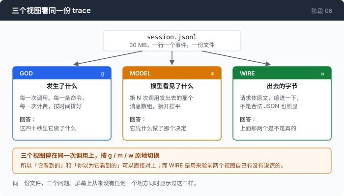
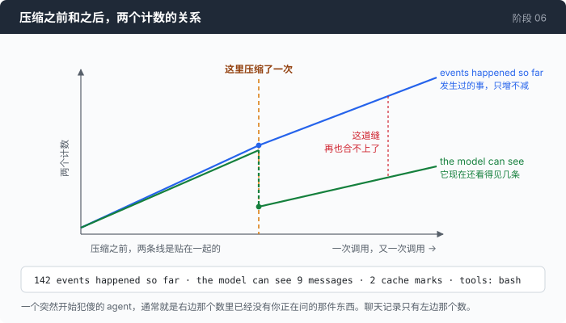

# 阶段 06：作曲家 —— 在同一份 trace 上开三个视图，让它们互相不同意

[00](../../00-loop/doc/README_zh.md) → 01 → 02 → 03 → 04 → [05](../../05-live-forever/doc/README_zh.md) → `06` → [07](../../07-multiply/doc/README_zh.md) → 08 → 09 → 10 → 11 → 12

> 这一章不给 agent 加任何能力。它加的是一副眼镜：同一份 JSONL，三种读法 —— 到底发生了什么、模型看到了什么、线上传的是什么字节。这三个数字会对不上，而每一处对不上都是一个 bug。

---

## 问题

第 05 章之后，会话可以一直开着不管了。你顺手加了 `--trace session.jsonl`，跑了一个下午。

现在这个文件在你面前。它有 30 MB，一行一个事件。你用编辑器打开，编辑器卡了三秒；你 `head -1`，一行滚了四屏还没滚完 —— 那一行是一次请求，里面装着当时的整个消息数组。

`jq` 能查它。`jq '.kind' session.jsonl | sort | uniq -c` 一秒钟给你答案。但你想问的不是这种问题。你想问的是这一个：

**第 30 轮的时候，模型实际看到的是什么？**

这个问题 `jq` 帮不上忙。答案是第 30 次 `request` 事件里那个 `request` 字段的完整内容 —— 一个几万字符的 JSON，里面是一整个消息数组。你可以把它抠出来 `json_pp`，得到八百行缩进整齐的东西，然后开始一条一条数消息。

而且这中间发生过两次压缩。所以你看到的那八百行，既不是你输入过的原文，也不是屏幕上滚过去的东西 —— 是一段摘要，加上一截被保留的尾巴，加上冻在每条用户消息里的环境快照。屏幕上从来没有任何一个地方显示过这个组合。

再往下一层还有一件事：那段 JSON 是不是真的就是网卡上出去的那些字节。你默认它是。第 02 章的注释里就是这么写的。

**你手上有一份完整的证据，但它的形状不是给人看的，而你连它是不是证据都还没验过。**

---

## 办法

三个视图，读同一个文件。



| 视图 | 回答哪个问题 | 数据从哪来 |
|---|---|---|
| GOD | 到底发生了什么 | 每一条事件，按 `seq` 排 |
| MODEL | 模型看到了什么 | 把 `request` 事件里那段 body 解码出来 |
| WIRE | 线上传的是什么 | 那段 body 本身，一个字节不动 |

建三个而不是一个，理由不是"多几种展示"。是因为**它们会不一致**。GOD 说发生了 629 件事，MODEL 说模型能看见 11 条消息，这两个数在同一次调用上并排放着。压缩之前它们一起涨；压缩之后它们永久地分开。

它还不需要 key、不需要网络、不需要 provider —— 输入只有一个文件路径。这是第 02 章那个决定的利息：trace 是事实来源，不是调试日志。

---

## 怎么做的

代码在 [`06-the-composer/code/views.go`](../code/views.go)（数据变成行）和 [`tui.go`](../code/tui.go)（行变成画面）。这一节只讲前一半。

### 第 1 步：把平铺的事件流切成"一次调用一段"

一份 trace 是一条扁平的事件序列。视图需要的是"第 12 次调用"这种单位，所以先切。

```go
case KindRequest:
    s.Calls = append(s.Calls, call{
        Seq: e.Seq, Turn: e.Turn, At: e.T, Request: e.Request,
        Compaction: inCompaction,
    })
```

切点选 `KindRequest`，不选 `turn_start`，也不选第一个 `text_delta`。理由只有一个：**一次连字都没吐出来就死掉的调用，也一定有一条 request 事件。** 把索引锚在失败路径也会产生的那个事件上，否则你的查看器会恰好在最值得看的那些会话上一片空白。

`inCompaction` 那个标记是顺手记的：压缩本身是一次真实的模型调用，它会在这里生成一条 call。不标出来，你会以为 agent 在第 12 轮问了一个奇怪的问题。

### 第 2 步：一千条 delta 折成一行

流式响应是几千条 `text_delta`，每条四个字符。一行一条画出来，没有人能滚。

```go
var b strings.Builder
n := 0
for ; i < len(events) && events[i].Kind == e.Kind; i++ {
    b.WriteString(events[i].Text)
    n++
}
i--
e.Text = b.String()
e.Bytes = n
out = append(out, e)
```

合并后的事件保留**第一条** delta 的 `Seq`。这个选择是为了点击：点一行折叠起来的 delta，应该选中这段流开始的那次调用；一段跨过边界的流（响应结束、下一次请求开始）会把你往前送一次。

两个数字都留着：`×165` 是来了多少帧，后面的文本是它们一共带了多少字。这两个数的比值是这条流的形状。某个 provider 哪天改成一个 token 一帧，只有这里看得出来。

折叠只做一次，做在这里。渲染、点击、滚动位置全都读这一份 `Display`。行号在渲染器眼里是一个意思、在点击处理里是另一个意思，这种 bug 只在有人用鼠标的时候才出现。

### 第 3 步：解码一段请求，先嗅协议

```go
v.Model, v.MaxTokens = probe.Model, probe.MaxTokens
if len(probe.System) > 0 {
    v.Protocol = "anthropic"
    viewAnthropicRequest(raw, &v)
} else {
    v.Protocol = "openai"
    viewOpenAIRequest(raw, &v)
}
```

嗅的是结构，不是版本号：顶层有 `system` 键就是 Anthropic 的形状，没有就是 OpenAI 的。这正是第 03 章列出的第一条分歧，而它之所以是最可靠的判据，恰恰因为它是两种协议里唯一一个"模仿了就变成对方"的差别。

还有一件事值得说：这里没有复用两个 adapter 自己的结构体。那些类型描述的是**这个 agent 会发出什么**；这里要能读一份别的版本录的 trace、一段手写的请求、或者一个三个版本前就删掉了的协议。一个只认得自己编码器输出的查看器，会恰好在你最需要它的时候罢工 —— 也就是改过东西之后。

### 第 4 步：那一行标题，是这一章的全部



```go
eventsSoFar := 0
for _, e := range s.Events {
    if e.Seq <= c.Seq {
        eventsSoFar++
    }
}
```

然后把它和"模型能看见几条消息"印在同一行上：

```go
add("  %s", dim(fmt.Sprintf("%d events happened so far · the model can see %d messages · %d cache marks · tools: %s",
    eventsSoFar, len(v.Messages), v.CacheMarks, strings.Join(v.Tools, ","))))
```

这一行就是这一章存在的理由。压缩之前，两个数一起涨。压缩之后，左边继续涨，右边掉回去，从此再也不会合上。

一个突然开始犯傻的 agent，通常就是一个 model 视图里已经没有你正在问的那件东西的 agent。这件事在聊天记录里看不出来 —— 聊天记录只有左边那个数。

### 第 5 步：压缩过的调用，头上加一句警告

```go
if compactionsBefore > 0 {
    add("  %s", sWarn+fmt.Sprintf("⚠ %d compaction(s) happened before this call: everything below is what SURVIVED, not what happened", compactionsBefore)+sOff)
}
```

没有这一行，下面那些消息看起来就是完整的历史。它们不是，它们是幸存下来的部分，而这两件事长得一模一样。

### 第 6 步：WIRE 视图只有三行

```go
var pretty bytes.Buffer
if err := json.Indent(&pretty, c.Request, "", "  "); err != nil {
    return []string{sBad + "not valid JSON: " + err.Error() + sOff, string(c.Request)}
}
```

解析失败也要显示原文。一段不是合法 JSON 的请求体，正是你最想亲眼看看的那种。

行是**折行**的，不是截断的：

```go
for _, l := range strings.Split(pretty.String(), "\n") {
    // Wrapped, not truncated: a 30kB system prompt on one line is the
    // commonest thing you want to read in this view, and a viewer that cuts
    // it at the window edge is a viewer that hides the answer.
    out = append(out, wrapCols("  "+l, max(20, w-2))...)
}
```

### 第 7 步：同样的东西，不开界面也能出

```go
s := indexSession(path, events)
idx := call - 1
var lines []string
switch view {
case "god":
    lines, _ = s.godView(width, 0)
case "model":
    lines = s.modelView(idx, width)
case "wire":
    lines = s.wireView(idx, width)
// ...
}
```

这不是一个调试后门。一个 TUI 对任何你想 diff、想 grep、想贴进 issue、想放进 CI 的东西来说都是死路，而"第 12 次调用模型看到了什么"恰好就是那种你想用管道接走的答案。

它一共 8 行，因为渲染和绘制本来就是分开的两个函数：`views.go` 把 session 变成 `[]string`，`term.go` 把 `[]string` 画出来。不让界面持有数据，收的利息就在这里。

### 接下来的一半

到这里三个视图都还只是 `[]string`。把它们放到屏幕上、让键盘能滚动，是另外三件完全不同的事，而且是这个仓库里"不用框架"这条规矩从审美变成实质的地方。

**[第 1 部分：拿回终端](1-terminal_zh.md)** —— 一个 TUI 框架替你藏起来的三样东西：raw 模式怎么还回去、Escape 键为什么有歧义、以及一列为什么不是一个字节。

---

## 跑一下

```sh
go build -o agent ./06-the-composer/code

cd sandbox
set -a && . ../.env && set +a
../agent --trace session.jsonl        # 先正常跑一会儿，让它干点活
```

然后，不需要 key，也不需要联网：

```sh
../agent --composer session.jsonl
```

界面里 `g` / `m` / `w` 切三个视图，`n` / `p` 走调用，`?` 是键位表，`q` 退出。同一份东西也可以直接打出来：

```sh
../agent --composer-dump session.jsonl --view model --call 12
../agent --composer-dump session.jsonl --view god | grep COMPACT
```

**观察重点：**

- MODEL 视图第二行那句 `N events happened so far · the model can see M messages`。按 `n` 一路往后走，盯着这两个数。压缩之前它们一起涨，压缩之后 M 掉下去，再也追不上 N。
- 压缩那一次调用，标题后面会挂一句 `[the summarising call, not the agent]`。它是花了钱的一次真调用，不是记账。
- WIRE 视图里找一条带 `2>&1` 的命令。你看到的应该是 `2>&1` 本身，而不是 `\u003e`。下面那一节讲这一行为什么值得专门去看一眼。
- agent 还在跑的时候，在**第二个终端**里开 composer，按 `r`。它会重读文件，右下角报 `+N`。没有一行 IPC —— 文件就是接口。

---

## 量一量

一次真实会话，24 次记录在案的请求，629 条事件。第 12 次调用的 MODEL 视图表头，原样：

```
  call 12 of 24   openai · mimo-v2.5 · max_tokens 4096 · 16.4kB
  629 events happened so far · the model can see 11 messages · 0 cache marks · tools: bash
  ⚠ 1 compaction(s) happened before this call: everything below is what SURVIVED, not what happened
```

**629 比 11。** 同一次调用上的两个数。

把两个视图并排放着，还有四处常规的不一致，每一处单看任何一个视图都发现不了：

- 模型推理了大约 **400 个 token**，下一次请求里一个字都没有 —— thinking 不进历史。
- 用户打了 **9 个词**，模型收到的是 9 个词加一整块环境信息，而它从来不提这块东西。
- 一条命令打出 **40kB**，模型拿到的是 **8kB** 加一个截断标记。
- 一次压缩之后，那个滚动的 `cache breakpoint` 标记落在了另一个块上。

### 这个视图把自己的前提证伪了

WIRE 视图的全部价值是"这些字节，原封不动"。`events.go` 里管 `Request` 叫 "the exact bytes about to be sent"。

把视图建出来之后，第一件事就是发现这句话是假的：

```
posted:  {"command":"ls 2>&1 <in"}
traced:  {"command":"ls 2\u003e\u00261 \u003cin"}
```

`encoding/json` 会把 `<`、`>`、`&` 转义成 `\u003c`、`\u003e`、`\u0026`，而且 —— 这才是要命的地方 —— 它在压缩一个 `json.RawMessage` 的时候**也照转不误**。两个 adapter 都特意用 `SetEscapeHTML(false)` 编码，正因为一个 shell agent 发出去的请求里全是 `2>&1`、`>/tmp/out`、`<<EOF`；而 trace 写入层一句普通的 `json.Marshal`，把它们的努力在下一层原样撤销了。

**这次会话里 24 条请求全部带着转义。** 没有任何东西报错，JSON 是等价的，每一个解码器都能还原出正确的字符串。坏掉的是那句承诺：一份 trace 是证据，它一旦不再是逐字节相同的，它就不再是关于字节的证据。

修法是四行：

```go
func marshalEvent(e Event) ([]byte, error) {
    var buf bytes.Buffer
    enc := json.NewEncoder(&buf)
    enc.SetEscapeHTML(false)
    if err := enc.Encode(e); err != nil {
        return nil, err
    }
```

值得记下来的不是这四行，是这件事的形状：**一个用来核对的工具，第一个核出问题的地方是它自己脚下那块地。**

---

## 接下来

现在你能读懂一次会话了。任何人的会话 —— 只要有文件，不需要 key。

这个能力立刻暴露出下一个限制。你在 GOD 视图里看着的是**一个** agent 的**一个**上下文，从头到尾一条线。给它一件有四个互不相干部分的任务：读四份文档，各写三句总结。

它读第一份，40kB 进上下文；读第二份，又 40kB；读到第三份的时候，它开始把第一份文档里的说法安到第三份头上。而窗口在涨，第 05 章那台压缩机转起来，把第一份文档的内容摘掉了 —— 而那正是你要的三句总结之一。

**这四件事互不相干，但它们共用一个上下文，于是互相污染，而且谁也塞不下。**

[阶段 07](../../07-multiply/doc/README_zh.md) 让这个循环可以再调用它自己：每一部分交给一个自带上下文窗口的 agent，回来的只有一段文字。它也量了一遍这么做值不值 —— 答案不是你以为的那个。
