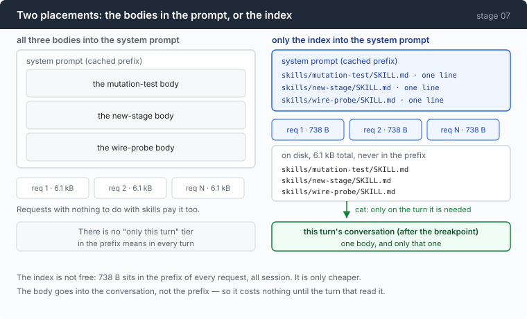

# Stage 07 · part 1: skills — a directory, and one sentence saying it exists

[← back to stage 07](README.md)

> Three skills cost **738 bytes in the prefix of every request, forever**, and
> leave 6.1kB on disk. The mechanism is twenty lines. The arithmetic is the
> design.

---

## The problem

There is a procedure you want the agent to follow, and it is four hundred words
long: how to run a mutation test in this repo, or how to probe a new endpoint,
or the checklist for adding a stage.

Put it in the system prompt and it is there on every request for the life of the
session, including the eight hundred requests that have nothing to do with it.
Put three of those in and you are carrying 6kB of instructions the model needs
about twice a day.

Leave them out and the agent does not know they exist. Which is the same as not
having written them.

The tempting middle — "inject it when it seems relevant" — needs something to
decide relevance, and the only thing that could decide is the model, which
cannot see the file.

---

## The idea

Put the *index* in the prompt and leave the *bodies* on disk. The agent already
has `cat`.



| | in the prefix | on disk |
|---|---:|---:|
| three bodies | 6.1 kB | 0 |
| index only | 738 B | 6.1 kB |

And the second row's body cost is not zero, it is *deferred* and *scoped*: when
a skill is read, its text lands in the conversation, after the cache breakpoint,
on the turn that needed it.

---

## Building it

### Step 1: a skill is a directory, not a file

```go
type skill struct {
	Name        string
	Description string
	Path        string // relative, because the model has to be able to cat it
	BodyBytes   int    // what it would cost to load, for the accounting
}
```

```go
// A directory per skill rather than a flat file per skill, because a real skill
// grows attachments — a script it tells the model to run, a template, an
// example input. Those live next to it, and the model can find them with `ls`
// because it already knows the directory.
```

`skills/mutation-test/SKILL.md`, not `skills/mutation-test.md`. The extra level
costs nothing today and is the difference between a skill that can ship a script
and one that has to inline it.

### Step 2: the path goes to bash, so the separator cannot be a backslash

```go
			Path:        filepath.ToSlash(filepath.Join("skills", e.Name(), "SKILL.md")),
```

```go
// Path is what the model types after `cat`. On Windows filepath.Join produces
// backslashes, and `cat skills\deploy\SKILL.md` inside bash reads the escapes,
// not the path — the skill silently cannot be opened, on the one platform where
// nobody testing on a Mac will see it.
```

`filepath.Join` is right for touching the filesystem and wrong for handing a
string to a shell. This is one call, and it is the kind of bug that ships
because the platform that has it is not the platform it was written on.

Sorting matters for a reason from two chapters back:

```go
	sort.Slice(out, func(i, j int) bool { return out[i].Name < out[j].Name })
```

Directory order is not guaranteed. An unsorted index means the system prompt's
bytes change between runs on the same machine — a moved prefix, and a cache
that misses for no visible reason.

### Step 3: a skill with no description does not exist

```go
		if desc == "" {
			// A skill with no description is invisible: the index is the only
			// thing the model sees, so a missing description means the skill
			// will never be chosen. Skipping it silently would hide that;
			// naming it in the index with an explicit complaint would put the
			// complaint in every request forever. Skip, and let the count in
			// the skills_indexed event not match the directory listing.
			continue
		}
```

Three options and each has a cost. Skipping loses the skill quietly. Listing it
with a complaint puts the complaint in the prefix of every request forever.
Failing at startup punishes everyone for one bad file.

The choice here is to skip, and to make the *count* visible — the
`skills: 3 skills` line will not match `ls skills | wc -l`, and that mismatch is
the report.

### Step 4: twenty lines instead of a YAML dependency

```go
// Twenty lines instead of a YAML dependency, and the trade is worth stating
// because it is the same trade the whole repo makes. YAML would handle nested
// values, anchors, multi-line scalars and type coercion — none of which two
// string fields need. What it would cost is a dependency in a project whose
// argument is that you can read all of it, to parse a file format we also
// control. When you own both ends of an interface, the parser is allowed to be
// as small as the interface.
```

The parser is `strings.Cut` in a loop:

```go
		k, v, ok := strings.Cut(line, ":")
```

with one piece of real-world grit:

```go
	// A skill file authored on Windows very often starts with a UTF-8 BOM, and a
	// literal U+FEFF is a compile error anywhere but byte zero of a Go source file,
	// so the cutset is spelled with rune values: BOM, space, tab, CR, LF.
	s = strings.TrimLeft(s, string([]rune{0xFEFF, 0x20, 0x09, 0x0D, 0x0A}))
```

A BOM in front of `---` means the frontmatter delimiter does not match, which
means the file has no frontmatter, which means no description, which means
step 3 skips it. Three layers away from the actual cause.

### Step 5: zero skills must be zero bytes

```go
	if len(skills) == 0 {
		return ""
	}
```

Not "Available skills: (none)". An empty section is still a section, and a
project with no `skills/` directory should pay exactly nothing — including no
header, no blank line, and no explanation of a feature it is not using.

The index itself is one aligned line each:

```go
		fmt.Fprintf(&b, "  %-*s  %s\n", w, s.Path, s.Description)
```

The path is what to type after `cat`, so the index is simultaneously the menu
and the instructions for using it.

### Step 6: two lines that each block one failure

```go
//   - "at most one" — a model given five plausible skills will read all five,
//     which converts a token saving into a token cost plus five round trips.
//   - "if none applies, ignore them" — without it, a skills list reads as a menu
//     the model is expected to order from, and it will find one that nearly fits.
```

Both failures are the same mistake from opposite ends: a list in a prompt reads
as an instruction to use the list.

### Step 7: print the bill

```go
func skillsCost(skills []skill) (indexBytes, bodyBytes int) {
	indexBytes = len(skillsPrompt(skills))
	for _, s := range skills {
		bodyBytes += s.BodyBytes
	}
	return indexBytes, bodyBytes
}
```

```go
// Worth printing, because the index is NOT free and the arithmetic is the whole
// design decision. Every skill's name and description sit in the prefix of every
// request for the life of the session. Forty skills is a couple of thousand
// tokens of permanent overhead — cached, at a tenth of the price after stage 04,
// but never zero. A skills directory that grows without anyone pruning it is a
// tax levied on every call the agent ever makes, and the only way anyone notices
// is if something prints the number.
```

One line at startup:

```
≡ skills: 3 skills · index 738B in every request · 6.1kB of bodies left on disk
```

Be honest about what that comment contains, though: **738 B for three skills is
measured; the forty-skill figure is an extrapolation.** It is written down as a
warning, not as a result.

### Step 8: which part of the prompt it joins

```go
	stable += skillsPrompt(skills)
	full := basePrompt + para + stable
```

```go
	// stable is the environment + memory + skills block, shared verbatim with
	// every subagent. Computed once; see stage 05's placement rule for why it
	// must never be recomputed.
	stable string
```

The index is stable context, so it goes before the cache breakpoint — paid once,
read at a tenth of the price thereafter. A skill *body*, when read, arrives as
tool output in the conversation, which is after the breakpoint and therefore
scoped to the turn that asked.

And there is one guard on the whole idea:

```go
	if bodies <= 5*idx {
```

If the bodies are not meaningfully larger than the index, the indirection is
buying nothing — you have paid for a menu roughly the size of the meal. The
agent says so rather than letting you assume the design is working.

---

## Run it

```sh
mkdir -p sandbox/skills/count-lines
```

```md
---
name: count-lines
description: Count lines of code in this repo, excluding vendored and generated files.
---

# Counting lines here

Use `git ls-files` rather than `find`, so ignored files stay ignored:

    git ls-files '*.go' | xargs wc -l | tail -1
```

```sh
cd sandbox && set -a && . ../.env && set +a
../agent --yolo
> how many lines of Go are in this project?
```

**What to watch for:**

- The `≡ skills:` line at startup, and the two byte counts in it.
- The model runs `cat skills/count-lines/SKILL.md` **first**, then the command
  the skill told it to use. Two round trips, and the body only enters the
  conversation on the second.
- Ask something unrelated afterwards. The index is still in the prefix; the body
  is not in the prompt at all.
- Then delete the `description:` line and restart. The startup line says 0
  skills, with no error — that is step 3, seen from the outside.

---

## Measured

```
≡ skills: 3 skills · index 738B in every request · 6.1kB of bodies left on disk
```

| | |
|---|---:|
| skills indexed | 3 |
| index, in every request, all session | **738 B** |
| bodies, on disk, never in the prefix | **6.1 kB** |
| frontmatter parser | **20 lines**, no dependency |

The ratio is 8.3× — which is why the indirection is worth it here, and why the
`bodies <= 5*idx` guard exists for when it is not.

The honest caveat, again: 738 B is measured for three skills. "Forty skills is a
couple of thousand tokens" is arithmetic on that number, not an observation, and
the chapter says so where it says it.

---

## Next

[Back to stage 07](README.md) for the subagent measurement, or on to
[stage 08](../../08-sandbox/doc/README.md), where the gate that can only show
you a string finally gets to see a command after expansion.
