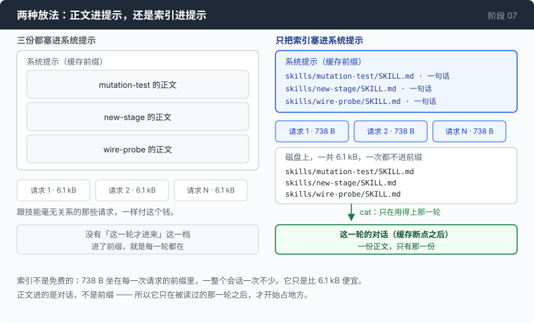

# 阶段 07 · 第 1 部分：技能 —— 一个目录，和一段说它存在的话

[00](../../00-loop/doc/README_zh.md) → 01 → 02 → 03 → 04 → 05 → [06](../../06-the-composer/doc/README_zh.md) → `07` → 08 → 09 → 10 → 11 → 12

> [返回本章目录](README_zh.md)

---

## 问题

这个仓库里有一件事你每隔几天要做一次：判断一套 Go 测试到底有没有牙。

做法是固定的。挑一条不变量，把实现故意改坏一处，跑测试，看它红不红；改回来，换下一处。哪一处改坏了测试还是绿的，那一处就没有被测到。中间有几条容易忘的规矩 —— 一次只改一个地方，跑完必须改回来，一次被中途杀掉的运行会在树里留下一个活着的变异体。

第一次你把这一整套讲给 agent 听，讲了二十来行。它做得不错。

一个星期以后你又要做一次。新开一个会话，二十来行再讲一遍。

于是你做了那件明显该做的事：把这二十行写进 `AGENTS.md` —— [第 05 章那个记忆文件](../../05-live-forever/doc/4-memory_zh.md) —— 让它进系统提示。位置是对的：整个会话都不变的东西，放在缓存前缀之前，写一次管一辈子。

然后你写了第二份：给这个课程加一个新阶段的规矩。然后是第三份：拿 curl 探一遍那个网关，把它真正发出去的字节记下来。

三份加起来六千多字节。现在你问它「这个目录里有什么」，这三份一起发出去。你问它今天几号，这三份一起发出去。第 04 章之后它们是缓存命中的，一折价 —— 一折不是零，而且这个钱是按会话里的每一次请求收的。

更难受的是，那三份里最多有一份用得上。**一份用得上的文档和两份用不上的文档，收的是同样的钱。**

把这件事说得再准一点：

**一段进了系统提示的文字，只有"永远都在"这一种时间粒度。而你手上这三份文档，要的是"用得上的那一轮才在"。**

---

## 办法

一个技能是一个目录，和一段说它存在的话。



进系统提示的只有名字、一句话描述、和一个路径。正文留在磁盘上。模型判断哪一份用得上的时候，自己 `cat` 它 —— 它本来就有一个 shell，这件事不需要新工具。

| 这一段 | 谁把它送进去 | 什么时候 |
|---|---|---|
| 索引：每份一行，路径加一句话 | 程序，写进系统提示 | 每一次请求，一整个会话 |
| 一份正文 | 模型自己，用 `cat` | 它判断这一份用得上的那一轮 |
| 正文旁边的脚本、模板、示例 | 模型自己，用 `ls` 和 `cat` | 它已经在读正文的时候 |

这个形状有个名字叫渐进披露，而它值得记住的不是名字，是那笔算术：名字和描述在每一次请求里都付一点，正文很贵但只在被读到的时候付一次。

第 05 章那份记忆是同一个想法的另一半。那边是一份始终相关的事实，所以整份常驻；这边是三份各自只在某一轮相关的流程，所以只有目录常驻。判据是同一个：**这段文字有多大比例的请求真的用得上它。**

---

## 怎么做的

代码在 [`skills.go`](../code/skills.go)。

### 第 1 步：一个技能是一个目录，不是一个文件

```go
type skill struct {
	Name        string
	Description string
	Path        string // relative, because the model has to be able to cat it
	BodyBytes   int    // what it would cost to load, for the accounting
}
```

`Path` 那一行的注释就是这个设计的全部接口：模型拿到的不是一个句柄，不是一个 id，是一个它能直接 `cat` 的相对路径。

为什么是目录而不是一个平铺的文件：

```go
// A directory per skill rather than a flat file per skill, because a real skill
// grows attachments — a script it tells the model to run, a template, an
// example input. Those live next to it, and the model can find them with `ls`
// because it already knows the directory.
```

一份写实的流程，写到第三版就会带上一个脚本、一个模板、一份示例输入。它们放在正文旁边，而模型已经知道那个目录了，所以附件的存在不必告诉它 —— `ls` 就能看见。

扫描本身没有惊喜，只有一处值得一提：`os.ReadDir` 读不到 `skills/` 就 `return nil`，不报错也不警告。绝大多数项目没有这个目录，而一个因为缺少可选功能就抱怨一句的 agent，会把那句话印给每一个从来没听说过技能的人。

### 第 2 步：路径要交给 bash，所以分隔符不能是反斜杠

```go
			Path:        filepath.ToSlash(filepath.Join("skills", e.Name(), "SKILL.md")),
```

`filepath.Join` 在 Windows 上给的是反斜杠，而这个字符串最后是模型打在 `cat` 后面的东西。测试里把这条链子写清楚了：

```go
// Path is what the model types after `cat`. On Windows filepath.Join produces
// backslashes, and `cat skills\deploy\SKILL.md` inside bash reads the escapes,
// not the path — the skill silently cannot be opened, on the one platform where
// nobody testing on a Mac will see it.
```

bash 里的反斜杠是转义符，不是目录分隔符：`\d` 就是 `d`，`\S` 就是 `S`，这条命令实际去找的文件叫 `skillsdeploySKILL.md`。模型收到一个 `No such file`，而它没有任何办法看出问题出在哪一层 —— 它照索引里给的路径打的字，一个字都没错。

同一个函数最后那一行，理由要绕一下才看得清：

```go
	sort.Slice(out, func(i, j int) bool { return out[i].Name < out[j].Name })
```

`os.ReadDir` 的顺序不是任何文件系统给过的承诺。而这段索引坐在缓存前缀里，所以一个跟着文件系统走的顺序，意味着换一台机器、甚至同一台机器换一次运行，前缀就可能不一样 —— 照第 04 章的说法，那是一个不命中的缓存。一次排序，换一个逐字节稳定的前缀。

### 第 3 步：没有描述的技能，等于不存在

```go
		if desc == "" {
			// A skill with no description is invisible: the index is the only
			// thing the model sees, so a missing description means the skill
			// will never be chosen. Skipping it silently would hide that;
			// naming it in the index with an explicit complaint would put the
			// complaint in every request forever. Skip, and let the count in
			// the skills_indexed event not match the directory listing.
			continue
		}
```

三条路都不好看。登记进去：模型永远不会选它，那一行在每一次请求里白付钱。报错退出：一个写歪了的 Markdown 文件让整个 agent 起不来。悄悄跳过：作者不知道自己的技能不见了。

选的是第三条，但把代价挂在一个看得见的地方 —— 启动那一行印的是索引里的条数，跟 `ls skills/` 数出来的对不上。三个里面没有漂亮的，这一个只是最诚实的。

### 第 4 步：二十行，换掉一个 YAML 依赖

```go
// Twenty lines instead of a YAML dependency, and the trade is worth stating
// because it is the same trade the whole repo makes. YAML would handle nested
// values, anchors, multi-line scalars and type coercion — none of which two
// string fields need. What it would cost is a dependency in a project whose
// argument is that you can read all of it, to parse a file format we also
// control. When you own both ends of an interface, the parser is allowed to be
// as small as the interface.
```

要读的只有两个字符串字段，而这个格式的两端都在你手里：解析器是你写的，SKILL.md 也是你写的。最后那句话是这一整套判断的短版本，而它在别处不成立 —— 第 08 章要解析的是别人写的 bash，那时候这条推理会朝相反的方向倒过来。

第一行就是给 Windows 准备的：

```go
	// A skill file authored on Windows very often starts with a UTF-8 BOM, and a
	// literal U+FEFF is a compile error anywhere but byte zero of a Go source file,
	// so the cutset is spelled with rune values: BOM, space, tab, CR, LF.
	s = strings.TrimLeft(s, string([]rune{0xFEFF, 0x20, 0x09, 0x0D, 0x0A}))
```

一份用记事本存出来的 SKILL.md，前面有三个字节的 BOM。于是 `---` 的前缀判断为假，前言解析不出来，描述是空字符串 —— 然后走上一步那条路，这个技能安静地消失。整条链子上没有任何一环会报错，唯一的症状是一个模型从来不用的技能。

切键值那一行也有一个具体的失败挡在后面：

```go
		k, v, ok := strings.Cut(line, ":")
```

`strings.Cut` 切在**第一个**冒号，右边整段留着。描述里出现冒号不是什么稀奇事，`build the image: then push it` 就是正常人的写法；按每个冒号切，这句话会被砍在有用的那一半。

### 第 5 步：零个技能必须是零个字节

```go
	if len(skills) == 0 {
		return ""
	}
```

不是一个空的 `<skills>` 块。一个空块会进到每一个没有 `skills/` 目录的项目的每一次请求的前缀里，而且它在跟模型说：有一份清单你应该去查 —— 然后模型去查，发现是空的。

有技能的时候，索引一行一条：

```go
		fmt.Fprintf(&b, "  %-*s  %s\n", w, s.Path, s.Description)
```

`%-*s` 把路径垫到最长那一条的宽度，描述于是排成一列 —— 这几个空格是给人看的，因为第 06 章那三个视图里，SYSTEM 视图会把这段原样摆出来。这个仓库自己那三个技能，渲染出来是这样：

```
<skills>
This project has playbooks for recurring tasks. Only their names and one-line
descriptions are below. If one clearly applies to what you are doing, read it
first with `cat`, then follow it.

  skills/mutation-test/SKILL.md  Verify a Go test suite has teeth by breaking the code on purpose, one change at a time
  skills/new-stage/SKILL.md      Add a stage to this course — the snapshot rules, the chapter shape, and what a chapter has to measure
  skills/wire-probe/SKILL.md     Probe the LLM gateway with curl and record what it actually sends in external/wire-notes.md

Read at most one before acting. If none clearly applies, ignore this list
entirely — it is a set of shortcuts, not a menu you have to order from.
</skills>
```

上半段那句 `read it first with cat, then follow it` 是三条指令里最容易被跳过的一条。少了它，模型会照着那一行描述直接动手 —— 而那一行描述是为了让人和模型能**挑中**它写的，不是为了够用。

### 第 6 步：下半段那两行，各挡一种失败

```go
//   - "at most one" — a model given five plausible skills will read all five,
//     which converts a token saving into a token cost plus five round trips.
//   - "if none applies, ignore them" — without it, a skills list reads as a menu
//     the model is expected to order from, and it will find one that nearly fits.
```

第一行是算术上的。五份看着都沾点边的技能，模型会把五份都读一遍 —— 这时候整个设计翻了个面：你本来是为了不让那几千字节常驻前缀，结果在一轮里把五份正文全读进来了，外加五个来回。省下的一分不剩，还多付了五次往返。

第二行是这两行里更要紧的那一行，因为它挡的不是浪费，是走错。**一份清单摆在模型面前，默认的读法是菜单。** 拿到菜单的人不会得出"今天不吃了"这个结论，他会挑一个最接近的。模型也一样：它会找到一份"差不多能套上"的技能，然后照着一份为别的事写的流程做眼前这件事 —— 而它给的理由听上去挺合理，因为那份流程本身是对的，只是不是对这件事的。

所以那句话必须明说：用不上就整份忽略，这是一组捷径，不是一份必须点单的菜单。

### 第 7 步：把这笔账印出来

```go
func skillsCost(skills []skill) (indexBytes, bodyBytes int) {
	indexBytes = len(skillsPrompt(skills))
	for _, s := range skills {
		bodyBytes += s.BodyBytes
	}
	return indexBytes, bodyBytes
}
```

`indexBytes` 是把索引真正渲染出来再量它的长度，不是照条数估的。测试把这一点钉住了：印在屏幕上的数，必须就是发出去的那个数，否则这个读数是拿来安慰你的。

这个函数存在的理由写在它自己的注释里：

```go
// Worth printing, because the index is NOT free and the arithmetic is the whole
// design decision. Every skill's name and description sit in the prefix of every
// request for the life of the session. Forty skills is a couple of thousand
// tokens of permanent overhead — cached, at a tenth of the price after stage 04,
// but never zero. A skills directory that grows without anyone pruning it is a
// tax levied on every call the agent ever makes, and the only way anyone notices
// is if something prints the number.
```

这段注释里"四十个技能是几千个 token"那一句，是从三个技能往上推的，不是量出来的。下一节会把这件事挑明。

### 第 8 步：它进的是哪一段提示

```go
	stable += skillsPrompt(skills)
	full := basePrompt + para + stable
```

`stable` 这个名字是第 05 章那条摆放规则的字面执行：整个进程都不变的，进系统提示，缓存断点之前。

而 `stable` 在这一章多了一个用途：

```go
	// stable is the environment + memory + skills block, shared verbatim with
	// every subagent. Computed once; see stage 05's placement rule for why it
	// must never be recomputed.
	stable string
```

本章目录第 3 步那一行 `subagentSystem + para + a.stable`，意思是每一个孩子都拿到同一份索引。它不知道父 agent 说过什么，但它知道有哪些流程可以读 —— 这正好是你要的，因为派给 subagent 的活，常常就是"照一份流程走一遍"。

代价也跟着一起复制。回本章目录看 量一量 那张表：分派那条臂上有三个孩子，于是同一段索引在那次会话里进了四个不同的前缀。

---

## 跑一下

```sh
go build -o agent ./07-multiply/code

cd sandbox
cp -r ../external/skills .
set -a && . ../.env && set +a
../agent --trace skills.jsonl
```

启动的时候会多出一行，量一量里那次运行印出来的是：

```
  ≡ skills: 3 skills · index 738B in every request · 6.1kB of bodies left on disk
```

这两个数跟着你 `skills/` 底下的东西走 —— 加一个技能，左边那个数就涨，而它涨的是每一次请求。

然后写一份只对这个目录有意义的技能，看它到底会不会去读：

```sh
mkdir -p skills/count-lines
cat > skills/count-lines/SKILL.md <<'EOF'
---
name: count-lines
description: Count this project's lines the way this project counts them
---

# Counting lines here

A line counts only if it has code on it: blank lines do not count, and neither
do lines whose first non-space character is `#`. Report three numbers in this
order: total lines, counted lines, and the percentage that were dropped.
EOF
```

放几个 `.py` 文件进去，然后试这两句：

1. `统计一下这个目录下所有 .py 文件有多少行代码。`
2. `这个目录里有什么？`

**观察重点：**

- 第 1 句：它先 `cat skills/count-lines/SKILL.md`，然后按里面那三个数的顺序报。你在对话里从来没说过"三个数"，也没说过 `#` 开头的行不算 —— 索引里那一句话也没有这些，它只够让模型决定要不要去开那份正文。
- 第 2 句：它不该去读任何技能。这是索引最后那句"用不上就整份忽略"在干活。如果它还是读了一份，那句话就是你要去调的地方，而不是去给技能加一层匹配逻辑。
- `../agent --no-skills` 跑一遍同样的第 1 句：索引不进提示了，那三个数的顺序也就没有了。
- 用第 06 章的 composer 读这份 trace：`../agent --composer skills.jsonl`。在 SYSTEM 视图里找那段 `<skills>` —— 它在系统提示里，从第一次请求到最后一次逐字节一样。然后在 MODEL 视图里找 `cat` 出来的正文 —— 它坐在对话中间的某一轮里。**两段文字进的是两个不同的地方，这就是整个设计。**

---

## 量一量

三个技能，就是这个仓库 `external/skills/` 底下那三份：

```
  ≡ skills: 3 skills · index 738B in every request · 6.1kB of bodies left on disk
```

| | 大小 | 什么时候进上下文 |
|---|---:|---|
| 索引（三条：路径 + 一句话） | **738 B** | 每一次请求，整个会话，一次不少 |
| 三份正文 | **6.1 kB** | 只有被 `cat` 的那一份，只有那一轮 |

正文是索引的八倍上下，而这个比例就是整个设计的全部论据。测试里直接把它写成了一条会失败的断言：

```go
	if bodies <= 5*idx {
```

如果正文只比索引大一点，那么"登记"和"加载"花的钱差不多，这么绕一圈什么也没买到。而后面三件事得跟着这张表一起说，因为它们都在削它自己的说服力。

**第一件：738 B 不是零。** 它坐在前缀里，从会话的第一次请求到最后一次。第 04 章之后它是缓存命中的，一折价 —— 一折不是免费。而且它跟"用不用得上"完全无关：你问今天几号，这 738 B 也发出去了。一个没人清理的 `skills/`，是一笔向这个 agent 之后每一次调用征收的税。

**第二件：印出来的是字节，不是 token。** 这台仪表数的是那段字符串的长度。字节和 token 之间的系数是第 05 章那台估算器在校准的东西，这里不换算 —— 一个自己乘出来的 token 数，长得和量出来的一模一样，而它不是量出来的。

**第三件，也是最该说出声的一件：上一节注释里"四十个技能是几千个 token 的常驻开销"，是从三个技能往上推出来的。** 三个技能量到 738 B；四十个是不是就十几倍，取决于那四十条描述有多长，而这件事没人跑过。那个数在注释里的作用是提醒你去数，不是替你数完了。

把这三件事收起来，是一句和本章另一半完全一样的话：**技能省的不是"上下文里的字节"，是没用上的那些字节。** 三份文档全放进去要 6.1 kB，只放索引要 738 B，而在真正用得上的那一轮，两种放法交到模型手里的东西一模一样。

---

## 接下来

这一部分和本章另一半是同一个想法的两种做法：**要用的时候才进上下文。** subagent 把一整段过程挡在边界外面，技能把一份正文留在磁盘上，两边省下的都是上下文，都不是 token。

它也留下了一样新东西。现在磁盘上有一份文档，能让 agent 去跑一串命令，而这份文档既不在你的提示里，也不在对话里 —— 它在一个目录里，而往那个目录里放一个目录，谁都可以。模型读到它，照着做，闸门看到的仍然是一条一条的命令字符串。

[回到本章目录](README_zh.md) 看这一章自己的接下来。
