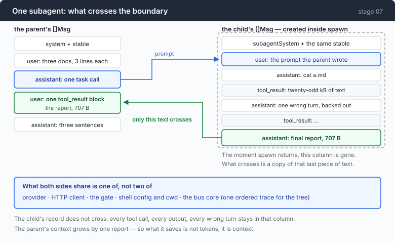
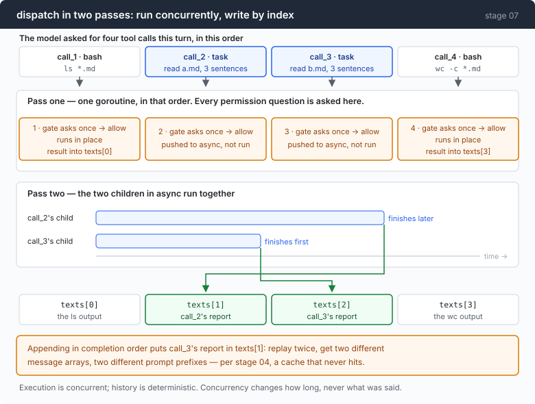

# Stage 07: Multiply — the loop calling itself, each copy with its own context

[06](../../06-the-composer/doc/README.md) → `07` → [08](../../08-sandbox/doc/README.md) → 09 → 10 → 11 → 12

> Measured against doing the same work inline: **+20% tokens, 2.9× output, 2.2×
> wall clock — and a parent context 9.6× smaller.** A subagent does not save
> tokens. It saves context, and knowing which of the two you are short of is
> the entire decision.

---

## The problem

"Summarise each of these three documents." The files are 63kB together.

Do it inline and the arithmetic is unforgiving. Each file gets `cat`-ed into the
conversation, and the conversation is re-sent on every subsequent call, so
document one is paid for while working on document three. At the end you have a
context window holding 63kB of source material to produce nine sentences, and
every one of those bytes is still there for whatever you ask next.

The waste is not the reading. The reading was necessary. The waste is that the
*intermediate* material — three whole documents — outlives its usefulness by the
rest of the session.

And this shape is everywhere: searching a large codebase, investigating a
failure, surveying a directory. **Read a lot, conclude a little.** The reading
is disposable and the conclusion is not, and one flat conversation has no way to
say so.

---

## The idea

Call the loop again, from inside a tool call, with a fresh conversation.



The child reads what it needs, gets things wrong, backs out, and finally writes
a report. Then it is discarded. **What crosses the boundary is a copy of its
last message and nothing else.**

There is no new machinery in that sentence. A subagent is the same `runTurn`,
called again, with a different system prompt and an empty message array. The
interesting parts are all about the boundary.

---

## Building it

The code is in [`07-multiply/code/`](../code/).

### Step 1: tell the model the mechanism instead of hiding it

```
Everything you do here is discarded when you finish EXCEPT your final message.
Your caller will never see your commands, your reasoning, or your tool output —
only the last thing you say. So your final message has to stand alone:
```

Without that paragraph, a subagent writes a summary of its *process* — "I looked
at several files and found some things" — because that is what a chat turn
normally is. It is answering a person who watched it work.

Nobody watched it work. Saying so, plainly, changes the output from a
conversational reply into a report.

### Step 2: the tool description is an economics argument, not a feature list

```go
Description: "Delegate a self-contained piece of work to a subagent with its own context window. " +
    "The subagent has the same shell and returns only a final written report; its commands and " +
    "output never enter your context. Use this for work that will read a lot and conclude a little — " +
    "searching a large codebase, investigating a failure, surveying files. Do not use it for a single " +
    "command, and do not use it for work whose intermediate output you need to see.",
```

Read the last sentence. Two explicit prohibitions, both of them cases where the
tool works perfectly and is the wrong choice.

A tool description is the only training a model gets about *when* to reach for
something. Describing capability gets you a tool used whenever it could work;
describing economics gets you a tool used when it should.

### Step 3: run one child

```go
child := a.newChild(agentID, func() string { return subagentSystem + para + a.stable })

msgs := []Msg{TextMsg(RoleUser, prompt)}
msgs = child.runTurn(msgs)

report := lastAssistantText(msgs)
if strings.TrimSpace(report) == "" {
    report = "[the subagent produced no final report — it may have hit its turn limit or been cut off. Treat this as a failure, not as an empty result.]"
}
```

Four lines of mechanism and one of honesty.

An empty report is not an empty result. A child that hit its turn limit produced
*nothing*, and handing the parent `""` reads as "I looked, there was nothing
there" — which the parent will believe and act on. The message says which of the
two it is.

### Step 4: write down what is shared, one field at a time

```go
child := &agent{
    p: a.p, httpc: a.httpc, g: a.g, cfg: a.cfg,
    bus:       a.bus.Fork(agentID),
    memoryDir: a.memoryDir,
    stable:    a.stable,
    depth:     a.depth + 1,
    maxDepth:  a.maxDepth,
    system:    system,
    comp: newCompactor(a.comp.window, a.comp.threshold, a.comp.keepRatio),
}
child.comp.est.ratio = a.comp.est.ratio // one free hint, then it calibrates
child.cfg.maxTurns = a.cfg.subTurns
return child
```

| shared | not shared |
|---|---|
| provider, HTTP client | the message array |
| the permission gate | the system prompt |
| shell config and working directory | the compactor |
| the bus core — one ordered trace for the tree | the turn budget |

Two of those deserve a sentence.

**A new compactor, not the parent's.** They have different conversations, so
they hit the wall at different times. Sharing one would have a child's growth
trigger the parent's compaction.

**The estimator ratio is copied once.** The child starts with the parent's
characters-per-token figure instead of the 3.6 cold start, and then calibrates
its own. One free hint, and no coupling afterwards.

### Step 5: the depth limit removes the tool; it does not refuse the call

```go
func (a *agent) tools() []Tool {
    if a.depth >= a.maxDepth {
        return []Tool{bashToolDef()}
    }
    return []Tool{bashToolDef(), taskToolDef()}
}
```

The obvious implementation refuses at call time. It is worse in two ways that
compound.

It costs a full round trip to say no — plus the tool-definition tokens sitting
in every request that can never use it. And a model presented with a tool it is
then forbidden to use will argue: it rephrases, it tries a variant, it asks why.
**A rule you can see and cannot satisfy invites negotiation.** A tool that is
not in the list is not a rule at all.

### Step 6: run concurrently, return in the order asked



Two passes, and the split exists because of a race that is easy to miss.

Pass one is sequential, on one goroutine, and it is where every permission
question is asked:

```go
v, why := a.g.ask("subagent — " + description)
```

Two goroutines writing a prompt to one terminal produce a single interleaved
line and then read **one answer for both questions**. The user approves one
command and a different one runs. So all asking happens before any concurrency
starts.

Pass two runs the approved children together:

```go
if len(async) > 0 {
    var wg sync.WaitGroup
    for _, p := range async {
        wg.Add(1)
        go func(p pending) {
            defer wg.Done()
            report, _, err := a.spawn(calls[p.i].ID, p.description, p.prompt)
            if err != nil {
                texts[p.i] = fmt.Sprintf("[the subagent failed: %v]", err)
                return
            }
            texts[p.i] = report
        }(p)
    }
    wg.Wait()
}

for i, c := range calls {
    results[i] = a.emitResult(turn, c.ID, texts[i])
}
```

Each goroutine writes to `texts[p.i]` — **its own index** — and the results are
emitted in call order afterwards.

Appending in completion order would be the natural thing and would be a serious
bug. The same session replayed twice would produce two different message arrays,
two different prompt prefixes, and (stage 04) a cache that never hits. Worse, it
would be intermittent.

> Execution is concurrent. History is deterministic. Concurrency may change how
> long something takes; it may not change what the conversation said.

### Step 7: one bus, one ordered stream

```go
func (b *Bus) Fork(agent string) *Bus {
    return &Bus{core: b.core, depth: b.depth + 1, agent: agent}
}
```

`Fork` copies nothing. It shares the core and adds a label.

```go
b.core.mu.Lock()
defer b.core.mu.Unlock()
b.core.seq++
e.Seq = b.core.seq
```

One mutex, one sequence counter, N producers. Four agents running at once
produce **one** totally-ordered trace, which is what keeps stage 06's views
working — they assume a single timeline, and this is what makes that assumption
true rather than merely convenient.

### The other half

Skills — a directory, a one-line description, and the arithmetic of what that
description costs in every request forever — are [part 1](1-skills.md).

---

## Run it

```sh
go build -o agent ./07-multiply/code
cd sandbox && set -a && . ../.env && set +a

../agent --yolo --max-output 60000
> read each of a.md, b.md and c.md in full and write three sentences on each

../agent --yolo --max-output 60000 --max-depth 0
> read each of a.md, b.md and c.md in full and write three sentences on each
```

`--max-depth 0` removes the `task` tool, so the second run is the same task done
inline. Then:

```sh
../agent --subagent "count the go files under code/ and report the total"
```

**What to watch for:**

- The `╰─` line under each child: turns, tokens, milliseconds, and bytes
  returned. Those bytes are the only thing that entered the parent.
- The context number on the parent's last panel, in both arms.
- In the third command: no REPL, one prompt in, one report out. That is the
  whole subagent mechanism as a command-line tool.

---

## Measured

Three Markdown files, 63kB total, same task, same model.

```
  ╰─ 2 turns ·  5133 prompt +  204 output tokens ·  6327ms →  707B returned
  ╰─ 2 turns · 11952 prompt +  237 output tokens · 12441ms →  827B returned
  ╰─ 2 turns ·  4696 prompt +  380 output tokens · 13519ms →  950B returned
```

| | delegate | inline |
|---|---:|---:|
| model calls | 9 (3 parent, 6 child) | 3 |
| prompt tokens | 25,782 | 19,715 |
| at 0.1× cache read | **22,038** | **18,390** |
| output tokens | 1,635 | 571 |
| wall clock | 39s | 18s |
| **parent context at the end** | **1,893** | **18,160** |

Delegation lost on every axis except one: **+20%** tokens, **2.9×** output,
**2.2×** wall clock, three times the model calls.

And won the last row by **9.6×**.

Across the three children, **21,781 prompt tokens went in and 2,484 bytes came
back**. That ratio is the whole mechanism, stated as a number: the reading
happened, it cost what it costs, and then it stopped existing.

So the rule is not "use subagents". It is:

> A subagent does not save tokens. It saves context. Delegate when the parent's
> window is the scarce thing, not when the bill is.

On a three-file task, the bill is the scarce thing and inline wins. On a
forty-file investigation, the parent hits the wall around file six and inline
does not finish at all.

### And this feature is not required for the capability

```go
if *subagentAt != "" {
    child := a.newChild("cli", func() string { return subagentSystem + para + stable })
    msgs := child.runTurn([]Msg{TextMsg(RoleUser, *subagentAt)})
    fmt.Println()
    fmt.Println(lastAssistantText(msgs))
    return
}
```

That flag makes the agent a one-shot subagent from the command line. Which means
an agent with only `bash` can already do all of this:

```sh
agent --subagent "summarise a.md" > /tmp/a.txt &
agent --subagent "summarise b.md" > /tmp/b.txt &
wait; cat /tmp/*.txt
```

Concurrency, isolation, one report each. No `task` tool, no `dispatch`, no
`Fork`.

What the in-process version adds is not the capability — it is the
instrumentation: one ordered trace across the tree, per-child token accounting,
one permission gate. **The shell is a perfectly good orchestrator right up until
you want to know what it cost.**

---

## Next

Everything so far has run the model's commands directly on your machine, behind
a gate that can only show you a string.

Stage 01 said that was the honest weakness of "bash is all you need" and left it
there. The next chapter takes it seriously: an embedded shell interpreter that
sees a command *after* expansion, so `rm -rf $D` can be inspected as the path it
actually resolves to.

[Stage 08](../../08-sandbox/doc/README.md) also has the repo's only dependency,
and a measured account of what that one cost — it moved the Go floor twice
before being pinned back. It is marked optional for exactly that reason, and
phase 2 continues from stage 07 rather than through it.
