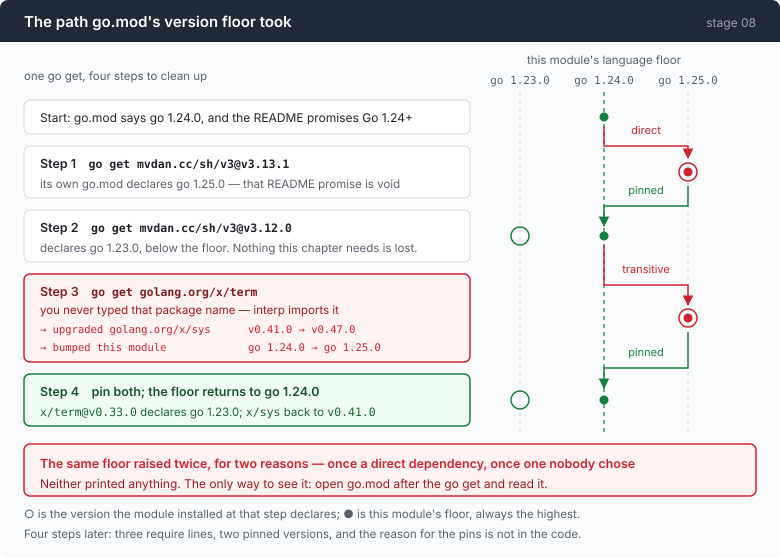

# Stage 08 · part 1: the ledger for one dependency

[← back to stage 08](README.md)

> `go get` printed nothing unusual. It had raised this module's language floor
> twice — once for the package that was asked for, and once for a package
> nobody chose.

---

## The problem

Stages 00–07 are the standard library plus `golang.org/x/sys`, and that is a
claim the README makes to a reader: this project is small enough to read, and
nothing in it is somebody else's black box.

Stage 08 needs a shell interpreter. Writing one is not a chapter, it is a
career — expansion, quoting, job control, arithmetic, `[[`, arrays, and the
forty years of compatibility that make a shell useful. `mvdan.cc/sh/v3` exists,
is good, and is the right call.

So the question is not whether to take the dependency. It is what taking it
actually costs, and whether that cost is visible.

---

## The idea

Take it, and write down every effect it had, in the order they happened.



The criterion this repo applies to a dependency is narrow: **it must do
something you could not reasonably do yourself.** A shell interpreter clears
that bar with room to spare.

The criterion says nothing about the second cost, which is the one this document
is about: what the dependency does to *your* module.

---

## Building it

### Step 1: `go get`, latest version

```
go get mvdan.cc/sh/v3@v3.13.1
  → declares `go 1.25.0`, which would raise this module's floor two releases
```

`go.mod` said `go 1.24.0`. The README promises Go 1.24+. One command later,
neither is true — because Go takes the maximum of every dependency's declared
language version, and a dependency declaring 1.25 makes you a 1.25 module.

Nothing in the output says so.

### Step 2: back off one version

```
pin to v3.12.0
  → declares `go 1.23.0`. Fine.
```

`v3.12.0` declares a version below the floor, so the floor does not move. And
nothing this chapter needs is missing from it — the exec and open handlers are
older than either release.

This is a real technique and it is worth naming: **when a dependency raises your
floor, check whether the previous release does the job.** Often the bump had
nothing to do with the API you are using.

### Step 3: a package you did not choose

```
...but interp imports golang.org/x/term
go get golang.org/x/term
  → upgraded golang.org/x/sys  v0.41.0 → v0.47.0
  → bumped this module          go 1.24.0 → go 1.25.0
```

You never typed `golang.org/x/term`. `interp` imports it, so it is yours now.

And it brought its own opinion about `x/sys` — a module this repo already
depended on, at a version it had chosen — and raised the floor a second time,
for a reason two levels away from anything anyone decided.

Read the second line of that output again. `go get` reports the upgrade. What it
does not report is that the upgrade changed the language version of the module
you are standing in.

### Step 4: pin both

```
pin x/term to v0.33.0 (`go 1.23.0`) and x/sys back to v0.41.0
  → floor restored to go 1.24.0
```

Four steps for one `go get`, and the end state is a `go.mod` with three `require`
lines, two of them pinned to versions that look arbitrary.

**The reason for those pins is nowhere in the code.** That is what this document
is for.

---

## Run it

```sh
cd /path/to/this/repo
grep '^go ' go.mod
grep -A5 '^require' go.mod
go list -m all | grep -E 'mvdan|x/term|x/sys'
```

Then reproduce it, in a scratch copy so you do not have to undo it:

```sh
cp go.mod go.mod.bak
go get mvdan.cc/sh/v3@latest
grep '^go ' go.mod          # look at this before anything else
mv go.mod.bak go.mod && go mod tidy
```

**What to watch for:** the `go` line, before and after. That is the whole
lesson, and it is one line in a file most people open only when something is
broken.

Then check the claim that stages 00–07 are unaffected:

```sh
go list -deps ./07-multiply/code | grep -v '^internal/' | grep -Ev '^(std|[a-z]+/|[a-z]+$)' 
go list -deps ./08-sandbox/code | grep mvdan
```

The interpreter is linked into stage 08's binary and no other.

---

## Measured

```
go get mvdan.cc/sh/v3@v3.13.1
  → declares `go 1.25.0`, which would raise this module's floor two releases

pin to v3.12.0
  → declares `go 1.23.0`. Fine.

...but interp imports golang.org/x/term
go get golang.org/x/term
  → upgraded golang.org/x/sys  v0.41.0 → v0.47.0
  → bumped this module          go 1.24.0 → go 1.25.0

pin x/term to v0.33.0 (`go 1.23.0`) and x/sys back to v0.41.0
  → floor restored to go 1.24.0
```

| | |
|---|---|
| `go get` commands intended | 1 |
| times the language floor moved | **2** |
| of those, caused by a package nobody chose | **1** |
| steps to restore the floor | 4 |
| warnings printed by any tool | **0** |
| final pins | `mvdan.cc/sh/v3@v3.12.0`, `x/term@v0.33.0`, `x/sys@v0.41.0` |

Stages 00–07 remain standard library plus `golang.org/x/sys`, and their binaries
link none of this.

### The ledger does not balance

Three things belong on the other side of it, and the criterion this repo uses to
judge a dependency does not weigh any of them.

**It moved a promise.** The README's "Go 1.24+" was not a technical constraint,
it was a statement to a reader about what they need installed. A transitive
dependency changed it, silently, and only reading `go.mod` afterwards catches
that.

**It sits in the policy path.** This is not a logging library. The interpreter
is what decides which processes start, so a bug in it is a policy bug — in a
chapter whose whole subject is that policies are hard to get right.

**The cost was invisible until someone looked.** Not hidden, not undocumented —
just not printed. The tooling reports what it upgraded and not what that did to
you, and there is no step in a normal workflow where anyone reads `go.mod`.

So the honest version of the criterion is longer than one sentence:

> A dependency must do something you cannot reasonably do yourself — **and you
> must read your own `go.mod` afterwards, because it is the only place the rest
> of the bill is written down.**

---

## Next

[Back to stage 08](README.md), or on to
[stage 09](../../09-triage/doc/README.md) — where the agent stops assuming the
model call succeeds.
