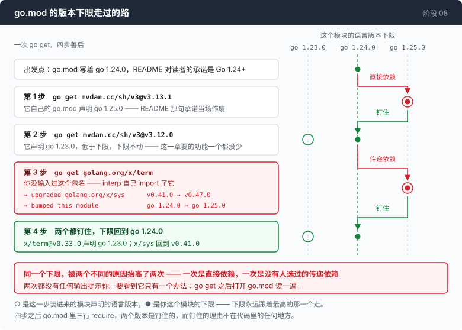

# 阶段 08 · 第 1 部分：一个依赖的账 —— 它改的是你没打算改的东西

[00](../../00-loop/doc/README_zh.md) → 01 → 02 → 03 → 04 → 05 → 06 → [07](../../07-multiply/doc/README_zh.md) → `08` → [09](../../09-triage/doc/README_zh.md) → 10 → 11 → 12

> [返回本章](README_zh.md) · 一次 `go get`，四步善后，而账单上最贵的那一项在 `go.mod` 里，没有人通知你。

---

## 问题

到第 07 章为止，这个仓库的依赖表上只有一样东西：`golang.org/x/sys`。它在两个地方用到，都是没有替代品的地方 —— 第 01 章要在 Windows 上用 Job Object 杀掉整棵进程树，第 06 章要问终端有多宽。

第 08 章第 5 步要求内嵌一个 shell 解释器。

你先认真想了想自己写。写不了。不是「工作量大」的那种写不了 —— 引号规则、参数展开的十几种形式、`$(...)` 的嵌套、`eval`、通配符、算术展开，这些加起来是一整门语言，而且这门语言的细节里全是 bash 三十年的历史包袱。把它写错，你得到的不是一个功能少一点的沙盒，是一个**判断和真 shell 不一致**的沙盒 —— 也就是一个在你不知道的地方放行的沙盒。这比没有沙盒更糟。

所以你敲下 `go get`。

然后有四件事发生了，其中三件没有任何人告诉你。

你会在下一次别人 clone 这个仓库、`go build` 失败的时候才知道。

---

## 办法

一个依赖的成本不是它的代码量，也不是它的许可证。

| 你以为在付什么 | 实际在付什么 |
|---|---|
| 多一行 import | 你这个模块的语言版本下限被抬高 |
| 一个包 | 一个你从没选过的传递依赖被顺手升级 |
| 一个工具 | 它进了策略路径，它的 bug 就是你的策略 bug |



判断标准只有一条，而且它比「有多少 star」严格得多：**它做的事，是不是你自己做不了。** 上面那三行是这个标准要称量的另一边，而这一次，最重的那一项在称完之前是看不见的。

---

## 怎么做的

### 第 1 步：`go get` 最新版

```sh
go get mvdan.cc/sh/v3@v3.13.1
```

它自己的 `go.mod` 里声明 `go 1.25.0`。

Go 的模块规则是：你依赖的模块声明的语言版本，会成为你这个模块的下限。这个仓库的 `go.mod` 写的是 `go 1.24.0`，README 里对读者的承诺也是 Go 1.24+。装上这个版本，那句承诺当场作废，而且**作废的方式是静默的** —— 你的机器上是 Go 1.25，所以你什么都没看见。

### 第 2 步：往回退一个版本

```sh
go get mvdan.cc/sh/v3@v3.12.0
```

v3.12.0 声明 `go 1.23.0`。低于这个仓库的下限，没问题。

到这里看起来结束了。这一章要的功能在 v3.12.0 里全都有：`syntax`、`expand`、`interp` 三个包，两个处理器接口，一个都没少。

### 第 3 步：`interp` 引入了一个你没选的包

`interp` 自己 import 了 `golang.org/x/term`。于是：

```sh
go get golang.org/x/term
```

这一条命令做了两件你没要求的事：

```
→ upgraded golang.org/x/sys  v0.41.0 → v0.47.0
→ bumped this module          go 1.24.0 → go 1.25.0
```

`golang.org/x/sys` 是第 01 章和第 06 章正在用的那个包。它被升了六个小版本，因为 `x/term` 的最新版要求。而 `x/term` 的最新版声明的语言版本，又一次把这个模块的下限推到了 `go 1.25.0`。

**同一个下限，被两个不同的原因抬高了两次。第二次的原因是一个没有人选过的包。两次都没有任何输出提示你。** 你要看到它，只有一个办法：`go get` 之后打开 `go.mod` 读一遍。

### 第 4 步：两个都钉住

```sh
go get golang.org/x/term@v0.33.0
go get golang.org/x/sys@v0.41.0
```

`x/term@v0.33.0` 声明 `go 1.23.0`。`x/sys` 回到第 01 章一直在用的那个版本。下限回到 `go 1.24.0`。

最终的 `go.mod`，四步之后：

```
go 1.24.0

require (
	golang.org/x/sys v0.41.0
	mvdan.cc/sh/v3 v3.12.0
)

require golang.org/x/term v0.33.0 // indirect
```

三行 require，两个版本是钉住的，而钉住的理由不在代码里的任何地方 —— 在这一节里。所以它写在这里，而不是写在一句 `// pinned` 注释里。

---

## 跑一下

这一节全部离线，也不需要构建这一章的 agent。

看每个模块声明的语言版本：

```sh
go list -m -f '{{.Path}} {{.Version}} {{.GoVersion}}' all
```

问一句 `x/term` 是谁拖进来的：

```sh
go mod why golang.org/x/term
```

然后验证前面八章确实没被牵连。构建第 07 章的二进制，看它链接了什么：

```sh
go build -o agent07 ./07-multiply/code
go version -m agent07 | grep -E 'mvdan|x/term'
```

**观察重点：**

- 第一条命令里，`mvdan.cc/sh/v3` 那行的 `GoVersion` 是 `1.23.0`，`golang.org/x/term` 那行也是。这两个数字就是第 2 步和第 4 步钉版本的全部理由。把它们换成各自的最新版再跑一次这条命令，你会看到 `1.25.0`，而 `go.mod` 第三行也会跟着变 —— 这就是第 3 步那件没人通知你的事，可以现场复现一次。
- 第二条命令的输出会指向 `mvdan.cc/sh/v3/interp`。这是「传递依赖」这个词的具体样子：一个你没输入过的包名，出现在你的依赖表里，理由在另一个模块的源码里。
- 第三条命令**没有输出**。第 00 到 07 章的每一个二进制都只链接标准库加 `golang.org/x/sys`；这个依赖只存在于第 08 章的二进制里。这也是这一章被排在主干之外的技术依据 —— 它是可以被撤掉的，而且撤掉的代价正好是一个 `diff`。

---

## 量一量

一次 `go get`，完整的账：

```
go get mvdan.cc/sh/v3@v3.13.1
  → declares `go 1.25.0`, which would raise this module's floor two releases

pin to v3.12.0
  → declares `go 1.23.0`. Fine.

...but interp imports golang.org/x/term
go get golang.org/x/term
  → upgraded golang.org/x/sys  v0.41.0 → v0.47.0
  → bumped this module          go 1.24.0 → go 1.25.0

pin x/term to v0.33.0 (`go 1.23.0`) and x/sys back to v0.41.0
  → floor restored to go 1.24.0
```

四步。两次抬高，两次撤销。**一次是直接依赖造成的，一次是一个没有人选过的传递依赖造成的，两次都没有任何提示。**

第 00 到 07 章保持标准库加 `golang.org/x/sys`，它们的二进制一个字节都没链接上面这些。

### 这笔账没有算平

这一章为这个依赖给出的理由是「它做的事你自己做不了」。这个理由成立 —— 上面「问题」那一节说的是真的，自己写一个解释器会得到一个判断和真 shell 不一致的策略。

但这笔账有三项支出，评判标准一项都没称到：

**第一，代价在 `go.mod` 里，而不在 import 里。** 一次 `go get` 抬高了两次语言版本下限，需要四步撤销，而这四步是靠打开 `go.mod` 用眼睛看出来的。没有一个环节会告诉你这件事发生了。

**第二，它现在坐在策略路径上。** `interp.ExecHandlers` 是策略被调用的地方，`literalWord` 依赖 `syntax` 包对每一种词的分类。这个库里的一个 bug，就是这个 agent 的一个策略 bug —— 而且是那种「表面上一切正常，实际上某一类命令没有被检查」的策略 bug。这不是对这个库的指控，它是这个领域里最认真的一个实现；这是在说依赖的位置比依赖的质量更决定风险。

**第三，也是最难看的一项：** 这个依赖买来的能力，在[本章「量一量」](README_zh.md#量一量)里被自己的一个通过的测试证明不是安全边界。花了这些代价装进来的东西，它宣称的用途（策略）交付不了，最后真正值钱的是那个副产品（可观测性）。

如果只按「策略」这一项来结账，这个依赖不划算。把「可观测性」算进来它就划算了 —— 因为**每一次 exec 都被报告**这件事，确实是你自己做不了的，而且它没有任何替代方案：`set -x` 只在你控制那个 shell 的时候有效，`strace` 不跨平台，而这两个都拿不到「argv 已经展开完」这个位置。

这个结论没有一个干净的形状，账就是这么记的。

---

## 接下来

上面这笔账直接决定了这一章在课程里的位置：一个可选的依赖，只能放在一条可选的路上。

[回到本章的「接下来」](README_zh.md#接下来)，那里说清楚了这条岔路怎么接回主干，以及第 09 章真正要面对的那个问题 —— 它和 shell 无关，和你把这个 agent 交给别人之后的第一个早上有关。
