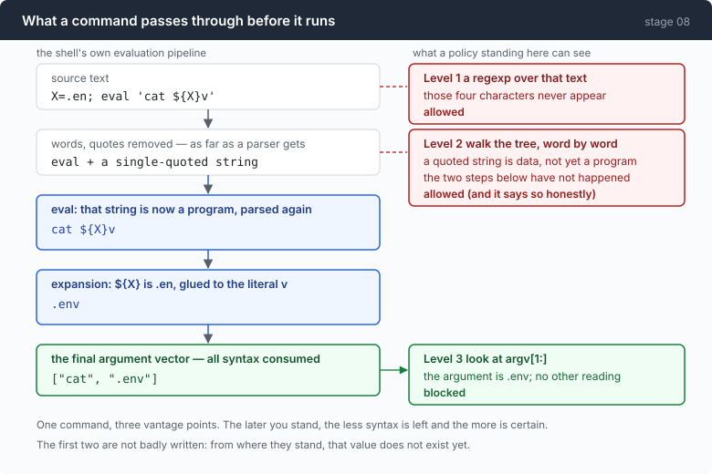
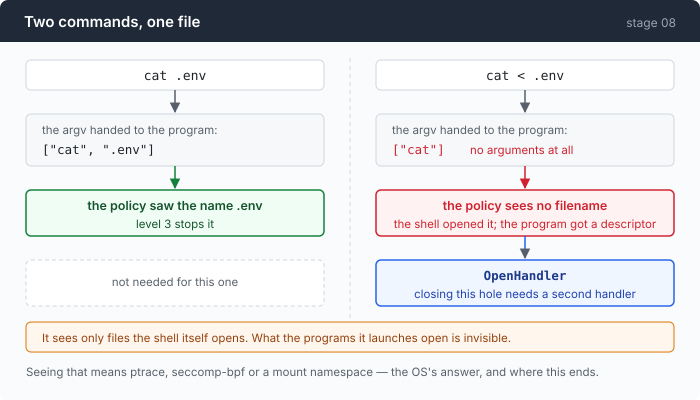

# Stage 08: Sandbox — you cannot put a boundary around a shell by reading the command

[07](../../07-multiply/doc/README.md) → `08` *(optional)* → [09](../../09-triage/doc/README.md) → 10 → 11 → 12

> Fourteen commands that read the same file. A regexp misses four of them, a
> shell parser misses seven, and **the misses do not overlap** — so running both
> checks is not a stronger check. One line defeats them together.

---

## The problem

Stage 01 ended with an admission: the permission gate can only show you a
string. `git push --force origin main` and `grep -r TODO .` arrive in exactly
the same shape, and telling them apart is your job, at eleven at night, with a
prompt waiting.

So write a rule. Something small and checkable: **the agent may not read
`.env`.**

Now try to enforce it.

```sh
cat .env
```

Easy — the string is right there. Then:

```sh
cat ".e""nv"
cat .en''v
X=.env; cat $X
eval "cat .env"
cat < .env
```

Every one of those reads the file. Not one of them is exotic; four of the five
are things a shell script does on purpose. And the last one is worse than it
looks, in a way that takes until step 6 to explain.

---

## The idea

Move the check later, and keep moving it until the syntax is gone.



| level | where it stands | what it has |
|---|---|---|
| 1 | the command string | text, before the shell has read it |
| 2 | the parse tree | structure, before anything has been evaluated |
| 3 | the exec handler | the argument vector, after everything |

The reason the third one is different in kind, not degree:

> **A shell is not a syntax, it is an evaluator.** A parse tree of an evaluator's
> input does not tell you what the evaluator will do.

---

## Building it

The code is in [`08-sandbox/code/`](../code/), and the dependency that makes
level 3 possible has its own ledger: [part 1](1-dependency.md).

### Step 1: make the rule small enough to be falsifiable

```go
// secretName is the file the policy protects.
const secretName = ".env"
```

```go
func isSecretPath(p string) bool {
	p = strings.TrimSpace(p)
	if p == "" {
		return false
	}
	return filepath.Base(filepath.Clean(p)) == secretName
}
```

One file, by base name. This is deliberately the simplest interesting rule,
because a rule that can be stated in a sentence can be tested exhaustively — and
this chapter's whole argument rests on the test table.

Be clear about what `isSecretPath` does not do: no symlink resolution, no `..`
canonicalisation, no knowledge that `/proc/self/cwd/.env` is the same file. And
even a version that did all three would still lose the check-then-open race.
**TOCTOU is the standard attack here, not an edge case.**

### Step 2: look at the string

```go
// denyPattern is what a first implementation always looks like.
var denyPattern = regexp.MustCompile(`\.env\b`)

func inspectString(command string) *refusal {
	if m := denyPattern.FindString(command); m != "" {
		return &refusal{Level: "string", What: m, Why: "the command mentions " + secretName}
	}
	return nil
}
```

Nine lines, and it does catch `cat .env`. It also catches `cat .env.example`
without the `\b`, and it is defeated by:

```sh
cat ".e""nv"     # one word to the shell, two strings to a regexp
cat .en''v
cat .en\v
cat $'\x2eenv'   # the name never appears as text at all
```

The last one is the honest summary of level 1: you are pattern-matching a
language whose entire job is to rewrite text before running it.

### Step 3: parse it

```go
	syntax.Walk(f, func(node syntax.Node) bool {
		if found != nil {
			return false
		}
		switch n := node.(type) {
		case *syntax.CallExpr:
			for _, w := range n.Args {
				if lit, ok := literalWord(w); ok && isSecretPath(lit) {
					found = &refusal{Level: "ast", What: lit,
						Why: "an argument resolves to " + secretName}
					return false
				}
			}
```

This is a real improvement and it wins several rows outright. Quoting is gone —
the parser joins `".e""nv"` into one word, because that is what the shell does.
It even finds `.env` inside `$(echo .env)`, since walking the tree descends into
the command substitution.

### Step 4: the parser has to admit when it does not know

```go
func literalWord(w *syntax.Word) (string, bool) {
	var b strings.Builder
	for _, part := range w.Parts {
		switch p := part.(type) {
		case *syntax.Lit:
			b.WriteString(p.Value)
		// ...
		default:
			return "", false // ParamExp, CmdSubst, ArithmExp, ExtGlob, …
		}
	}
	return b.String(), true
}
```

That `default` is the most important line in the file, and it is a refusal to
guess.

`$X` has no value at parse time. `${MISSING:-.env}` has a value that depends on
the environment. Returning a partial string — "the literal parts, joined" —
would produce a policy that is confidently wrong about what it just approved.

```go
		case *syntax.SglQuoted:
			if p.Dollar {
				// ...
				return "", false
			}
			b.WriteString(p.Value)
```

`'x'` is a literal; `$'x'` is ANSI-C quoting, where `$'\x2eenv'` is `.env` with
the name nowhere in the text. Same node type, two meanings, one boolean.

The result is a check that is honest and still loses, on these:

```sh
X=.env; cat $X
cat "${MISSING:-.env}"
eval "cat .env"
for f in .env; do cat "$f"; done
```

Not because the parser is bad. Because at the point where a parser stands, those
values do not exist.

### Step 5: be the shell

```go
	runner, err := interp.New(
		interp.Dir(s.dir()),
		interp.StdIO(nil, &stdout, &stderr),
		interp.Env(expand.ListEnviron(os.Environ()...)),
		interp.ExecHandlers(s.execHandler(bus)),
		interp.OpenHandler(s.openHandler(bus)),
	)
```

Instead of asking bash to run a string, run it yourself with an interpreter that
calls you before every exec.

```go
func (s *sandbox) checkArgv(args []string) *refusal {
	for _, a := range args[1:] {
		if isSecretPath(a) {
			return &refusal{Level: "sandbox/exec", What: a,
				Why: "an argument resolves to " + secretName + " after expansion"}
		}
	}
```

That loop is simpler than level 2's tree walk, and it is strictly stronger,
because by the time it runs there is no syntax left. Expansion has happened,
`eval` has happened, the loop has iterated. `argv` is what the program is about
to receive.

The exec handler also fires for **every** program the shell runs, including ones
nobody typed — what a pipeline expanded into, what a glob matched, what `eval`
produced.

```go
			bus.Emit(Event{Kind: KindSandboxExec, Command: joined})
```

Which is the part that turns out to matter most, and it is not the policy. It is
that you now have a record of every process the shell started.

### Step 6: one hole argv can never see



```sh
cat < .env
```

`argv` is `["cat"]`. One element. **No argument inspection at any level can see
that filename** — including level 3 — because the shell opened the file and
handed the program a file descriptor.

So the interpreter needs a second handler for a second question:

```go
func (s *sandbox) openHandler(bus *Bus) interp.OpenHandlerFunc {
	return func(ctx context.Context, path string, flag int, perm os.FileMode) (io.ReadWriteCloser, error) {
		// ...
		if isSecretPath(path) {
			r := &refusal{Level: "sandbox/open", What: path, Why: "a redirect targets " + secretName}
			// ...
			if s.enforce {
				return nil, r
			}
		}
		return interp.DefaultOpenHandler()(ctx, path, flag, perm)
	}
}
```

And note the limit of even that: it sees files **the shell itself** opens. What
the programs the shell launches go on to open is invisible to an interpreter,
full stop.

### Step 7: wiring it in, and a bug that was one missing field

```go
	var r execResult
	if a.sb != nil {
		r = a.sb.run(command, a.cfg.timeout, a.bus)
	} else {
		r = runBash(a.cfg.shell, command, a.cfg.timeout)
	}
```

`--sandbox` is a claim about a session: every command in it goes through the
interpreter.

The claim was false for every delegated command.

```go
	child := &agent{
		p: a.p, httpc: a.httpc, g: a.g, cfg: a.cfg, sb: a.sb,
```

`sb: a.sb` is the fix. Before it, `newChild` built a subagent field by field and
simply did not list `sb` — so children got a nil sandbox, took the other branch
above, ran in real bash with no policy, emitted no `sandbox_exec` events, and
contributed nothing to the end-of-session tally.

Invisible, because the parent's own commands were still checked.

The field-by-field construction is not carelessness either: `go vet` correctly
refuses to copy a struct containing a `sync.Mutex`, so `child := *a` is not
available. **Both defaults are wrong in one direction** — a struct copy inherits
what must not be shared; an explicit list fails to inherit what must.

The same function repeats the bug two chapters later: stage 10 adds three
deadlines to `agent`, subagents do not get them, and nobody notices until stage
11.

---

## Run it

```sh
go build -o agent ./08-sandbox/code
cd sandbox && printf 'SECRET=hunter2\n' > .env && printf 'a\nb\n' > notes.txt
set -a && . ../.env && set +a

../agent --yolo --sandbox
> read notes.txt, then try to read .env and tell me what happened
```

Then the observation-only mode, which blocks nothing:

```sh
../agent --yolo --observe
> find every go file under . and count them
```

And the table this chapter's argument rests on:

```sh
go test ./08-sandbox/code/ -run TestBypass -v
```

**What to watch for:**

- The refusal text names what it objected to. That matters: the model reads it
  and routes around it. A bare "denied" teaches it to try the same thing again.
- In `--observe`, the number of `sandbox_exec` events versus the number of
  commands the model issued. A pipeline is several execs; a glob is several
  more.
- In the test output: which rows only one level catches.

---

## Measured

Fourteen commands that read `.env`. Every row was verified to actually read the
file, by running it with the policy off:

```
command                works?  string   ast    sandbox
plain                  true    blocked  blocked blocked
single quotes          true    blocked  blocked blocked
split across quotes    true      --     blocked blocked    one word to the shell, two strings to a regexp
empty quotes inside    true      --     blocked blocked
backslash              true      --       --    blocked
leading ./             true    blocked  blocked blocked    a different string, the same file
ANSI-C quoting         true      --       --    blocked    the name never appears as text at all
variable               true    blocked    --    blocked    the value does not exist until runtime
command substitution   true    blocked  blocked blocked
eval                   true    blocked    --    blocked    the program is data until it is not
parameter default      true    blocked    --    blocked
loop                   true    blocked    --    blocked
redirect               true    blocked  blocked blocked    argv is just ["cat"] — no filename anywhere in it
nested shell           true    blocked    --    blocked    a whole program smuggled in one argument
```

```
string missed 4 · ast missed 7 · caught only by ast: 2 · caught only by string: 5
```

**The two checks' misses are disjoint, not nested.** Two rows only the parser
catches, five only the regexp catches. So the obvious defensive move — run both
— adds nothing an attacker has to beat, because a command only has to defeat one
property at a time.

One line beats both:

```sh
X=.en; eval 'cat ${X}v'
```

The text `.env` appears nowhere, so the regexp has nothing to match. The word
`${X}v` is a parameter expansion glued to a literal, so the parser correctly
reports that it cannot know. Level 3 sees:

```
command:  X=.en; eval 'cat ${X}v'
argv:     ["cat", ".env"]
```

From one real run:

```
  $ wc -l notes.txt
  $ cat .env 2>&1; echo "EXIT_CODE=$?"
  ⛔ blocked by the sandbox/exec policy: an argument resolves to .env after expansion (matched ".env")
```

`wc -l notes.txt`: exit 0, 64ms. The blocked command: exit 1, 1ms. The model
read the refusal and moved on without retrying.

One thing on that transcript worth noting: the `; echo "EXIT_CODE=$?"` after the
blocked command produced **no line in the captured stdout**. The refusal appears
to have terminated the whole statement list, not just the one exec.

### The row that contradicts this chapter

```
--- PASS: TestTheSandboxCannotSeeInsideAProgram
    as documented: the sandbox saw one exec, allowed it, and the program did
    the rest. An embedded interpreter is a policy and observability layer, not
    a security boundary.
```

The command:

```sh
awk -v a=.en 'BEGIN{f=a"v"; while((getline l < f)>0) print l}'
```

The sandbox sees `awk -v a=.en <a program>`, allows the exec — correctly, by its
own rule — and awk reads the file.

That defeat generalises to every program that takes a program as an argument:
`awk`, `perl`, `python`, `ruby`, `node`, `find -exec`, `git -c core.pager=…`,
`make`. `sh -c` is blocked explicitly:

```go
	if len(args) >= 3 {
		switch args[0] {
		case "sh", "bash", "dash", "zsh", "ksh":
			if args[1] == "-c" {
				return &refusal{Level: "sandbox/exec", What: strings.Join(args, " "),
					Why: "a nested shell would run outside this sandbox's view"}
			}
		}
	}
```

and that is a half-measure which does not generalise, and says so in a comment.

So the chapter builds a three-level progression toward "be the shell", and then
ships its own defeat as a **passing test**. That is the honest thing to do, and
it means the conclusion is not the one the progression implies:

> This is a policy and observability layer. It is not a security boundary. For a
> coding agent the right answer is almost always to run it in a container.

Which leaves the thing that actually earned its place: `--observe`. Every exec,
every open, every process the shell started, on the bus. The feature that fails
at its stated purpose succeeds completely at the side effect.

---

## Next

This stage is a side road. It is the one place in the repository that takes a
dependency, and [part 1](1-dependency.md) is the ledger for that — a single
`go get` that moved the module's language floor **twice**, once for a package
nobody chose.

Phase 2 continues from **stage 07**, not from here, so the dependency stays
optional in practice as well as in the README.

[Stage 09](../../09-triage/doc/README.md) starts it: what an agent does when the
call itself fails. Two protocols, one taxonomy, and the two obvious rules both
turn out to be wrong on recorded bytes — a nonexistent model returns **401**,
and a malformed body returns **500**.
