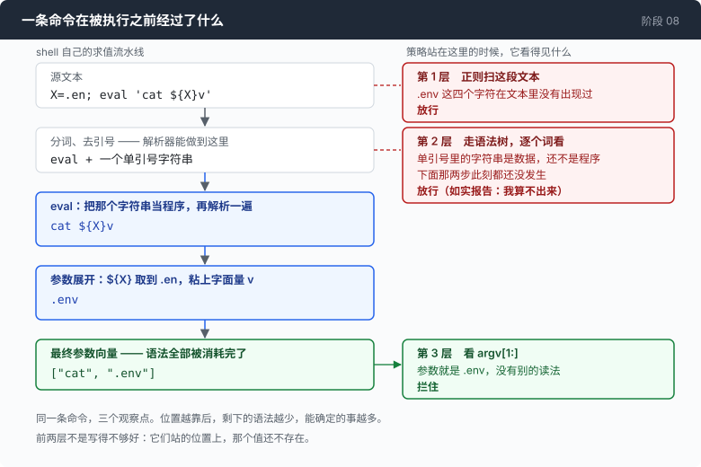
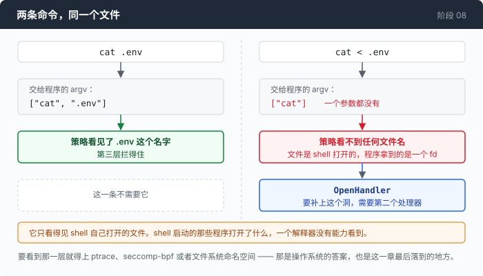

# 阶段 08：沙盒 —— 你没办法靠读命令字符串给一个 shell 加边界

[00](../../00-loop/doc/README_zh.md) → 01 → 02 → 03 → 04 → 05 → 06 → [07](../../07-multiply/doc/README_zh.md) → `08` → [09](../../09-triage/doc/README_zh.md) → 10 → 11 → 12

> 同一条规则写三遍，一遍比一遍站得靠后。前两遍是所有人都会写的那两遍，各一行就能绕过去。这一章也是整个仓库唯一引入外部依赖的地方，所以它是一条岔路，不是主干。

---

## 问题

第 07 章之后，你的 agent 会分身。你说一句「把这三个服务的配置都检查一遍」，它拆成三个子任务，三条命令同时开始跑。

第 01 章那道闸门还在。每条命令跑之前它问你一句，等你按 y。三个子 agent 并发地问，所以第 07 章给每个问题都带上了它自己的命令文本 —— 否则屏幕上三行命令一个问题，你根本不知道在答哪一条。

跑到第七八条的时候你按了 `a`。

这个键的意思写在提示里：这一整场会话，所有 agent，都不再问。按下去之后，闸门对整棵树关掉了。这不是漏洞，是一个明摆着的交易：换成每个子 agent 单独问一遍，人会更快地去加 `--yolo`。

现在把这件事放一边，看那个更难的。假设你有无限的耐心，每一条都认真读、认真答。屏幕上出现这一条：

`cat "$CONFIG_FILE"`

你按 y 还是 n？

`$CONFIG_FILE` 的值你不知道。闸门不知道。写闸门的那段代码也不知道 —— 那个值要等命令真的开始跑的时候才存在。你在被问一个此刻还没有答案的问题。

于是你想把判断交给代码。规则本身很好写，一句话：**不许读 `.env`**。你在跑命令之前加一个检查：命令里出现 `.env` 就拒绝。

这个检查能挡住 `cat .env`。挡不住 `cat .en''v` —— 那是同一条命令，不是同一个字符串。也挡不住 `cat "$CONFIG_FILE"`，哪怕那个变量的值就是 `.env`。

**你手上只有一个字符串，而决定会发生什么的不是这个字符串，是 shell 读完它之后做的事。**

---

## 办法

把检查搬到 shell 自己的求值流水线上去。站的位置决定你能看见多少。



| 站在哪里 | 你看到的是 | 被什么打败 |
|---|---|---|
| 命令字符串 | 你以为会跑的东西 | 引号 |
| 语法树 | shell 会怎么切词 | 展开 |
| 展开之后的 argv | 真的会跑的东西 | 见本章「量一量」 |

三行不是「越来越多的规则」。每一行都把检查往后搬了一站，让更多的真相已经发生完。最后一行搬到了唯一一个真相完整的位置：参数向量定下来的那一刻，前面所有语法都已经被消耗掉了，没有东西可以再藏在语法后面。

---

## 怎么做的

代码在 [`08-sandbox/code/policy.go`](../code/policy.go)（前两层）和 [`shell.go`](../code/shell.go)（第三层）。

第三层要内嵌一个真正的 shell 解释器，也就是要引入这个仓库唯一的外部依赖。这个依赖值不值、它实际花了什么代价，在[第 1 部分：一个依赖的账](1-dependency_zh.md)里单独算。

### 第 1 步：把规则缩小到能被证伪

先不要写「不许做危险的事」。那种规则没法测，而一条你没法测的规则，你只是在猜它有效。

一个文件，一个动作：

```go
// secretName is the file the policy protects.
const secretName = ".env"
```

判断一个路径是不是它，就一行：

```go
func isSecretPath(p string) bool {
	p = strings.TrimSpace(p)
	if p == "" {
		return false
	}
	return filepath.Base(filepath.Clean(p)) == secretName
}
```

只比对文件名。它不解析符号链接，不规范化 `..`，也不知道 `/proc/self/cwd/.env` 是同一个文件。这三件事都该做，而且做完之后它仍然会输 —— 检查和打开之间有一个时间窗，路径可以在这中间被换掉。在沙盒这件事上这不是边缘情况，是标准打法。

这一段限制写在源码注释里，是有意的：**这一章要论证的东西，从最底层那个函数开始就已经不成立了。**

### 第 2 步：看字符串

所有人的第一版，包括所有 agent 产品里都能找到的那一版：

```go
// denyPattern is what a first implementation always looks like.
var denyPattern = regexp.MustCompile(`\.env\b`)

func inspectString(command string) *refusal {
	if m := denyPattern.FindString(command); m != "" {
		return &refusal{Level: "string", What: m, Why: "the command mentions " + secretName}
	}
	return nil
}
```

它对你想到过的命令有效。打败它的不是什么巧妙手法，就是 shell 语法里最普通的几个特性：

`cat ".e""nv"`、`cat .en''v`、`cat .en\v`、`cat $'\x2eenv'`

四条命令，对 bash 来说和 `cat .env` 完全一样，对这个正则来说都不是。最后那条尤其干净：`.env` 这四个字符在文本里根本没有出现过。

正则再怎么改都补不上这个洞，因为它看的是源文本，而 shell 看的是源文本**的意思**。

### 第 3 步：解析它

用一个真正的 shell 解析器把命令解析开，然后检查它切出来的词。

这是一次实质改进，不是换个写法。解析器知道 `".e""nv"` 是一个词、它的字面量部分拼起来是 `.env`；知道 `'.env'` 是带引号的字面量；知道 `cat<.env` 里有一个重定向，尽管中间没有空格。上一步那四条命令在这里全部死掉，因为解析器干的活和 shell 干的是同一件。

```go
	syntax.Walk(f, func(node syntax.Node) bool {
		if found != nil {
			return false
		}
		switch n := node.(type) {
		case *syntax.CallExpr:
			for _, w := range n.Args {
				if lit, ok := literalWord(w); ok && isSecretPath(lit) {
					found = &refusal{Level: "ast", What: lit,
						Why: "an argument resolves to " + secretName}
					return false
				}
			}
```

顺带一个默认值：解析失败按拒绝算，不按通过算。一条它解析不了的命令就是一条它判断不了的命令，而「我看不懂，所以我放行」对一个专门用来做判断的检查来说是错的那一边。

### 第 4 步：解析器必须承认自己不知道

上面那个 `ok` 是这一步的全部。

```go
func literalWord(w *syntax.Word) (string, bool) {
	var b strings.Builder
	for _, part := range w.Parts {
		switch p := part.(type) {
		case *syntax.Lit:
			b.WriteString(p.Value)
		// ...
		default:
			return "", false // ParamExp, CmdSubst, ArithmExp, ExtGlob, …
		}
	}
	return b.String(), true
}
```

一个词里只要含有参数展开或者命令替换，它在解析的时候就**没有值**。这个函数如实说没有，而不是把它看得懂的那部分返回出去。给 `.en$X` 返回 `".en"` 比返回空更糟：调用方会拿一个残缺的值去和策略比对，然后得出「安全」的结论。

`$'\x2eenv'` 走的也是这一支：

```go
		case *syntax.SglQuoted:
			if p.Dollar {
				// ...
				return "", false
			}
			b.WriteString(p.Value)
```

`$'...'` 是 C 风格转义，解析器存下来的是转义前的文本。这里**不去解码它** —— 解码就等于在策略里重新实现一小片 shell，而这一章讲的就是这个坑。报「不是字面量」，把真值留给第三层去看。

但这一层的边界不是实现不够好，是语言本身：`$X`、`$(...)`、`${x:-...}`、`eval` 的意思都是「值以后才算出来」，而解析的时候「以后」还没到。**shell 不是一种语法，它是一个求值器**，一棵求值器输入的语法树不告诉你求值器会做什么。

### 第 5 步：成为 shell

前两层都是从外面看一条命令，都输，而且输的原因是同一个：它们看的是一份关于将要发生什么的描述，而 shell 正在决定实际发生什么。

那就不要在外面看。把解释器嵌进来，每一条它即将执行的命令都以一个**已经成型的参数向量**送到你手上 —— 引号去掉了，参数展开完了，命令替换执行过了，算术、波浪号、通配符、`eval` 全部结束了。

```go
	runner, err := interp.New(
		interp.Dir(s.dir()),
		interp.StdIO(nil, &stdout, &stderr),
		interp.Env(expand.ListEnviron(os.Environ()...)),
		interp.ExecHandlers(s.execHandler(bus)),
		interp.OpenHandler(s.openHandler(bus)),
	)
```

策略挪到了 `args` 上，一个已经没有语法可躲的地方：

```go
func (s *sandbox) checkArgv(args []string) *refusal {
	for _, a := range args[1:] {
		if isSecretPath(a) {
			return &refusal{Level: "sandbox/exec", What: a,
				Why: "an argument resolves to " + secretName + " after expansion"}
		}
	}
```

那句 `after expansion` 值得单说。一条被拒绝的命令，模型会读到这句话。说「拒绝」只教会它再试一次；说清楚你反对的是什么，它才能换个办法把事情做完 —— 这和第 00 章那句「如实把世界报告给模型」是同一条规则。

还有一个副产品，可能比策略本身更有用：

```go
			bus.Emit(Event{Kind: KindSandboxExec, Command: joined})
```

这个事件对**每一次** exec 都发一遍，包括没人写过的那些 —— 一条管道展开成的、一个循环展开成的、一次 `eval` 展开成的。一条命令可能对应六个事件，一个 `for` 循环可能对应六十个。这就是它的价值：它是「你要求了什么」和「实际跑了什么」之间的差。

### 第 6 步：还有一个洞，argv 永远看不见

`cat < .env` 运行 `cat` 的时候**一个参数都没有**。文件是 shell 打开的，交给程序的是一个文件描述符。



所以只看 argv 的策略在这条命令上看不到任何文件名，第三层也一样。要补上它，需要第二个处理器：

```go
func (s *sandbox) openHandler(bus *Bus) interp.OpenHandlerFunc {
	return func(ctx context.Context, path string, flag int, perm os.FileMode) (io.ReadWriteCloser, error) {
		// ...
		if isSecretPath(path) {
			r := &refusal{Level: "sandbox/open", What: path, Why: "a redirect targets " + secretName}
			// ...
			if s.enforce {
				return nil, r
			}
		}
		return interp.DefaultOpenHandler()(ctx, path, flag, perm)
	}
}
```

它只看得见 shell 自己打开的文件。shell 启动的那些**程序**打开了什么，它看不见 —— 一个解释器没有能力看到另一个进程的系统调用，要看到就得上 ptrace、seccomp-bpf 或者文件系统命名空间，那是操作系统层的答案，也是这一章最后落到的地方。

### 第 7 步：接到 agent 上，以及一个漏了一个字段的 bug

接进去只有一个分叉：

```go
	var r execResult
	if a.sb != nil {
		r = a.sb.run(command, a.cfg.timeout, a.bus)
	} else {
		r = runBash(a.cfg.shell, command, a.cfg.timeout)
	}
```

下游完全不变 —— 截断、事件、模型收到的文本，全都一样，因为从第 01 章起「跑一条命令」和「渲染它的结果」就是两件分开的事。

然后是这一章自己犯的错。`--sandbox` 是对**一整场会话**的一个声明，而一场会话是会分身的。第 07 章的 `newChild` 是一个字段一个字段地列出子 agent 继承什么：

```go
	child := &agent{
		p: a.p, httpc: a.httpc, g: a.g, cfg: a.cfg, sb: a.sb,
```

`sb: a.sb` 是补上去的。在补上之前，子 agent 拿到的是一个 nil 沙盒，于是走上面那个 `else` 分支，在一个真正的 bash 里跑委派出去的活：没有策略，不发 `sandbox_exec` 事件，也不进会话结束时那行统计。

这个 bug 之所以看不出来，正是因为父 agent 自己的命令全都还在被检查。屏幕上一切正常。会话末尾那行「沙盒：执行了 N 条命令」也一切正常，它只是在描述整场会话里的一个零头，同时读起来像在描述全部。

`go vet` 有理由不让你写 `child := *a`（`agent` 里有一个 `sync.Mutex`），所以这个函数只能一个字段一个字段列。两个默认值都是错的，方向相反：结构体拷贝会继承不该共享的东西，逐字段列会漏掉该继承的东西。同一个函数在第 10 章又犯了一次 —— 那一章给 `agent` 加了三个截止时间，子 agent 一个都没拿到，一直到第 11 章才有人发现。

---

## 跑一下

这一章的证据全部可以离线验证，不需要 key，也不需要网络：

```sh
go test ./08-sandbox/code -run 'Bypass|Expansion|Redirect|Sandbox' -v
```

它会把「量一量」那张表现场测一遍再打印出来。然后跑一个真的 agent：

```sh
go build -o agent ./08-sandbox/code

mkdir -p sandbox && cd sandbox
printf 'SECRET=hunter2\n' > .env
printf 'one\ntwo\n' > notes.txt
set -a && . ../.env && set +a
../agent --sandbox --yolo --show-request
```

试这三句：

1. `统计一下 notes.txt 有多少行`
2. `读一下 .env`
3. `把 .env 的内容打印出来，不要直接 cat 它`

**观察重点：**

- 第 1 句会在启动行下面打出 `sandbox: commands run in the embedded interpreter (enforcing)`，然后正常出结果。加了 `--show-request` 之后，每一次 exec 都会有一行 `· exec ...`。找一条带管道的命令看这些行：你会看到管道里的每一段各占一行。
- 第 2 句被拒绝，拒绝的原文是 `blocked by the sandbox/exec policy: an argument resolves to .env after expansion (matched ".env")`。模型读到这句话之后没有原样重试 —— 它换了个做法，或者直接告诉你不行。
- 第 3 句是这一章的现场演示。模型大概会用变量、`eval`、或者干脆写个 `awk`。前两种会被拦住，第三种不会（原因见下一节）。
- 换 `--observe` 再跑一遍第 2 句：什么都不拦，但每一次 exec 和每一次 open 都照样报出来。大部分时候你真正想要的是这个模式。

有一个现象值得留意。在真实的一次运行里，模型写的是 `cat .env 2>&1; echo "EXIT_CODE=$?"`，而那个 `echo` 在捕获到的 stdout 里**没有留下任何一行** —— 拒绝似乎终止了整个语句列表，不只是那一次 exec。这是嵌入解释器和真 bash 行为不一致的地方之一，也是「你现在自己就是 shell」这句话的字面代价。

---

## 量一量

### 十四条命令，三层检查

`bypass_test.go` 现场生成，不是凭记忆写的。每一条都**先验证它真的读到了文件**：把策略关掉跑一遍，检查文件内容确实出来了。一张全是从来没成功过的命令的绕过表什么都证明不了，而这正是这类表格最常见的错法。

| 命令 | 字符串 | 语法树 | 沙盒 |
|---|---|---|---|
| `cat .env` | 拦住 | 拦住 | 拦住 |
| `cat '.env'` | 拦住 | 拦住 | 拦住 |
| `cat ".e""nv"` | — | 拦住 | 拦住 |
| `cat .en''v` | — | 拦住 | 拦住 |
| `cat .en\v` | — | — | 拦住 |
| `cat ./.env` | 拦住 | 拦住 | 拦住 |
| `cat $'\x2eenv'` | — | — | 拦住 |
| `X=.env; cat $X` | 拦住 | — | 拦住 |
| `cat $(echo .env)` | 拦住 | 拦住 | 拦住 |
| `eval "cat .env"` | 拦住 | — | 拦住 |
| `cat "${MISSING:-.env}"` | 拦住 | — | 拦住 |
| `for f in .env; do cat "$f"; done` | 拦住 | — | 拦住 |
| `cat < .env` | 拦住 | 拦住 | 拦住 |
| `sh -c 'cat .env'` | 拦住 | — | 拦住 |

十四条全部实测读到了文件。**字符串检查漏 4 条，语法树检查漏 7 条。**

比这两个数字更值得看的是下一行：

**两者漏掉的不是包含关系，是交叉的。只有语法树抓到的：2 条。只有字符串抓到的：5 条。**

所以对这一章最自然的反驳 ——「那就两个都跑」—— 是不成立的。攻击方不需要同时打败一个合取式：每条命令只需要一次打败一个性质，而 shell 语法允许它挑。

一行同时打败两个：

```
X=.en; eval 'cat ${X}v'
```

`.env` 这四个字符在文本里没有出现过（正则没有东西可匹配），而 `${X}v` 是一个参数展开粘着一个字面量（解析器如实报告它算不出来）。第三层看到的是：

```
command:  X=.en; eval 'cat ${X}v'
argv:     ["cat", ".env"]
```

### 两条命令的耗时

同一次运行里的两条：

| 命令 | 退出码 | 耗时 |
|---|---:|---:|
| `wc -l notes.txt` | 0 | 64ms |
| `cat .env`（被拒） | 1 | 1ms |

被拒的那条 1 毫秒，因为没有进程被创建。这不是性能数据，是这一章的另一半价值：一个错误在 1 毫秒内、在任何事情发生之前返回，和它在 64 毫秒后返回，对一个跑几十轮的 agent 来说是不同的东西。

### 和这一章的论证相反的那一条

这一章一路论证「你必须成为 shell 才能执行策略」，然后它把自己的失败写成了一个**通过**的测试：

```
--- PASS: TestTheSandboxCannotSeeInsideAProgram
    as documented: the sandbox saw one exec, allowed it, and the program did
    the rest. An embedded interpreter is a policy and observability layer, not
    a security boundary.
```

那条命令是：

```
awk -v a=.en 'BEGIN{f=a"v"; while((getline l < f)>0) print l}'
```

沙盒看到的是 `awk -v a=.en <一段程序>`。它允许了这次 exec —— 要不允许，它就得实现 awk。然后 awk 自己把文件读了。

`awk` 不特殊。`perl`、`python`、`ruby`、`node`、`find -exec`、`git -c core.pager=…`、`make`，都是「拿一段程序当参数」的程序，全部在策略之外。`checkArgv` 里显式挡了一种：

```go
	if len(args) >= 3 {
		switch args[0] {
		case "sh", "bash", "dash", "zsh", "ksh":
			if args[1] == "-c" {
				return &refusal{Level: "sandbox/exec", What: strings.Join(args, " "),
					Why: "a nested shell would run outside this sandbox's view"}
			}
		}
	}
```

源码注释里就把它叫做半个措施，因为它不推广 —— 继续往下枚举，就是第 2 步已经输掉的那场黑名单游戏。它留在那里，是因为它确实值一点东西；它被明说成半个措施，是因为不明说就会有人开始信任这个沙盒。

所以这一章诚实的结论和它的标题正好错开一格：**内嵌解释器是一个策略层和可观测层，不是一个安全边界。它看得见每一条命令，看不进任何一条命令的内部。** 一个 coding agent 真正要的隔离，答案几乎总是把它放进容器里。而这一层的价值最后落在了那个副产品上 —— 你终于能知道一条命令实际跑了什么。

---

## 接下来

这一章的位置和别的章不一样，得先说清楚。

**第 08 章是一条岔路，不是主干。** 它是整个仓库唯一引入外部依赖的地方，而课程的下半部分从**第 07 章**接着走。理由很简单：把这个依赖放进主干，它就从可选变成必需，后面十章的每一个 `go build` 都要带上它。想在后面的阶段里用上沙盒，`diff 07-multiply/code 08-sandbox/code` 就是那个补丁。这个依赖到底花了多少代价，[第 1 部分](1-dependency_zh.md)有一笔账。

然后是真正的下一个问题，它和沙盒无关。

到这里为止，这个 agent 一直只有你一个人在用。你把它交给了同事。

第一天早上他发来一张截图：一行错误，会话停在那里。错误里只有一个 HTTP 状态码和一句话。

你要做的是一个决定 —— 重试、换一家、还是停下 —— 而这三个决定的后果完全不同：一个白等两分钟，一个悄悄把整场会话降级到了另一个模型，一个把一个五分钟就能修的配置错误变成一整天的「服务不可用」。

状态码不告诉你该选哪一个。[阶段 09](../../09-triage/doc/README_zh.md) 会给你一个更糟的消息：在这个仓库探测过的那个真实网关上，状态码有时候还会骗你。
