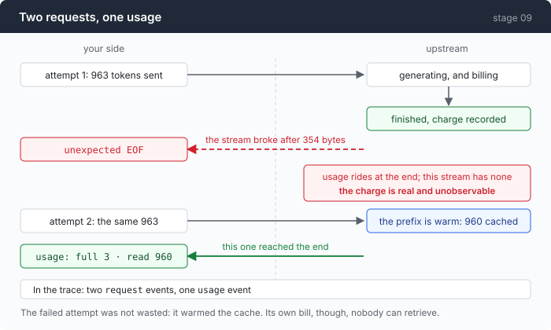

# Stage 09 · part 1: the bill for a retry

[← back to stage 09](README.md)

> A retry sends the same prompt again. Nothing in any API tells you what the
> failed attempt cost, and the first version of the counter that tried to say so
> reported a re-bill **larger than the entire session**.

---

## The problem

The retry loop works. It caught a broken stream, waited, sent the request again,
and the session finished.

Now: what did that cost?

The provider will not tell you. Usage arrives at the *end* of a stream, so a
stream that broke never delivered it. Upstream sees a completed generation and
bills for it; your client sees an `unexpected EOF` and has no numbers at all.

That is not an edge case, it is the ordinary shape of the failure this stage
exists to survive. And it is invisible in every cost report an agent produces,
including the one built in stage 02, because that report sums `usage` events and
there is no `usage` event to sum.

---

## The idea

Count the requests, not the responses.



Two `request` events and one `usage` event is the shape of a re-bill, and it is
visible in a trace without any arithmetic at all.

But only for the failures that actually generated something — which is where
the first version went wrong.

---

## Building it

### Step 1: manufacture a stream that breaks

The gateway never dropped one, so it had to be provoked: a throwaway reverse
proxy, **121 lines** around `httputil.ReverseProxy`, not part of any stage. It
cuts the connection after 354 bytes with `panic(http.ErrAbortHandler)`, having
sent a `Content-Length` header that promised more.

Manufacturing the failure is worth saying out loud. It means this measurement is
about how the *client* behaves, not about how often this provider breaks —
which, on the evidence, is never.

### Step 2: the first counter, and the false number

Count retries, multiply by the prompt size. Two injected 503s produced:

```
  cost: $0.000276
  retried attempts re-sent ≥1926 prompt tokens (≥$0.000301)
```

**The re-bill is larger than the whole session.** Which is nonsense, and
obviously so once written down: a 503 is refused before generation, so the
provider billed nothing for those two attempts.

The instrument built to stop plausible wrong numbers was itself producing one.

### Step 3: the fix is to carry the phase on the event

```go
if e.Phase == string(phaseStream) {
    r.billedFailures++
}
```

```go
// Only a failure that got its 200 and then broke has cost anything.
//
// This line is here because the first live run of this stage got it
// wrong. A fault injector returned 503 twice; the panel counted two
// retries and reported "re-sent ≥1926 prompt tokens (≥$0.000301)" —
// more than the session's actual $0.000276. Nonsense: the requests were
// refused before generation, so the provider billed nothing for them.
//
// A refused status and a refused connection are free. A stream that
// opened and died is not: those tokens were generated upstream and
// charged for, and the usage frame that would have said so never
// arrived. That asymmetry is the whole reason Phase is on the event.
```

`Phase` was already in `CallError` for triage. Putting it on the *event* is what
lets a renderer — which knows nothing about HTTP — ask the one question that
decides whether a number is real.

Same session, counting only attempts that reached the model:

```
  cost: $0.000287
  2 retries
```

Two retries, no re-bill line, because there was nothing to re-bill.

### Step 4: in case the broken stream did report usage

```go
if e.Usage != nil {
    // A broken stream that got far enough to report usage. Rare, and
    // worth its own line when it happens: those tokens are billed and
    // nothing else in the panel will ever mention them again.
    r.p("  %s\n", r.c(cDim, fmt.Sprintf("  └ billed on the failed attempt: %d prompt + %d output",
        e.Usage.Prompt(), e.Usage.Output)))
}
```

A stream can break *after* the usage frame — the connection dies during the
final bytes. Then you have real numbers for a call that failed, and they will
never be mentioned again by anything else, because every other line in the panel
is built from successful calls.

This is the same discipline as stage 03's partial-result-with-error: when a
failure carries evidence, keep the evidence.

### Step 5: the length of the leash, by kind of failure

```go
func (e *CallError) leash() int {
	if e.Phase == phaseStatus && e.Status >= 500 && e.Status != http.StatusServiceUnavailable {
		return 2
	}
	return 0
}
```

Two attempts for a bare 500, the full policy allowance for everything else. And
the policy itself is four numbers:

```go
type retryPolicy struct {
	attempts int           // total attempts per provider, including the first
	base     time.Duration // the first backoff
	max      time.Duration // ceiling on any single wait
	budget   time.Duration // ceiling on all waiting in one call, summed
}
```

```go
// retryPolicy is the whole configuration of retrying, and it is four numbers
// because the fifth one people add — "retry forever until it works" — is how a
// transient failure turns into a bill.
```

Compaction gets its own, tighter version — `attempts` capped at 2, `budget` at
5 seconds, and it is allowed to retry but **not** to fail over. A summarising
call that quietly moves to a different model produces a summary in a different
voice, mid-session, with nothing saying so.

One detail worth stealing from the backoff: **full jitter**, not
half-fixed-half-random. Subagents share one HTTP client and one endpoint, so a
provider hiccup fails several calls in the same millisecond — and roughly-equal
waits re-synchronise them into a burst aimed at a service that is already
struggling.

### Step 6: the shape in the trace, visible without arithmetic

```
   1    0.00s  provider         flaky (openai · mimo-v2.5) · session start
   4    0.31s  request          openai · 1 messages · 0 cache marks · 3.2kB
   5   37.15s  call_error       RETRY attempt 1 · the stream broke: unexpected EOF
   6   37.15s  retry            wait 313ms · attempt 2 · the stream broke: unexpected EOF
   7   37.46s  request          openai · 1 messages · 0 cache marks · 3.2kB
   8   43.88s  first_token      TTFT 6414ms
  20   44.26s  usage            prompt 963 (full 3 · write 0 · read 960) · out 41
```

Two `request` events, one `usage`. That asymmetry *is* the re-billing, and you
can see it by counting rows.

Note also that `call_error` is a distinct kind from `error`. An error that was
retried and recovered is not a session failure, and a renderer that colours them
the same teaches you to ignore red.

---

## Run it

The fault proxy is not part of any stage, so this needs the one in `.work/`, or
your own 20-line equivalent:

```sh
go run ./faultproxy.go --listen :8099 --upstream "$AGENT_BASE_URL" --break-after 354 &

cd sandbox
AGENT_BASE_URL=http://localhost:8099 ../agent --yolo --trace flaky.jsonl -p "what is 2+2"
```

Then read the shape back:

```sh
grep -c '"kind":"request"' flaky.jsonl
grep -c '"kind":"usage"'   flaky.jsonl
jq -r 'select(.kind=="call_error") | .text' flaky.jsonl
```

**What to watch for:** more `request` events than `usage` events. The difference
is what you paid for and cannot see.

---

## Measured

One manufactured stream break:

```
  call failed (attempt 1, retry): the stream broke: unexpected EOF
  retrying in 313ms (attempt 2) — the stream broke: unexpected EOF

  ┌─ call 1 · tool_calls
  │ in 963    █░░░░░░░░░░░░░░░░░░░  full 3 · write 0 · read 960  100% cached
  ── session ──────────────────────
  cost: $0.000155
  1 retry
  retried attempts re-sent ≥963 prompt tokens (≥$0.000030)
```

Look at the bar on the retry: **full 3 · read 960, 100% cached.** The attempt
that failed was not entirely wasted — it warmed the prompt cache, so the retry
was cheap.

Which is a genuinely nice property and does not change the conclusion: the
tokens the *first* attempt generated upstream were billed, and no number
anywhere will ever report them.

And the counter, wrong then right:

| | reported re-bill | actual session cost |
|---|---|---|
| counting every retry | $0.000301 | $0.000276 |
| counting only `stream`-phase failures | none | $0.000287 |

The first row is the instrument lying. The second is it declining to.

The `≥` in "re-sent ≥963 prompt tokens" is doing real work too. It is a lower
bound: the prompt is known, the output the failed attempt generated is not, and
a number presented as exact when half of it is unknowable is the kind of number
this repo exists to avoid.

---

## Next

[Back to stage 09](README.md) for the taxonomy, or on to
[stage 10](../../10-deadlock/doc/README.md) — the failure retries cannot help
with, because it never fails.
