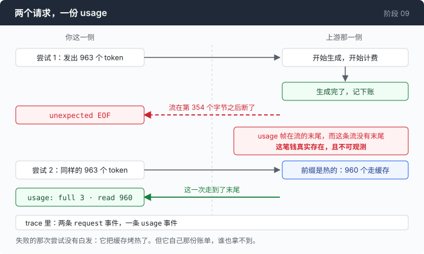

# 阶段 09 · 重试的账单

[00](../../00-loop/doc/README_zh.md) → 01 → 02 → 03 → 04 → 05 → 06 → 07 → [08](../../08-sandbox/doc/README_zh.md) → `09` → [10](../../10-deadlock/doc/README_zh.md) → 11 → 12

> [回到本章主线](README_zh.md)。这一篇回答一个没人报的数字：那些失败的尝试，花了多少钱。

---

## 问题

一次调用失败了，重试了一次，第二次成功了。面板上写着这次会话花了 `$0.000155`。

这个数字是对的吗？

它是供应商告诉你的那个数字加起来的结果，而供应商只会为**成功的那次调用**发一份 usage。失败的那一次，它一个字都不会提 —— 从它的账本上看，那次不算你的调用。

于是你会自然地推断：失败的尝试是免费的。

这个推断有一半是对的，而错的那一半正好是最贵的那一半。

---

## 办法

失败分四个阶段，而**只有一个阶段花钱**。

| 失败发生在 | 上游生成了 token 吗 | 你被计费了吗 | 你看得见吗 |
|---|---|---|---|
| 构造请求 | 没有 | 没有 | — |
| 连接 | 没有 | 没有 | — |
| 拿到状态码（4xx / 5xx） | 没有 —— 请求在生成之前就被拒了 | **没有** | — |
| 流已经开始，中途断掉 | **生成了** | **计费了** | **看不见** |

最后一行是全部的问题。那一行成立，靠的是一个协议性质：

**usage 帧在流的末尾。** 一条断掉的流永远走不到那一帧。上游看到的是一次完成的生成，照单计费；客户端看到的是一个 `unexpected EOF`，没有任何数字。

这笔钱真实存在，而且从原理上不可观测。



---

## 怎么做的

### 第 1 步：先造一条会断的流

这个网关从来没有自己断过一次流。所以这条流是造出来的 —— 一个用完就丢的反向代理，`httputil.ReverseProxy` 外面包 121 行，不属于任何一个阶段。它在第 354 个字节之后 `panic(http.ErrAbortHandler)` 掐断连接，而响应头里的 `Content-Length` 承诺过更多。

这件事必须写下来，理由在主线的「[这一章自己的证据审计](README_zh.md#这一章自己的证据审计)」那一节：仓库里别的地方，一个说法背后是录下来的字节；这一段不是。

跑出来是这样：

```
  call failed (attempt 1, retry): the stream broke: unexpected EOF
  retrying in 313ms (attempt 2) — the stream broke: unexpected EOF

  ┌─ call 1 · tool_calls
  │ in 963    █░░░░░░░░░░░░░░░░░░░  full 3 · write 0 · read 960  100% cached
  ── session ──────────────────────
  cost: $0.000155
  1 retry
  retried attempts re-sent ≥963 prompt tokens (≥$0.000030)
```

先注意一件顺带的好事：那次断掉的尝试**把缓存烤热了**。963 个 prompt token，重试那次里 960 个是缓存读，只有 3 个是全价。失败的尝试没有白发 —— 它做完了第 04 章那件事。

### 第 2 步：第一版计数器，报了一个假数

上面那行 `re-sent ≥963 prompt tokens` 的第一版实现，逻辑非常直白：数一下重试了几次，乘上 prompt 的大小。

拿两个注入的 503 一跑：

```
  cost: $0.000276
  retried attempts re-sent ≥1926 prompt tokens (≥$0.000301)
```

`$0.000301` 比整场会话的 `$0.000276` 还大。

一个"额外花掉的钱"比"总共花掉的钱"更多，这在算术上就说不通。它不是差一点，它是纯属虚构：两个 503 都是在**生成之前**被拒的，供应商为它们一分钱没收。

值得停一下看看这个 bug 的形状。它不是算错了，它是**把一个免费的失败和一个计费的失败当成了同一种东西**。而这一章讲的正好就是"别把两种不同的失败当成同一种"，所以它出在这里，是这一章自己犯了自己在讲的那个错。

### 第 3 步：修法是把阶段带在事件上

修的办法不是改公式，是让计数器有能力分辨。`Phase` 本来就在事件上：

```go
if e.Phase == string(phaseStream) {
    r.billedFailures++
}
```

这两行的理由写在它上面，而这段注释是整个文件里最长的一段，因为它记的是那次事故：

```go
// Only a failure that got its 200 and then broke has cost anything.
//
// This line is here because the first live run of this stage got it
// wrong. A fault injector returned 503 twice; the panel counted two
// retries and reported "re-sent ≥1926 prompt tokens (≥$0.000301)" —
// more than the session's actual $0.000276. Nonsense: the requests were
// refused before generation, so the provider billed nothing for them.
//
// A refused status and a refused connection are free. A stream that
// opened and died is not: those tokens were generated upstream and
// charged for, and the usage frame that would have said so never
// arrived. That asymmetry is the whole reason Phase is on the event.
```

最后一句是这一步的全部：`Phase` 之所以是事件上的一个字段，不是为了好看，是因为**没有它就算不出这个数**。

同一场会话，只数真正到达模型的尝试：

```
  cost: $0.000287
  2 retries
```

重试次数还是 2 —— 那两次失败是真的 —— 但没有虚构的重发账单了。

### 第 4 步：万一那条断掉的流真的报了 usage

极少数情况下，流走得够远，`usage` 帧到了，然后才断。那种情况下这笔钱是**可以看见的**，而且值得单独印一行：

```go
if e.Usage != nil {
    // A broken stream that got far enough to report usage. Rare, and
    // worth its own line when it happens: those tokens are billed and
    // nothing else in the panel will ever mention them again.
    r.p("  %s\n", r.c(cDim, fmt.Sprintf("  └ billed on the failed attempt: %d prompt + %d output",
        e.Usage.Prompt(), e.Usage.Output)))
}
```

「nothing else in the panel will ever mention them again」是这一行存在的理由。它不印，这笔钱就永远消失了。

### 第 5 步：绳子的长度，按失败的种类给

既然重试有成本，重试次数就不能是一个常数。

```go
func (e *CallError) leash() int {
	if e.Phase == phaseStatus && e.Status >= 500 && e.Status != http.StatusServiceUnavailable {
		return 2
	}
	return 0
}
```

`503` 拿全额 —— 它是一个真实的容量信号，服务端在说「我现在忙，等下再来」。

一个光秃秃的 `500` 只拿两次。理由在注释里，而它是关于这个网关的一个观察，不是关于 HTTP 的一条通则：

```go
// One rule, one reason. A 503 is a real capacity signal and gets everything. A
// bare 500 gets two attempts total, because on this endpoint it is at least as
// likely to be *our* misconfiguration as their outage (§D11), and two attempts
// is enough to ride out a blip while being far too few to hide a permanent
// mistake behind a retry loop.
```

「far too few to hide a permanent mistake behind a retry loop」—— 一个畸形的请求体在这个网关上返回 500。如果 500 拿全额，那么一个你自己写错的请求，会以指数退避的节奏，一遍一遍地重发下去。

而整个重试配置只有四个数字：

```go
type retryPolicy struct {
	attempts int           // total attempts per provider, including the first
	base     time.Duration // the first backoff
	max      time.Duration // ceiling on any single wait
	budget   time.Duration // ceiling on all waiting in one call, summed
}
```

注释里点了名的那第五个数字，才是这个结构体真正的设计说明：

```go
// retryPolicy is the whole configuration of retrying, and it is four numbers
// because the fifth one people add — "retry forever until it works" — is how a
// transient failure turns into a bill.
```

### 第 6 步：trace 里那个不用算就看得见的形状

面板要算，trace 不用：

```
   1    0.00s  provider         flaky (openai · mimo-v2.5) · session start
   4    0.31s  request          openai · 1 messages · 0 cache marks · 3.2kB
   5   37.15s  call_error       RETRY attempt 1 · the stream broke: unexpected EOF
   6   37.15s  retry            wait 313ms · attempt 2 · the stream broke: unexpected EOF
   7   37.46s  request          openai · 1 messages · 0 cache marks · 3.2kB
   8   43.88s  first_token      TTFT 6414ms
  20   44.26s  usage            prompt 963 (full 3 · write 0 · read 960) · out 41
```

**两个 `request` 事件，一份 `usage`。**

这个不对称就是重发本身，而它不需要任何算术就能看出来。第 02 章那句「所有你能看见的东西都是订阅者」在这里兑现了一次：你没有为"数重发"写任何专门的记账代码，你只是把发生过的事按顺序记了下来，然后这件事自己浮出来了。

---

## 量一量

**换一家的代价，同一段 963 token 的 prompt。**

缓存是按供应商、按模型、按前缀分的，所以往下换一级，必然从冷的开始：

| | 全价 | 缓存读 | 这段 prompt 的价钱 |
|---|---:|---:|---:|
| 热的 | 3 | 960 | **$0.0000297** |
| 第一次见到这个前缀 | 963 | 0 | **$0.000289** |

**同样的字节，9.7 倍。**

必须跟上的一句：这两个数字来自**两次不同的运行**，不是同一场会话里相邻的两轮。所以它说明的是量级，不是一个可以直接代入你的账单的系数。

这也是主线第 8 步说「换一家是一个不撤销的降级」的第二层含义。第一层是它从不往回爬；第二层是它落地那一刻，你为整段前缀重新付了一次全价。

---

## 接下来

到这里，失败有了三个出路、一张从字节里长出来的表，以及一个能说出重试花了多少钱的面板 —— 包括那笔真实存在但不可观测的钱。

回到主线：[跑一下](README_zh.md#跑一下)，以及那张表为什么其实是一份关于某一个网关的说明书。
