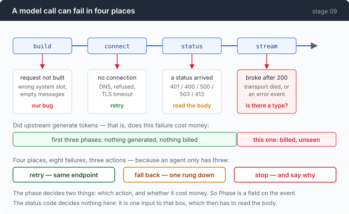
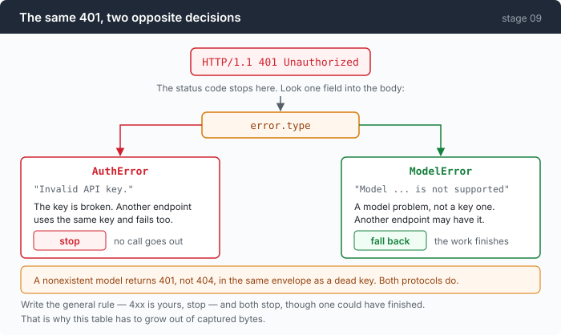

# Stage 09: Triage — an error is a decision, not a string

[07](../../07-multiply/doc/README.md) → `09` → [10](../../10-deadlock/doc/README.md) → 11 → 12

> Two sessions, the same HTTP 401, opposite correct answers. One is a dead key
> and stopping is right; one is a model that does not exist and stopping throws
> away a job another endpoint could finish. The status code cannot tell them
> apart.

---

## The problem

Every model call in this repo so far has ended the same way:

```go wrong
return fmt.Errorf("http %d: %s", resp.StatusCode, body)
```

A string. Which forces every caller into this:

```go wrong
if strings.Contains(err.Error(), "429") {
```

That works until a message body contains "429" for an unrelated reason, and it
is not really the problem. The problem is that a caller needs to make a
*decision* — try again, try somewhere else, or stop — and a string does not
contain one.

So you write the obvious rules. **5xx is transient, retry. 4xx is your fault,
stop.** Both are wrong on this gateway, and the recorded bytes say so:

- A model name that does not exist returns **401**, not 404, in the same JSON
  envelope as a revoked key.
- A malformed request body returns **500** — a client bug wearing a server's
  status code.

Follow the rules and you retry your own bug five times, then stop on a failure
another provider would have served.

---

## The idea

Three verdicts, and everything is a mapping onto them.

```go
const (
	TriageRetry    Triage = "retry"    // the same bytes, later
	TriageFallback Triage = "fallback" // the same bytes, elsewhere
	TriageFatal    Triage = "fatal"    // stop, and say why
)
```

Three, because an agent has exactly three things it can do. And the mapping is
not from the status code — it is from the **phase** the call died in, plus what
the body said.



The phase decides two separate things: which action to take, and **whether the
failure cost money**. Those are not the same question and only one of them is
usually asked.

---

## Building it

The code is [`triage.go`](../code/triage.go), about 400 lines, nearly all in one
new file.

### Step 1: one string cannot carry the decision

```go
type CallError struct {
	Phase   callPhase
	Status  int    // 0 when there was no response
	Type    string // the provider's error.type, verbatim — never normalised, because it is evidence
	Message string
	Body    string // first 8 KiB of the response body, verbatim
```

Two of those fields are the chapter.

`Type` is kept **verbatim**. Stage 03 made the same argument about `RawStop`,
and here it is load-bearing: the observed values on this gateway are
`ModelError` and `AuthError` — capitalised words run together — while both
protocol specifications document the same field in lower case with underscores
(`not_found_error`, `invalid_request_error`). **An equality check written from
either spec is correct against the documentation and wrong against the wire.** A
substring test survives both spellings.

`Body` keeps the first 8 KiB. When a response does not fit any rule you have,
the body is the only thing that will tell you why.

### Step 2: name the four places it can die

```go
const (
	phaseBuild   callPhase = "build"   // we could not even render the request
	phaseConnect callPhase = "connect" // no response at all: DNS, refused, TLS, reset before headers
	phaseStatus  callPhase = "status"  // a response arrived and it was not 200
	phaseStream  callPhase = "stream"  // 200, then the body broke or carried an error event
)
```

Read them as a question about billing rather than about networking. `build`,
`connect` and `status` all failed before anything was generated, so they are
free. `stream` means the model was working — those tokens exist and were charged
for.

### Step 3: the 401 that is not about your key

```go
	case status == http.StatusUnauthorized, status == http.StatusForbidden:
		if strings.Contains(t, "model") {
			return TriageFallback
		}
		return TriageFatal
```



Four lines, and they are the reason this chapter exists. Same status, same
envelope shape, one field of difference, opposite decisions — and the decision
that the generic rule gets wrong is the expensive one, because it throws away a
job that would have completed.

### Step 4: the 500 that is your own bug, and a short leash

```go
func (e *CallError) leash() int {
	if e.Phase == phaseStatus && e.Status >= 500 && e.Status != http.StatusServiceUnavailable {
		return 2
	}
	return 0
}
```

```go
// One rule, one reason. A 503 is a real capacity signal and gets everything. A
// bare 500 gets two attempts total, because on this endpoint it is at least as
// likely to be *our* misconfiguration as their outage (§D11), and two attempts
// is enough to ride out a blip while being far too few to hide a permanent
// mistake behind a retry loop.
```

Be honest about what that function is: **the chapter's thesis is that the status
code cannot be the thing you branch on, and `leash()` branches on exactly the
status code.** The defence is that it is not deciding *what to do* — the table
already did that — it is deciding how much patience a retry gets. But it is the
one place the general rule survived, and it survived because on this gateway a
bare 500 really is ambiguous.

### Step 5: an error can arrive with no envelope

```go
	var env errEnvelope
	if err := json.Unmarshal(raw, &env); err != nil || env.Error == nil {
		return "", ""
	}
```

Observed: a 400 whose entire body was a 24-byte echo of the request —
`{"model":"qwen3.7-plus"}`. No `type`, no `message`, nothing to classify.

The code that reaches for `error.type` on that either panics or silently reads
`""`. And the rendering matters too:

```go
		if e.Type == "" && e.Message == "" {
			return fmt.Sprintf("http %d with no error envelope: %.200s", e.Status, strings.TrimSpace(e.Body))
		}
```

`http 400: ` with nothing after the colon is a message that tells you the tool is
broken. `http 400 with no error envelope: {"model":"qwen3.7-plus"}` tells you
what actually arrived.

### Step 6: failing after the stream started

```go
		if e.Type == "" {
			return TriageRetry
		}
		switch e.Type {
		case "overloaded_error", "api_error", "rate_limit_error", "timeout_error":
			return TriageRetry
		}
		return TriageFatal
```

Two different situations arrive in the same phase, and the discriminator is
whether the server said anything.

**No type** means the transport died — the connection dropped, the body was
truncated. Nothing was decided about your request; retry.

**A type** means the server sent an error event *inside* a 200 response, on
purpose. `overloaded_error` is capacity and worth retrying;
`invalid_request_error` arrived because of what you sent, and retrying it sends
the same thing again.

The default is `TriageFatal`, and that is deliberate. An unrecognised error type
inside a stream is not a good reason to send the same bytes again.

### Step 7: falling back is a demotion, and it does not undo itself

```go
func (l *ladder) advance(from int) bool {
	// ...
	if l.cur > from {
		return true // a sibling already moved us; that is a success, not a step
	}
	if from+1 >= len(l.rungs) {
		return false
	}
	l.cur = from + 1
	return true
}
```

The `l.cur > from` guard needs **three** participants to matter, and the case it
prevents is a *rewind*: A fails on rung 0 and moves everyone to rung 1; C fails
on rung 1 and moves everyone to rung 2; B, still holding a stale rung 0, asks to
fall back — and without the guard writes `cur = 1`, dragging the whole ladder
back up to a provider that has already failed.

Falling back also throws away your cache. **A prompt cache is per provider, per
model and per prefix**, so moving one rung starts cold by construction. Stage 04
priced that: see the measurement below.

### Putting it together

```go
	for {
		attempt++
		perRung++
		at, p, _ := lad.pos()
		res, err := do(p)
		if err == nil {
			return res, nil
		}

		ce, ok := asCallError(err)
		if !ok {
			return res, err
		}

		v := ce.triage()
		// ...

		switch v {
		case TriageFatal:
			return res, err

		case TriageFallback:
			if !lad.advance(at) {
				return res, err
			}
			// ...
			perRung = 0
			continue

		case TriageRetry:
			limit := pol.attempts
			if l := ce.leash(); l > 0 && l < limit {
				limit = l
			}
			if perRung >= limit {
				// ...
			}

			w := pol.wait(perRung, ce.RetryAfter, rnd)
			if waited+w > pol.budget {
				return res, fmt.Errorf("retry budget %s exhausted after %d attempts: %w", pol.budget, perRung, err)
			}
			waited += w
			sleep(w)
			continue
		}
	}
```

`perRung = 0` on a fallback: the new provider gets a full allowance, because its
failures are unrelated to the last one's.

And two budgets rather than one — a per-rung attempt count *and* a total time
budget. The count alone lets a slow retry loop wait for minutes; the budget alone
lets a fast one hammer an endpoint.

---

## Run it

```sh
go build -o agent ./09-triage/code
cd sandbox && set -a && . ../.env && set +a

../agent --provider bad-model --fallback opencode-oai --yolo -p "what is 2+2"
../agent --provider bad-key   --fallback opencode-oai --yolo -p "what is 2+2"
```

Two providers configured to fail, one fallback list, one status code.

**What to watch for:** the first falls back and finishes the job. The second
stops without touching the fallback list, even though one is right there. Same
401.

Then the table as a test:

```sh
go test ./09-triage/code/ -run TestTriage -v
```

The test and the chapter are the same list, which is deliberate — a taxonomy
that lives in prose drifts from the one that runs.

---

## Measured

### The same status, opposite decisions

```
stage 09 · provider=bad-model (openai) · model=gpt-does-not-exist-9000
  call failed (attempt 1, fallback): http 401 ModelError: Model gpt-does-not-exist-9000 is not supported
  provider → opencode-oai (openai · mimo-v2.5) — fell back after http 401 ModelError: ...
  ┌─ call 1 · tool_calls
  │ in 963    ████████████████████  full 963 · write 0 · read 0
  cost: $0.000424
```

```
  call failed (attempt 1, fatal): http 401 AuthError: Invalid API key.
  error: http 401 AuthError: Invalid API key.
  0 calls · 0 commands
```

### What a fallback costs

The same 963-token prompt:

| | full price | cache read | cost of the prompt |
|---|---:|---:|---|
| warm | 3 | 960 | **$0.0000297** |
| first sight of this prefix | 963 | 0 | **$0.000289** |

**9.7× for identical bytes.** Which is the argument for the ladder being ordered
and for falling back being a last resort rather than a reflex.

Two caveats, because they matter: those figures come from **two different runs**,
not two adjacent turns of one session. So it is evidence about two
configurations rather than a controlled measurement of a switch.

### This chapter's own evidence audit

Grep all **731 lines** of [`wire-notes.md`](../../external/wire-notes.md) for
`429|Retry-After|timeout|502|503|504|408`. It returns **exactly one hit**, and
that hit is the wire notes' own advice, not captured bytes.

The gateway this repo was built against **never sent a 429, never sent a
`Retry-After`, and never dropped a stream on its own.** The broken stream in
[part 1](1-the-bill.md) had to be manufactured with a 121-line reverse proxy.

So: the retry and backoff machinery here — `Retry-After` parsing, the 429 row,
the jitter argument — is **the least-founded code in this repository.** Every
other chapter rests a claim on recorded bytes. This one rests on RFC 9110 and a
local test server, and it is worth knowing which parts of a taxonomy you have
actually seen.

### And this table is really a fact sheet about one gateway

Several rows are true of *this* endpoint and *this* agent's architecture rather
than of HTTP:

- `413` is fatal only because compaction is the sole thing that changes request
  size here.
- `400`/`422` are fatal only because a malformed request is ours.
- Both 401 rows depend on a non-standard `error.type` spelling this gateway
  invented.

Ported to another provider, those rows are unverified. The *method* — probe it,
write down what came back, build the table from that — is the part that ports.

### A bug shipped on purpose

The success test is `!= http.StatusOK`, not a 2xx range. A 202 would be
classified as a failure.

No endpoint in this repo's evidence returns one, so fixing it would mean writing
a branch nothing has ever exercised — but it is a known-latent bug in a stage
whose entire subject is classifying responses correctly, and it is here rather
than in a comment nobody reads.

---

## Next

Retries handle a call that fails. They do nothing for a call that never fails
and never finishes.

`http.Client.Timeout` looks like the answer and is not: it covers the whole
request *including the body read*, so on a streamed response it cannot tell a
model that is thinking hard from a socket that died — and setting it low enough
to catch the dead socket kills the slow answer.

[Stage 10](../../10-deadlock/doc/README.md) gives every wait a deadline and an
owner, and measures the widest silence a real stream actually had — **5.0s
against a 45s default** — so the timeout is a margin rather than a number
somebody liked.
