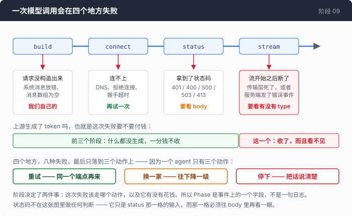
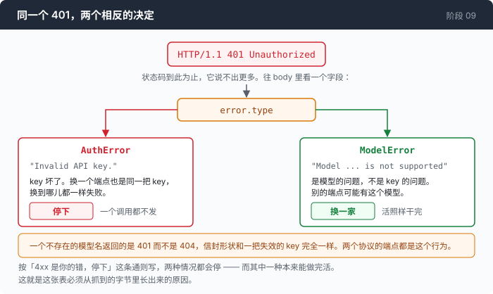

# 阶段 09：分诊 —— 一个错误是一个决定，不是一个字符串

[00](../../00-loop/doc/README_zh.md) → 01 → 02 → 03 → 04 → 05 → 06 → 07 → [08](../../08-sandbox/doc/README_zh.md) → `09` → [10](../../10-deadlock/doc/README_zh.md) → 11 → 12

> 一个失败只有三个出路：重试、换一家、停下。而所有人都会写的那两条规则，在这个仓库探测过的真实网关上都是错的 —— 所以这张表是从抓到的字节里长出来的，不是从状态码的定义里长出来的。

---

## 问题

你把这个 agent 交给了同事。

第一天早上他发来一张截图。屏幕上一行红字，会话停在那里，红字里只有一个数字和一句话：

```
401  Invalid API key.
```

这个好办。你让他重新导一遍环境变量。

下午他又发来一张截图：

```
401  Model gpt-does-not-exist-9000 is not supported
```

同一个数字。而这一次 key 是好的 —— 他昨天在配置里填的模型名多了一个字符。

这两件事你要做的处理正好相反。第一张截图里，这个会话已经死了：重试一万次不会成功，换一个端点也不会成功，唯一有用的动作是停下来，把这句话原样交给能改配置的人。第二张截图里，会话本来可以继续 —— 同样的请求发到另一个端点上，那边可能就有这个模型。

你想把这个判断写进代码。你写的第一版几乎一定是这两条：

- 401 是 key 不对，停下。
- 5xx 是服务端抽风，等一会儿再试。

两条都很合理，两条都是从状态码「应该是什么意思」推出来的，而两条在这个网关上都会把事情做坏。上面那张下午的截图就是第一条的反例。第二条的反例更贵：一个畸形的请求体在这里返回 500，于是一个你自己写错的 bug 会被当成临时故障，每一轮都重试到预算用光，永远不会成功，也永远不会停。

而且你有两套协议。第 03 章之后，同一个失败在两边的描述方式不一样：一边把错误放在响应体里，一边可以在流已经开始之后再发一个错误事件。给两边各写一套判断，你就有了两套策略，而它们会在你不看的地方分叉。

**你手上是一个字符串，而你要做的是一个决定。这两件事之间，现在什么都没有。**

---

## 办法

一个失败只有三个出路，因为一个 agent 只有三个动作。



| 决定 | 意思 | 什么时候 |
|---|---|---|
| 重试 | 同样的字节，晚一点再发一次 | 这一次什么都没生成 |
| 换一家 | 同样的字节，发到另一个端点 | 这个端点上没有这个东西 |
| 停下 | 不再发，把原因说清楚 | 再发一次结果一样 |

按「这个错误叫什么」分类是分不完的：名字有几十个，每家的拼法还不一样。按「该怎么办」分类只有三格，而这三格是代码真的能执行的三个动作。

剩下的问题只有一个：一个失败怎么落到某一格里。这一章的答案是从抓到的字节里推 —— 因为从定义里推出来的那两条，前面已经错了。

---

## 怎么做的

代码在 [`09-triage/code/triage.go`](../code/triage.go)。下面一步步把它拼出来。

### 第 1 步：先给三个出路起名字

```go
const (
	TriageRetry    Triage = "retry"    // the same bytes, later
	TriageFallback Triage = "fallback" // the same bytes, elsewhere
	TriageFatal    Triage = "fatal"    // stop, and say why
)
```

按动作起名，不按失败起名。`ErrRateLimited` 告诉调用方发生了什么，`TriageRetry` 告诉它该干什么 —— 而调用方需要的只有后者。这三个名字定下来之后，这一章剩下的工作就是一个函数：把一个失败映射到这三个值之一。

### 第 2 步：一个字符串装不下这个决定

先看装不下的那一版。它是所有人的第一版，包括这个仓库前八章的：

```go wrong
return fmt.Errorf("http %d: %s", resp.StatusCode, body)
```

这行代码把决定所需要的东西全部拍平成了一句人话，于是调用方只剩下一个办法：

```go wrong
if strings.Contains(err.Error(), "429") {
```

它能用，直到某一天某个错误消息的正文里因为别的原因出现了 429。而在这个网关上它还有个更早的问题：状态码根本不足以做这个决定，所以拍平的时候丢掉的正是要用的那一份。

真实的写法是把一次失败原样带上来：

```go
type CallError struct {
	Phase   callPhase
	Status  int    // 0 when there was no response
	Type    string // the provider's error.type, verbatim — never normalised, because it is evidence
	Message string
	Body    string // first 8 KiB of the response body, verbatim
```

`Type` 那行的 `verbatim` 是有意的。不做大小写归一，不映射到自己的枚举 —— 一旦归一，你就把证据变成了解释，而这一章后面每一个判断都要拿原文去比。

`Body` 看着多余，它旁边已经有 `Type` 和 `Message` 了。第 6 步会说明它为什么是这里最常派上用场的一个字段。

### 第 3 步：先问「生成了吗」

一次调用会在四个不同的地方失败，而它们不是同一件事：

```go
const (
	phaseBuild   callPhase = "build"   // we could not even render the request
	phaseConnect callPhase = "connect" // no response at all: DNS, refused, TLS, reset before headers
	phaseStatus  callPhase = "status"  // a response arrived and it was not 200
	phaseStream  callPhase = "stream"  // 200, then the body broke or carried an error event
)
```

分类器第一眼看的是这个字段，因为它回答了后面所有事都依赖的那个问题：**有东西被生成出来了吗？**

没生成，重试是免费的 —— 一次被拒绝的连接不产生 token，也就不产生账单。生成了，重试就要再付一份完整的 prompt，而第一份已经在账上了。这个区别在[第 1 部分](1-the-bill_zh.md)里会变成一个数字。

`phaseBuild` 那一支是我们自己的 bug：渲染不出来的请求，第二次也渲染不出来，所以它是停下，不是重试。

### 第 4 步：那个 401

现在到这一章存在的理由。这是抓到的四个响应，原样（`external/wire-notes.md` §D11）：

```
OpenAI    /v1/chat/completions  bad model  -> HTTP/1.1 401 Unauthorized
{"type":"error","error":{"type":"ModelError","message":"Model gpt-does-not-exist-9000 is not supported"}}

OpenAI    /v1/chat/completions  bad key    -> HTTP/1.1 401 Unauthorized
{"type":"error","error":{"type":"AuthError","message":"Invalid API key."}}
```

一个不存在的模型名返回的是 **401，不是 404**，信封的形状和一个失效的 key 完全一样。两个协议的端点都是这个行为。



状态码分不开它们。`error.type` 分得开，而这两个值要的决定正好相反：

```go
	case status == http.StatusUnauthorized, status == http.StatusForbidden:
		if strings.Contains(t, "model") {
			return TriageFallback
		}
		return TriageFatal
```

用子串匹配，不用等号，这也是有意的。线上抓到的值是 `ModelError`、`AuthError` —— 首字母大写、单词连写；而两个协议的规范文档写的都是小写加下划线（`not_found_error`、`invalid_request_error`）。照任何一份规范写一个等值判断，你得到的代码对着文档是正确的，对着线路是错的。子串两种拼法都活得下来。

### 第 5 步：那个 500，以及一根短绳

第二个反例，同样是抓到的字节：

```
malformed JSON body        -> 500  {"type":"error","error":{"type":"error","message":"Internal server error"}}
OpenAI body POSTed to /v1/messages -> 500  {"type":"error","error":{"type":"error","message":"Internal server error"}}
```

两条都是客户端的错，穿着服务端的状态码回来。「5xx 是临时故障」这条规则会一轮一轮地重试它们，直到预算死掉。

它仍然要重试 —— 因为真的服务端故障也是 5xx，而那个是值得重试的。区别在于给它多少次机会：

```go
func (e *CallError) leash() int {
	if e.Phase == phaseStatus && e.Status >= 500 && e.Status != http.StatusServiceUnavailable {
		return 2
	}
	return 0
}
```

`0` 是「用策略的全额」。503 是一个明确的容量信号，给全额；一个光秃秃的 500 在这个端点上至少和「我们自己配错了」一样可能，所以总共两次 —— 足够扛过一次抽风，远不足以让一个永久性的错误藏在重试循环后面。

这个函数值得停一下：**这一章的论点是「不能拿状态码当分支依据」，而这里唯一一条加在表之上的规则，分支依据正好就是状态码。** 它不是漏掉的，是这一章记的账里没算平的一笔。分诊表是从观察来的，这根绳子是从「这一类里两种原因都有可能」来的，而区分它们的字段这个网关没有给。

### 第 6 步：一个 400 可以没有信封

```
Anthropic call with `max_tokens` omitted -> 400, Content-Type: application/json, body is:
    {"model":"qwen3.7-plus"}
```

24 个字节，是请求的一段回声。没有 `type`，没有 `message`。对着 `error.type` 直接取值的代码在这里拿到空字符串，什么都没得打印。

所以解析函数在没有信封的时候返回两个空串，而不是返回一个错误：

```go
	var env errEnvelope
	if err := json.Unmarshal(raw, &env); err != nil || env.Error == nil {
		return "", ""
	}
```

信封不存在不是一次解析失败，是关于这个响应的一个事实。返回错误的后果是 agent 报告「我解析不了这个错误」而不是报告这个错误。

原始 body 就是这一种情况下唯一的证据，这是 `Body` 字段的用处。而它得被说出来，不能只是空着：

```go
		if e.Type == "" && e.Message == "" {
			return fmt.Sprintf("http %d with no error envelope: %.200s", e.Status, strings.TrimSpace(e.Body))
		}
```

`http 400: ` 后面什么都没有，读起来像 agent 自己坏了。把「没有信封」这件事说出来，手指才指向服务端。

顺带一件事，让「一套分类覆盖两个协议」变得可能：**这个网关给 OpenAI 那条路线返回的也是 Anthropic 的错误信封。** 两边一致的那一层就是嵌在里面的 `error` 对象，所以上面那个结构体只读那一层，两条路线共用。这件事的运气成分很大，但它是抓到的。

### 第 7 步：流已经开始之后才失败

`phaseStream` 里有两种完全不同的东西，而今天它们是同一个 Go 错误：

```go
		if e.Type == "" {
			return TriageRetry
		}
		switch e.Type {
		case "overloaded_error", "api_error", "rate_limit_error", "timeout_error":
			return TriageRetry
		}
		return TriageFatal
```

没有 type，就是传输层死了 —— 连接在响应体中途断掉。值得再试一次。

有 type，就是服务端在生成过程中特意发了一个错误事件。只有那四种意思是「再问一次」。其余的是因为我们发过去的东西才出现的，再发一次会得到同一个事件 —— 比如 `invalid_request_error`，它是第 5 步那个 500 陷阱在流里的孪生兄弟：它长得像一个流错误，所以看起来该重试，而它其实是我们自己的请求。

### 第 8 步：换一家是一个降级，而且是不撤销的

「换一家」需要有一家可以换。这就是一个有序的列表，配置的那个在最前面，后面的只有拿到 `TriageFallback` 才够得着。

它有一个性质要先说清楚：**它从不往回爬。** 一场会话掉到第二级之后就一直在第二级，因为「主端点恢复了吗」这个问题不花一次真实调用是答不出来的。所以换一家是一个你会一直带着的降级，也正因为如此，每一次切换都要发一个事件出去 —— 一场会话被悄悄用便宜模型服务了一个小时，是这个设计换简单性付出的代价，而它只有在看得见的时候才活得下去。

第 07 章的子 agent 是并发的，而它们按指针共享这个列表 —— 有意的，因为「这个端点在拒绝调用」是端点的性质，不是哪个 agent 先发现的性质。于是三个参与者会撞出一个需要一行保护的情况：

```go
func (l *ladder) advance(from int) bool {
	// ...
	if l.cur > from {
		return true // a sibling already moved us; that is a success, not a step
	}
	if from+1 >= len(l.rungs) {
		return false
	}
	l.cur = from + 1
	return true
}
```

它接收的是调用方手上那一级，不是自己读当前值。A 在第 0 级失败，走到 1；C 在第 1 级失败，走到 2；然后 B —— 手上还捏着这一切发生之前读到的第 0 级 —— 来要求换一家。没有那行保护，它会把当前级写回 1，把下一次调用送到两个兄弟已经放弃的地方。有了它，B 得到的答复是「是」，而列表一格都不动，这也正是它真正在问的那个问题的诚实答案：还有别的地方可以发吗？有，而且已经在那儿了。

### 整张表

前面五步一行一行地长出了下面这张表。标着「没抓到过」的行就是没抓到过：

| 抓到的 | 最自然的规则 | 它实际上是什么 | 决定 |
|---|---|---|---|
| `401` + `AuthError` | 停下 | 对的 | **停下** |
| `401` + `ModelError` | 停下 —— 同一个状态码 | 一个*模型*问题，别的端点可能有 | **换一家** |
| `401`，没有信封 | 读 `error.type` 时拿到空值 | 没有东西可以分类 | **停下** |
| `404` | 换一家 | 对的 | **换一家** |
| `429` | 重试 | *这里没抓到过*；按 RFC 9110 | **重试** |
| `413` | 重试 | 问题在字节数上，只有压缩能改它 | **停下** |
| `400` / `422` | 按 5xx 那一套重试 | 我们自己的 | **停下** |
| 畸形请求体之后的 `500` | 临时故障 | 穿着服务端状态码的客户端 bug | 重试，短绳 |
| `503` | 临时故障 | 对的 | 重试，全额 |
| 连接被拒 | 重试 | 什么都没生成，什么都没计费 | **重试** |
| 流断了，没有 type | 重试 | 传输层死了 | **重试** |
| 流里 `overloaded_error` | 重试 | 对的 | **重试** |
| 流里 `invalid_request_error` | 重试 —— 它是个流错误 | 它是因为我们发的东西才来的 | **停下** |
| 任何没分到类的 | 重试 | 不知道 | **停下** |

最后一行是一个选择。一个没分到类的失败去重试，就只是把这个失败重复一遍；而它发出去的那个事件，是漏掉的那一格被发现的唯一途径。

### 拼起来

一个循环，唯一一处对分诊结果采取行动的地方：

```go
	for {
		attempt++
		perRung++
		at, p, _ := lad.pos()
		res, err := do(p)
		if err == nil {
			return res, nil
		}

		ce, ok := asCallError(err)
		if !ok {
			return res, err
		}

		v := ce.triage()
		// ...发一个 call_error 事件，带上 phase、status、error.type 和决定

		switch v {
		case TriageFatal:
			return res, err

		case TriageFallback:
			if !lad.advance(at) {
				return res, err
			}
			// ...发一个 provider 事件，说清楚为什么换
			perRung = 0
			continue

		case TriageRetry:
			limit := pol.attempts
			if l := ce.leash(); l > 0 && l < limit {
				limit = l
			}
			if perRung >= limit {
				// ...这一级的次数用完了，再看一眼列表，然后才放弃
			}

			w := pol.wait(perRung, ce.RetryAfter, rnd)
			if waited+w > pol.budget {
				return res, fmt.Errorf("retry budget %s exhausted after %d attempts: %w", pol.budget, perRung, err)
			}
			waited += w
			sleep(w)
			continue
		}
	}
```

它接收的是一个闭包，不是一个请求，理由只有一句：**压缩也是一次模型调用。** 第 05 章那个摘要器自己发 POST，在这一章之前它有自己的一套错误处理 —— 另一套的一半，而且少了读响应体那一步，所以一次失败的压缩报告出来的是「http 500」，后面什么都没有，也就是唯一一种没法调试的形态。现在两个调用方从同一段代码拿同样的决定。

等待时间那个 `wait` 用的是全抖动 —— 从 `[0, exp)` 里均匀取一个数，而不是更常见的「一半固定加一半随机」。原因也在第 07 章：子 agent 们共享一个 HTTP 客户端和一个端点，所以一次抽风会在同一毫秒里让好几个调用一起失败。差不多相等的等待会把它们重新对齐成一个批次，一起再撞一次；一个会把自己的客户端同步起来的重试策略，就是一台对着已经在挣扎的服务的压力发生器。

`triage.go` 一共 796 行，去掉注释和空行是 379 行。三个命令行开关：`--retry`（每一级的尝试次数）、`--retry-budget`（一次调用总共可以等多久）、`--fallback`（按顺序往下掉的端点名）。

---

## 跑一下

这一章要看的东西必须靠真的失败才看得见，所以先在 `providers.json` 里加两个坏的端点：

```json
    "bad-model": {
      "protocol": "openai",
      "base_url": "https://opencode.ai/zen/go/v1",
      "api_key_env": "AGENT_API_KEY",
      "model": "gpt-does-not-exist-9000",
      "window": 131072
    },
    "bad-key": {
      "protocol": "openai",
      "base_url": "https://opencode.ai/zen/go/v1",
      "api_key_env": "BAD_API_KEY",
      "model": "mimo-v2.5",
      "window": 131072
    }
```

然后：

```sh
go build -o agent ./09-triage/code

mkdir -p sandbox && cd sandbox
set -a && . ../.env && set +a
export BAD_API_KEY=not-a-real-key

../agent --providers ../providers.json --provider bad-model --fallback opencode-oai --yolo
../agent --providers ../providers.json --provider bad-key   --fallback opencode-oai --yolo
```

两次都问同一句话，随便一句要用到 bash 的，比如 `这个目录里有什么？`。离线的那一半不需要 key，也不需要网络：

```sh
go test ./09-triage/code -run 'Triage|Leash|Retry|Fallback|Ladder|ReBilled' -v
```

**观察重点：**

- 两次运行的第一行报错，状态码是同一个 401。第一次后面跟着一行 `provider → ...`，会话继续跑完并且打出了花费；第二次直接停在那里，`0 calls · 0 commands`。**同一个状态码，两个相反的结果，而两次的 `--fallback` 是同一个。**
- 第二次运行手上明明有一个可用的备用端点，它一次都没碰。这不是漏了 —— 一个坏掉的 key 换个端点也是坏的，走一遍列表只是把一个五分钟能修的配置错误拖成一整天。
- 第一次运行那行 `call failed (attempt 1, fallback): ...` 里的 `fallback` 就是这一章那个决定。它是黄的，不是红的：大多数 `call_error` 都被活下来了，把一个能活下来的失败标成红色，人就学会了忽略红色。
- 把 `--fallback` 去掉再跑一次 `bad-model`。这一次没有地方可去，于是同一个失败变成了会话终止 —— 决定不是失败的性质，是失败和你手上有什么的组合。
- 测试那一行会把上面那张表现场跑一遍。表和测试是同一份清单，改一个必须改另一个。

---

## 量一量

### 同一个状态码，两个相反的决定

两次运行，同一个 `--fallback`：

```
stage 09 · provider=bad-model (openai) · model=gpt-does-not-exist-9000
  call failed (attempt 1, fallback): http 401 ModelError: Model gpt-does-not-exist-9000 is not supported
  provider → opencode-oai (openai · mimo-v2.5) — fell back after http 401 ModelError: ...
  ┌─ call 1 · tool_calls
  │ in 963    ████████████████████  full 963 · write 0 · read 0
  cost: $0.000424
```

```
  call failed (attempt 1, fatal): http 401 AuthError: Invalid API key.
  error: http 401 AuthError: Invalid API key.
  0 calls · 0 commands
```

第一场会话做完了活，花了 $0.000424。第二场一个调用都没有发出去。区别不在状态码上，状态码是同一个；区别在 body 深处的一个字段上。

### 失败的那几次花了多少钱

这一章还有一个别人都不报的数字：那些失败的尝试要不要付钱，付多少。它有自己的一节：[第 1 部分：重试的账单](1-the-bill_zh.md)。那一节里有一个更值得看的东西 —— 造出这个数字的第一版实现，自己报了一个假数。

### 这一章自己的证据审计

上面所有的分类都指着抓到的字节。有一半代码不是。

把整个 `external/wire-notes.md`（952 行）拿来搜 `429|Retry-After|502|503|504|408`，**命中恰好一处**，而那一处是笔记自己写的建议，不是抓到的字节。

也就是说：

- 这个网关**从没发过 429**。
- 它**从没发过 `Retry-After`**。
- 它**从没自己断过一次流**。

于是这一阶段的重试与退避机制 —— `Retry-After` 的两种合法形式、429 那一行、全抖动的那段论证 —— 是**整个仓库里根基最浅的一段代码**。它靠的是一份 RFC 和一个本地测试服务器。仓库里别的地方，一个说法背后是录下来的字节；这里不是。

那次断流是造出来的：一个用完就丢的反向代理，`httputil.ReverseProxy` 外面包 121 行，不属于任何一个阶段。它在第 354 个字节之后 `panic(http.ErrAbortHandler)` 掐断连接，而响应头里的 `Content-Length` 承诺过更多。

这件事写在这里，是因为不写它这一章就在假装它测过它没测过的东西。

### 这张表其实是一份关于一个网关的说明书

它看起来像一份失败分类学。它不是。

- `413` 是「停下」，只因为在这个 agent 里唯一能改变请求大小的东西是压缩，而压缩是第 05 章的事。
- `400` / `422` 是「停下」，只因为它们是「我们自己的」—— 这是关于这个客户端的判断，不是关于 HTTP 的。
- 两行 401 全都建立在一个非标准的 `error.type` 拼法上，这个拼法是这个网关自己发明的。

换一个供应商，这张表里有好几行是未经验证的。这不影响那三个出路 —— 一个 agent 仍然只有三个动作 —— 但它意味着搬过去的时候要重新做一次同样的探测，而不是把这张表抄过去。

### 一个明知故留的 bug

判断成功用的是 `!= http.StatusOK`，不是一个 2xx 区间。一个 202 会被当成失败。

仓库探测过的证据里没有任何端点返回过 202，所以它今天不会发作。它留在一个专门讲「把响应分类分对」的阶段里，是因为它正好是这一章要防的那种错误：一个从「状态码应该是什么意思」推出来的判断，而不是从观察推出来的。

---

## 接下来

失败现在是决定了。三个出路，一张从字节里长出来的表，还有一个能说出重试花了多少钱的面板。

而最坏的那种失败什么都不返回。

没有错误，没有响应，一个字节都没有。命令跑起来之后再也没回来 —— 第 01 章那个超时管的是它，但那是命令那一侧。模型这一侧没有人管：流在回答的中途停住，连接还开着，`Read` 还在等，而这段代码里没有任何一个地方对「还在干活」可以持续多久有意见。

再往里一层还有更难看的：第 07 章那些子 agent 是并发的，它们共享的东西不止一个端点。一个没有主人的等待，撞上一个共享的东西，就不叫慢了。

[阶段 10](../../10-deadlock/doc/README_zh.md) 给每一个等待配一个截止时间和一个主人。
