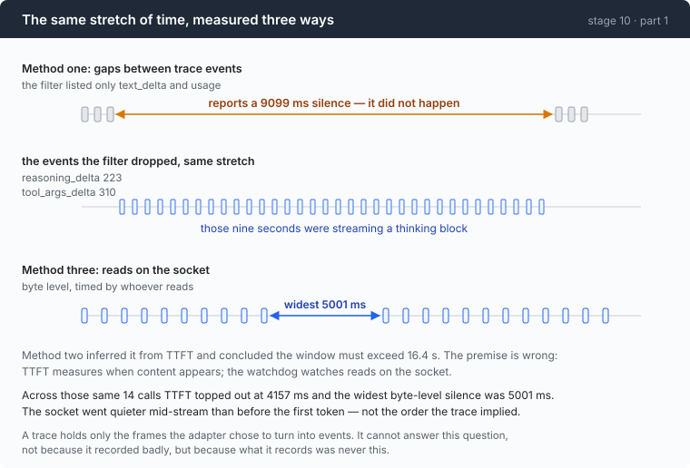

# Stage 10 · part 1: how wide the window should be — two measurements, both wrong

[← back to stage 10](README.md)

> The trace could not answer the question the trace exists for. Two independent
> methods produced confident numbers out of it, and both were fabrications —
> not because the recording was bad, but because what it records was never this.

---

## The problem

`--stall-timeout 45s`. Where does 45 come from?

It has to be wider than the longest silence a healthy stream produces, or the
watchdog kills working calls — and the failure looks like a flaky provider, so
you will blame the provider. It has to be narrow enough to catch a dead socket
before the user gives up, or it is decoration.

So it is an empirical question with a real answer, and the repo has eleven
sessions of recorded traces sitting right there.

---

## The idea

Measure the gap between reads on the socket. Nothing else is the same quantity.



That is the conclusion. The two attempts before it are the document, because
both produced numbers that looked like findings.

---

## Building it

### Step 1: measure gaps between trace events

The trace has timestamps on everything. Filter to the events that mean the
stream is alive, take the gaps, take the maximum.

```go wrong
// "the stream is alive" — the two kinds, listed from memory
alive := map[Kind]bool{
    KindTextDelta: true,
    KindUsage:     true,
}
```

Result: silences of up to **9099 ms** and **11067 ms**, across three real
sessions.

### Step 2: the number contradicts itself

One of those sessions had run with `--stall-timeout 5s` and completed normally.

A claimed nine-second silence in a session that a five-second watchdog did not
interrupt is not a finding, it is a bug. Both cannot be true.

The cause is in the code block above, and it is the comment: *listed from
memory*. The filter omitted `reasoning_delta` and `tool_args_delta`, which in
that session were **223** and **310** events. The nine-second silence had been
streaming a thinking block the entire way through.

Two lessons, and the second is the bigger one. Enumerate a set from the source
that defines it — `events.go` — not from recollection. And **a measurement that
contradicts a run you already did is worth more than a measurement that
agrees**, because it is the only kind that tells you something.

### Step 3: try again, inferring from TTFT

Event kinds now read out of `events.go`. **993 gaps across 11 calls**:

| | p50 | p90 | p99 | max |
|---|---:|---:|---:|---:|
| gap between stream frames | 30 ms | 62 ms | 294 ms | **804 ms** |
| time to first token | 2159 ms | 3309 ms | — | **16448 ms** |

The reasoning: mid-stream gaps are small, but before the first token the model
may think for a long time, and 16448 ms is the longest observed. So the idle
window must be at least 16.4 s plus a margin.

That is a clean argument from correctly-gathered data, and the conclusion is
false.

### Step 4: the premise is wrong

**TTFT measures when content appears. The watchdog measures reads on the
socket.**

They are not the same clock. Between the request going out and the first token
appearing, the connection is not necessarily silent — there are response
headers, there may be framing, there may be whatever the gateway sends while it
waits. The watchdog sees all of that; TTFT sees none of it.

So a 16.4-second TTFT tells you nothing about how long the socket was quiet
during it. The number was real, gathered properly, and about a different
quantity.

### Step 5: measure it in the only place it exists

```go
func idleNote(ms int64) string {
	if ms <= 0 {
		return ""
	}
	return fmt.Sprintf(" · idle max %dms", ms)
}
```

The instrument is the `stallReader` from the main chapter — it already timestamps
every read, so the widest gap is free. It goes on the panel, next to TTFT, where
the two can be compared on the same line.

Note `--stall-timeout 0` turns off the *watchdog* and not the *instrument*.
`guardBody` still wraps, measures and reports. Turning off a guard should never
turn off the measurement that tells you how to set it.

---

## Run it

```sh
go build -o agent ./10-deadlock/code
cd sandbox && set -a && . ../.env && set +a
../agent --yolo --stall-timeout 0 --trace idle.jsonl
> read every .go file in this directory and explain the design
```

Then compare the two quantities per call:

```sh
jq -r 'select(.kind=="first_token") | "TTFT \(.ms)"' idle.jsonl
jq -r 'select(.kind=="idle_max")    | "idle \(.ms)"' idle.jsonl | tail -1
```

**What to watch for:** on some calls the idle max is *larger* than the TTFT. That
is the whole of step 4, visible in two lines of `jq`.

Then reproduce the original mistake deliberately:

```sh
jq -r 'select(.kind=="text_delta" or .kind=="usage") | .t' idle.jsonl | head -50
jq -r 'select(.kind|test("delta")) | .kind' idle.jsonl | sort | uniq -c
```

The second command is the one that would have caught it.

---

## Measured

Across 14 calls:

| | min | median | max |
|---|---:|---:|---:|
| widest byte-level silence per call | 72 ms | 252 ms | **5001 ms** |

And the comparison that undoes method two entirely: on those same 14 calls,
**TTFT topped out at 4157 ms while the widest byte-level silence was 5001 ms.**

The socket went quieter *mid-stream* than it ever did before the first token.
The two quantities are not even ordered the way the trace implied.

45 s against 5001 ms is a **9× margin**.

### The five-second cadence, unexplained

```
idle max     650 ms      ← running maximum, byte level
idle max    5000 ms
idle max    5001 ms
event gap  18509 ms      ← content frames, same stretch of the same call
```

An 18.5-second content silence, spanned by byte-level gaps of almost exactly
**5000 ms** each. Something is arriving on that socket every five seconds and it
is not content.

Two `curl` probes went looking for it — one prompting a long silent think, one
with a tool definition and a hard command. **152 and 1134 lines captured, zero
gaps over one second, zero SSE comment lines.** The cause is not in evidence.

Which matters for the headline number. If that five-second cadence is a provider
keep-alive and the provider stops sending it, the 45 s window starts killing
calls that pause 46 s to think — and nothing in the instrument would warn first,
because the instrument only reports what did happen.

### Unpaid debts

- **Detection is late by up to one tick.** A stall is noticed between `idle` and
  `idle × 1.25`. Deliberate, and it means the effective worst case at the
  default is 56 s, not 45.
- **The watchdog costs a goroutine and a ticker per in-flight call**, waking a
  little over five times a minute at the default.
- **`--stall-timeout 200ms` fires on roughly half of all calls**, because the
  median observed silence is 252 ms. Useful as an exercise; a good illustration
  of how narrow the safe range is at the low end.

---

## Next

[Back to stage 10](README.md), or on to
[stage 11](../../11-malformed/doc/README.md) — where the call completes and what
arrives is not valid JSON.
