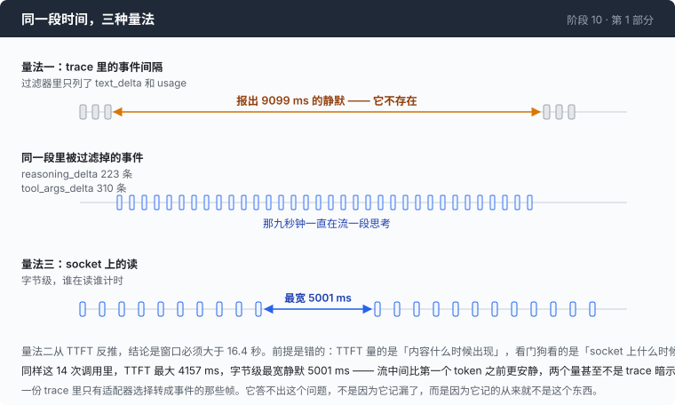

# 阶段 10 · 第 1 部分：窗口该开多大 —— 两次量出来的答案，都是错的

[00](../../00-loop/doc/README_zh.md) → 01 → 02 → 03 → 04 → 05 → 06 → 07 → 08 → [09](../../09-triage/doc/README_zh.md) → `10` → [11](../../11-malformed/doc/README_zh.md) → 12

> [返回本章正文](README_zh.md)

---

## 问题

45 秒这个数字，在正文里出现的时候像一个标准值。它不是。

定小了，一个想得久一点的模型会被当成挂死杀掉，而且每一次都要为砍断之前生成的 token 付钱；定大了，一次真正的挂死会占着这一轮的 45 秒，或者更糟 —— 占到你以为它还在干活。这两头都不是「稍微不合适」，都是故障。

而它必须自己量出来。没有任何一份协议文档写着「本端点两帧之间最长会安静多久」，也不会有。

**一个从来不显示自己比较对象的超时，就是一个有人猜出来的数字。**

下面是三次测量。前两次的答案是错的 —— 不是「不够准」，是错的，而且错的方向相反。它们都自信、可复现，都是从当时手上最好的证据里推出来的，这才是它们值得写下来的原因。

---

## 办法

手上有 trace。第 02 章立的规矩是：会话里发生的一切都进事件总线，trace 是总线的订阅者，所以事后想知道这次会话的任何事，去问 trace。



| 量法 | 数据来自 | 结论 | 对不对 |
|---|---|---|---|
| 一 | trace 里相邻事件的时间差 | 见过 9099 ms 和 11067 ms 的静默 | 编的 |
| 二 | 从 TTFT 的分布反推 | 窗口必须大于 16.4 秒 | 前提错 |
| 三 | 在 socket 上直接量两次读之间的间隔 | 最宽 5001 ms | 对 |

三次量的都不是同一个东西，而只有第三个是那个看门狗真正拿来比较的量。

---

## 怎么做的

### 第 1 步：从 trace 的事件间隔量

一次会话的 trace 是一行一个事件的 JSONL，每行带时间戳。要问的问题是「这个流最久安静过多长时间」，于是先决定哪些事件算「流还活着」，然后取相邻两个这类事件之间的最大间隔。

那个判据是凭记忆写的，长这样：

```go wrong
// 「流还活着」—— 凭记忆列出来的两种事件
alive := map[Kind]bool{
    KindTextDelta: true,
    KindUsage:     true,
}
```

在三次真实会话上跑出来的结果：最宽的静默 **9099 ms**，另一次 **11067 ms**。

这个数字很好用。它把 45 秒变成了一个有依据的选择：见过 11 秒，那就留到 45 秒。

### 第 2 步：这个数字自己打自己

那三次会话里有一次是带 `--stall-timeout 5s` 跑的，而且**正常结束**。

一个 5 秒的看门狗没有打断的会话里，不可能存在 9 秒的静默。这里只有两个东西可以怀疑：一个是从 trace 里算出来的数，一个是一次真的跑完了的会话。

错的是前者。上面那个凭记忆列出来的判据漏了两种事件：`reasoning_delta` 和 `tool_args_delta`。而在那次会话里，这两种事件分别有 **223** 条和 **310** 条。

那九秒钟里，流一直在动，动的是一段思考。

值得把这一步说清楚：**这不是 trace 记漏了。** 那 223 条和 310 条事件就在文件里，是取数的那段代码没有列它们。第 02 章说 trace 是事后的唯一真相，这句话要加一个限定 —— 它是**被适配器选择转成事件的那些帧**的唯一真相。你想量的东西如果不在这个集合里，一份完整无损的 trace 会给你一个自信的错误答案，而且它看起来完全像一个发现。

### 第 3 步：换一条路，从 TTFT 反推

第二次量的时候，事件种类不再凭记忆写了，是照着 `events.go` 抄的。取样是 **11 次调用、993 个间隔**：

| | p50 | p90 | p99 | 最大 |
|---|---:|---:|---:|---:|
| 相邻流帧之间的间隔 | 30 ms | 62 ms | 294 ms | **804 ms** |
| 第一个 token 的等待（TTFT） | 2159 ms | 3309 ms | — | **16448 ms** |

这次的样本量本身就是一种说服力：993 个间隔，11 次调用，四个分位点排得整整齐齐，p99 到最大值之间也没有断层。一张这样的表很难让人再往回问一句「我量的是不是那个东西」。

上面那行看着非常安全 —— 最宽 804 ms，离 45 秒远得看不见。

下面那行不安全。一次调用等了 16.4 秒才出现第一个 token。如果 socket 在这 16.4 秒里是安静的，那么任何小于 16.4 秒的窗口都会把一次正常的、只是在排队或者在想的调用杀掉。

于是结论是：窗口必须大于 16.4 秒，再加余量。

### 第 4 步：这条路的前提是错的

TTFT 量的是**内容什么时候出现**。看门狗看的是 **socket 上什么时候被读到字节**。

在一个会先流一段思考、再流工具参数的端点上，这两件事根本不是一回事。第一个 token 出现之前，socket 上完全可以一直有东西在到 —— 而那些东西，正是第 2 步里被漏掉的那两种事件。

同一个错误换了两次形状：第一次是把它们从统计里漏掉，第二次是把一个不含它们的量当成了它们的上界。两次都是拿一个在错误的层次上产生的数字，去回答一个属于另一层的问题。

### 第 5 步：在唯一该量的地方量

那个层次只有一个地方：唯一碰 socket 的那个对象。它每读到一次字节就记下时刻，顺手记下这次调用见过的最宽间隔（README 第 2 步的 `mark`），然后把新的最大值发到总线上。

面板负责显示它：

```go
func idleNote(ms int64) string {
	if ms <= 0 {
		return ""
	}
	return fmt.Sprintf(" · idle max %dms", ms)
}
```

`ms <= 0` 返回空字符串，不是 `idle max 0ms`。只有一帧的流没有间隔可报，而一个 0 读起来像「它一次都没停过」，那是另一个意思。

于是每一次调用的面板多了最后一段：

```
  ┌─ call 1 · tool_calls
  │ in 1743   ████████████████████  full 1743 · write 0 · read 0
  │ out 38     TTFT 4156ms · total 5830ms · 22.7 tok/s · idle max 1119ms
```

一次 TTFT 是 4156 ms 的调用，socket 上最宽的安静是 **1119 ms**。模型在想的那四秒里，socket 一直在响。

这一行是这一章唯一新增的输出，也是它全部的正面证据：默认值合不合适，不用信文档，屏幕上写着你自己这次会话的余量。

顺带说一句，这个数字是**边流边发**的，不是流读完之后算一次。因为一个挂死的调用永远走不到「响应结束」那个事件，而挂死的那一次恰好是你最想看到间隔的那一次。每刷新一次最大值就发一次，意味着这个数字能活过它所描述的那次失败。

---

## 跑一下

先跑这条测试，它是这把尺子自己的保险：

```sh
go test ./10-deadlock/code -run 'TheWidestGapIsMeasuredAndReported' -v
```

它是变异测试逼出来的：把 `mark` 改成永远不记录新的最大值，**其他测试全是绿的** —— 因为看门狗比较的是 `last`，不是 `widest`。悄悄死掉的是那把尺子，而一章的全部论点是「把那个被比较的数字打出来」。

然后量你自己的端点：

```sh
go build -o agent ./10-deadlock/code

mkdir -p sandbox && cd sandbox
set -a && . ../.env && set +a
../agent --stall-timeout 0 --trace idle.jsonl
```

问三五句不同长短的话，其中至少一句要它先想一会儿再动手。然后：

```sh
jq -r 'select(.kind=="idle_max") | .millis' idle.jsonl | sort -n | tail -1
```

**观察重点：**

- `--stall-timeout 0` 关掉了看门狗，但那把尺子还在量、还在报。测量的时候要这么跑：一个被自己的看门狗砍断的样本，量出来的最宽间隔恰好就是你设的那个窗口，那是循环论证。
- 面板上 `idle max` 和 `TTFT` 的关系。它们不是一个跟着另一个走的，这就是第 4 步那个前提错在哪。
- 把 `--stall-timeout` 设成 `200ms` 再问同一批问题：大约一半的调用会被判成挂死然后重试，因为实测的间隔中位数是 252 ms。这是最便宜的一种「看着它响一次」。

---

## 量一量

上面第 3、5 步的数据就是这一部分的测量。把第三种量法的结果单独列出来 —— **14 次调用**，每次取这一次调用里最宽的字节级静默：

| | 最小 | 中位数 | 最大 |
|---|---:|---:|---:|
| 每次调用里最宽的字节级静默 | 72 ms | 252 ms | **5001 ms** |

45 秒对着 5001 ms 是 **9 倍**余量。

同样这 14 次调用，TTFT 的最大值是 **4157 ms**。也就是说：

**socket 在流中间比在第一个 token 之前更安静。** 两个量甚至不是 trace 那两次测量暗示的那个顺序 —— 按量法二的结论，TTFT 是上界，静默都该落在它之下；实测是最宽的静默 5001 ms，比最大的 TTFT 4157 ms 更宽。

### 那个五秒的节奏，说不清

同一次调用的同一段时间里，两把尺子读出来的东西是这样的：

```
idle max     650 ms      ← running maximum, byte level
idle max    5000 ms
idle max    5001 ms
event gap  18509 ms      ← content frames, same stretch of the same call
```

一段 **18509 ms** 的内容级静默，被几乎精确的 5000 ms 一段一段地跨过去。也就是说：内容停了十八秒，而 socket 每五秒准时收到一点东西。

那点东西是什么，没查出来。两个 `curl` 探针专门去找它 —— 一个要模型先长时间静默地想，一个带上工具定义和一条难命令 —— 抓到 **152 行**和 **1134 行**，其中**没有一个**超过一秒的间隔，也**没有一行** SSE 注释行。SSE 允许一行以 `:` 开头、不带数据，这是保活最明显的形状；两个探针都没有产出过这样一行。

**原因不在证据里。** 于是这一章的头号数字自己带着一个洞：45 秒是对着 5001 ms 留的九倍余量，而 5001 ms 从哪来的没人知道。如果它是某种保活，而它某天不发了，这个窗口就会开始杀掉那些真的想了 46 秒的调用 —— 而那把尺子不会提前警告，它只会在事后告诉你最宽间隔变成了 46000 ms。

### 几笔没还的账

- **这三个时钟没到子 agent。** `newChild` 复制了 provider 阶梯、重试策略和 HTTP 客户端，没复制 `deadlines`。而零值意味着三个时钟**全关** —— `guardBody` 和 `waitFor` 都把 `<= 0` 读成「不看门」。所以这一章的全部内容对子 agent 不生效，而「一个永远挂在那儿的子进程」恰好就是这一章要防的那棵树。第 11 章用一行修掉，并且补了一个专门盯着它的测试。
- **`--connect-timeout` 不是 connect 超时。** `ResponseHeaderTimeout` 从请求写完之后才开始，DNS 和建连落在它外面，只有操作系统在管。三个时钟里有一个没覆盖它名字里的那一段。
- **总期限和重试预算不合成任何人能预测的数字。** 总期限按每次尝试算，所以三次重试一个 15 分钟的调用是 45 分钟；而第 09 章那个重试预算只管尝试**之间**的等待。两个数字都对，合起来没有意义。
- **压缩没有自己的取消。** 它继承回合的 context，所以在摘要调用中间按 Ctrl-C 杀掉的是整个会话，而不只是那次压缩 —— 出现在一章标题写着「精确地结束一次等待」的东西里。

---

## 接下来

正文那三个默认值就是这么定出来的：一个从探针里来（30 秒的响应头），一个从这里的第三种量法里来（45 秒的空闲），一个是纯兜底（15 分钟）。

但这一部分真正该带走的不是这三个数，是前两次失败的形状：

**你要量的东西，如果不是你记录下来的东西，那么一份完整、无损、可回放的 trace 会给你一个自信的错误答案。** 而且它看起来会完全像一个发现 —— 有数字，有多次会话的一致性，还能算出余量。

下次要量什么之前先问一句：这个量是在哪一层产生的，我的记录是在哪一层做的。这两层不一样的时候，得下到产生它的那一层去量。

回到[本章正文](README_zh.md)：三个时钟装好了，每一次等待都有期限也有主人。接下来出问题的是**按时回来**的那些东西 —— 第 [11 章](../../11-malformed/doc/README_zh.md)。
