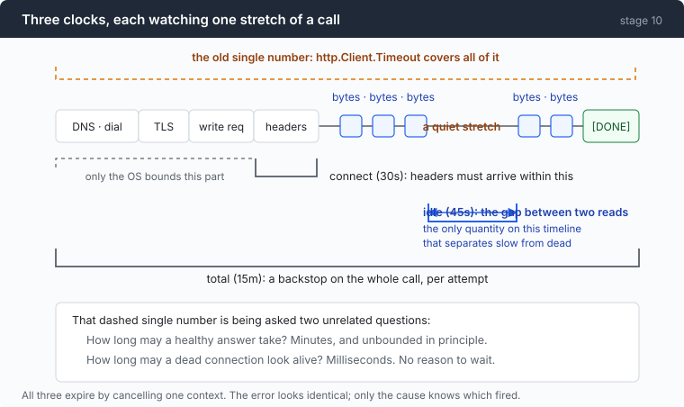
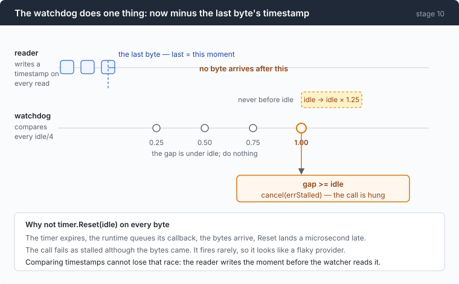

# Stage 10: Deadlock — every wait gets a deadline and an owner

[09](../../09-triage/doc/README.md) → `10` → [11](../../11-malformed/doc/README.md) → 12

> `http.Client.Timeout` is one number being asked two unrelated questions: how
> long may a healthy answer take, and how long may a dead connection look alive.
> The honest answers are "minutes, unbounded" and "milliseconds", and no single
> value satisfies both.

---

## The problem

Stage 09 handles calls that fail. This is about a call that never fails and
never finishes.

The obvious guard is the one Go hands you:

```go wrong
http: &http.Client{Timeout: 5 * time.Minute}    // every stage before this one
```

That field covers DNS, connect, TLS, writing the request, reading the response
headers — **and the entire body read**. On a streaming endpoint the body read
lasts exactly as long as the model is talking.

So the number is not a guard against a broken connection. It is a cap on how
long the model is allowed to speak, and the two things it is supposed to do pull
in opposite directions:

- Set it to five minutes and a socket that died silently holds the agent for
  five minutes.
- Set it to thirty seconds and a model that thinks hard about a long answer gets
  killed for succeeding.

And from outside, **a live stream and a hung socket are indistinguishable.** No
bytes arrive in either case. The only evidence you have about the future is how
long the silence has already lasted.

---

## The idea

Three clocks, each watching one stretch, each disableable.



| clock | default | mechanism |
|---|---|---|
| connect | `--connect-timeout 30s` | `http.Transport.ResponseHeaderTimeout` |
| idle | `--stall-timeout 45s` | the gap between **reads on the socket** |
| total | `--call-timeout 15m` | `context.WithTimeoutCause` around one attempt |

The middle one is the new idea. It is not "how long may this take" but "how long
may nothing arrive", and it is the only quantity on the timeline that separates
slow from dead.

---

## Building it

About 300 lines in one new file, plus a `context.Context` parameter on
everything that blocks. How wide the idle window should be is
[part 1](1-window.md) — and the two obvious ways of measuring it are both wrong.

### Step 1: three durations, each allowed to be zero

```go
type deadlines struct {
	connect time.Duration // headers must arrive within this
	idle    time.Duration // longest tolerated gap between bytes
	total   time.Duration // backstop on the entire call
}
```

Zero means off, for all three. That is not a convenience — it is how the wire
probing behind `wire-notes.md` gets done, and a watchdog you cannot turn off is
a watchdog you cannot measure against.

### Step 2: do not reset a timer on every byte

The natural implementation:

```go wrong
t := time.NewTimer(idle)
// on every byte read:
t.Reset(idle)                       // <- a race you cannot win
```

The timer expires. The runtime has already queued its function. The bytes arrive
and `Reset` lands a microsecond late. The call is failed as stalled although the
data got there.



The window is tiny, and that is exactly what makes it expensive: it fires
occasionally, on a healthy connection, and it looks like an unstable provider
rather than like your own bug.

### Step 3: the watchdog does one subtraction

```go
func (g *stallGuard) mark(now time.Time) bool {
	n := now.UnixNano()
	prev := g.last.Swap(n)
	if prev == 0 {
		return false
	}
	gap := n - prev
	// ...
	g.widest.Store(gap)
	return true
}
```

```go
case now, ok := <-tick:
	if !ok {
		return
	}
	if now.Sub(time.Unix(0, g.last.Load())) >= idle {
		cancel(errStalled)
		return
	}
```

The reader writes a timestamp; the watcher subtracts. **A timestamp comparison
cannot lose that race**, because the reader writes the moment before the watcher
reads it — bytes that have arrived are always visible to the next comparison.

Ticking at `idle/4` means detection is late by at most one tick: a stall is
noticed somewhere between `idle` and `idle × 1.25`, and **never before `idle`**.
Late is fine. Early is a bug.

### Step 4: the liveness test is `n > 0`, not `err == nil`

```go
func (s *stallReader) Read(p []byte) (int, error) {
	n, err := s.rc.Read(p)
	if n > 0 && s.guard.mark(s.now()) && s.bus != nil {
		s.bus.Emit(Event{Kind: KindIdleMax, Turn: s.turn,
			Millis: s.guard.idleMax().Milliseconds()})
	}
	return n, err
}
```

A `Read` may return data **and** `io.EOF` at the same time. Testing `err == nil`
throws away the liveness signal from the final read of every stream.

And note the second job this wrapper is doing. It is not only a watchdog; it is
the **instrument** that measures the widest silence, which is what makes the
window in part 1 a measured margin rather than a number somebody liked.

### Step 5: who owns the watchdog

```go
t := time.NewTicker(idle / 4)
done := make(chan struct{})
go func() {
	defer close(done)
	g.watch(ctx, idle, cancel, t.C)
}()
stop := func() {
	t.Stop()
	cancel(context.Canceled) // ends watch() even if the body never EOFs
	<-done
}
```

One goroutine and one ticker per in-flight call, and a `stop` that actually joins
it. The `<-done` is the difference between "we asked it to stop" and "it
stopped" — without it, a call that ends while the watcher is mid-tick leaks a
goroutine per call, which on a long session is a slow leak nobody attributes to
this file.

The cost, stated: 4 wakeups per idle window, a little over **5 per minute** at
the 45 s default.

### Step 6: take the timeout off `http.Client`

```go
httpc := &http.Client{
	Transport: &http.Transport{
		Proxy:                 http.ProxyFromEnvironment,
		ResponseHeaderTimeout: dl.connect,
	},
}
```

`Timeout` is left at zero and there is a test whose only job is to keep it there
— because it is the obvious field, and somebody will put a value back into it.

```go
if dl.total > 0 {
	var stop context.CancelFunc
	ctx, stop = context.WithTimeoutCause(ctx, dl.total, errCallTimeout)
	defer stop()
}
```

`WithTimeoutCause`, not `WithTimeout`. The next step is why.

One honest correction while we are here: **`--connect-timeout` is not a connect
timeout.** `ResponseHeaderTimeout` starts *after* the request is written, so DNS
and dial sit outside it, bounded only by the OS. A `net.Dialer` timeout would
close that gap; this stage does not spend the line, and the flag's name
overpromises.

### Step 7: four causes, and why the cause matters more than the deadline

All three clocks and the interrupt cancel the same context, so every one of them
surfaces as `context.Canceled`. Only the cause still knows which fired.

```go
func triageCause(err error) (Triage, string, bool) {
	switch {
	case errors.Is(err, errInterrupted):
		return TriageFatal, "interrupted", true
	case errors.Is(err, errStalled):
		return TriageRetry, "stalled", true
	case errors.Is(err, errCallTimeout):
		return TriageFatal, "call_timeout", true
	case errors.Is(err, context.DeadlineExceeded), errors.Is(err, context.Canceled):
		return TriageFatal, "cancelled", true
	}
	return "", "", false
}
```

Read the verdicts. **Stalled is the only retryable one**, because it is the only
one where trying again might work: a dead connection proved itself dead and a
new connection is a different thing. A call timeout means the model is alive and
simply too slow — the same request will be too slow again, and each attempt pays
for tokens generated before the cut.

Three new failure modes, absorbed by stage 09's three verdicts. No fourth
verdict was needed, which is a small piece of evidence that the taxonomy was the
right shape.

And the ordering matters:

```go
if v, _, ok := triageCause(e.cause); ok {
	return v
}
```

The cause is checked **before** the phase/status switch. A cancelled call can
still be carrying a 503 from whatever the dying request last saw, so a classifier
that looked at the status first would retry your Ctrl-C.

Which is also why the signal handler is written by hand rather than using
`signal.NotifyContext`: that cancels with plain `context.Canceled`, the one
thing that cannot be told apart from a stall.

```go
sigc := make(chan os.Signal, 1)
signal.Notify(sigc, os.Interrupt)
go func() {
	<-sigc
	cancel(errInterrupted)
	// ...
	signal.Stop(sigc)
}()
```

### Step 8: a wait that can be interrupted

```go
t := time.NewTimer(d)
defer t.Stop()
select {
case <-t.C:
	return nil
case <-ctx.Done():
	return context.Cause(ctx)
}
```

Stage 09's backoff was `time.Sleep`. At default settings that is up to **eight
seconds** in which a program that has been told to stop does nothing at all.

Ctrl-C during a `time.Sleep` is a program that ignores you, and there is no
version of that which is acceptable.

### Step 9: on the command side, do not use `exec.CommandContext`

```go wrong
cmd := exec.CommandContext(ctx, shell, "-c", command)   // <- looks exactly right
```

It kills `cmd.Process` and nothing else — which discards stage 01's entire
process-group containment. The shell dies; every backgrounded grandchild
survives, reparented.

The fix is one more case in the `select` that was already there:

```go
select {
case waitErr = <-done:
case <-ctx.Done():
	cancelled = true
	stop()
case <-time.After(timeout):
	timedOut = true
	stop()
}
```

`stop()` is stage 01's `g.kill()` plus the five-second reap. And the two
outcomes are reported differently, because they mean different things to the
model:

```go
status = fmt.Sprintf("\n[CANCELLED after %s — the session is stopping and the process tree was killed]",
	r.Duration.Round(time.Millisecond))
```

A timeout carries advice — try something narrower. A cancellation carries none,
because there is no next command.

---

## Run it

```sh
go build -o agent ./10-deadlock/code
cd sandbox && set -a && . ../.env && set +a

../agent --yolo --stall-timeout 200ms -p "explain what this directory contains"
```

**What to watch for:** it fires on roughly half of all calls, because the median
observed silence is 252 ms. That is the exercise: a badly chosen window is not
subtle.

Then the instrument on its own:

```sh
../agent --yolo --stall-timeout 0 -p "read every .go file here and summarise the design"
```

The watchdog is off; `idle max` is still on the panel. Turning off a guard
should not turn off the measurement that tells you how to set it.

And the interrupt:

```sh
../agent --yolo
> run: sleep 300
```

Press Ctrl-C. The command line reports `[CANCELLED …]`, the process tree is
gone, and there is no retry.

---

## Measured

Per-call panel:

```
  ┌─ call 1 · tool_calls
  │ in 1743   ████████████████████  full 1743 · write 0 · read 0
  │ out 38     TTFT 4156ms · total 5830ms · 22.7 tok/s · idle max 1119ms
```

`idle max 1119ms` on a call whose TTFT was 4156 ms — **the socket was not silent
while the model was thinking**, which is the finding that makes part 1
necessary.

Across 14 calls:

| | min | median | max |
|---|---:|---:|---:|
| widest byte-level silence per call | 72 ms | 252 ms | **5001 ms** |

The 45 s default is a **9× margin** over the widest silence observed.

The demonstration run — stage 00's scratch task, find the bug, fix it, verify:

```
  ── session ──────────────────────
  7 calls · 10 commands
  prompt tokens billed: 23232  (full 4736 · write 0 · read 18496)
  output tokens: 1053
  re-send ratio: 5.1x (billed 23232 for a final context of 4526)
```

Three clocks armed for the whole session, and **none of them fired**. Nothing on
that panel is new, which is the point: the feature is shown by its absence.

That is worth saying plainly rather than dressing up. The only positive evidence
for these defaults comes from the instrument, not from a stall it caught.

### Debts this stage leaves

**The deadlines never reached subagents.** `newChild` copies the ladder, the
retry policy and the HTTP client — and not the `deadlines` struct. A zero
`deadlines` means all three clocks are **off**, because `guardBody` and `waitFor`
read `<= 0` as "no watchdog". So the stage named after a wait nobody can end left
every child with no stall detector and no total backstop. Fixed one stage later,
in one line. It is the same bug stage 08 had with `sb`, in the same function.

**The three clocks do not compose with stage 09's retry budget.** The total
deadline is per *attempt*, so three retries of a 15-minute call is 45 minutes,
and the retry budget bounds only the waiting *between* attempts. The two numbers
do not compose into anything a human would predict.

**Nothing cancels a compaction independently.** It inherits the turn's context,
so Ctrl-C during a summarising call kills the session rather than just the
compaction — in a stage whose subject is ending a wait precisely.

---

## Next

Three clocks, four causes, and every wait owned. The call now completes, or
fails for a reason you can name.

What arrives when it completes is a different question. The model asks for a
tool call and the arguments are not valid JSON — cut off mid-string, or a
perfectly formed object with the wrong field, or a `stop_reason` claiming a
usable call over a body that is not one.

[Stage 11](../../11-malformed/doc/README.md) is about what each protocol hands
you when that happens, why repairing it is the trap, and where the one
validation boundary goes.
