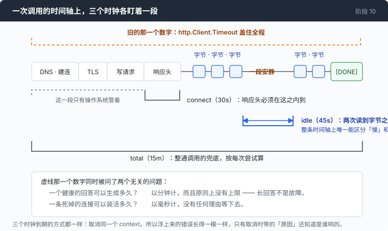
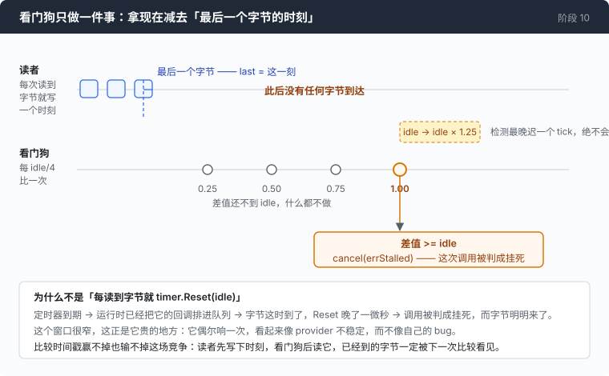

# 阶段 10：死锁 —— 每一次等待都要有期限，也要有主人

[00](../../00-loop/doc/README_zh.md) → 01 → 02 → 03 → 04 → 05 → 06 → 07 → 08 → [09](../../09-triage/doc/README_zh.md) → `10` → [11](../../11-malformed/doc/README_zh.md) → 12

> 三个时钟，而不是一个数字。这一章最值得记住的不是那三个时钟，而是给它们定尺寸的过程：两种独立的量法，都从 trace 里推出了自信而错误的答案，错的方向还相反。

---

## 问题

第 09 章之后，失败都有了归属。超时的、被限流的、连不上的、返回 500 的，每一种都能落到三个决定里的一个：再试一次、换一家、停下来说清楚。

然后你撞上一种不属于任何一类的失败：什么都没回来。

你让 agent 去干一件正常的活。它开始回答，屏幕上出现了两行字，然后光标停在那儿。没有报错，没有退出码，没有第三行。你等了一分钟。你不知道它是在想 —— 模型确实会想很久，尤其是那些会先写一段思考再动手的 —— 还是那条 TCP 连接已经死了，而你的程序正抱着一个永远不会有下一个字节的 socket。

从外面看，这两件事**长得一模一样**：两边都没有字节在来。

你按 Ctrl-C。屏幕上什么都没变。程序卡在一次 `Read` 上，而这个键按下去之后，没有任何一段代码在等它。你又按了一次，进程直接死了；trace 文件写到一半，这一轮花掉的钱没有记下来。

同一次会话里还有几处有同样的性质：重试之间那个 `time.Sleep` 退避，睡着的时候什么都听不见，按默认值最长能睡八秒；一个派了三个子 agent 的回合，父 agent 等着它们全部返回，而「全部返回」这件事本身没有任何期限。

整个程序里跟时间有关的数字只有一个，它管着从建立连接到读完最后一个字节的全过程。这个数字挑不出好值来：设成十分钟，第三秒就死掉的流会占着这一轮剩下的 597 秒；设成十秒，一个长回答会在句子中间被砍断，而砍断之前生成的 token 已经付过钱了。

**这个循环里没有任何一个地方对「还在干活」能持续多久有意见，也没有任何一个地方回答得出「这次等待归谁管、谁来结束它」。**

---

## 办法

把那一个数字换成三个，每个只盯一段。



| 时钟 | 它盯着什么 | 默认值 |
|---|---|---|
| connect | 响应头必须在这之内到 | 30s（`--connect-timeout`） |
| idle | 两次**读到字节**之间的间隔 | 45s（`--stall-timeout`） |
| total | 一整通调用的兜底 | 15m（`--call-timeout`） |

中间那个是承重的。一个活着的流和一个挂死的 socket 唯一的区别是，其中一个还会产出下一个字节 —— 而关于这件事你能拿到的唯一证据，是它已经安静了多久。

三个时钟到期的方式完全一样：取消同一个 context。所以错误浮上来的时候它们无法区分，而它们需要三种不同的处理。于是每一个都带着**原因**取消，判定的时候读原因，不读错误。

---

## 怎么做的

代码在 [`10-deadlock/code/deadline.go`](../code/deadline.go)，一个新文件，大约 300 行，外加给每一处会阻塞的调用加上一个 `context.Context` 参数。后者是机械劳动，下面不讲。

### 第 1 步：三个时长，每一个都允许是 0

```go
type deadlines struct {
	connect time.Duration // headers must arrive within this
	idle    time.Duration // longest tolerated gap between bytes
	total   time.Duration // backstop on the entire call
}
```

0 是一个真实的设置，不是「还没填」。`external/wire-notes.md` 里那些协议探针就是三个时钟全关着跑的 —— 被砍断的探测结果不算证据。

### 第 2 步：不要用「每读到字节就重置定时器」

最顺手的实现是一个 `time.Timer`，每次读到字节就 `Reset`：

```go wrong
t := time.NewTimer(idle)
// ...每次读到字节：
t.Reset(idle)                       // ← 这里有一场你赢不了的竞争
```

`Reset` 会跟它想阻止的那次触发抢：定时器已经到期，运行时已经把回调排进队列，而这次 `Reset` 晚到了一微秒。结果是这次调用被判成挂死，而字节明明到了。窗口很窄，这正是它贵的地方 —— 它偶尔响一次，在繁忙的流上响，看起来像 provider 不稳定，而不像自己的 bug。

换成记时间戳，这场竞争就不存在了：



```go
func (g *stallGuard) mark(now time.Time) bool {
	n := now.UnixNano()
	prev := g.last.Swap(n)
	if prev == 0 {
		return false
	}
	gap := n - prev
	// ...
	g.widest.Store(gap)
	return true
}
```

读者先写下时刻，看门狗后读它，已经到达的字节一定会被下一次比较看见。`widest` 是这一步顺手记下的第二个东西 —— 这次调用真正见过的最宽间隔。为什么要记它，第 [1 部分](1-window_zh.md)是整篇。

### 第 3 步：看门狗只做一次减法

```go
case now, ok := <-tick:
	if !ok {
		return
	}
	if now.Sub(time.Unix(0, g.last.Load())) >= idle {
		cancel(errStalled)
		return
	}
```

`tick` 是一个通道，不是里面自己造的 `time.Ticker`。理由跟第 09 章把 `sleep` 注进去一样：一个自带时钟的组件不注入时钟就只能靠 `time.Sleep` 测，而一套全是 sleep 的测试是一套大家会渐渐不跑的测试。这里「45 秒过去了」是往通道里塞一个值，不花时间。

代价是检测会迟，最多迟一个 tick。tick 定成窗口的四分之一：45 秒的窗口一个周期醒四次，一分钟五次多一点，而一次挂死会在 idle 和 idle × 1.25 之间被发现，**绝不会早于 idle**。

### 第 4 步：判据是 `n > 0`，不是 `err == nil`

```go
func (s *stallReader) Read(p []byte) (int, error) {
	n, err := s.rc.Read(p)
	if n > 0 && s.guard.mark(s.now()) && s.bus != nil {
		s.bus.Emit(Event{Kind: KindIdleMax, Turn: s.turn,
			Millis: s.guard.idleMax().Milliseconds()})
	}
	return n, err
}
```

一次 `Read` 允许同时返回数据和 `io.EOF`。忽略这一次读，等于每一段短流的空闲窗口都从最后那几个字节之前开始算。这里也是那个测量值离开这个文件的地方：渲染器没有时钟 —— 那是第 02 章立的规矩，也是回放能精确到毫秒的原因 —— 所以一个它要显示的时长必须由拿着秒表的人测好、放进事件里。这里拿着秒表的就是整个程序里唯一碰 socket 的那个对象。

### 第 5 步：这只看门狗归谁

```go
t := time.NewTicker(idle / 4)
done := make(chan struct{})
go func() {
	defer close(done)
	g.watch(ctx, idle, cancel, t.C)
}()
stop := func() {
	t.Stop()
	cancel(context.Canceled) // ends watch() even if the body never EOFs
	<-done
}
```

`guardBody` 造出这个 goroutine，也交出结束它的函数，调用方 `defer` 它 —— 这就是标题里「也要有主人」的那一半。一只没人关的看门狗是一个随调用次数增长的泄漏，而一棵子 agent 树能让这个数字变成几百。窗口设成 0 的时候，`stallReader` 照样包上去，只是不再有人看门。关掉一个期限，不应该顺手关掉那个能告诉你这个期限该设多少的仪器。

### 第 6 步：把 `http.Client` 上的 Timeout 拿掉

```go
httpc := &http.Client{
	Transport: &http.Transport{
		Proxy:                 http.ProxyFromEnvironment,
		ResponseHeaderTimeout: dl.connect,
	},
}
```

`http.Client.Timeout` 覆盖到整个响应体读完，所以在一个流式端点上，它的字面意思是「模型最多可以说这么久」。没有人想给这件事设上限。有一个测试的唯一职责就是把这个字段按在 0 上，因为它会被人好心地加回来。

`ResponseHeaderTimeout` 停在响应头，不管流。这里要老实说一句：它是**在请求写完之后**才开始计时的，所以 DNS 和建连落在它外面，只被操作系统管着 —— 这三个时钟里，名字叫 connect 的那个并没有真的覆盖它名字里的那一段。一个 `net.Dialer` 的超时能补上，这一章没有花那一行。

总预算包在一次尝试外面：

```go
if dl.total > 0 {
	var stop context.CancelFunc
	ctx, stop = context.WithTimeoutCause(ctx, dl.total, errCallTimeout)
	defer stop()
}
```

按尝试算，不按调用算。一次重试如果继承上一次剩下的时间，就会越需要成功、预算越小。代价在第 [1 部分](1-window_zh.md)记着：它和第 09 章的重试预算不合成任何一个人能预测的数字。

### 第 7 步：四个原因，以及为什么原因比期限重要

三个时钟加上 Ctrl-C，一共四种取消，取消完之后它们都是同一个 `context.Canceled`。

```go
func triageCause(err error) (Triage, string, bool) {
	switch {
	case errors.Is(err, errInterrupted):
		return TriageFatal, "interrupted", true
	case errors.Is(err, errStalled):
		return TriageRetry, "stalled", true
	case errors.Is(err, errCallTimeout):
		return TriageFatal, "call_timeout", true
	case errors.Is(err, context.DeadlineExceeded), errors.Is(err, context.Canceled):
		return TriageFatal, "cancelled", true
	}
	return "", "", false
}
```

四个答案，每一个都不能当成别的：

- **interrupted** —— 致命，而且是唯一一个既不能重试也不能换 provider 的。人说了停。一个 agent 用「去第二家试试」来回答这句话，是把停止键变成了扇出，而且换过去的那家缓存是冷的，于是这也是最贵的一种回答方式。
- **stalled** —— 重试。它跟第 09 章已经在重试的那些传输故障没有区别，只是一条死连接花了一个空闲窗口的时间才证明自己死了。
- **call timeout** —— 致命。这一个是活着的，只是太慢；同一个请求下次还是这么慢，而每次尝试都要为砍断之前生成的 token 付钱。一个会被重试的兜底不是兜底。
- **parent gone** —— 致命。结束的那个 context 不是这次调用自己的，是整个回合或者整个程序在收摊。

三种新的失败模式，被第 09 章那三个决定全部吸收，**没有多出第四个决定**。而这个判断要放在原来那张表**之前**：

```go
if v, _, ok := triageCause(e.cause); ok {
	return v
}
```

一个被取消的调用身上可能还挂着它临死前看到的 503。按状态码那张表，503 是重试 —— 于是 agent 用「服务器今天也不太好」的理由无视了 Ctrl-C。

### 第 8 步：一个能被打断的等待

```go
t := time.NewTimer(d)
defer t.Stop()
select {
case <-t.C:
	return nil
case <-ctx.Done():
	return context.Cause(ctx)
}
```

`time.Sleep` 换成这个，第 09 章那八秒退避就能被中断了，而且它返回的是**原因** —— 于是被打断的重试循环知道自己不该再转下去。

Ctrl-C 的处理是手写的，没用 `signal.NotifyContext`：那个函数用 `context.Canceled` 取消，而这恰好是判定唯一分不出来的那一个。

```go
sigc := make(chan os.Signal, 1)
signal.Notify(sigc, os.Interrupt)
go func() {
	<-sigc
	cancel(errInterrupted)
	// ...
	signal.Stop(sigc)
}()
```

最后那行 `signal.Stop` 是把第二次 Ctrl-C 还给操作系统。第一次 Ctrl-C 要求 agent 收摊：杀命令、关 trace、打账单。如果收摊本身卡住了，用户需要一条不依赖这段卡住的代码的出路。

### 第 9 步：命令那一侧，别用 `exec.CommandContext`

```go wrong
cmd := exec.CommandContext(ctx, shell, "-c", command)   // ← 看着正好
```

它只对 `cmd.Process` 发信号，别的一个不管 —— 而这正好是第 01 章造那个进程组要防的东西：shell 死了，它在后台起的每一个孙子进程都活着。把 context 接进已有的那个 `select` 就行，杀法完全复用：

```go
select {
case waitErr = <-done:
case <-ctx.Done():
	cancelled = true
	stop()
case <-time.After(timeout):
	timedOut = true
	stop()
}
```

两个出口要保持可区分，因为它们对模型是两件事。超时说的是这条命令：太久了，换个窄一点的。取消说的是这次会话，所以它故意不给建议 —— 这里每一条状态都在告诉模型下一步做什么，只有这一条没有下一步，给建议就是给一个它执行不了的指令：

```go
status = fmt.Sprintf("\n[CANCELLED after %s — the session is stopping and the process tree was killed]",
	r.Duration.Round(time.Millisecond))
```

### 拼起来

一次调用现在是这样：总预算包在最外面，响应头有自己的表，拿到响应体之后流被看着，而看它的那只狗有主人。

```go
stream, _, stopGuard := guardBody(ctx, resp.Body, dl.idle, cancel, bus, turn)
defer stopGuard()
```

`dispatch()` 一行没改。父 agent 用 `wg.Wait()` 等子 agent，这个等待仍然没有自己的期限 —— 但 context 到得了子 agent 的模型调用，调用失败，子 agent 返回，`wg.Wait()` 自己就完了。这就是「把一个 context 穿下去」而不是「每一层各加一个超时」换来的东西。

---

## 跑一下

这一章的机制可以完全离线验证，一个 key 都不需要：

```sh
go test ./10-deadlock/code -run 'Stall|TriageCause|WaitFor|Cancelled|Interrupted|BlanketTimeout' -v
```

然后跑一个真的，把空闲窗口调到一个必然会响的值：

```sh
go build -o agent ./10-deadlock/code

mkdir -p sandbox && cd sandbox
set -a && . ../.env && set +a
../agent --stall-timeout 200ms --trace stall.jsonl
```

试这三件事：

1. 问一句需要它想一会儿再动手的话，比如 `把这个目录里的代码读一遍，说说它是干什么的`。
2. 换成 `--stall-timeout 45s` 再问同一句，这次在它答到一半的时候按 Ctrl-C。
3. 让它 `跑 sleep 60`，然后按 Ctrl-C。

**观察重点：**

- 每一轮面板的第二行末尾多了 `idle max …ms`。这是这一章唯一新增的数字，也正是那个 45 秒被拿去比较的量 —— 你的余量是多少，屏幕上写着，不用信默认值。
- 第 1 件事里，200ms 这个窗口大概会在一半的调用上响（实测的间隔中位数是 252 ms）。你会看到一次 `stalled`，然后是一次重试，然后往往就过去了 —— 挂死和「重试一次就好」在这一层是同一种东西。
- 第 2 件事里，这一轮以 `interrupted` 结束，不重试，也不换 provider。把 `triageCause` 那几行注释掉再试一次：同一个 Ctrl-C 会变成三次重试加一次换家。
- 第 3 件事里，命令的收尾是 `[CANCELLED after … — the session is stopping and the process tree was killed]`，不是 `[TIMED OUT …]`。
- `jq -r 'select(.kind=="idle_max") | .millis' stall.jsonl` 会列出这次会话所有的新最大值。这些数字就是下面那张表的原料。

---

## 量一量

这一章的测量全部在第 [1 部分](1-window_zh.md)：`--stall-timeout` 那个 45 秒是怎么定出来的，以及为什么前两次定它的过程都得出了错的答案。这里只放结论。

同一批 14 次真实调用，两个量：

| | 最小 | 中位数 | 最大 |
|---|---:|---:|---:|
| 每次调用里最宽的字节级静默 | 72 ms | 252 ms | **5001 ms** |

这 14 次调用的 TTFT 最大值是 **4157 ms**。也就是说，流**中间**比第一个 token 之前更安静，而从 trace 里推出来的两个答案（一个说这里有 9099 ms 的静默，一个说窗口必须大于 16.4 秒）没有一个对得上。45 秒是对着 5001 ms 留的九倍余量。

看门狗自己的开销：每一次在飞的调用一个 goroutine、一个 ticker，45 秒默认值下一分钟醒五次多一点；总线上多一种事件（`idle_max`），只在刷新最大值时发。

最后是这一章的演示会话 —— 第 00 章那个「找 bug、修好、验证」的目录，三个时钟全程武装：

```
  ── session ──────────────────────
  7 calls · 10 commands
  prompt tokens billed: 23232  (full 4736 · write 0 · read 18496)
  output tokens: 1053
  re-send ratio: 5.1x (billed 23232 for a final context of 4526)
```

**三个时钟一个都没响。** 面板上没有一样东西是新的。一个功能靠它的缺席来展示，而支持那三个默认值的正面证据全部来自那把尺子，不是来自一次抓到的挂死 —— 这句话该记着，第 1 部分末尾还有几笔同样性质的账。

---

## 接下来

每一次等待现在都有期限，也有主人：挂死的流在 45 秒后被判成挂死然后重试，Ctrl-C 落在一个真的有人在听的地方，一次调用最长 15 分钟，命令的进程树跟着会话一起收摊。

于是问题换成了**按时回来的那些东西**。模型的工具调用回来了，信封上说它想用工具，而那段参数不是合法的 JSON —— 有时候是被 `max_tokens` 砍在半句话中间，有时候压根不是 JSON。补全它是最容易走的一条路，也是唯一一条会让你运行一条模型没有写过的命令的路。

[阶段 11](../../11-malformed/doc/README_zh.md) 先把「补全」这条路走一遍、量一量后果，然后立一道校验边界 —— 并且发现这道边界完全正确，而 agent 连续十六轮什么都没干成。
